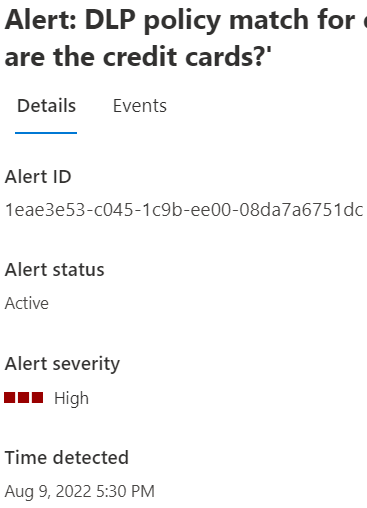

# Share data loss prevention alerts (preview)

Users with the [appropriate permissions]([Roles](dlp-configure-view-alerts-policies.md#roles)) can view Microsoft Purview Data Loss Prevention (DLP) alerts in the DLP Alerts console. But, as alerts are triaged and investigated, you may need to share them with other users who don't, and shouldn't, have full permissions to DLP and the alerts console.

You can share an alert with users that you give limited permissions to using the procedures in this article.

## Before you begin

If you aren't familiar with DLP Alerts, see [Configure and view alerts for data loss prevention policies](/microsoft-365/compliance/dlp-configure-view-alerts-policies).

In this procedure, you need to create a custom role group for Purview. If you haven't worked with permissions, roles and role groups in Microsoft Purview, see [Permissions in the Microsoft Purview compliance portal](/microsoft-365/compliance/microsoft-365-compliance-center-permissions) 

## Configure DLP Alert urls for review

1. Open the [Microsoft Purview compliance portal](https://compliance.microsoft.com) with an account that has Global Admin permissions.

1. Create a [Custom Role Group](/microsoft-365/compliance/microsoft-365-compliance-center-permissions#create-a-custom-role-group) for the users you want to share alerts with. For example `DLPAlertInvestigator`. Add these roles to the group:
    1. **View-Only DLP Compliance Management** - required.
    1. **Data Classification Content Viewer** - required.
    1. **Preview** - *this role is optional*, assign this if the reviewer needs to see the source content.

1. Add the users you the custom role group you just created, in this example `DLPAlertInvestigator`.

1.  Open the **DLP Alerts** tab and select the alert you want to share. This opens the flyout pane.

1. Get the **Alert ID** and **Time detected** values for the alert.

6. Construct the shareable URL in this format:

`<compliance-portal-domain>/datalossprevention/alerts/eventdeeplink?eventid={eventId}&creationtime={creationTime}`

Use the **Time detected** value for the `creationtime` field
 
For example:
 
`compliance.microsoft.com/datalossprevention/alerts/eventdeeplink?eventid=1eae3e53-c045-1c9b-ee00-08da7a6751dc&creationtime=2022-08-9T09:38:47Z`

7. You can share this link with people in the group you created, they'll be able to access the alert for review and investigation.

