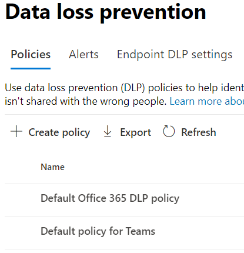

# Learn about the default data loss prevention policy in Microsoft Teams (preview)

[Microsoft Purview Data Loss Prevention](dlp-learn-about-dlp.md) capabilities have been extended to include Microsoft Teams chat and channel messages, including private channel messages. As a part of this release, we created a default DLP policy for Microsoft Teams for first-time customers to the <a href="https://go.microsoft.com/fwlink/p/?linkid=2077149" target="_blank">Microsoft Purview compliance portal</a>.

## Licensing

For complete licensing information for DLP in Microsoft Teams, see [Information Protection: Data Loss Prevention for Teams](/office365/servicedescriptions/microsoft-365-service-descriptions/microsoft-365-tenantlevel-services-licensing-guidance/microsoft-365-security-compliance-licensing-guidance#information-protection-data-loss-prevention-for-teams).

## What does the default policy do?

The default DLP policy for Teams tracks all the credit card numbers shared internally and externally to the organization. This policy is on by default for all users of the tenant. It does not generate any policy tips for end users but does generate an Alert event and also triggers a low severity email to the admin (added in the policy). Administrator can view the activities and edit the policies details by logging into the Compliance center.

Admins can view this policy in the [Microsoft Purview compliance portal](https://compliance.microsoft.com/compliancesettings) > Data Loss prevention policies page.

> [!div class="mx-imgBorder"]
> 

## Edit or delete the default policy

To [edit the default policy for better performance or to delete it](create-test-tune-dlp-policy.md#tune-a-dlp-policy), just use an account with **DLP Compliance Management** permissions. For more information, see, [Permissions](create-test-tune-dlp-policy.md#permissions).

