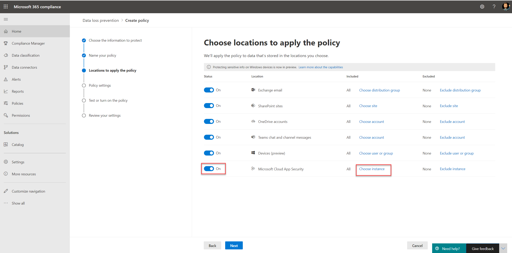
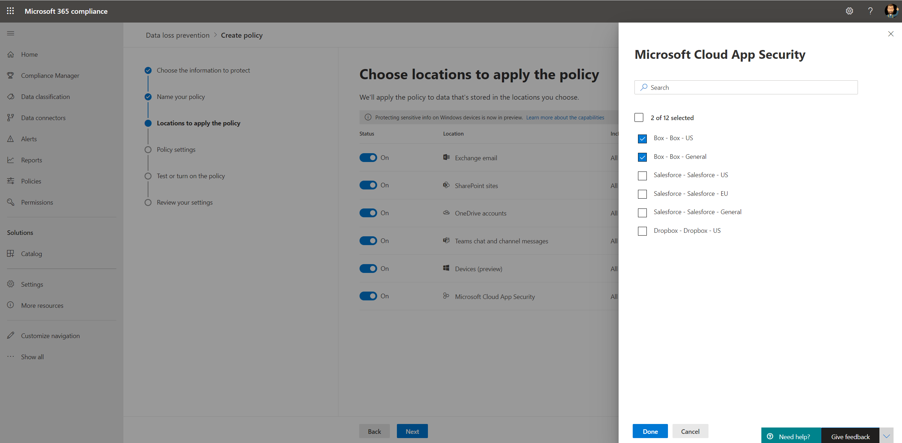
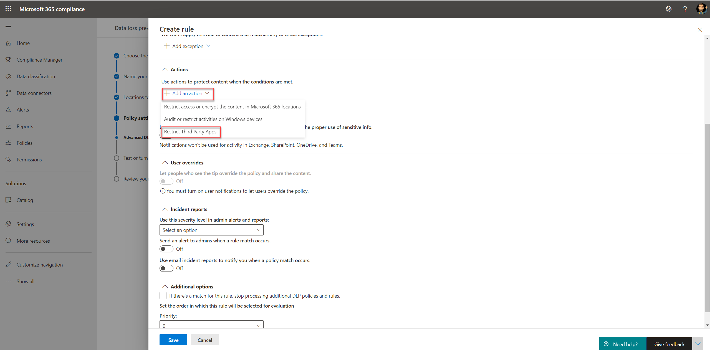
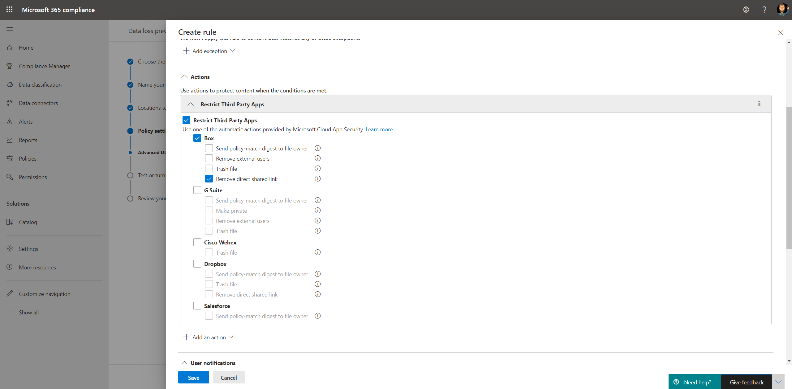

# Use data loss prevention policies for non-Microsoft cloud apps (preview)

Data loss prevention (DLP) policies to non-Microsoft cloud apps are part of the Microsoft 365 DLP suite of features; using these features, you can discover and protect sensitive items across Microsoft 365 services. For more information about all Microsoft DLP offerings, see [Learn about data loss prevention](dlp-learn-about-dlp.md).

You can use DLP policies to non-Microsoft cloud apps to monitor and detect when sensitive items are used and shared via non-Microsoft cloud apps. Using these policies gives you the visibility and control that you need to ensure that they're correctly used and protected, and it helps prevent risky behavior that might compromise them.

## Before you begin

### SKU/subscriptions licensing

Before you start using DLP policies to non-Microsoft cloud apps, confirm your [Microsoft 365 subscription](https://www.microsoft.com/microsoft-365/compare-microsoft-365-enterprise-plans?rtc=1) and any add-ons. To access and use this functionality, you must have one of these subscriptions or add-ons:

- Microsoft 365 E5
- Microsoft 365 E5 Compliance
- Microsoft 365 E5 Security

### Prepare your Cloud App Security environment

DLP policies to non-Microsoft cloud apps use Cloud App Security DLP capabilities. To use it, you should prepare your Cloud App Security environment. For instructions, see [Set instant visibility, protection, and governance actions for your apps](/cloud-app-security/getting-started-with-cloud-app-security#step-1-set-instant-visibility-protection-and-governance-actions-for-your-apps).

### Connect a non-Microsoft cloud app

To use DLP policy to a specific non-Microsoft cloud app, the app must be connected to Cloud App Security. For information, see:

- [Connect Box](/cloud-app-security/connect-box-to-microsoft-cloud-app-security)
- [Connect Dropbox](/cloud-app-security/connect-dropbox-to-microsoft-cloud-app-security)
- [Connect G-Suite](/cloud-app-security/connect-google-apps-to-microsoft-cloud-app-security)
- [Connect Salesforce](/cloud-app-security/connect-salesforce-to-microsoft-cloud-app-security)
- [Connect Cisco Webex](/cloud-app-security/connect-webex-to-microsoft-cloud-app-security)

After you connect your cloud apps to Cloud App Security, you can create Microsoft 365 DLP policies for them.

>[!NOTE]
>It's also possible to use Microsoft Cloud App Security to create DLP policies to Microsoft cloud apps. However, it's recommended to use Microsoft 365 to create and manage DLP policies to Microsoft cloud apps.

## Create a DLP policy to a non-Microsoft cloud app

When you select a location for the DLP policy, turn on the **Microsoft Cloud App Security** location.

- To select a specific app or instance, select **Choose instance**.
- If you don't select an instance, the policy uses all connected apps in your Microsoft Cloud App Security tenant.

   

   

You can choose various actions for every supported non-Microsoft cloud app. For every app, there are different possible actions (depends on the cloud app API).

When you create a rule in the DLP policy, you can select an action for non-Microsoft cloud apps. To restrict third-party apps, select **Restrict Third Party Apps**.

>[NOTE]
>DLP policies applied to non-Microsoft apps use Microsoft Cloud App Security. When the DLP policy for a non-Microsoft app is created, the same policy will be automatically created in Microsoft Cloud App Security.

For information about creating and configuring DLP policies, see [Create test and tune a DLP policy](./create-test-tune-dlp-policy.md?view=o365-worldwide).

## See Also

- [Create test and tune a DLP policy](./create-test-tune-dlp-policy.md?view=o365-worldwide)
- [Get started with the default DLP policy](./get-started-with-the-default-dlp-policy.md?view=o365-worldwide)
- [Create a DLP policy from a template](./create-a-dlp-policy-from-a-template.md?view=o365-worldwide)