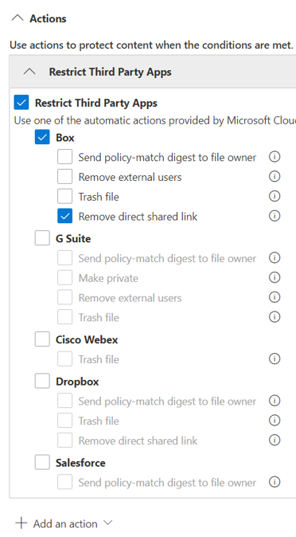

# Use data loss prevention policies for non-Microsoft cloud apps

[!include[Purview banner](../includes/purview-rebrand-banner.md)]

You can scope DLP policies to Microsoft Defender for Cloud Apps to monitor, detect and take actions when sensitive items are used and shared via non-Microsoft cloud apps.

## Before you begin

### SKU/subscriptions licensing

Before you start using DLP policies, confirm your [Microsoft 365 subscription](https://www.microsoft.com/microsoft-365/compare-microsoft-365-enterprise-plans?rtc=1) and any add-ons. To access and use this functionality, you must have one of these subscriptions or add-ons:

- Microsoft 365 E5
- Microsoft 365 E5 Compliance
- Microsoft 365 E5 Security

### Permissions
The user who creates the DLP policy should be a:

- Global administrator
- Compliance administrator: assign in Azure AD
- Compliance data administrator: assign in Azure AD

### Prepare your Defender for Cloud Apps environment

Before you configure DLP policies scoped to Microsoft Defender for Cloud Apps, you must prepare your Defender for Cloud Apps environment. For instructions, see [Set instant visibility, protection, and governance actions for your apps](/cloud-app-security/getting-started-with-cloud-app-security#step-1-set-instant-visibility-protection-and-governance-actions-for-your-apps).

### Connect a non-Microsoft cloud app

To use a DLP policy thats scoped to a specific non-Microsoft cloud app, the app must be connected to Defender for Cloud Apps. For information, see:

- [Connect Box](/cloud-app-security/connect-box-to-microsoft-cloud-app-security)
- [Connect Dropbox](/cloud-app-security/connect-dropbox-to-microsoft-cloud-app-security)
- [Connect G-Workspace](/cloud-app-security/connect-google-apps-to-microsoft-cloud-app-security)
- [Connect Salesforce](/cloud-app-security/connect-salesforce-to-microsoft-cloud-app-security)
- [Connect Cisco Webex](/cloud-app-security/connect-webex-to-microsoft-cloud-app-security)

After you connect your cloud apps to Defender for Cloud Apps, you can create DLP policies for them.

## Create a DLP policy scoped to a non-Microsoft cloud app

Refer to [Create, test, and tune a DLP policy](create-test-tune-dlp-policy.md) for the procedures to create a DLP policy. Keep these points in mind as you configure your policy.

- Select the turn on the **Microsoft Defender for Cloud Apps** location.
- To select a specific app or instance, select **Choose instance**. If you don't select an instance, the policy will be scoped to all connected apps in your Microsoft Defender for Cloud Apps tenant.
- You can select from a number of **Actions** to enforce on third party apps. To restrict third-party apps, select **Restrict Third Party Apps** and then select the specific actions.

> [!NOTE]
> When you create a DLP policy that is scoped to Microsoft Defender for Cloud Apps, the same policy will be automatically created in Microsoft Defender for Cloud Apps.

## See Also

- [Create test and tune a DLP policy](./create-test-tune-dlp-policy.md)
- [Get started with the default DLP policy](./get-started-with-the-default-dlp-policy.md)
- [Create a DLP policy from a template](./create-a-dlp-policy-from-a-template.md)
