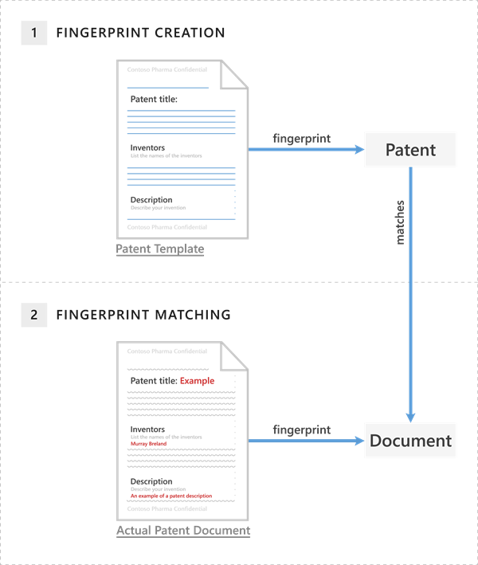

# Document Fingerprinting

Information workers in your organization handle many kinds of sensitive information during a typical day. In the Security &amp; Compliance Center, Document Fingerprinting makes it easier for you to protect this information by identifying standard forms that are used throughout your organization. This topic describes the concepts behind Document Fingerprinting and how to create one by using PowerShell.
  
## Basic scenario for Document Fingerprinting

Document Fingerprinting is a Data Loss Prevention (DLP) feature that converts a standard form into a sensitive information type, which you can use in the rules of your DLP policies. For example, you can create a document fingerprint based on a blank patent template and then create a DLP policy that detects and blocks all outgoing patent templates with sensitive content filled in. Optionally, you can set up [policy tips](use-notifications-and-policy-tips.md) to notify senders that they might be sending sensitive information, and the sender should verify that the recipients are qualified to receive the patents. This process works with any text-based forms used in your organization. Additional examples of forms that you can upload include:
  
- Government forms
- Health Insurance Portability and Accountability Act (HIPAA) compliance forms  
- Employee information forms for Human Resources departments
- Custom forms created specifically for your organization

Ideally, your organization already has an established business practice of using certain forms to transmit sensitive information. After you upload an empty form to be converted to a document fingerprint and set up a corresponding policy, the DLP detects any documents in outbound mail that match that fingerprint.

## How Document Fingerprinting works

You've probably already guessed that documents don't have actual fingerprints, but the name helps explain the feature. In the same way that a person's fingerprints have unique patterns, documents have unique word patterns. When you upload a file, DLP identifies the unique word pattern in the document, creates a document fingerprint based on that pattern, and uses that document fingerprint to detect outbound documents containing the same pattern. That's why uploading a form or template creates the most effective type of document fingerprint. Everyone who fills out a form uses the same original set of words and then adds his or her own words to the document. As long as the outbound document isn't password protected and contains all the text from the original form, DLP can determine if the document matches the document fingerprint.

> [!IMPORTANT]
> For now, DLP can use document fingerprinting as a detection method in Exchange online only.

The following example shows what happens if you create a document fingerprint based on a patent template, but you can use any form as a basis for creating a document fingerprint.
  
### Example of a patent document matching a document fingerprint of a patent template


  
The patent template contains the blank fields "Patent title," "Inventors," and "Description" and descriptions for each of those fields—that's the word pattern. When you upload the original patent template, it's in one of the supported file types and in plain text. DLP converts this word pattern into a document fingerprint, which is a small Unicode XML file containing a unique hash value representing the original text, and the fingerprint is saved as a data classification in Active Directory. (As a security measure, the original document itself isn't stored on the service; only the hash value is stored, and the original document can't be reconstructed from the hash value.) The patent fingerprint then becomes a sensitive information type that you can associate with a DLP policy. After you associate the fingerprint with a DLP policy, DLP detects any outbound emails containing documents that match the patent fingerprint and deals with them according to your organization's policy. 

For example, you might want to set up a DLP policy that prevents regular employees from sending outgoing messages containing patents. DLP will use the patent fingerprint to detect patents and block those emails. Alternatively, you might want to let your legal department to be able to send patents to other organizations because it has a business need for doing so. You can allow specific departments to send sensitive information by creating exceptions for those departments in your DLP policy, or you can allow them to override a policy tip with a business justification.
  
### Supported file types

Document Fingerprinting supports the same file types that are supported in mail flow rules (also known as transport rules). For a list of supported file types, see [Supported file types for mail flow rule content inspection](/exchange/security-and-compliance/mail-flow-rules/inspect-message-attachments#supported-file-types-for-mail-flow-rule-content-inspection). One quick note about file types: neither mail flow rules nor Document Fingerprinting supports the .dotx file type, which can be confusing because that's a template file in Word. When you see the word "template" in this and other Document Fingerprinting topics, it refers to a document that you have established as a standard form, not the template file type.
  
#### Limitations of document fingerprinting

Document Fingerprinting won't detect sensitive information in the following cases:
  
- Password protected files
- Files that contain only images
- Documents that don't contain all the text from the original form used to create the document fingerprint
- Files greater than 10 MB

## Use PowerShell to create a classification rule package based on document fingerprinting

Note that you can currently create a document fingerprint only by using PowerShell in the Security &amp; Compliance Center. To connect, see [Connect to Security & Compliance Center PowerShell](/powershell/exchange/connect-to-scc-powershell).

DLP uses classification rule packages to detect sensitive content. To create a classification rule package based on a document fingerprint, use the **New-DlpFingerprint** and **New-DlpSensitiveInformationType** cmdlets. Because the results of **New-DlpFingerprint** aren't stored outside the data classification rule, you always run **New-DlpFingerprint** and **New-DlpSensitiveInformationType** or **Set-DlpSensitiveInformationType** in the same PowerShell session. The following example creates a new document fingerprint based on the file C:\My Documents\Contoso Employee Template.docx. You store the new fingerprint as a variable so you can use it with the **New-DlpSensitiveInformationType** cmdlet in the same PowerShell session.
  
```powershell
$Employee_Template = Get-Content "C:\My Documents\Contoso Employee Template.docx" -Encoding byte -ReadCount 0
$Employee_Fingerprint = New-DlpFingerprint -FileData $Employee_Template -Description "Contoso Employee Template"
```

Now, let's create a new data classification rule named "Contoso Employee Confidential" that uses the document fingerprint of the file C:\My Documents\Contoso Customer Information Form.docx.
  
```powershell
$Customer_Form = Get-Content "C:\My Documents\Contoso Customer Information Form.docx" -Encoding byte -ReadCount 0
$Customer_Fingerprint = New-DlpFingerprint -FileData $Customer_Form -Description "Contoso Customer Information Form"
New-DlpSensitiveInformationType -Name "Contoso Customer Confidential" -Fingerprints $Customer_Fingerprint -Description "Message contains Contoso customer information." 
```

You can now use the **Get-DlpSensitiveInformationType** cmdlet to find all DLP data classification rule packages, and in this example, "Contoso Customer Confidential" is part of the data classification rule packages list. 
  
Finally, add the "Contoso Customer Confidential" data classification rule package to a DLP policy in the Security &amp; Compliance Center. This example adds a rule to an existing DLP policy named "ConfidentialPolicy".

```powershell
New-DlpComplianceRule -Name "ContosoConfidentialRule" -Policy "ConfidentialPolicy" -ContentContainsSensitiveInformation @{Name="Contoso Customer Confidential"} -BlockAccess $True
```

You can also use the data classification rule package in mail flow rules in Exchange Online, as shown in the following example. To run this command, you first need to [Connect to Exchange Online PowerShell](/powershell/exchange/connect-to-exchange-online-powershell). Also note that it takes time for the rule package to sync from the Security &amp; Compliance Center to the Exchange admin center.
  
```powershell
New-TransportRule -Name "Notify :External Recipient Contoso confidential" -NotifySender NotifyOnly -Mode Enforce -SentToScope NotInOrganization -MessageContainsDataClassification @{Name=" Contoso Customer Confidential"}
```

DLP now detects documents that match the Contoso Customer Form.docx document fingerprint.
  
For syntax and parameter information, see:

- [New-DlpFingerprint](/powershell/module/exchange/New-DlpFingerprint)
- [New-DlpSensitiveInformationType](/powershell/module/exchange/New-DlpSensitiveInformationType)
- [Remove-DlpSensitiveInformationType](/powershell/module/exchange/Remove-DlpSensitiveInformationType)
- [Set-DlpSensitiveInformationType](/powershell/module/exchange/Set-DlpSensitiveInformationType)
- [Get-DlpSensitiveInformationType](/powershell/module/exchange/Get-DlpSensitiveInformationType)
