---
# required metadata

title: Double Key Encryption (DKE)
description: DKE enables you to protect highly sensitive data while maintaining full control of your key.
author: kccross
ms.author: krowley
manager: laurawi
ms.date: 01/29/2021
ms.topic: conceptual
ms.service: information-protection
audience: Admin
ms.reviewer: esaggese
localization_priority: Normal
ms.collection:
- M365-security-compliance

---

# Double Key Encryption for Microsoft 365

> *Applies to: Double Key Encryption for Microsoft 365, [Microsoft 365 Compliance](https://www.microsoft.com/microsoft-365/business/compliance-management), [Azure Information Protection](https://azure.microsoft.com/pricing/details/information-protection)*
>
> *Instructions for: [Azure Information Protection unified labeling client for Windows](/azure/information-protection/faqs#whats-the-difference-between-the-azure-information-protection-classic-and-unified-labeling-clients)*
>
> *Service description for: [Microsoft 365 Compliance](/office365/servicedescriptions/microsoft-365-service-descriptions/microsoft-365-tenantlevel-services-licensing-guidance/microsoft-365-security-compliance-licensing-guidance)*

Double Key Encryption (DKE) uses two keys together to access protected content. Microsoft stores one key in Microsoft Azure, and you hold the other key. You maintain full control of one of your keys using the Double Key Encryption service. You apply protection using The Azure Information Protection unified labeling client to your highly sensitive content.

Double Key Encryption supports both cloud and on-premises deployments. These deployments help to ensure that encrypted data remains opaque wherever you store the protected data.

For more information about the default, cloud-based tenant root keys, see [Planning and implementing your Azure Information Protection tenant key](/azure/information-protection/plan-implement-tenant-key).

## When your organization should adopt DKE

Double Key Encryption is intended for your most sensitive data that is subject to the strictest protection requirements. DKE is not intended for all data. In general, you'll be using Double Key Encryption to protect only a small part of your overall data. You should do due diligence in identifying the right data to cover with this solution before you deploy. In some cases, you might need to narrow your scope and make use of other solutions for most your data such as Microsoft Information Protection with Microsoft-managed keys or BYOK. These solutions are sufficient for documents that aren't subject to enhanced protections and regulatory requirements. Also, these solutions enable you to use the most powerful Office 365 services; services that you can't use with DKE encrypted content. For example:

- Transport rules including anti-malware and spam that require visibility into the attachment
- Microsoft Delve
- eDiscovery
- Content search and indexing
- Office Web Apps including coauthoring functionality

Any external applications or services that are not integrated with DKE through the MIP SDK will be unable to perform actions on the encrypted data.

The Microsoft Information Protection SDK 1.7+ supports Double Key Encryption; applications that integrate with our SDK will be able to reason over this data with sufficient permissions and integrations in place.

We recommend organizations use Microsoft Information protection capabilities (classification and labeling) to protect most of their sensitive data and only use DKE for their mission-critical data. Double Key Encryption is relevant for sensitive data in highly regulated industries such as Financial services and Healthcare.

If your organizations have any of the following requirements, you can use DKE to help secure your content:

- You want to ensure that *only you* can ever decrypt protected content, under all circumstances.
- You don't want Microsoft to have access to protected data on its own.
- You have regulatory requirements to hold keys within a geographical boundary. All of the keys that you hold for data encryption and decryption are maintained in your data center.

## System and licensing requirements for DKE

**Double Key Encryption for Microsoft 365** comes with Microsoft 365 E5. If you don’t have a Microsoft 365 E5 license, you can sign up for a [trial](https://aka.ms/M365E5ComplianceTrial). For more information about these licenses, see [Microsoft 365 licensing guidance for security & compliance](/office365/servicedescriptions/microsoft-365-service-descriptions/microsoft-365-tenantlevel-services-licensing-guidance/microsoft-365-security-compliance-licensing-guidance).

**Azure Information Protection**. DKE works with sensitivity labels and requires Azure Information Protection.

DKE sensitivity labels are made available to end users through the sensitivity ribbon in Office Desktop Apps. Install these prerequisites on each client computer where you want to protect and consume protected documents.

**Microsoft Office Apps for enterprise** version 2009 or later (Desktop versions of Word, PowerPoint, and Excel) on Windows.

**Azure Information Protection Unified Labeling Client** versions 2.7.93.0 or later. Download and install the Unified Labeling client from the [Microsoft download center](https://www.microsoft.com/download/details.aspx?id=53018).

## Supported environments for storing and viewing DKE-protected content

**Supported applications**. [Microsoft 365 Apps for enterprise](https://www.microsoft.com/microsoft-365/business/microsoft-365-apps-for-enterprise-product) clients on Windows, including Word, Excel, and PowerPoint.

**Online content support**. You can store documents and files protected with Double Key Encryption online in both Microsoft SharePoint and OneDrive for Business. You must label and protect documents and files with DKE by supported applications before you upload to these locations. You can share encrypted content by email, but you can't view encrypted documents and files online. Instead, you must view protected content using the supported desktop applications and clients on your local computer.

## Overview of deploying DKE

You'll follow these general steps to set up DKE. Once you've completed these steps, your end users will can protect your highly sensitive data with Double Key Encryption.

1. Deploy the DKE service as described in this article.

2. Create a label with Double Key Encryption. Navigate to Information protection under the [Microsoft 365 compliance center](https://compliance.microsoft.com) and create a new label with Double Key Encryption. See [Restrict access to content by using sensitivity labels to apply encryption](./encryption-sensitivity-labels.md).

3. Use Double Key Encryption labels. Protect data by selecting the Double Key Encrypted label from the Sensitivity ribbon in Microsoft Office.

There are several ways you can complete some of the steps to deploy Double Key Encryption. This article provides detailed instructions so that less experienced admins successfully deploy the service. If you're comfortable doing so, you can choose to use your own methods.

## Deploy DKE

This article and the deployment video use Azure as the deployment destination for the DKE service. If you're deploying to another location, you'll need to provide your own values.

Watch the [Double Key Encryption deployment video](https://youtu.be/vDWfHN_kygg) to see a step-by-step overview of the concepts in this article. The video takes about 18 minutes to complete.

You'll follow these general steps to set up Double Key Encryption for your organization.

1. [Install software prerequisites for the DKE service](#install-software-prerequisites-for-the-dke-service)
1. [Clone the Double Key Encryption GitHub repository](#clone-the-dke-github-repository)
1. [Modify application settings](#modify-application-settings)
1. [Generate test keys](#generate-test-keys)
1. [Build the project](#build-the-project)
1. [Deploy the DKE service and publish the key store](#deploy-the-dke-service-and-publish-the-key-store)
1. [Validate your deployment](#validate-your-deployment)
1. [Register your key store](#register-your-key-store)
1. [Create sensitivity labels using DKE](#create-sensitivity-labels-using-dke)
1. [Enable DKE in your client](#enable-dke-in-your-client)
1. [Migrate protected files from HYOK labels to DKE labels](#migrate-protected-files-from-hyok-labels-to-dke-labels)

When you're done, you can encrypt documents and files using DKE. For information, see [Apply sensitivity labels to your files and email in Office](https://support.microsoft.com/office/2f96e7cd-d5a4-403b-8bd7-4cc636bae0f9).

### Install software prerequisites for the DKE service

Install these prerequisites on the computer where you want to install the DKE service.

**.NET Core 3.1 SDK**. Download and install the SDK from [Download .NET Core 3.1](https://dotnet.microsoft.com/download/dotnet-core/3.1).

**Visual Studio Code**. Download Visual Studio Code from [https://code.visualstudio.com/](https://code.visualstudio.com). Once installed, run Visual Studio Code and select **View** \> **Extensions**. Install these extensions.

- C# for Visual Studio Code

- NuGet Package Manager

**Git resources**. Download and install one of the following.

- [Git](https://git-scm.com/downloads)

- [GitHub Desktop](https://desktop.github.com/)

- [GitHub Enterprise](https://github.com/enterprise)

**OpenSSL** You must have [OpenSSL](https://slproweb.com/products/Win32OpenSSL.html) installed to [generate test keys](#generate-test-keys) after you deploy DKE. Make sure you're invoking it correctly from your environment variables path. For example, see "Add the installation directory to PATH" at [https://www.osradar.com/install-openssl-windows/](https://www.osradar.com/install-openssl-windows/) for details.

### Clone the DKE GitHub repository

Microsoft supplies the DKE source files in a GitHub repository. You clone the repository to build the project locally for your organization's use. The DKE GitHub repository is located at [https://github.com/Azure-Samples/DoubleKeyEncryptionService](https://github.com/Azure-Samples/DoubleKeyEncryptionService).

The following instructions are intended for inexperienced git or Visual Studio Code users:

1. In your browser, go to: [https://github.com/Azure-Samples/DoubleKeyEncryptionService](https://github.com/Azure-Samples/DoubleKeyEncryptionService).

2. Towards the right side of the screen, select **Code**. Your version of the UI might show a **Clone or download** button. Then, in the dropdown that appears, select the copy icon to copy the URL to your clipboard.

    For example:

   > [!div class="mx-imgBorder"]
   > 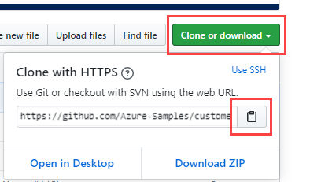

3. In Visual Studio Code, select **View** \> **Command Palette** and select **Git: Clone**. To jump to the option in the list, start typing `git: clone` to filter the entries and then select it from the drop-down. For example:

   > [!div class="mx-imgBorder"]
   > 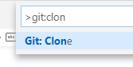

4. In the text box, paste the URL that you copied from Git and select **Clone from GitHub**.

5. In the **Select Folder** dialog that appears, browse to and select a location to store the repository. At the prompt, select **Open**.

    The repository opens in Visual Studio Code, and displays the current Git branch at the bottom left. For example,  The branch should be **main**. For example:

   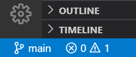

6. If you're not on the main branch, you'll need to select it. In Visual Studio Code, select the branch and choose **main** from the list of branches that displays.

   > [!IMPORTANT]
   > Selecting the main branch ensures that you have the correct files to build the project. If you don't choose the correct branch your deployment will fail.

You now have your DKE source repository set up locally. Next, [modify application settings](#modify-application-settings) for your organization.

### Modify application settings

To deploy the DKE service, you must modify the following types of application settings:

- [Key access settings](#key-access-settings)
- [Tenant and key settings](#tenant-and-key-settings)

You modify application settings in the appsettings.json file. This file is located in the DoubleKeyEncryptionService repo you cloned locally under DoubleKeyEncryptionService\src\customer-key-store. For example, in Visual Studio Code, you can browse to the file as shown in the following picture.

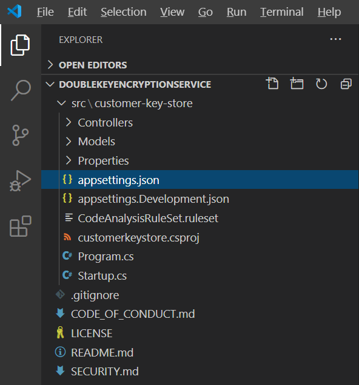

#### Key access settings

Choose whether to use email or role authorization. DKE supports only one of these authentication methods at a time.

- **Email authorization**. Allows your organization to authorize access to keys based on email addresses only.

- **Role authorization**. Allows your organization to authorize access to keys based on Active Directory groups, and requires that the web service can query LDAP.

**To set key access settings for DKE using email authorization**

1. Open the **appsettings.json** file and locate the `AuthorizedEmailAddress` setting.

2. Add the email address or addresses that you want to authorize. Separate multiple email addresses with double quotes and commas. For example:

   ```json
   "AuthorizedEmailAddress": ["email1@company.com", "email2@company.com ", "email3@company.com"]
   ```

3. Locate the `LDAPPath` setting and remove the text `If you use role authorization (AuthorizedRoles) then this is the LDAP path.` between the double quotes. Leave the double quotes in place. When you're finished, the setting should look like this.

   ```json
   "LDAPPath": ""
   ```

4. Locate the `AuthorizedRoles` setting and delete the entire line.

This image shows the **appsettings.json** file correctly formatted for email authorization.

   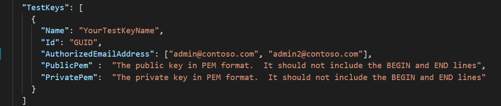

**To set key access settings for DKE using role authorization**

1. Open the **appsettings.json** file and locate the `AuthorizedRoles` setting.

2. Add the Active Directory group names you want to authorize. Separate multiple group names with double quotes and commas. For example:

   ```json
   "AuthorizedRoles": ["group1", "group2", "group3"]
   ```

3. Locate the `LDAPPath` setting and add the Active Directory domain. For example:

   ```json
   "LDAPPath": "contoso.com"
   ```

4. Locate the `AuthorizedEmailAddress` setting and delete the entire line.

This image shows the **appsettings.json** file correctly formatted for role authorization.

   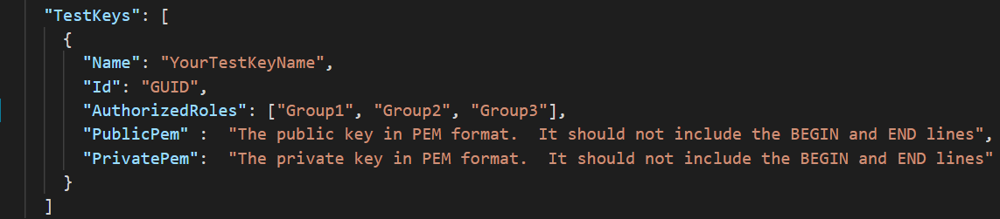

#### Tenant and key settings

DKE tenant and key settings are located in the **appsettings.json** file.

**To configure tenant and key settings for DKE**

1. Open the **appsettings.json** file.

2. Locate the `ValidIssuers` setting and replace `<tenantid>` with your tenant ID. You can locate your tenant ID by going to the Azure portal and viewing the [tenant properties](https://aad.portal.azure.com/#blade/Microsoft_AAD_IAM/ActiveDirectoryMenuBlade/Properties). For example:

   ```json
   "ValidIssuers": [
     "https://sts.windows.net/9c99431e-b513-44be-a7d9-e7b500002d4b/"
   ]
   ```
> [!NOTE]
> If you want to enable external B2B access to your key store, you will also need to include these external tenants as part of the valid issuers' list.

Locate the `JwtAudience`. Replace `<yourhostname>` with the hostname of the machine where the DKE service will run. For example:

  > [!IMPORTANT]
  > The value for `JwtAudience` must match the name of your host *exactly*. You may use **localhost:5001** while debugging. However, When you're done debugging, make sure to update this value to the server's hostname.

- `TestKeys:Name`. Enter a name for your key. For example: `TestKey1`
- `TestKeys:Id`. Create a GUID and enter it as the `TestKeys:ID` value. For example, `DCE1CC21-FF9B-4424-8FF4-9914BD19A1BE`. You can use a site like [Online GUID Generator](https://guidgenerator.com/) to randomly generate a GUID.

This image shows the correct format for tenant and keys settings in **appsettings.json**. `LDAPPath` is configured for role authorization.

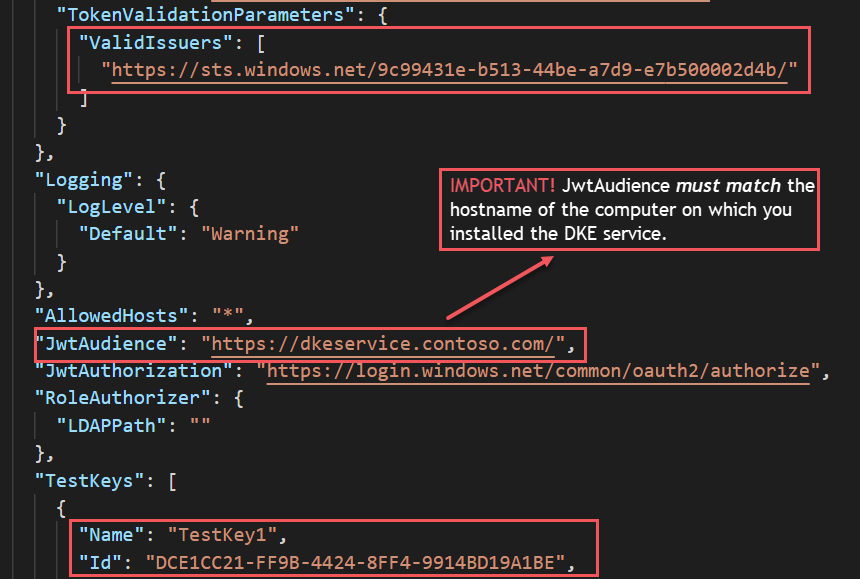

### Generate test keys

Once you have your application settings defined, you're ready to generate public and private test keys.

To generate keys:

1. From the Windows Start menu, run the OpenSSL Command Prompt.

2. Change to the folder where you want to save the test keys. The files you create by completing the steps in this task are stored in the same folder.

3. Generate the new test key.

   ```console
   openssl req -x509 -newkey rsa:2048 -keyout key.pem -out cert.pem -days 365
   ```

4. Generate the private key.

   ```console
   openssl rsa -in key.pem -out privkeynopass.pem
   ```

5. Generate the public key.

   ```console
   openssl rsa -in key.pem -pubout > pubkeyonly.pem
   ```

6. In a text editor, open **pubkeyonly.pem**. Copy all of the content in the **pubkeyonly.pem** file, except the first and last lines, into the `PublicPem` section of the **appsettings.json** file.

7. In a text editor, open **privkeynopass.pem**. Copy all of the content in the **privkeynopass.pem** file, except the first and last lines, into the `PrivatePem` section of the **appsettings.json** file.

8. Remove all blank spaces and newlines in both the `PublicPem` and `PrivatePem` sections.

    > [!IMPORTANT]
    > When you copy this content, do not delete any of the PEM data.

9. In Visual Studio Code, browse to the **Startup.cs** file. This file is located in the DoubleKeyEncryptionService repo you cloned locally under DoubleKeyEncryptionService\src\customer-key-store\.

10. Locate the following lines:

    ```csharp
        #if USE_TEST_KEYS
        #error !!!!!!!!!!!!!!!!!!!!!! Use of test keys is only supported for testing,
        DO NOT USE FOR PRODUCTION !!!!!!!!!!!!!!!!!!!!!!!!!!!!!
        services.AddSingleton<ippw.IKeyStore, ippw.TestKeyStore>();
        #endif
    ```

11. Replace these lines with the following text:

    ```csharp
    services.AddSingleton<ippw.IKeyStore, ippw.TestKeyStore>();
    ```

    The end results should look similar to the following.

    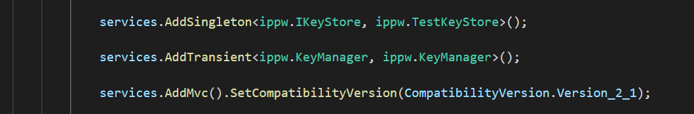

Now you're ready to [build your DKE project](#build-the-project).

### Build the project

Use the following instructions to build the DKE project locally:

1. In Visual Studio Code, in the DKE service repository, select **View** \> **Command Palette** and then type **build** at the prompt.

2. From the list, choose **Tasks: Run build task**.

   If there are no build tasks found, select **Configure Build Task** and create one for .NET core as follows.

   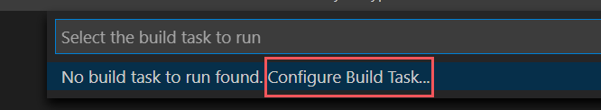

   1. Choose **Create tasks.json from template**.

      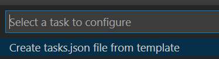

   2. From the list of template types, select **.NET Core**.

      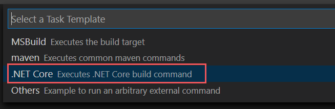

   3. In the build section, locate the path to the **customerkeystore.csproj** file. If it's not there, add the following line:

      ```json
      "${workspaceFolder}/src/customer-key-store/customerkeystore.csproj",
      ```

   4. Run the build again.

3. Verify that there are no red errors in the output window.

   If there are red errors, check the console output. Ensure that you completed all the previous steps correctly and the correct build versions are present.

4. Select **Run** \> **Start Debugging** to debug the process. If you're prompted to select an environment, select **.NET core**.

   The .NET core debugger typically launches to `https://localhost:5001`. To view your test key, go to `https://localhost:5001` and append a forward slash (/) and the name of your key. For example:

   ```https
   https://localhost:5001/TestKey1
   ```

   The key should display in JSON format.

Your setup is now complete. Before you publish the keystore, in appsettings.json, for the JwtAudience setting, ensure the value for hostname exactly matches your App Service host name. You may have changed it to localhost to troubleshoot the build.

### Deploy the DKE service and publish the key store

For production deployments, deploy the service either in a third-party cloud or [publish to an on-premises system](/aspnet/core/tutorials/publish-to-iis?preserve-view=true&tabs=netcore-cli&view=aspnetcore-3.1).

You may prefer other methods to deploy your keys. Select the method that works best for your organization.

For pilot deployments, you can deploy in Azure and get started right away.

**To create an Azure Web App instance to host your DKE deployment**

To publish the key store, you'll create an Azure App Service instance to host your DKE deployment. Next, you'll publish your generated keys to Azure.

1. In your browser, sign in to the [Microsoft Azure portal](https://ms.portal.azure.com), and go to **App Services** > **Add**.

2. Select your subscription and resource group and define your instance details.

   - Enter the hostname of the computer where you want to install the DKE service. Make sure it's the same name as the one defined for the JwtAudience setting in the [**appsettings.json**](#tenant-and-key-settings) file. The value you provide for the name is also the WebAppInstanceName.

   - For **Publish**, select **code**, and for **Runtime stack**, select **.NET Core 3.1**.

   For example:

   > [!div class="mx-imgBorder"]
   > 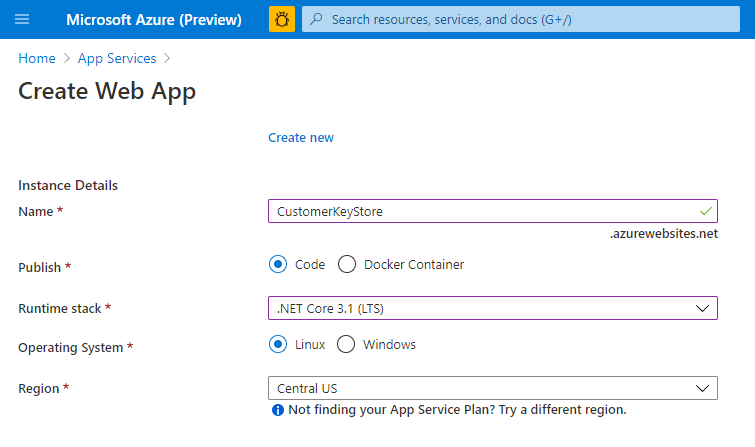

3. At the bottom of the page, select **Review + create**, and then select **Add**.

4. Do one of the following to publish your generated keys:

   - [Publish via ZipDeployUI](#publish-via-zipdeployui)
   - [Publish via FTP](#publish-via-ftp)
   - [Publish via Visual Studio 2019 or later](/aspnet/core/tutorials/)

#### Publish via ZipDeployUI

1. Go to `https://<WebAppInstanceName>.scm.azurewebsites.net/ZipDeployUI`.

   For example: https://dkeservice.scm.azurewebsites.net/ZipDeployUI

2. In the codebase for the key store, go to the **customer-key-store\src\customer-key-store** folder, and verify that this folder contains the **customerkeystore.csproj** file.

3. Run: **dotnet publish**

   The output window displays the directory where the publish was deployed.

   For example: `customer-key-store\src\customer-key-store\bin\Debug\netcoreapp3.1\publish\`

4. Send all files in the publish directory to a .zip file. When creating the .zip file, make sure that all files in the directory are at the root level of the .zip file.

5. Drag and drop the .zip file you create to the ZipDeployUI site you opened above. For example: https://dkeservice.scm.azurewebsites.net/ZipDeployUI

DKE is deployed and you can browse to the test keys you've created. Continue to [Validate your deployment](#validate-your-deployment) below.

#### Publish via FTP

1. Connect to the App Service you created [above](#deploy-the-dke-service-and-publish-the-key-store).

   In your browser, go to: **Azure portal** > **App Service** > **Deployment Center** > **Manual Deployment** > **FTP** > **Dashboard**.

2. Copy the connection strings displayed to a local file. You'll use these strings to connect to the Web App Service and upload files via FTP.

   For example:

   

3. In the codebase for the key storage, go to the **customer-key-store\src\customer-key-store directory**.

4. Verify that this directory contains the **customerkeystore.csproj** file.

5. Run: **dotnet publish**

   The output contains the directory where the publish was deployed.

   For example: `customer-key-store\src\customer-key-store\bin\Debug\netcoreapp3.1\publish\`

6. Send all files in the publish directory to a zip file. When creating the .zip file, make sure that all files in the directory are at the root level of the .zip file.

7. From your FTP client, use the connection information you copied to connect to your App Service. Upload the .zip file you created in the previous step to the root directory of your Web App.

DKE is deployed and you can browse to the test keys you'd created. Next, [Validate your deployment](#validate-your-deployment).

### Validate your deployment

After deploying DKE using one of the methods described above, validate the deployment and the key store settings.

Run:

```powershell
src\customer-key-store\scripts\key_store_tester.ps1 dkeserviceurl/mykey
```

For example:

```powershell
key_store_tester.ps1 https://mydkeservice.com/mykey
```

Ensure that no errors appear in the output. When you're ready, [register your key store](#register-your-key-store).

The key name is case sensitive. Enter the key name as it appears in the appsettings.json file.

## Register your key store

The following steps enable you to register your DKE service. Registering your DKE service is the last step in deploying DKE before you can start creating labels.

To register the DKE service:

1. In your browser, open the [Microsoft Azure portal](https://ms.portal.azure.com/), and go to **All Services** \> **Identity** \> **App Registrations**.

2. Select **New registration**, and enter a meaningful name.

3. Select an account type from the options displayed.

   If you're using Microsoft Azure with a non-custom domain, such as **onmicrosoft.com**, select **Accounts in this organizational directory only (Microsoft only - Single tenant).**

   For example:

   > [!div class="mx-imgBorder"]
   > 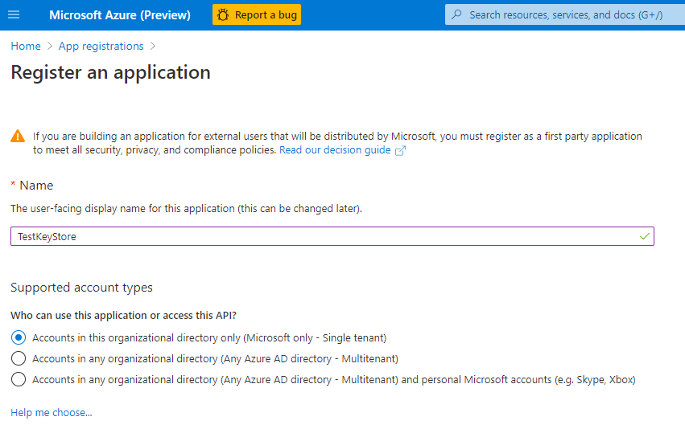

4. At the bottom of the page, select **Register** to create the new App Registration.

5. In your new App Registration, in the left pane, under **Manage**, select **Authentication**.

6. Select **Add a platform**.

7. On the **Configure platforms** popup, select **Web**.

8. Under **Redirect URIs**, enter the URI of your double key encryption service. Enter the App Service URL, including both the hostname and domain.

   For example: https://mydkeservicetest.com

   - The URL you enter must match the hostname where your DKE service is deployed.
   - If you're testing locally with Visual Studio, use **https://localhost:5001**.
   - In all cases, the scheme must be **https**.

   Ensure the hostname exactly matches your App Service hostname. You may have changed it to `localhost` to troubleshoot the build. In **appsettings.json**, this value is the hostname you set for `JwtAudience`.

9. Under **Implicit grant**, select the **ID tokens** checkbox.

10. Select **Save** to save your changes.

11. On the left pane, select **Expose an API**, then next to Application ID URI, select **Set**.

12. Still on the **Expose an API** page, in the **Scopes defined by this API** area, select **Add a scope**. In the new scope:

    1. Define the scope name as **user_impersonation**.

    2. Select the administrators and users who can consent.

    3. Define any remaining values required.

    4. Select **Add scope**.

    5. Select **Save** at the top to save your changes.

13. Still on the **Expose an API** page, in the **Authorized client applications** area, select **Add a client application**.

    In the new client application:

    1. Define the Client ID as `d3590ed6-52b3-4102-aeff-aad2292ab01c`. This value is the Microsoft Office client ID, and enables Office to obtain an access token for your key store.

    2. Under **Authorized scopes**, select the **user_impersonation** scope.

    3. Select **Add application**.

    4. Select **Save** at the top to save your changes.

    5. Repeat these steps, but this time, define the client ID as `c00e9d32-3c8d-4a7d-832b-029040e7db99`. This value is the Azure Information Protection unified labeling client ID. 

Your DKE service is now registered. Continue by [creating labels using DKE](#create-sensitivity-labels-using-dke).

## Create sensitivity labels using DKE

In the Microsoft 365 compliance center, create a new sensitivity label and apply encryption as you would otherwise. Select **Use Double Key Encryption** and enter the endpoint URL for your key.

For example:

> [!div class="mx-imgBorder"]
> 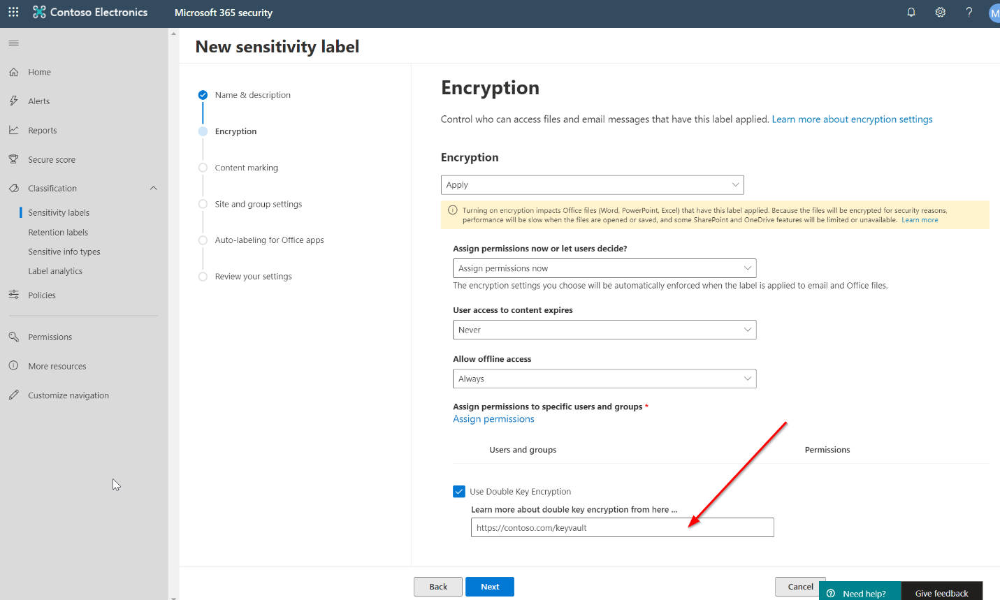

Any DKE labels you add will start appearing for users in the latest versions of Microsoft 365 Apps for enterprise.

> [!NOTE]
> It may take up to 24 hours for the clients to refresh with the new labels.

### Enable DKE in your client

If you're an Office Insider, DKE is enabled for you. Otherwise, enable DKE for your client by adding the following registry keys:

```console
   [HKEY_LOCAL_MACHINE\SOFTWARE\WOW6432Node\Microsoft\MSIPC\flighting]
   "DoubleKeyProtection"=dword:00000001

   [HKEY_LOCAL_MACHINE\SOFTWARE\Microsoft\MSIPC\flighting]
   "DoubleKeyProtection"=dword:00000001
```

## Migrate protected files from HYOK labels to DKE labels

If you want, once you're finished setting up DKE, you can migrate content that you've protected using HYOK labels to DKE labels. To migrate, you'll use the AIP scanner. To get started using the scanner, see [What is the Azure Information Protection unified labeling scanner?](/azure/information-protection/deploy-aip-scanner).

If you don't migrate content, your HYOK protected content will remain unaffected.
