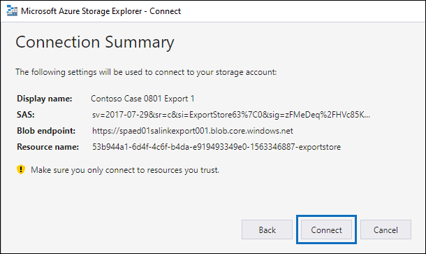

# Download export jobs in an Advanced eDiscovery case

When you export documents from a review set in an Advanced eDiscovery case, the documents are uploaded to a Microsoft-provided Azure Storage location or to an Azure Storage location managed by your organization. The type of Azure Storage location used depends on which option was selected when the documents were exported.

This article provides instructions for how to use the Microsoft Azure Storage Explorer to connect to an Azure Storage location to browse and download the exported documents. For more information about Azure Storage Explorer, see [Quickstart: Use Azure Storage Explorer](https://docs.microsoft.com/azure/storage/blobs/storage-quickstart-blobs-storage-explorer).

## Step 1: Install the Azure Storage Explorer

The first step is to download and install the Azure Storage Explorer. For instructions, see [Azure Storage Explorer tool](https://go.microsoft.com/fwlink/p/?LinkId=544842). You use this tool to connect to and download the exported documents in Step 3.

## Step 2: Obtain the SAS URL from the export job

The next step is to obtain the shared access signature (SAS) URL that's generated when you created the export job to [export documents from a review set](export-documents-from-review-set.md). You can copy the SAS URL for documents that are uploaded to a Microsoft-provided Azure Storage location or an Azure Storage location managed by your organization. In either case, you use the SAS URL to connect to the Azure Storage location in Step 3.

1. On the **Advanced eDiscovery** page, go to the case, and then click the **Exports** tab.

2. On the **Exports** tab, click the export job that you want to download.

3. On the flyout page, under **Locations**, copy the SAS URL that's displayed. If necessary, you can save it to a file so you can access it in Step 3.
 
   

## Step 3: Connect to the Azure Storage location

The final step is to use the Azure Storage Explorer and the SAS URL to connect to the Azure Storage location and download the documents that you exported to a local computer.

1. Open the Azure Storage Explorer that you installed in Step 1.

2. Click the **Add account** icon. Alternatively, you can right-click **Storage Accounts**.

   

3. On the **Connect to Azure Storage** page, click **Use a shared access signature (SAS) URI** and then click **Next**.

    

4. On the **Attach with SAS URI** page, click in the URI box, and then paste the SAS URL that you obtained in Step 2. 

    

    Notice that a portion of the SAS URL is displayed in the **Display name** box. This will be used as the display name of the container that's created under the **Storage accounts** after you connect to the storage location. This name consists of the ID of the Advanced eDiscovery case is from and a unique identifier. You can keep the default display name or change it. If you change it, the display name must be unique.

5. Click **Next**.

    The **Connection summary** page is displayed.

    

6. On the **Connection summary** page, review the connection information, and then click **Connect**.

    The **Blob containers** node (under **Storage Accounts** > **(Attached Containers)** \> is opened.

    

    It contains a container named with the display name from step 4. This container contains a folder for each export job that you've created. These folders are named with an ID that corresponds to the ID of the export job. You can find these export IDs (and the name of the export) under **Support information** on the flyout page for each **Preparing data for export** job listed on the **Jobs** tab.

7. Double-click the export job folder to open it.

   A list of folders and export reports is displayed.
   
    

   The export job folder contains the following items. The actual items in the export folder are determined by the export options configured when the export job was created. For more information, see [Export documents from a review set](export-documents-from-review-set.md).

    - Export_load_file.csv: This CSV file is a detail export report that contains information about each exported document. The file consists of a column for each metadata property for a document. For a list and description of the metadata that's included in this report, see the **Exported field name** column in the table in [Document metadata fields in Advanced eDiscovery](document-metadata-fields.md).
    
    - Summary.txt: A text file that contains a summary of the export including export statistics.
    
    - Extracted_text_files: This folder contains a text file version of each exported document.
     
    - NativeFiles: This folder contains a native file version of each exported document.
    
    - Error_files: This folder includes the following items when the export job contains any error files: 
        
      - ExtractionError.csv: This CSV file contains the available metadata for files that weren't properly extracted from their parent item.
        
      - ProcessingError: This folder contains documents with processing errors. This content is at an item level, which means if an attachment had a processing error, the document that contains the attachment will also be included in this folder.
 
8. To export all contents in the export, select the export folder, and then click **Download**.

9. Specify the location where you want to download the exported files, and then click Select folder.

    The Azure Storage Explorer starts the export process. The status of the downloading the exported items is displayed in the **Activities** pane. A message is displayed when the download is finished.

    

> [!NOTE]
> Instead of downloading the entire export job, you can select specific items to download. And instead of downloading items, you can double-click an item to view it.
