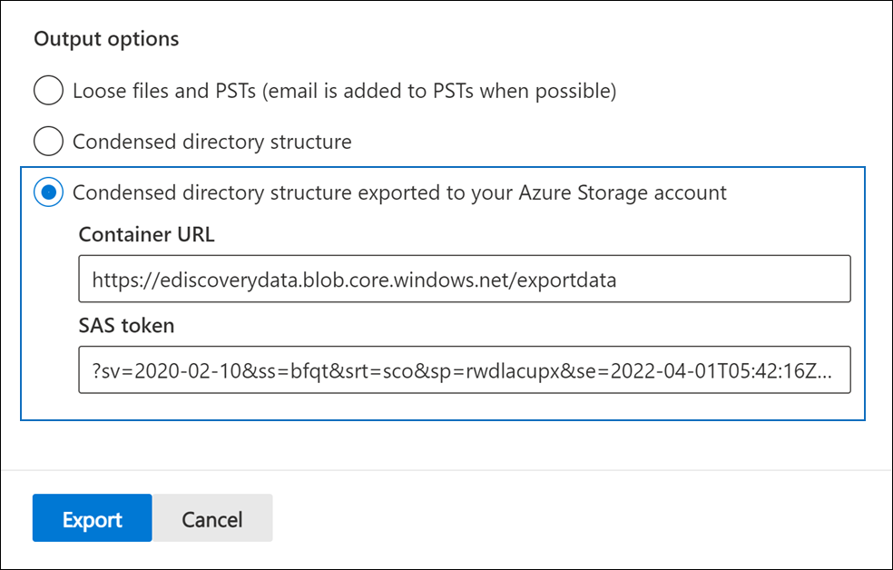
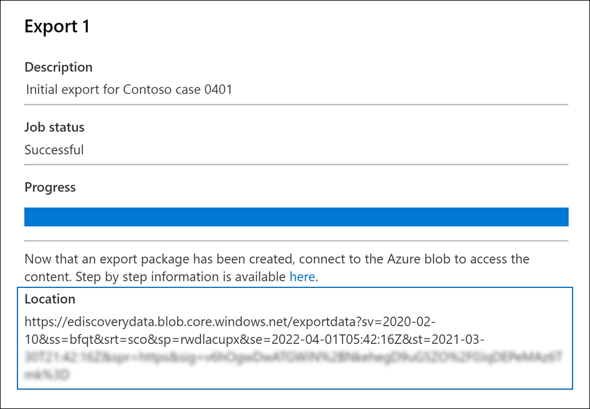
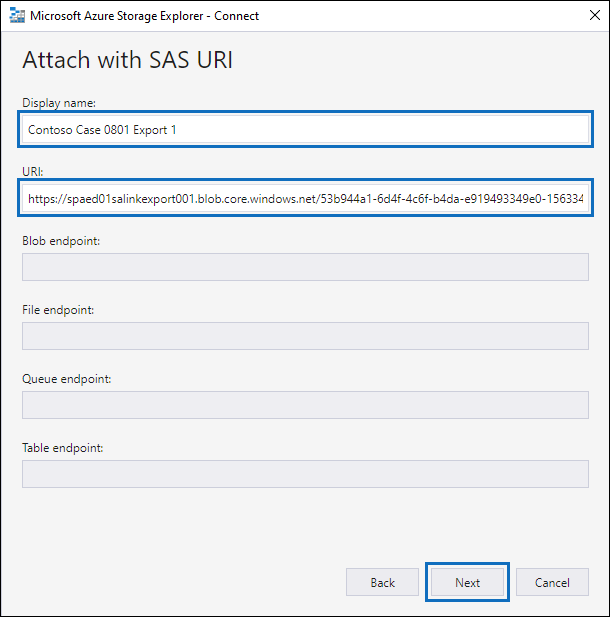
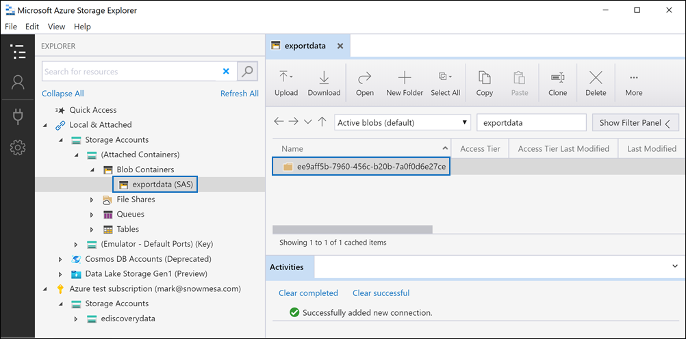
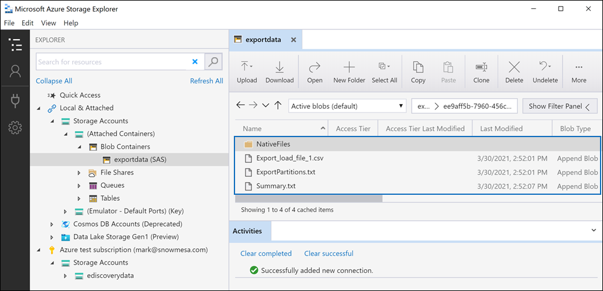

# Export documents in a review set to an Azure Storage account

When you export documents from a review set in an Advanced eDiscovery case, you have the option to export them to an Azure Storage account managed by your organization. If you used this option, the documents are uploaded to your Azure Storage location. After they are exported, you can access the documents (and download them to a local computer or other location) by using the Azure Storage Explorer. This article provides instructions for how to export documents to your Azure Storage account and the use the Azure Storage Explorer to connect to an Azure Storage location to download the exported documents. For more information about Azure Storage Explorer, see [Use Azure Storage Explorer](/azure/storage/blobs/storage-quickstart-blobs-storage-explorer).

## Before you export documents from a review set

- You need to provide a shared access signature (SAS) token for your Azure Storage account and the URL for a specific container in the storage account to export documents from a review set. Be sure to have these at hand (for example, copied to a text file) when you perform Step 2

  - **SAS token**: Be sure to get the SAS token is for your Azure Storage account (and not for the container). You can generate an SAS token for your account in Azure Storage. To do this, go to the Azure Storage account, and select **Share access signature** under the **Settings** settings in the storage account blade. Use the default settings and allow all resource types when you generate the SAS token.

  - **Container URL**: You need to create a container to upload the review set documents to, and then get a copy of the URL for the container; for example, `https://ediscoverydata.blob.core.windows.net/exportdata`. To get the URL, go to the container in Azure Storage, and select **Properties** under the **Settings** section in the container blade.

- Download and install the Azure Storage Explorer. For instructions, see [Azure Storage Explorer tool](https://go.microsoft.com/fwlink/p/?LinkId=544842). You use this tool to connect to the container in your Azure Storage account and download the documents that you exported in Step 1.

## Step 1: Export the documents from a review set

The first step is to create an export job to export documents out of a review set. For more detailed instructions about all the export options, see [Export documents from a review set](export-documents-from-review-set.md). The following procedure highlights the settings to export documents to your organization's Azure Storage account.

1. In the Microsoft 365 compliance center, open the Advanced eDiscovery case, select the **Review sets** tab, and then select the review set that you want to export.

2. In the review set, click **Action** > **Export**.

3. On the **Export options** flyout page, type a name (required) and description (optional) for the export.

4. Configure the settings in the documents, metadata, content, and options sections. For more information about these settings, see [Export documents from a review set](export-documents-from-review-set.md).

5. In the **Output options** section, select the **Condensed directory structure exported to your Azure Storage account** option.

6. Paste the container URL and the SAS token for your storage account in the corresponding fields.

   

7. Click **Export** to create the export job.

## Step 2: Obtain the SAS URL from the export job

The next step is to obtain the SAS URL that's generated after you create the export job in Step 1. You use the SAS URL to connect to the container in your Azure Storage account that you exported the review set documents to.

1. On the **Advanced eDiscovery** page, go to the case, and then click the **Exports** tab.

2. On the **Exports** tab, click the export job that you want to download. This is the export job that you created in Step 1.

3. On the flyout page, under **Locations**, copy the SAS URL that's displayed. If necessary, you can save it to a text file so you can access it in Step 3.

   

   > [!TIP]
   > The SAS URL that's displayed in the export job is a concatenation of the container URL and the SAS token for your Azure Storage account. You can copy it from the export job or create it yourself by combining the URL and the SAS token.

## Step 3: Connect to the Azure Storage container

The final step is to use the Azure Storage Explorer and the SAS URL to connect to the container in your Azure Storage account and download the exported documents to a local computer.

1. Start the Azure Storage Explorer that you downloaded and installed.

2. Click the **Open Connect Dialog** icon.

   

3. On the **Connect to Azure Storage** page, click **Blob container**.

4. On the **Select Authentication Method** page, select the **Shared access signature (SAS)** option and then click **Next**.

5. On the **Enter Connection Info** page, paste the SAS URL (that you obtained in the export job in Step 2) in the **Blob Container SAS URL** box.

    

    Notice that the container name is displayed in the **Display name** box. You can edit this name.

6. Click **Next** to display the **summary** page and then click **Connect**.

    The **Blob containers** node (under **Storage Accounts** > **(Attached Containers)** \> is opened.

    

    It contains a container named with the display name from step 5. This container contains a folder for each export job that you've downloaded to the container in your Azure Storage account. These folders are named with an ID that corresponds to the ID of the export job. You can find these export IDs (and the name of the export) under **Support information** on the flyout page for each **Preparing data for export** job listed on the **Jobs** tab in the Advanced eDiscovery case.

7. Double-click the export job folder to open it.

   A list of folders and export reports is displayed.

    

8. To export all contents from the export job, click the **Up** arrow to go back to the export job folder, and then click **Download**.

9. Specify the location where you want to download the exported files, and then click Select folder.

    The Azure Storage Explorer starts the download process. The status of the downloading the exported items is displayed in the **Activities** pane. A message is displayed when the download is complete.

> [!NOTE]
> Instead of downloading the entire export job in Azure Storage Explorer, you can select specific items to download and view.

## More information

- The export job folder contains the following items. The actual items in the export folder are determined by the export options configured when the export job was created. For more information about these options, see [Export documents from a review set](export-documents-from-review-set.md).

  - Export_load_file.csv: This CSV file is a detail export report that contains information about each exported document. The file consists of a column for each metadata property for a document. For a list and description of the metadata that's included in this report, see the **Exported field name** column in the table in [Document metadata fields in Advanced eDiscovery](document-metadata-fields-in-advanced-ediscovery.md).

  - Summary.txt: A text file that contains a summary of the export including export statistics.

  - Extracted_text_files: This folder contains a text file version of each exported document.

  - NativeFiles: This folder contains a native file version of each exported document.

  - Error_files: This folder includes the following items when the export job contains any error files:

    - ExtractionError.csv: This CSV file contains the available metadata for files that weren't properly extracted from their parent item.

    - ProcessingError: This folder contains documents with processing errors. This content is at an item level, which means if an attachment had a processing error, the document that contains the attachment will also be included in this folder.
