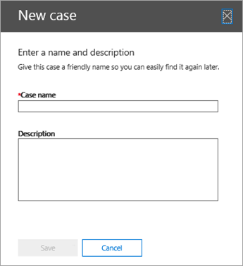
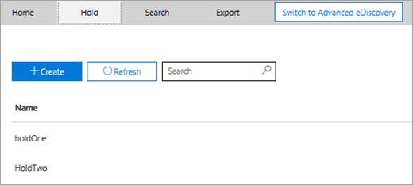
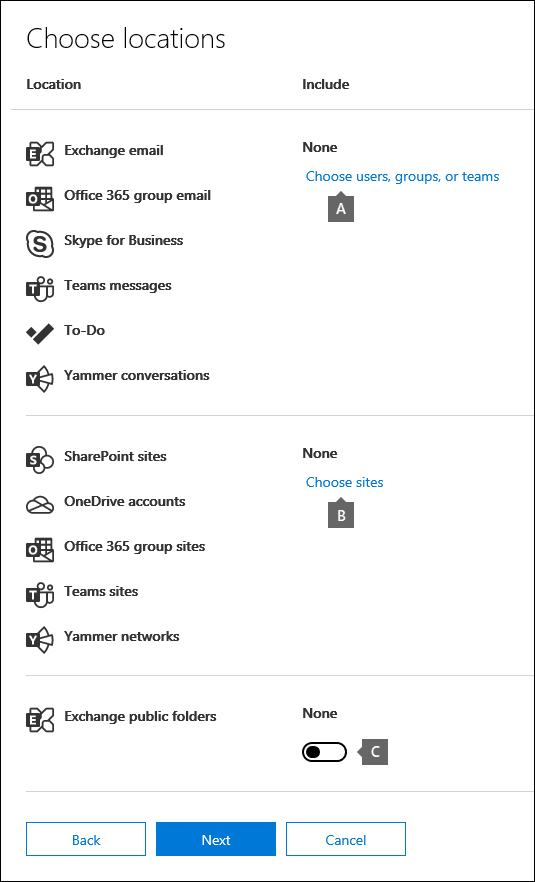
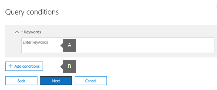
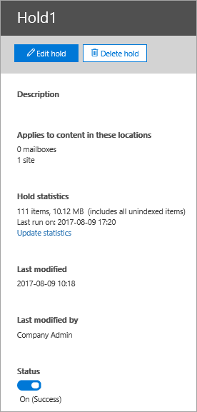
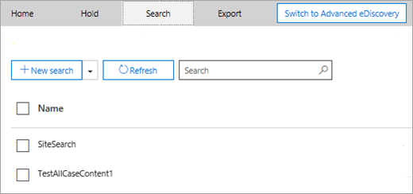
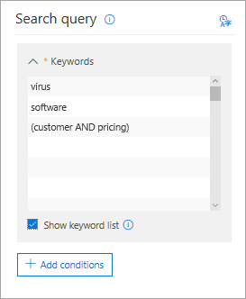
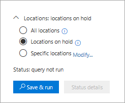
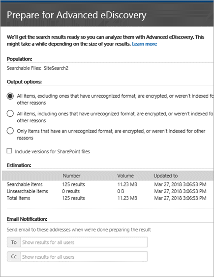
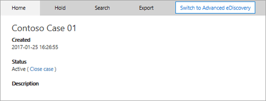

# Manage eDiscovery cases in the Security & Compliance Center

You can use eDiscovery cases in the compliance center in Office 365 and Microsoft 365 to control who can create, access, and manage eDiscovery cases in your organization. If your organization has an Office 365 E5 subscription, you can also use eDiscovery cases to analyze search results by using Office 365 Advanced eDiscovery.
  
An eDiscovery case allows you to add members to a case, control what types of actions that specific case members can perform, place a hold on content locations relevant to a legal case, and associate multiple Content Searches with a single case. You can also export the results of any Content Search that is associated with a case or prepare search results for analysis in Advanced eDiscovery. eDiscovery cases are a good way to limit who has access to Content Searches and search results for a specific legal case in your organization.
  
Use the following workflow to set-up and use eDiscovery cases in the Security & Compliance Center and Advanced eDiscovery.

[Step 1: Assign eDiscovery permissions to potential case members](#step-1-assign-ediscovery-permissions-to-potential-case-members)

[Step 2: Create a new case](#step-2-create-a-new-case)

[Step 3: Add members to a case](#step-3-add-members-to-a-case)

[Step 4: Place content locations on hold](#step-4-place-content-locations-on-hold)

[Step 5: Create and run a Content Search associated with a case](#step-5-create-and-run-a-content-search-associated-with-a-case)

[Step 6: Export the results of a Content Search associated with a case](#step-6-export-the-results-of-a-content-search-associated-with-a-case)

[Step 7: Prepare search results for Advanced eDiscovery](#step-7-prepare-search-results-for-advanced-ediscovery)

[Step 8: Go to the case in Advanced eDiscovery](#step-8-go-to-the-case-in-advanced-ediscovery)

[(Optional) Step 9: Close a case](#optional-step-9-close-a-case)

[(Optional) Step 10: Re-open a closed case](#optional-step-10-re-open-a-closed-case)

[More information](#more-information)
  
## Step 1: Assign eDiscovery permissions to potential case members

The first step is to assign the appropriate eDiscovery-related permissions to people so you can add them to an eDiscovery case in Step 2. You have to be a member of the Organization Management role group (or be assigned the Role Management role) in the Security & Compliance Center to assign eDiscovery permissions. The following list describes the eDiscovery-related role groups in the Security & Compliance Center. 
  
- **Reviewer.** This role group has the most restrictive eDiscovery-related permissions. The primary purpose of this role group is to allow members to view and access case data in [Office 365 Advanced eDiscovery](office-365-advanced-ediscovery.md) (also known as *Advanced eDiscovery v1*). Members of this group can only see and open the list of the cases on the **eDiscovery** page in the Security & Compliance Center that they are members of. After the user accesses a case in the security and compliance center, they can click **Switch to Advanced eDiscovery** to access and analyze the case data in Advanced eDiscovery. They can't create cases, add members to a case, create holds, create searches, preview search results, export search results, or prepare results for Advanced eDiscovery. 

   > [!NOTE]
   > At this time, users who are member of the Reviewer role group can't access data in [Advanced eDiscovery in Microsoft 365](overview-ediscovery-20.md) (also known as *Advanced eDiscovery v2*). To add members to a case in Advanced eDiscovery v2 so that they can review case data, a user must be a member of the eDiscovery Manager role group.
    
- **eDiscovery Manager.** Members of this role group can create and manage eDiscovery cases. They can add and remove members, place content locations on hold, create and edit Content Searches associated with a case, export the results of a Content Search, and prepare search results for analysis in Advanced eDiscovery. There are two subgroups in this role group. The difference between these subgroups is based on scope.
    
  - **eDiscovery Manager.** Can view and manage the eDiscovery cases they create or are a member of. If another eDiscovery Manager creates a case but doesn't add a second eDiscovery Manager as a member of that case, the second eDiscovery Manager won't be able to view or open the case on the **eDiscovery** page in the Security & Compliance Center. eDiscovery Managers can also access their cases in Advanced eDiscovery to perform analysis tasks. 
    
  - **eDiscovery Administrator*.** Can perform all case management tasks that an eDiscovery Manager can do. Additionally, an eDiscovery Administrator can:
    
    - View all cases that are listed on the **eDiscovery** page. 
    
    - Manage any case in the organization after they add themself as a member of the case.
    
    - Access case data in Advanced eDiscovery for any case in the organization.
    
    See the [More information](#more-information) section for reasons why you may want an eDiscovery Administrator in your organization. 
    
> [!IMPORTANT]
> If a person isn't a member of one of these eDiscovery-related role groups, or isn't a member of a role group that's assigned the Reviewer role, you can't add them as a member of an eDiscovery case. 

For more information about eDiscovery permissions, see [Assign eDiscovery permissions](assign-ediscovery-permissions.md).
  
 **To assign eDiscovery permissions:**
  
1. Go to [https://protection.office.com](https://protection.office.com).
    
2. Sign in to Office 365 using your work or school account.
    
3. In the Security & Compliance Center, click **Permissions**, and then do one of the following based on the eDiscovery permissions that you want to assign.
    
    - To assign Reviewer permissions, select the **Reviewer** role group, and then next to **Members**, click **Edit**. Click **Choose members**, click **Edit**, click  **Add**, select the user that you want to add to the Reviewer role group, and then click **Add**.
    
    - To assign eDiscovery Manager permissions, select the **eDiscovery Manager** role group, and then next to **eDiscovery Manager**, click **Edit**. Click **Choose eDiscovery Manager**, click **Edit**, click  ** Add **, select the user that you want to add as an eDiscovery Manager, and then click **Add**.
    
    - To assign eDiscovery Administrator permissions, select the **eDiscovery Manager** role group, and then next to **eDiscovery Administrator**, click **Edit**. Click **Choose eDiscovery Administrator**, click **Edit**, click  **Add**, select the user that you want to add as an eDiscovery Administrator, and then click **Add**.
    
4. After you have added all the users, click **Done**, click **Save** to save the changes to the role group, and then click **Close**.

## Step 2: Create a new case

The next step is to create a eDiscovery case. You must be a member of the eDiscovery Managers role group to create eDiscovery cases. As previously explained, after you create a case in the Security & Compliance Center, you (and other case members) will be able to access that same case in Advanced eDiscovery if your organization has an Office 365 E5 subscription.
  
1. Go to [https://protection.office.com](https://protection.office.com).
    
2. Sign in to Office 365 using your work or school account.
    
3. In the Security & Compliance Center, click **eDiscovery** \> **eDiscovery**, and then click  **Create a case**.
    
4. On the **New Case** page, give the case a name, type an optional description, and then click **Save**. The case name must be unique in your organization.
    
    
  
    The new case is displayed in the list of cases on the **eDiscovery** page. You can hover the cursor over a case name to display information about the case, including the status of the case (**Active** or **Closed**), the description of the case (that was created in the previous step), and when the case was changed last and who changed it.
    
    > [!TIP]
    > After you create a new case, you can rename it anytime. Just click the name of the case on the **eDiscovery** page. On the **Manage this case** flyout page, change the name displayed in the box under **Name**, and then save the change. 
  
## Step 3: Add members to a case

After you create a case, the next step is to add members to the case. As previous explained, only users who are members of the Reviewer or eDiscovery Manager role groups can be added as members of the case. The eDiscovery Manager who created the case is automatically added as a member.
  
1. In the Security & Compliance Center, click **eDiscovery** \> **eDiscovery** to display the list of cases in your organization. 
    
2. Click the name of the case that you want to add members to.
    
    The **Manage this case** flyout page is displayed. 
    
    
  
3. Under **Manage members**, click  **Add** to add members to the case. 
    
    You can also choose to add a role group to the case. Under **Manage role groups**, click  **Add**.
    
    > [!NOTE]
    > Role groups control who can assign members to an eDiscovery case. That means you can only assign the role groups that you are a member of to a case.
    
4. In the list of people or role groups that can be added as members of the case, click the check box next to the names of the people or role groups that you want to add.
    
    > [!TIP]
    > If you have a large list of people who can added as members, use the **Search** box to search for a specific person in the list. 
  
5. After you have selected the people or role groups to add as members of the group, click **Add**.
    
    In **Manage this case**, click **Save** to save the new list of case members. 
    
6. Click **Save** to save the new list of case members. 
  
## Step 4: Place content locations on hold

You can use an eDiscovery case to create holds to preserve content that might be relevant to the case. You can place a hold on the mailboxes and OneDrive for Business sites of people who are custodians in the case. You can also place a hold on the group mailbox, SharePoint site, and OneDrive for Business site for an Office 365 Group. Similarly, you can place a hold on the mailboxes and sites that are associated with Microsoft Teams or Yammer Groups. When you place content locations on hold, content is held until you remove the hold from the content location or until you delete the hold.

> [!NOTE]
> After you place a content location on hold, it takes up to 24 hours for the hold to take effect. 
>   
When you create a hold, you have the following options to scope the content that is held in the specified content locations:
  
- You create an infinite hold where all content is placed on hold. Alternatively, you can create a query-based hold where only content that matches a search query is placed on hold.
    
- You can specify a date range to hold only the content that was sent, received, or created within that date range. Alternatively, you can hold all content regardless of when it was sent, received, or created.
    
> [!NOTE]
> You can have a maximum of 10,000 hold policies across all eDiscovery cases in your organization. 
  
To create a hold for an eDiscovery case:
  
1. In the Security & Compliance Center, click **eDiscovery** \> **eDiscovery** to display the list of cases in your organization. 
    
2. Click **Open** next to the case that you want to create the holds in. 
    
3. On the **Home** page for the case, click the **Hold** tab. 
    
    
  
4. On the **Hold** page, click  **Create**.
    
5. On the **Name your hold** page, give the hold a name. The name of the hold must be unique in your organization. 
    
    
  
6. (Optional) In the **Description** box, add a description of the hold. 
    
7. Click **Next**.
    
8. Choose the content locations that you want to place on hold. You can place mailboxes, sites, and public folders on hold.
    
    
  
   a. **Exchange email** - Click **Choose users, groups, or teams** and then click **Choose users, groups, or teams** again. to specify mailboxes to place on hold. Use the search box to find user mailboxes and distribution groups (to place a hold on the mailboxes of group members) to place on hold. You can also place a hold on the associated mailbox for a Microsoft Team, a Yammer Group, or an Office 365 Group. Select the user, group, team check box, click **Choose**, and then click **Done**.
    
    > [!NOTE]
    > When you click **Choose users, groups, or teams** to specify mailboxes to place on hold, the mailbox picker that's displayed is empty. This is by design to enhance performance. To add people to this list, type a name (a minimum of 3 characters) in the search box. 

   b. **SharePoint sites** - Click **Choose sites** and then click **Choose sites** again to specify SharePoint and OneDrive for Business sites to place on hold. Type the URL for each site that you want to place on hold. You can also add the URL for the SharePoint site for a Microsoft Team, a Yammer Group, or a, Office 365 Group. Click **Choose**, and then click **Done**.
    
    See the [More information](#more-information) section for tips on putting Microsoft Teams, Yammer Groups, and Office 365 Groups on hold. 
    
    > [!NOTE]
    > In the rare case that a person's user principal name (UPN) is changed, the URL for their OneDrive account will also be changed to incorporate the new UPN. If this happens, you'll have to modify the hold by adding the user's new OneDrive URL and removing the old one. 
  
   c. **Exchange public folders.** Move the toggle switch  to the **All** position to put all public folders in your Exchange Online organization on hold. You can't choose specific public folders to put on hold. Leave the toggle switch set to **None** if you don't want to put a hold on public folders.
    
9. When you're done adding content locations to the hold, click **Next**.
    
10. To create a query-based hold with conditions, complete the following. Otherwise, click **Next**
    
    
  
    
       a. In the box under **Keywords**, type a search query in the box so that only the content that meets the search criteria is placed on hold. You can specify keywords, message properties, or document properties, such as file names. You can also use more complex queries that use a Boolean operator, such as **AND**, **OR**, or **NOT**. If you leave the keyword box empty, then all content located in the specified content locations will be placed on hold.
    
    b. Click  **Add conditions** to add one or more conditions to narrow the search query for the hold. Each condition adds a clause to the KQL search query that is created and run when you create the hold. For example, you can specify a date range so that email or site documents that were created within the date ranged are placed on hold. A condition is logically connected to the keyword query (specified in the keyword box) by the **AND** operator. That means that items have to satisfy both the keyword query and the condition to be placed on hold.

    For more information about creating a search query and using conditions, see [Keyword queries and search conditions for Content Search](keyword-queries-and-search-conditions.md).
    
11. After configuring a query-based hold, click **Next**.
    
12. Review your settings, and then click **Create this hold**.
    
### Hold statistics

After a while, information about the new hold is displayed in the details pane on the **Holds** page for the selected hold. This information includes the number of mailboxes and sites on hold and statistics about the content that was placed on hold, such as the total number and size of items placed on hold and the last time the hold statistics were calculated. These hold statistics help you identify how much content that's related to the eDiscovery case is being held. 
  

  
Keep the following things in mind about hold statistics:
  
- The total number of items on hold indicates the number of items from all content sources that are placed on hold. If you've created a query-based hold, this statistic indicates the number of items that match the query.
    
- The number of items on hold also includes unindexed items found in the content locations. If you create a query-based hold, all unindexed items in the content locations are placed on hold. This includes unindexed items that don't match the search criteria of a query-based hold and unindexed items that might fall outside of a date range condition. This is different than what happens when you run a Content Search, in which unindexed items that don't match the search query or are excluded by a date range condition aren't included in the search results. For more information about unindexed items, see [Partially indexed items in Content Search in Office 365](partially-indexed-items-in-content-search.md).
    
- You can get the latest hold statistics by clicking **Update statistics** to re-run a search estimate that calculates the current number of items on hold. If necessary, click **Refresh** in the toolbar to update the hold statistics in the details pane. 
    
- It's normal for the number of items on hold to increase over time because users whose mailbox or site is on hold are typically sending or receiving new email message and creating new SharePoint and OneDrive for Business documents.
    
> [!NOTE]
> If a SharePoint site or OneDrive account is moved to a different region in a multi-geo environment, the statistics for that site won't be included in the hold statistics. However, the content in the site will still be on hold. Also, if a site is moved to a different region the URL that's displayed in the hold will not be updated. You'll have to edit the hold and update the URL. 
  
## Step 5: Create and run a Content Search associated with a case

After an eDiscovery case is created and any custodians related to the case are placed on hold, you can create and run one or more Content Searches that are associated with the case. Content Searches associated with a case aren't listed on the **Search** page in the Security & Compliance Center. This means that Content Searches associated with a case can only be accessed by case members who are also members of the eDiscovery Manager role group. 
  
1. In the Security & Compliance Center, click **eDiscovery** \> **eDiscovery** to display the list of cases in your organization. 
    
2. Click **Open** next to the case that you want to create a Content Search in. 
    
3. On the **Home** page for the case, click the **Search** tab. 
    
    
  
4. On the **Search** page, click  **New search**. 
    
5. On the **New search** page, you can add keywords and conditions to create the search query. 
    
    
  
6. You can specify keywords, message properties, such as sent and received dates, or document properties, such as file names or the date that a document was last changed. You can use more complex queries that use a Boolean operator, such as **AND**, **OR**, **NOT**, **NEAR**, or **ONEAR**. You can also search for sensitive information (such as social security numbers) in documents, or search for documents that have been shared externally. If you leave the keyword box empty, all content located in the specified content locations will be included in the search results. 
    
7. You can click the **Show keyword list** check box and the type a keyword in each row. If you do this, the keywords on each row are connected by the **OR** operator in the search query that's created. 
    
    
  
    Why use the keyword list? You can get statistics that show how many items match each keyword. This can help you quickly identify which keywords are the most (and least) effective. You can also use a keyword phrase (surrounded by parentheses) in a row. For more information about search statistics, see [View keyword statistics for Content Search results](view-keyword-statistics-for-content-search.md).
    
    For more information about using the keywords list, see [Building a search query](content-search.md#building-a-search-query).
    
8. Under **Conditions**, add conditions to a search query to narrow a search and return a more refined set of results. Each condition adds a clause to the KQL search query that is created and run when you start the search. A condition is logically connected to the keyword query (specified in the keyword box) by the **AND** operator. That means that items have to satisfy both the keyword query and the condition to be included in the results. This is how conditions help to narrow your results. 
    
    For more information about creating a search query and using conditions, see [Keyword queries for Content Search](keyword-queries-and-search-conditions.md).
    
9. Under **Locations: locations on hold**, choose the content locations that you want to search. You can search mailboxes, sites, and public folders in the same search.
    
    
  
    - **All locations** - Select this option to search all content locations in your organization. When you select this option, you can choose to search all Exchange mailboxes (which includes the mailboxes for all Microsoft Teams, Yammer Groups, and Office 365 Groups), all SharePoint and OneDrive for Business sites (which includes the sites for all Microsoft Teams, Yammer Groups, and Office 365 Groups), and all public folders.
    
    - **All locations on hold.** Select this option to search all the content locations that have been placed on hold in the case. If the case contains multiple holds, the content locations from all holds will be searched when you select this option. Additionally, if a content location was placed on a query-based hold, only the items that are on hold will be searched when you run the content search that you're creating in this step. For example, if a user was placed on query-based case hold that preserves items that were sent or created before a specific date, only those items would be searched by using the search criteria of the content search. This is accomplished by connecting the case hold query and the content search query by an **AND** operator. See the [More information](#more-information) section at the end of this article for more details about searching case content. 
    
    - **Specific locations.** Select this option to select the mailboxes and sites that you want to search. When you select this option and click **Modify**, a list of locations appears. You can choose to search any or all users, groups, teams, or site locations.
    
      
  
      You can also choose to search all public folders in your organization, but if you select this option and search any content location that's on hold, any query from a query-based case hold won't be applied to the search query. In other words, all content in a location is searched, not just the content that is preserved by a query-based case hold.
    
      You can remove the pre-populated case content locations or add new ones. If you choose this option, you also have flexibility to search all content locations for a specific service (such as searching all Exchange mailboxes) or you can search specific content locations for a service. You can also choose whether to search the public folders in your organization.
    
      Keep these things in mind when adding content locations to search:
    
      - When you click **Choose users, groups, or teams** to specify mailboxes to search, the mailbox picker that's displayed is empty. This is by design to enhance performance. To add recipients to this list, click **Choose users, groups, or teams**, type a name (a minimum of 3 characters) in the search box, select the check box next to the name, and then click **Choose**. 
    
      - You can add inactive mailboxes, Microsoft Teams, Yammer Groups, Office 365 Groups, and distribution groups to the list of mailboxes to search. Dynamic distribution groups aren't supported. If you add Microsoft Teams, Yammer Groups, or Office 365 Groups, the group or team mailbox is searched; the mailboxes of the group members aren't searched.
    
      - To add sites click **Choose sites**, click **Choose sites** again, and then type the URL for each site that you want to search. You can also add the URL for the SharePoint site for a Microsoft Team, a Yammer Group, or an Office 365 Group. 
    
10. After you select the content locations to search, click **Done** and then click **Save**.
    
11. On the **New search** page, click **Save** and then type a name for the search. Content Searches associated with a case must have names that are unique within your Office 365 organization. 
    
12. Click **Save &amp; run** to save the search settings. 
    
13. Enter a unique name for the search, and click **Save** to start the search. 
    
    The search begins. After a while, an estimate of the search results is displayed in the details pane. The estimate includes the total size and number of items that matched the search criteria. The search estimate also includes the number of unindexed items in the content locations that were searched. The number of unindexed items that don't meet the search criteria will be included in the search statistics displayed in the details pane. If an unindexed item matches the search query (because other message or document properties meet the search criteria), it won't be included in the estimated number of unindexed items. If an unindexed item is excluded by the search criteria, it also won't be included in the estimate of unindexed items.
    
  After the search is completed, you can preview the search results. If necessary, click **Refresh** to update the information in the details pane. 
    
## Step 6: Export the results of a Content Search associated with a case

After a search is successfully run, you can export the search results. When you export search results, mailbox items are downloaded in PST files or as individual messages. When you export content from SharePoint and OneDrive for Business sites, copies of native Office documents and other documents are exported. A manifest file (in XML format) that contains information about every search result is also exported.
  
You can export the results of a [single search associated with a case](#export-the-results-of-a-single-search-associated-with-a-case) or you can export the results of [multiple searches associated with a case](#export-the-results-of-multiple-searches-associated-with-a-case).
  
### Export the results of a single search associated with a case

1. In the Security & Compliance Center, click **eDiscovery** \> **eDiscovery** to display the list of cases in your organization. 
    
2. Click **Open** next to the case that you want to export search from. 
    
3. On the **Home** page for the case, click **Search**.
    
4. In the list of searches for the case, click the search that you want to export search results from, click  **More**, and then select **Export results** from the drop-down list. 
    
    The **Export results** page is displayed. 
    
    
  
    The workflow to export the results from a Content Search associated with a case is that same as exporting the search results for a search on the **Content search** page. For step-by-step instructions, see [Export Content Search results](export-search-results.md).
    
    > [!NOTE]
    > When you export search results, you have the option to enable de-duplication so that only one copy of an email message is exported even though multiple instances of the same message might have been found in the mailboxes that were searched. For more information about de-duplication and how duplicate items are identified, see [De-duplication in eDiscovery search results](de-duplication-in-ediscovery-search-results.md). 
  
5. Click the **Export** tab to display the list of export jobs that exist for that case. 
    
    
  
    You might have to click **Refresh** to update the list of export jobs so that it shows the export job that you created. Export jobs have the same name as the corresponding Content Search with **_Export** appended to the end of search name. 
    
6. Click the export job that you just created to display status information in the details pane. This information includes the percentage of items that have been transferred to an Azure Storage area in the Microsoft cloud.
    
    After all items have been transferred, click **Download results** to download the search results to your local computer. For more information, see Step 2 in [Export Content Search results](export-search-results.md)
    
### Export the results of multiple searches associated with a case

As an alternative to exporting the results of a single Content Search associated with a case, you can export the results of multiple searches from the same case in a single export. Exporting the results of multiple searches is faster and easier than exporting the results one search at a time.
  
> [!NOTE]
> You can't export the results of multiple searches if one of those searches was configured to search all case content. only export the results of multiple searches for searches that are associated with an eDiscovery case. You can't export the results of multiple searches listed on the **Content search** page in the Security & Compliance Center. 
  
1. In the Security & Compliance Center, click **eDiscovery** \> **eDiscovery** to display the list of cases in your organization. 
    
2. Click **Open** next to the case that you want to export search results from. 
    
3. On the **Home** page for the case, click **Search**.
    
4. In the list of searches for the case, select two or more searches that you want to export search results from.
    
    > [!NOTE]
    > To select multiple searches, press Ctrl as you click each search. Or you can select multiple adjacent searches by clicking the first search, holding down the Shift key, and then clicking the last search. 
  
5. After you select the searches, the **Bulk actions** page appears. 
    
    
  
    
6. Click  **Export results**.

7. On the **Export results** page, give the export a unique name, select output options, and choose how your content will be exported. Click **Export**.
    
    The workflow to export the results from multiple content searches associated with a case is the same as exporting the search results for a single search. For step-by-step instructions, see [Export Content Search results](export-search-results.md).
    
    > [!NOTE]
    > When you export search results from multiple searches associated with a case, you also have the option to enable de-duplication so that only one copy of an email message is exported even though multiple instances of the same message might have been found in the mailboxes that were searched in one or more of the searches. For more information about de-duplication and how duplicate items are identified, see [De-duplication in eDiscovery search results](de-duplication-in-ediscovery-search-results.md). 
  
8. After you start the export, click the **Export** tab to display the list of export jobs for that case. 
    
    
  
    You might have to click **Refresh**  to update the list of export jobs to display the export job that you created. The searches that were included in the export job are listed in the **Searches** column. 
    
8. Click the export job that you just created to display status information in the details pane. This information includes the percentage of items that have been transferred to an Azure Storage area in the Microsoft cloud.
    
9. After all items have been transferred, click **Download results** to download the search results to your local computer. For more information, see Step 2 in [Export Content Search results](export-search-results.md).
    
#### More information about exporting the results of multiple searches

- When you export the results of multiple searches, the search queries from all the searches are combined by using **OR** operators, and then the combined search is started. The estimated results of the combined search are displayed in the details pane of the selected export job. The search results are then transferred to the Azure Storage area in the Microsoft cloud. The status of the transfer is also displayed in the details pane. As previously stated, after all the search results have been transferred, you can download them to your local computer. 
    
- The maximum number of keywords from the search queries for all searches that you want to export is 500. (this is the same limit for a single Content Search). That's because the export job combines all the search queries by using the **OR** operator. If you exceed this limit, an error will be returned. In this case, you have to export the results from fewer searches or simplify the search queries of the searches that you want to export. 
    
- The search results that are exported are organized by the content source the item was found in. That means a content source in the export results might have items returned by different searches. For example, if you chose to export email messages in one PST file for each mailbox, the PST file might have results from multiple searches.
    
- If the same email item or document from the same content location is returned by more than one of the searches that you export, only one copy of the item will be exported.
    
- You can't edit an export for multiple searches after you create it. For example, you can't add or remove searches from the export. You have to create an export job to change which search results are exported. After an export job is created, you only can download the results to a computer, restart the export, or delete the export job.
    
- If you restart the export, any changes to the queries of the searches that make up the export job won't affect the search results that will be retrieved. When you restart an export, the same combined search query job that was run when the export job was created will be run again.
    
- If you restart an export from the **Exports** page in an eDiscovery case, the search results that are transferred to the Azure Storage area overwrites the previous results. The previous results there were transferred won't be available to be downloaded. 
    
- Preparing the results of multiple searches for analysis in Advanced eDiscovery isn't available. You can only prepare the results of a single search for analysis in Advanced eDiscovery.

## Step 7: Prepare search results for Advanced eDiscovery

If your organization has an Office 365 E5 subscription, you can prepare the results of Content Searches associated with a case for analysis in Advanced eDiscovery. After you prepare search results, you can go to Advanced eDiscovery (see [Step 8: Go to the case in Advanced eDiscovery](#step-8-go-to-the-case-in-advanced-ediscovery)) and process the search result data for further analysis in Advanced eDiscovery.
  
When you prepare search results for Advanced eDiscovery, optical character recognition (OCR) functionality automatically extracts text from images. OCR is supported for loose files, email attachments, and embedded images. This allows you to apply the text analytic capabilities of Advanced eDiscovery (near-duplicates, email threading, themes, and predictive coding) to any text in image files.
  
> [!NOTE]
> To analyze a user's data using Advanced eDiscovery, the user (the custodian of the data) must be assigned an Office 365 E5 license. Alternatively, users with an Office 365 E1 or E3 license can be assigned an Advanced eDiscovery standalone license. Administrators and compliance officers who are assigned to cases and use Advanced eDiscovery to analyze data don't need an E5 license. 
  
1. In the Security & Compliance Center, click **eDiscovery** \> **eDiscovery** to display the list of cases in your organization. 
    
2. Click **Open** next to the case that you want to prepare search results for analysis in Advanced eDiscovery. 
    
3. On the **Home** page for the case, click **Search**, and then select the search.
    
4. In the details pane, click  **More**, and then click **Prepare for Advanced eDiscovery**.
    
    
  
5. On the **Prepare for Advanced eDiscovery** page, choose to prepare one of the following: 
    
    - All items, excluding those with unrecognized format, are encrypted, or weren't indexed for other reasons.
    
    - All items, including those that have unrecognized format, are encrypted, or weren't indexed for other reasons.
    
    - Only items that have an unrecognizable format, are encrypted, or weren't indexed for other reasons.
    
6. (Optional) Click the **Include versions for SharePoint files** check box. 
    
7. Click **Prepare**.
    
    The search results are prepared for analysis with Advanced eDiscovery.
    
8. Click **Close** to close the details pane. 
    
## Step 8: Go to the case in Advanced eDiscovery

After you create a case in the Security & Compliance Center, you can go to the same case in Advanced eDiscovery.
  
To go to a case in Advanced eDiscovery:
  
1. In the Security & Compliance Center, click **eDiscovery** \> **eDiscovery** to display the list of cases in your organization. 
    
2. Click **Open** next to the case that you want to go to in Advanced eDiscovery. 
    
3. On the **Home** page for the case, click **Switch to Advanced eDiscovery**.
    
    
  
    The **Connecting to Advanced eDiscovery** progress bar is displayed. When you're connected to Advanced eDiscovery, a list of containers is displayed on the page. 
    
    
  
    These containers represent the search results that you prepared for analysis in Advanced eDiscovery in Step 7. The name of the container has the same name as Content Search in the case in the Security & Compliance Center. The containers in the list are the ones that you prepared. If a different user prepared search results for Advanced eDiscovery, the corresponding containers won't be included in the list.
    
4. To load the search result data from a container to the case in Advanced eDiscovery, select a container and click **Process**.
    
    For information about how to process containers, see [Run the Process module and load data in Office 365 Advanced eDiscovery](run-the-process-module-and-load-data-in-advanced-ediscovery.md).
    
> [!TIP]
> Click **Switch to eDiscovery** to go back to the same case in the Security & Compliance Center. 
  
## (Optional) Step 9: Close a case

When the legal case or investigation supported by an eDiscovery case is completed, you can close the case. Here's what happens when you close a case:
  
- If the case contains any content locations on hold, those holds will be turned off. This might result in content being permanently deleted or purged, either by the user or by an automated process, such as a deletion policy.
    
- Closing a case only turns off the holds that are associated with that case. If other holds are place on a content location (such as a Litigation Hold. a Preservation Policy, or a hold from a different eDiscovery case) those holds will still be maintained.
    
- The case is still listed on the eDiscovery page in the Security & Compliance Center. The details, holds, searches, and members of a closed case are retained.
    
- You can edit a case after it's closed. For example, you can add or removing members, create searches, export search results, and prepare search result for analysis in Advanced eDiscovery. The primary difference between active and closed cases is that holds are turned off when a case is closed.
    
To close a case:
  
1. In the Security & Compliance Center, click **eDiscovery** \> **eDiscovery** to display the list of cases in your organization. 
    
2. Click the name of the case that you want to close.
    
    The **Manage this case** flyout page is displayed. 
    
3. Under **Manage case status**, click  **Close case**.
    
    A warning is displayed saying that the holds associated with the case will be turned off.
    
4. Click **Yes** to close the case. 
    
    The status on the **Manage this case** flyout page is changed from **Active** to **Closing**.
    
5. Close the **Manage this case** page. 
    
6. On the **eDiscovery** page, click  **Refresh** to update the status of the closed case. It might take up to 60 minutes for the closing process to complete. 
    
    When the process is complete, the status of the case is changed to **Closed** on the **eDiscovery** page. Click the name of the case again to display the **Manage this case** flyout page, which contains information about when the case was closed and who closed it. 
     
## (Optional) Step 10: Re-open a closed case

When you reopen a case, any holds that were in place when the case was closed won't be automatically reinstated. After the case is reopened, you'll have to go to the **Hold** page and turn on the previous holds. To turn on a hold, select it and click **Turn it on** in the details pane. 
  
1. In the Security & Compliance Center, click **eDiscovery** \> **eDiscovery** to display the list of cases in your organization. 
    
2. Click the name of the case that you want to reopen.
    
    The **Manage this case** flyout page is displayed. 
    
3. Under **Manage case status**, click **Reopen case**.
    
    A warning is displayed saying that the holds that were associated with the case when it was closed won't be turned on automatically.
    
4. Click **Yes** to reopen the case. 
    
    The status on the **Manage this case** flyout page is changed from **Closed** to **Active**.
    
5. Close the **Manage this case** page. 
    
6. On the **eDiscovery** page, click  **Refresh** to update the status of the reopened case. It might take up to 60 minutes for the reopening process to complete. 
    
    When the process is complete, the status of the case is changed to **Active** on the **eDiscovery** page. 
  
## (Optional) Step 11: Delete a case

You can also delete active and closed cases. When you delete a case all searches and exports in the case are deleted, and it's removed from the list of cases on the **eDiscovery** page in the Security & Compliance Center. You can't re-open a deleted case. 

Before you can delete a case (whether it's active or closed), you must first delete *all* holds associated with the case. That includes deleting holds with a status of **Off**. 

To delete a hold:

1. Go the **Holds** tab in case that you want to delete.

2. Click the hold that you want to delete.

3. On the flyout page, click **Delete hold**.

To delete a case:

1. In the Security & Compliance Center, click **eDiscovery** \> **eDiscovery** to display the list of cases in your organization. 
    
2. Click the name of the case that you want to delete.

3. Under **Manage case status** on the flyout page, click **Delete case**.

If the case you're trying to delete still contains holds, you'll receive an error message. You'll have to delete all holds associated with the case and then try again to delete the case.

## More information

- **Are there any limits for eDiscovery cases or holds associated with an eDiscovery case?** The following table lists the limits for eDiscovery cases and case holds.
    
  |**Description of limit**|**Limit**|
  |:-----|:-----|
  |Maximum number of cases for an organization  <br/> |No limit  <br/> |
  |Maximum number of case holds for an organization  <br/> |10,000  <br/> |
  |Maximum number of mailboxes in a single case hold  <br/> |1,000  <br/> |
  |Maximum number of SharePoint and OneDrive for Business sites in a single case hold  <br/> |100  <br/> |
   
- **What about cases that were created on the case management page in Advanced eDiscovery?** You can access a list of older Advanced eDiscovery cases by clicking the link at the bottom on the **eDiscovery** page in the Security & Compliance Center. However, to do any work in an older case, you have to contact Office 365 Support and request that the case be moved to a new eDiscovery case in the Security & Compliance Center. 
    
- **Why create an eDiscovery Administrator?** As previously explained, an eDiscovery Administrator is member of the eDiscovery Manager role group who can view and access all eDiscovery cases in your organization. This ability to access all the eDiscovery cases has two important purposes:
    
  - If a person who is the only member of an eDiscovery case leaves your organization, no one (including members of the Organization Management role group or another member of the eDiscovery Manager role group) can access that eDiscovery case because they aren't a member of a case. In this situation, there would be no way to access the data in the case. But because an eDiscovery Administrator can access all eDiscovery cases in the organization, they can view the case in the Security & Compliance Center and add themselves or another eDiscovery manager as a member of the case.
    
  - Because an eDiscovery Administrator can view and access all eDiscovery cases, they can audit and oversee all cases and associated Content Searches. This can help to prevent any misuse of Content Searches or eDiscovery cases. And because eDiscovery Administrators can access potentially sensitive information in the results of a Content Search, you should limit the number of people who are eDiscovery Administrators.
    
    Finally, as previous explained, eDiscovery Administrators in the Security & Compliance Center are automatically added as administrators in Advanced eDiscovery. That means a person who is an eDiscovery Administrator can perform administrative tasks in Advanced eDiscovery, such as setting up users, creating cases, and adding data to cases.
    
- **What are the licensing requirements to place content locations on hold?** In general, organizations require an Office 365 E3 subscription or higher to place content locations on hold. To place mailboxes on hold, an Exchange Online Plan 2 license is required for the mailbox you want to place on hold.
    
- **What else should you know about searching all case content in Step 5?** As previously explained, you can search the content locations that have been placed on hold in the case. When you do this, only the content that matches the hold criteria is search. If there is no hold criteria, all content is searched. If contents are on a query-based hold, only the content that matches both hold criteria (from the hold placed in Step 4) and the search criteria (from the search in Step 5) is returned with the search results.
    
    Here are some other things to keep in mind when searching all case content:
    
  - If a content location is part of multiple holds within the same case, the hold queries are combined by an **OR** operator when you search that content location using the all case content option. Similarly, if a content location is part of two different holds, where one is query-based and the other is an infinite hold (where all content is placed on hold), then all content is search because of the infinite hold. 
    
  - If a content search is for a case and you've configured it to search all case content and then you change a hold (by adding or removing a content location or changing the hold query), the search configuration is updated with those changes. However, you have to re-run the search after the hold is changed to update the search results.
    
  - If multiple case holds are placed on a content location in an eDiscovery case and you select to search all case content, the maximum number of keywords for that search query is 500. That's because the content search combines all the query-based holds by using the **OR** operator. If there are more than 500 keywords in the combined hold queries and the content search query, then all content in the mailbox is searched, not just that content that matches any query-based case holds. 
    
  - If a case hold has a status of **Turning on**, you can still search the case content locations while the hold is being turned on.
    
  - As previously stated, if a search is configured to search all case content, then you can't include that search if you want to export the results of multiple searches. If a search is configured to search all case content, then you have to export the results of that single search.
    
- **If a mailbox, SharePoint site, or OneDrive account that is on hold is moved to a different region in a multi-geo environment, will the hold still apply?** In all cases, the content in a mailbox, site, or OneDrive account will still be retained. However, the hold statistics will no longer include items from a content location that's been moved to a different region. To include hold statistics for a content location that's been moved, you have to edit the hold and update the URL (or SMTP address of a mailbox) so that the content location is once again included in the hold statistics. 
    
- **What about placing a hold on Office 365 Groups and Microsoft Teams?** Microsoft Teams is built on Office 365 Groups. Therefore, placing them on hold in an eDiscovery case is similar. Keep the following things in mind when placing Office 365 Groups and Microsoft Teams on hold. 
    
  - To place content located in Office 365 Groups and Microsoft Teams on hold, you have to specify the mailbox and SharePoint site that associated with a group or team.
    
  - Run the **Get-UnifiedGroup** cmdlet in Exchange Online to view properties for an Office 365 Group or Microsoft Team. This is a good way to get the URL for the site that's associated with an Office 365 Group or a Microsoft Team. For example, the following command displays selected properties for an Office 365 Group named Senior Leadership Team: 
    
       ```text
       Get-UnifiedGroup "Senior Leadership Team" | FL DisplayName,Alias,PrimarySmtpAddress,SharePointSiteUrl

       DisplayName            : Senior Leadership Team
       Alias                  : seniorleadershipteam
       PrimarySmtpAddress     : seniorleadershipteam@contoso.onmicrosoft.com
       SharePointSiteUrl      : https://contoso.sharepoint.com/sites/seniorleadershipteam
       ```

    > [!NOTE]
    > To run the **Get-UnifiedGroup** cmdlet, you have to be assigned the View-Only Recipients role in Exchange Online or be a member of a role group that's assigned the View-Only Recipients role. 
  
  - When a user's mailbox is searched, any Office 365 Group or Microsoft Team that the user is a member of won't be searched. Similarly, when you place an Office 365 Group or Microsoft Team hold, only the group mailbox and group site are placed on hold. The mailboxes and OneDrive for Business sites of group members aren't placed on hold unless you explicitly add them to the hold. Therefore, if you the need to place an Office 365 Group or Microsoft Team on hold for a legal reason, consider adding the mailboxes and OneDrive for Business sites for group and team members on the same hold.
    
  - To get a list of the members of an Office 365 Group or Microsoft Team, you can view the properties on the **Home \> Groups** page in the Microsoft 365 admin center. Alternatively, you can run the following command in Exchange Online PowerShell: 
    
    ```powershell
    Get-UnifiedGroupLinks <group or team name> -LinkType Members | FL DisplayName,PrimarySmtpAddress 
    ```

    > [!NOTE]
    > To run the **Get-UnifiedGroupLinks** cmdlet, you have to be assigned the View-Only Recipients role in Exchange Online or be a member of a role group that's assigned the View-Only Recipients role. 
  
  - Conversations that are part of a Microsoft Teams channel are stored in the mailbox that's associated with the Microsoft Team. Similarly, files that team members share in a channel are stored on the team's SharePoint site. Therefore, you have to place the Microsoft Team mailbox and SharePoint site on hold to retain conversations and files in a channel.
    
    Alternatively, conversations that are part of the Chat list in Microsoft Teams are stored in the mailbox of the user's who participate in the chat. And files that a user shares in Chat conversations are stored in the OneDrive for Business site of the user who shares the file. Therefore, you have to place the individual user mailboxes and OneDrive for Business sites on hold to retain conversations and files in the Chat list. That's why it's a good idea to place a hold on the mailboxes of members of a Microsoft Team in addition to placing the team mailbox (and site) on hold.
    
    > [!IMPORTANT]
    > Users who participate in conversations that are part of the Chat list in Microsoft Teams must have an Exchange Online (cloud-based) mailbox in order to retain chat conversations when the mailbox is placed on an eDiscovery hold. That's because conversations that are part of the Chat list are stored in the cloud-based mailboxes of the chat participants. If a chat participant doesn't have an Exchange Online mailbox, you won't be able to retain chat conversations. For example, in an Exchange hybrid deployment, users with an on-premises mailbox might be able to participate in conversations that are part of the Chat list in Microsoft Teams. However in this case, content from these conversation can't be retained because the users don't have cloud-based mailboxes. 
  
  - Every Microsoft Team or team channel contains a Wiki for note-taking and collaboration. The Wiki content is automatically saved to a file with a .mht format. This file is stored in the Teams Wiki Data document library on the team's SharePoint site. You can place the content in the Wiki on hold by placing the team's SharePoint site on hold.
    
    > [!NOTE]
    > The capability to retain Wiki content for a Microsoft Team or team channel (when you place the team's SharePoint site on hold) was released on June 22, 2017. If a team site is on hold, the Wiki content will be retained starting on that date. However, if a team site is on hold and the Wiki content was deleted before June 22, 2017, the Wiki content was not retained. 

- **How do I find the URL for OneDrive for Business sites?** To collect a list of the URLs for the OneDrive for Business sites in your organization so you can add them to a hold or search associated with an eDiscovery case, see [Create a list of all OneDrive locations in your organization](https://support.office.com/article/8e200cb2-c768-49cb-88ec-53493e8ad80a). This script in this article creates a text file that contains a list of all OneDrive sites. To run this script, you have to install and use the SharePoint Online Management Shell. Be sure to append the URL for your organization's MySite domain to each OneDrive site that you want to search. This is the domain that contains all your OneDrive; for example,  `https://contoso-my.sharepoint.com`. Here's an example of a URL for a user's OneDrive site:  `https://contoso-my.sharepoint.com/personal/sarad_contoso_onmicrosoft.com`.
