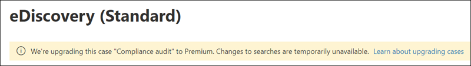
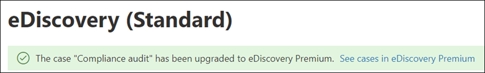

# Upgrade (preview), close, reopen, or delete eDiscovery (Standard) cases

This article describes how to close, reopen, delete, or upgrade a Microsoft Purview eDiscovery (Standard) cases in Microsoft Purview.

[!INCLUDE [purview-preview](../includes/purview-preview.md)]

## Upgrade a case to eDiscovery (Premium)

After working with an existing eDiscovery (Standard) case, you may need the additional case functionality provided with eDiscovery (Premium) cases. This work may include the need for more robust collections and review set functionality.

Before you upgrade a case from eDiscovery (Standard) to eDiscovery (Premium), make sure you review and understand the following:

- After an eDiscovery (Standard) case is upgraded to eDiscovery (Premium), it can't be reversed to an eDiscovery (Standard) case.
- Only eDiscovery Administrators can upgrade cases to eDiscovery (Premium).
- Changes to searches aren't available while the case is upgrading to eDiscovery (Premium). Once a case is upgraded, searches are available under the **Collections** section in the eDiscovery (Premium) case.
- Information for jobs created in the eDiscovery (Standard) case are maintained after the upgrade, however the job names retain the eDiscovery (Standard) case job names.
- Holds in the Standard case are maintained in the upgraded Premium case. No holds are removed or recreated during the upgrade process. This ensures that holds aren't lost or deleted during the upgrade.
- The search conditions from the eDiscovery (Standard) case are copied to a collection in the new eDiscovery (Premium) case. You can refresh/rerun the estimates, however this replaces all previous search statistics for the search.

To upgrade an eDiscovery (Standard) case to eDiscovery (Premium), complete the following steps:

1. In the compliance portal, select **eDiscovery** > **eDiscovery (Standard)** to display the list of eDiscovery (Standard) cases in your organization.
2. For the case that you want to upgrade, select the ellipsis control and then select **Upgrade case to Premium**. You can upgrade one case at a time, bulk upgrading of multiple cases isn't supported.
3. On the **Upgrade cases (preview)** dialog box, select **Continue upgrade**.

   

4. While the case is being upgraded, you'll see a banner at the top of the **eDiscovery (Standard)** case page.

   

5. After the case upgrade is finished, you'll see a banner at the top of the **eDiscovery (Standard)** case page.

   

## Close a case

When the legal case or investigation supported by a eDiscovery (Standard) case is completed, you can close the case. Here's what happens when you close a case:
  
- If the case contains any eDiscovery holds, they'll be turned off. After the hold is turned off, a 30-day grace period (called a *delay hold*) is applied to content locations that were on hold. This helps prevent content from being immediately deleted and provides admins the opportunity to search for and restore content before it may be permanently deleted after the delay hold period expires. For more information, see [Removing content locations from an eDiscovery hold](ediscovery-create-holds.md#removing-content-locations-from-an-ediscovery-hold).
- Closing a case only turns off the holds that are associated with that case. If other holds are placed on a content location (such as a Litigation Hold, a retention policy, or a hold from a different eDiscovery (Standard) case) those holds will still be maintained.
- The case is still listed on the eDiscovery (Standard) page in the Microsoft Purview compliance portal. The details, holds, searches, and members of a closed case are retained.
- You can edit a case after it's closed. For example, you can add or remove members, create searches, and export search results. The primary difference between active and closed cases is that eDiscovery holds are turned off when a case is closed.

To close a case:
  
1. In the compliance portal, select **eDiscovery** > **eDiscovery (Standard)** to display the list of eDiscovery (Standard) cases in your organization.

2. Select the name of the case that you want to close.

   

3. On the home page, under **Status**, select **Close case**.

    A warning is displayed saying that the holds associated with the case will be turned off.

4. Select **Yes** to close the case.

    The status on the case home page is changed from **Active** to **Closing**.

5. On the **eDiscovery (Standard)** page, select **Refresh** to update the status of the closed case. It might take up to 60 minutes for the closing process to complete.

    When the process is complete, the status of the case is changed to **Closed** on the **eDiscovery (Standard)** page.

## Reopen a closed case

When you reopen a case, any eDiscovery holds that were in place when the case was closed won't be automatically reinstated. After the case is reopened, you'll have to go to the **Holds** page and turn on the previous holds. To turn on a hold, select it to display the flyout page, and then set the **Status** toggle to **On**.
  
1. In the compliance portal, select **eDiscovery** > **Core** to display the list of eDiscovery (Standard) cases in your organization.

2. Select the name of the case that you want to reopen.

   

3. On the home page, under **Status**, select **Reopen case**.

    A warning is displayed saying that the holds that were associated with the case when it was closed won't be turned on automatically.

4. Select **Yes** to reopen the case.

    The status on the case home page flyout page is changed from **Closed** to **Active**.

5. On the **eDiscovery (Standard)** page, select **Refresh** to update the status of the reopened case. It might take up to 60 minutes for the reopening process to complete. 

    When the process is complete, the status of the case is changed to **Active** on the **eDiscovery (Standard)** page.

6. (Optional) To turn on any holds associated with the reopened case, go to **Holds** tab, select a hold, and then select the checkbox under **Status** on the hold flyout page.
  
## Delete a case

You can also delete active and closed eDiscovery (Standard) cases. When you delete a case, all searches and exports in the case are deleted, and the case is removed from the list of cases on the **eDiscovery (Standard)** page in the compliance portal. You can't reopen a deleted case.

Before you can delete a case (whether it's active or closed), you must first delete *all* eDiscovery holds associated with the case. That includes deleting holds with a status of **Off**. 

To delete an eDiscovery hold:

1. Go to the **Holds** tab in the case that you want to delete.
2. Select the hold that you want to delete.
3. On the flyout page, select **Delete**.

      

To delete a case:

1. In the compliance portal, select **eDiscovery** > **eDiscovery (Standard)** to display the list of eDiscovery (Standard) cases in your organization.
2. Select the name of the case that you want to delete.
3. On the case home page, under **Status**, select **Delete case**.

      

If the case you're trying to delete still contains eDiscovery holds, you'll receive an error message. You'll have to delete all holds associated with the case and then try again to delete the case.
