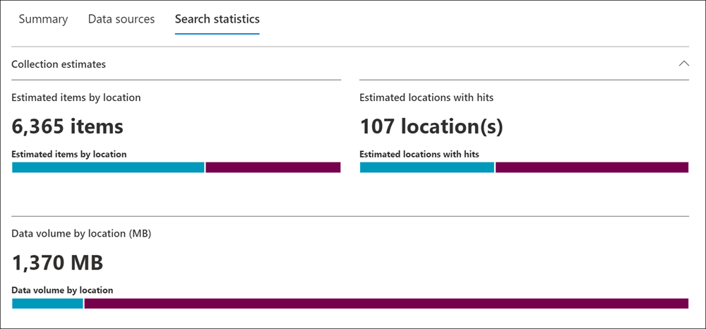
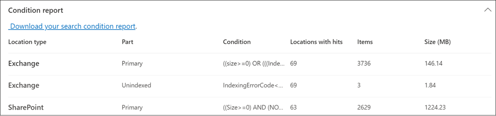
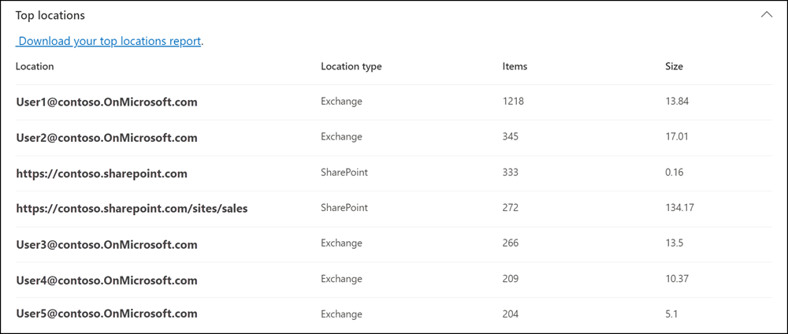
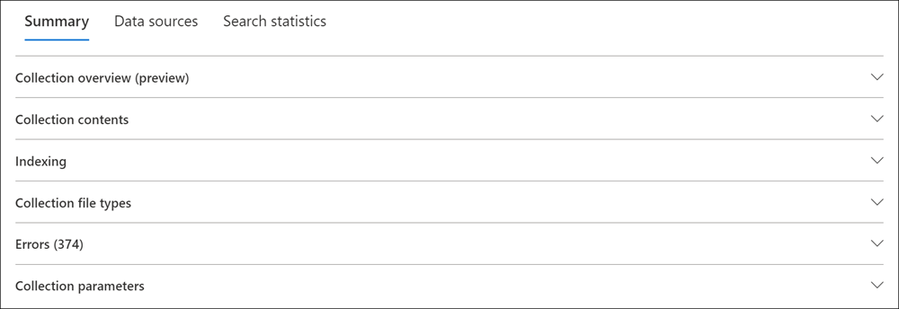
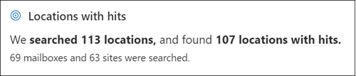
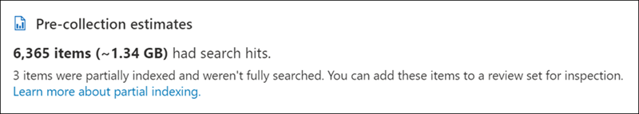
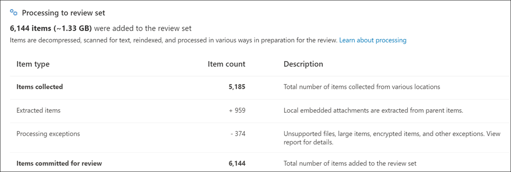

# Collection statistics and reports in Microsoft Purview eDiscovery (Premium)

After you create a collection estimate, you can view statistics on the retrieved items, such as the content locations that contain the most items that matched the search criteria and the number of items returned by the search query. You can also preview a subset of the results.

When you've identified the set of documents you want to further examine, you can add the search results to a review set to collect and process.

[!INCLUDE [purview-preview](../includes/purview-preview.md)]

## Search statistics for collection estimates

This section describes the statistics that are available for collection estimates. These statistics are available on the **Search statistics** tab on the flyout page of a collection estimate.

### Collection estimates

This section displays a graphical summary of the estimated items returned by the collection. This indicates the number of items that match the search criteria of the collection. This information gives you an idea about the estimated number of items returned by the collection.

- **Estimated items by locations**: The total number of estimated items returned by the collection. The specific number of items located in mailboxes and located in sites is also displayed.
- **Estimated locations with hits**: The total number of content locations that contain items returned by the collection. The specific number of mailbox and site locations is also displayed.
- **Data volume by location (in MB)**: The total size of all estimated items returned by the collection. The specific size of mailbox items and site items is also displayed.

### Condition report

This section displays statistics about the collection search query and the number of estimated items that matched different parts of the search query. You can use these statistics to analyze the number of items that match each component of search query. This can help you refine the search criteria for the collection and if necessary narrow the scope of the collection.

- **Location type**: The type of content location that the query statistics are applicable to. The value of **Exchange** indicates a mailbox location; a value of **SharePoint** indicates a site location.
- **Part**: The part of the search query the statistics are applicable to. **Primary** indicates the entire search query. **Keyword** indicates the statistics in the row are for a specific keyword. If you use a keyword list when for the search query in the collection, statistics for each component of the query are included in this table.
- **Condition**: The actual component (keyword or condition) of the search query that was run for the collection estimate that returned the statistics displayed in the corresponding row.
- **Locations with hits**: The number of the content locations (specified by the **Location type** column) that contain items that match the primary or keyword query listed in the **Condition** column.
- **Items**: The number of items (from the specified content location) that match the query listed in the **Condition** column. As previously explained, if an item contains multiple instances of a keyword that is being searched for, it's only counted once in this column.
- **Size (MB)**: The total size of all items that were found (in the specified content location) that match the search query in the **Condition** column.

### Top locations

This section displays statistics about the specific content locations with the most items returned by the collection.

- **Location**: The name of the location (the email address of mailboxes and the URL for sites).
- **Location type**: A mailbox will have an *Exchange* type and SharePoint sites will have a *SharePoint* type.
- **Items**: Estimated number of items in the content location returned by the collection.
- **Size**: The total size of estimated items in each content location.

## Statistics and reports for committed collections

This section describes the statistics that are available after you commit a collection to a review set, including the actual number of items added to the review set. These statistics (in addition to load set information) provide historical information about content added to a case.

After you commit a collection to a review set, the following tabs are displayed on the flyout page of the committed connection. Each of these tabs contains different types of information about the collection.

### Summary tab for collections

The **Summary** tab for committed collections contains several sections that provide information about the collection items, item estimates and locations, indexing, file types, and more.

#### Collection overview (preview)

The **Collection overview (preview)** section on the **Summary** tab of a committed review set contains information about how items were found, retrieved, and processed as part of the collection. The information in this section is a summary of the information gathered and displayed during the initial collection estimate and includes information gathered and processed during the collection committal to the review set. You can use the information in this section to help improve understanding on how the final collection data evolves from the estimate data during collection committal and processing.

This information is segmented and displayed in the following sub-sections:

- **Locations with hits**: This section summarizes the number of locations searched and the number of location with hits based on the conditions defined in the collection estimate. It also displays the number and type of locations searched.

    

- **Pre-collection estimates**: This section summarizes number of items and size of the total items calculated for the collection estimate (before the collection is committed). A count of any items that were [partially indexed](/microsoft-365/compliance/partially-indexed-items-in-content-search) is also displayed.

    

- **Collection items**: This section displays the type, count, and a description of all items retrieved from locations with hits during the committal of the collection to the review set. During this process, there may be some addition and consolidation of items during processing. Additions and consolidations may include types included in the following table:

    |**Item type**|**Item type description**|
    |:------------|:------------------------|
    | Items with hits | Estimated number of items found by search. |
    | Review set duplicates | Items that are already in the same review set aren't collected. |
    | Search duplicates | Duplicate instances of the same items aren't collected. |
    | All versions | All versions of items in SharePoint are collected. |
    | Historical versions | Historical versions maintained by SharePoint are collected. |
    | Cloud attachments | Cloud attachments are identified and collected from SharePoint links. |
    | Version as shared | The shared versions of items are collected in addition to their latest versions. |
    | Contextual Teams conversations | Additional chat messages that might be relevant are collected. |
    | Consolidated chat transcripts | Collected chat messages are consolidated into fewer HTML transcripts. |
    | Retrieval exceptions | Access time outs, empty files, and other exceptions. |
    | Total items collected | Total number of items collected from various locations. |

- **Processing to review set**: This section displays the type, count, and description of the items that were added to the review set from the collection estimate. Items are decompressed, scanned for text, reindexed, and processed in preparation for the review.

    

#### Collection contents

The **Collection contents** section on the **Summary** tab of a committed review set contains statistics and other information about the items that were collected from the data sources in the collection and added to the review set.

- **Total extracted items**. The total number of items added to the review set. This number indicates the sum of parent items and child items added to the review set.

  > [!TIP]
  > Hover the cursor over the parent or child item bars to display the total number of parent or child items.

- **Parent items**. The number of items returned by the collection that was used to collect the items that were added to the review set. This number corresponds  to (and is equal to) the estimated number of items that is displayed in the **Collection parameters** section. The number of parent items he collection information that was used to collect the items that were added to the review set.

   A parent item might contain multiple child items. For example, an email message is a parent item if it contains an attached file or has a cloud attachment. In this case, the attached file or the target file of the cloud attachment is considered a child item. When you commit a collection, parent items and any corresponding child items (like attached files and cloud attachments) are added to the review set as individual items or files.

- **Child items**. The number of child items added to the review set. Only child items that are file attachments and cloud attachments are added to the review set as individual files. Other types of child items, such as email signatures and images, are extracted from a parent item and then processed by Optical Character Recognition (OCR) to extract any text from the child item. Text extracted from these types of child items is then added to its parent item so you can view it in the review set. By not adding child items to the review set as a separate file, eDiscovery (Premium) helps streamline the review process by limiting the number of potentially immaterial items in the review set.
- **Unique items**. The number of unique items added to the review set. Unique items are unique to the review set. All items are unique when the first collection is added to a new review set because there were no previous items in the review set.
- **Identified duplicate items**. The number of items from the collection that weren't added to the review set because the same item already exists in the review set. Statistics about duplicate items can help explain the differences between the number of estimated items from a collection estimate and the actual number of items added to the review set.

#### Indexing

The **Indexing** section on the **Summary** tab of a committed review set contains indexing information about the items added to the review set.

- **New indexed items**. The number of items that were newly indexed before they were added to the review set. Examples of a newly indexed item are child items extracted from a parent item and then indexed before they're added to the review set. Also, items that aren't located in custodial data sources and non-custodial content locations listed on the **Data sources** tab in the case are indexed before they're added to the review. For example, newly indexed items would include items collected from additional locations.

- **Updated indexed items**. The number of partially indexed items that were successfully indexed and added to the review set. This statistic indicates the partially indexed items from custodial and non-custodial content locations **Data sources** tab that were successfully indexed when the collection was committed to the review set.

- **Indexing errors**. The number of partially indexed items that couldn't be indexed before they were added to the review set. These items might require error remediation.

#### Collection file types

The **Collection file types** section on the **Summary** tab of a committed review set displays the item count for each file type included in the collection. File types include email, image, document, audio, video file types and more. For a complete list of the supported file types, see [Supported file types in eDiscovery (Premium)](ediscovery-supported-file-types.md).

#### Errors

The **Errors** section on the **Summary** tab of a committed review set displays the type and number of errors encountered during the collection committal. Errors may include files with a zero size, protected files, malformed files, internal errors, and more. An error report in .csv format can be downloaded by selecting **Download your errors report** in this section.

#### Collection parameters

The **Collection parameters** section on the **Summary** tab of a committed review set displays the collection information that was used to collect the items that were added to the review set. This tab displays information that is similar to the information on the **Search statistics** tab. This section provides a quick snap shot of the search query used by the collection, the content locations that were searched, and the estimated collection results. As previously explained, the number of estimated items in this section would be equal to the number of parent items shown in the **Collection contents** section.

## Data sources tab for collections

The **Data sources** tab contains information about custodial and non-custodial data sources. The **Custodial data sources** section displays the all custodial data sources for each custodian included in the collection. The **Non-custodial data sources** section displays the all non-custodial data sources for the collection. The data source information displayed is also available on the main **Data sources** tab for each case.

## Search statistics tab for collections

The statistics displayed on the **Search statistics** tab are the same statistics from the last time that a collection estimate was run. This includes collection estimates, condition report, and top locations. This information is preserved from the collection estimate for historical reference, and can be compared to the actual collection that was committed to the review set.

## Differences between collection estimates and the actual committed collection

When you run a collection estimate, an estimate of the number of items (and their total size) that meet the collection criteria is displayed on the **Summary** tab and in **Collection estimates** section of the **Search statistics** tab. After you commit a collection estimate to a review set, the actual number of items (and their total size) added the review set are often different from the estimates. In most cases, more items are added to the review set than were estimated from the collection estimate. The following list describes the most common reasons for these differences and tips for identifying them:

- **Child items**. Child items (such as files attachments and cloud attachments) that are extracted from their parent items and added as individual files. The number of child items may increase the number of items that are added to the review set. In general, the number of parent items identified in the **Collection contents** section on the **Summary** tab of a committed collection should be equal to the number of estimated items from the collection estimate.
- **Duplicate items**. Items from the collection estimate that have already been added to the review set in a previous collection won't be added. As previously explained, the number of duplicate items in the collection is displayed in the **Collection contents** section on the **Summary** tab.
- **Collection configuration options**. When you commit a collection estimate to a review set, you have to option to include conversation threads, cloud attachments, and document versions. Any of these items that are added to the review set aren't included in the estimates of the collection estimate. They're identified and collected only when you commit the collection. Selecting these options will most likely increase the number of items added to the review set. 

    For example, multiple versions of SharePoint documents aren't included in the estimate for the collection estimate. But if you select the option to include all document versions when you commit a collection estimate, the actual number (and total size) of items added to the review set will increase.

    For more information about these options, see [Commit a collection estimate to a review set](ediscovery-commit-draft-collection.md#commit-a-collection-estimate-to-a-review-set-in-ediscovery-premium).

Here are other reasons why the estimated results from a collection estimate can be different that the actual committed results.

- **The way results are estimated for collection estimates**. An estimate of the search results returned by a collection estimate is just that, an estimate (and not an actual count) of the items that meet the collection query criteria. To compile the estimate of email items, a list of the message IDs that meet the search criteria is requested from the Exchange database. But when you commit the collection to a review set, the collection is rerun and the actual messages are retrieved from the Exchange database. So differences might result because of how the estimated number of items and the actual number of items are determined.
- **Changes that happen between the time when estimating and committing collection estimates**. When you commit a collection estimate to a review set, the search is rerun to collect that most recent items in the search index that meet the search criteria. It's possible that additional items were created, sent, or deleted that meet the search criteria in the time between when the collection estimate was last run and when the collection estimate is committed to a review set. It's also possible that items that were in the search index when the collection estimate results were estimated are no longer there because they were purged from a data source before committing the collection. One way to mitigate this issue is to specify a date range for a collection. Another way is to place a hold on content locations so that items are preserved and can't be purged.
- **Unindexed items**. If the collection estimate included searching all Exchange mailboxes or all SharePoint sites, then only unindexed items from content locations that contain items that match the collection criteria will be added to the review set. In other words, if no results are found in a mailbox or site, then any unindexed items in that mailbox or site won't be added to the review set. However, unindexed items from all content locations (even those that don't contain items that match the collection query) will be included in the estimated collection results.
- **Partially indexed items**: Selection of this option adds partially indexed items from additional data sources to the review set. If the collection searched additional data sources (as specified on the **Additional locations** page in the collections wizard), there may be partially indexed items from these locations that you want to add to the review set. Custodial and non-custodial data sources typically don't have partially indexed items. That's because the Advanced indexing process reindexes items when custodial and non-custodial data sources are added to a case. Also, Adding partially indexed items will increase the number of items added to the review set. 
 After partially indexed items are added to the review set, you can apply a filter to specifically view these items. For more information, see [Scenario example: Filter partially indexed items](ediscovery-review-set-search.md#scenario-example-filter-partially-indexed-items)

    Alternatively, if the collection estimate included specific content locations (which means that specific mailboxes or sites where specified on the **Additional locations** page in the collection estimate wizard), then unindexed items (that aren't excluded by the collection criteria) from the content locations specified in the search will be exported. In this case, the estimated number of unindexed items and the number of unindexed items that are added to the review set should be the same.
