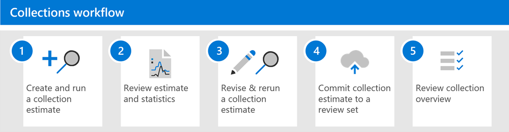

# Learn about collections in eDiscovery (Premium)

When organizations are faced with gathering the communications and content that may be relevant to an investigation or potential litigation, they face a significant challenge under the best of circumstances. In today's modern workplace, the volume, variety, and velocity of content is enabling innovation and remote work, while also expanding the requirements and process for managing collections for eDiscovery investigations.

Collections in eDiscovery (Premium) help eDiscovery managers quickly scope a search for content across email, documents, Teams reactions, and other content in Microsoft 365. Collections provide managers with an estimate of the content that may be relevant to the case. This estimate allows managers to make quick, informed decisions about the size and scope of content relevant to a case. eDiscovery managers can create a collection to search custodial data sources (such as mailboxes and SharePoint sites), non-custodial data sources (such as SharePoint sites, Group mailboxes, and Microsoft Teams), and by using specific search criteria (such as keywords and date ranges) to quickly define the scope of their collection.

After the collection is defined, eDiscovery managers must first submit the collection to create an estimate. The estimate includes estimates for data volume, the content locations that contain results, and the number of hits for search query condition, and more. These insights can help to inform if the collection should be revised to narrow or expand the scope of the collection before moving on the review and analyze stages in the eDiscovery workflow.

When the manager is satisfied with the scope of the collection and the estimated amount of content that's likely to be responsive, the manager can add or *commit* the content to a review set. When committing a collection to a review set, that manager also has the options to include chat conversations, cloud attachments, partially indexed items, and document versions. The content in the collection also goes through another level of processing during ingestion into the review set. and the collection will be updated with the final collection summary. After content is added to the review set, eDiscovery managers can continue to query, group, and refine the content in to help with minimization and review. Additionally, the collection is updated with information and statistics about the content committed to the review set. This information provides a historical reference about the content in the collection.

[!INCLUDE [purview-preview](../includes/purview-preview.md)]

## Collections workflow

To get started using collections in eDiscovery (Premium), here's a basic workflow and descriptions of each step in the process.

1. **Create and run a collection estimate**. The first step is to create a collection estimate and define the custodial and non-custodial data sources to search. You can also search other data sources that haven't been added to the case. After you add the data sources, you configure the search query to search the data sources for content relevant to the case. You can use keywords, properties, and conditions to build search queries that return content that's likely most relevant to the case. For more information, see [Create a collection estimate](ediscovery-create-draft-collection.md).

2. **Review estimate and statistics**. After you create a collection estimate and run it, the next step is to view collection statistics to help you verify whether relevant content is being found and the content locations with the most hits. You can also review a sample of the search results to further help you determine if the content is within scope of your investigation. For more information, see [Search statistics for collection estimates](ediscovery-collection-statistics-reports.md#search-statistics-for-collection-estimates).

3. **Revise & rerun a collection estimate**. Based on the estimates and statistics returned by the collection, you can edit the collection estimate by changing the data sources that are searched and the search query to expand or narrow the collection. You can update and rerun the collection estimate until you're confident that collection contains the content that's most relevant to your case.

4. **Commit a collection estimate to a review set**. When you're satisfied that the collection returns the type content that is relevant to the case, you can commit the collection to the review set. When you commit a collection, you have the option to add conversation threads, cloud attachments, and document versions to the review set, all of which might be relevant to the case.

   When you commit a collection, child items such as email signatures and images are extracted from a parent item (such as an email message, chat message, or document) and then processed by Optical Character Recognition (OCR) to extract any text from the child item. Text extracted from child items is then added to its parent item so you can view it in the review set. By not adding child items to the review set as a separate file, eDiscovery (Premium) helps limit the number of potentially immaterial items added to the review set. For more information about how child items are handled, see [Collection statistics and reports](ediscovery-collection-statistics-reports.md#collection-contents).

   For more information, see [Commit a collection estimate to a review set](ediscovery-commit-draft-collection.md).

5. **Review collection overview**. After you commit a collection to a review set, information about the collection is retained, such as statistics about extracted items, deep indexing, the search query used for the collection, and the content locations that items were collected from. Also, committed collections can't be edited or rerun. You can only copy or delete them. Preserving collections provides a historical record of the collected items that were added to a review set. For more information, see [Statistics and reports for committed collections](ediscovery-collection-statistics-reports.md#statistics-and-reports-for-committed-collections).
