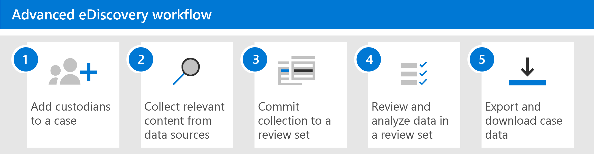

# Create and manage an eDiscovery (Premium) case

After setting up Microsoft Purview eDiscovery (Premium) and [assigning permissions to eDiscovery managers](ediscovery-premium-get-started.md#step-2-assign-ediscovery-permissions) in your organization that will manage cases, the next step is to create and manage a case.

This article also provides a high-level overview of using cases to manage the eDiscovery (Premium) workflow for a legal case or other types of investigations.

[!INCLUDE [purview-preview](../includes/purview-preview.md)]

## Create a case

Complete the following steps to create a case and configure case settings. The user who creates the case is automatically added as a member. Members of the case can access the case in the Microsoft Purview compliance portal and perform eDiscovery (Premium) tasks.

1. Go to the <a href="https://go.microsoft.com/fwlink/p/?linkid=2077149" target="_blank">compliance portal</a> and sign in using the credentials for user account that has been assigned eDiscovery permissions. Members of the *Organization Management* role group can also create eDiscovery (Premium) cases.
2. In the left navigation pane of the compliance portal, select **Show all**, and then select **eDiscovery** > **Premium**, and then select the  <a href="https://go.microsoft.com/fwlink/p/?linkid=2173764" target="_blank">**Cases**</a>tab.
3. Select **Create a case**.

4. On the **Name and description** page, complete the following fields:

   - **Name**: give the case a name (required). The case name must be unique in your organization
   - **Description**: Add an optional description to help others understand this case.
   - **Number**: Enter an optional docket number or other numeric identifier.
   - **Case format**: The **New (recommended)** option is automatically selected.

    >[!NOTE]
    >The legacy **Classic** format is no longer available when creating new cases. This format is now retired for all new cases.

5. Select **Next**.
6. On the **Members and settings** page, complete the following fields as applicable:

    - **Team members**: Select users and groups that should be assigned to the case. Make sure that users and groups assigned here have been [assigned the appropriate eDiscovery permissions](/microsoft-365/compliance/ediscovery-assign-permissions#ediscovery-assign-permissions).
    - **Search and analytics**: Select the options to configure the case. You can skip this section and configure these settings after the case is created if needed.
    - **Text to ignore**: Add text or regex expressions to define text to ignore in the case. You can apply this to *Near-duplicates*, *Email threads*, or *Themes* modules.
    - **Optical character recognition (OCR)**: Configure the option and settings for finding text contained in images during advanced indexing.

7. Select **Next**.
8. On the **Summary** page, review the settings for the case and edit the settings if needed. Select **Submit** to create the new case and start your investigation.

## Mark a case as a favorite

You can mark an eDiscovery (Premium) case as a favorite for quicker access to cases you want to prioritize. Cases marked as favorites can be accessed quickly via the eDiscovery (Premium) **Overview** page or can be sorted to be shown at the top of the **Cases** tab for ease of access. You can mark a case as a favorite in the case list on the **Cases** tab or on the top right of the case **Overview** tab for each case. The **Recent favorite cases** card on the **Overview** tab displays all the cases marked as favorites in your organization.

## Manage the workflow

To get you started using eDiscovery (Premium), here's a basic workflow that aligns with [common eDiscovery practices](advanced-ediscovery-edrm.md). In each of these steps, we'll also highlight some extended eDiscovery (Premium) functionality that you can explore.

1. **[Add custodians](ediscovery-add-custodians-to-case.md) and [non-custodial data sources](ediscovery-non-custodial-data-sources.md) to the case**. The first step after creating a case is to add custodians. A *custodian* is a person having administrative control of a document or electronic file that may be relevant to the case. Additionally, you can add data sources that aren't associated with a specific user but may be relevant to the case.

   Here are some things that happen (or that you can do) when you add custodians to a case:

   - Data in the custodian's Exchange mailbox, OneDrive account, and any Microsoft Teams or Viva Engage groups that the custodian is a member of can be "marked" as custodial data in the case.
   - Custodian (and non-custodial) data is reindexed (by a process called *Advanced indexing*). This helps optimize searching for it in the next step.
   - You can place a hold on custodian (and non-custodial) data. This preserves data that may be relevant to the case during the investigation.
   - You can associate other data sources with a custodian (for example, you can associate a SharePoint site or Microsoft 365 Group with a custodian) so this data can be reindexed, placed on hold, and searched, just like the data in the custodian's mailbox or OneDrive account.
   - You can use the [communications workflow](managing-custodian-communications.md) in eDiscovery (Premium) to send a legal hold notification to custodians.

2. **[Collect relevant content from data sources](ediscovery-create-draft-collection.md)**. After you add custodians and non-custodial data sources to a case, use the built-in collections tool to search these data sources for content that may be relevant to the case. You use keywords, properties, and conditions to [build search queries](ediscovery-building-search-queries.md) that return search results with the data that's most likely relevant to the case. You can also:

   - View [collection statistics](ediscovery-collection-statistics-reports.md) that may help you refine a collection to narrow the results.
   - Preview a sample of the collection to quickly verify whether the relevant data is being found.
   - Revise a query and rerun the collection.

3. **[Commit collection to a review set](ediscovery-commit-draft-collection.md)**. Once you've configured and verified that a search returns the desired data, the next step is to add the search results to a review set. When you add data to a review set, items are copied from their original location to a secure Azure Storage location. The data is reindexed again to optimize it for thorough and fast searches when reviewing and analyzing items in the review set. Additionally, you can also [add non-Office 365 data into a review set](ediscovery-load-non-office-365-data-into-a-review-set.md).

   There's also a special kind of review set that you can add data to, called a *conversation review set*. These types of reviews sets provide conversation reconstruction capabilities to reconstruct, review, and export threaded conversations like those in Microsoft Teams. For more information, see [Review conversations in eDiscovery (Premium)](ediscovery-conversation-review-sets.md).

4. **Review and analyze data in a review set**. Now that data is in a review set, you can use a wide-variety of tools and capabilities to view and analyze the case data with the goal of reducing the data set to what is most relevant to the case you're investigating. Here's a list of some tools and capabilities that you can use during this process.

   - [Group and view documents](ediscovery-view-documents-in-review-set.md). This includes selecting the group options for review sets in your cases, viewing the metadata for each document in a review set, and viewing the document in its native version or text version.
   - [Create queries and filters](ediscovery-review-set-search.md). You create search queries using various search criteria (including the ability to search all [file metadata properties](ediscovery-document-metadata-fields.md) to further refine and cull the case data to what is most relevant to the case. You can also use review set filters to quickly apply other conditions to the results of a search query to further refine those results. 
   - [Create and use tags](ediscovery-tagging-documents.md). You can apply tags to documents in a review set to identify which are responsive (or non-responsive to the case) and then use those tags when creating search queries to include or exclude the tagged documents. You can also tagging to determine which documents to export.
   - [Annotate and redact documents](ediscovery-view-documents-in-review-set.md#annotate-view). You can use the annotation tool in a review to annotate documents and redact content in documents as work product. We generate a PDF version of an annotated or redacted document during review to reduce the risk of exporting the unredacted native version of the document.
   - [Analyze case data](ediscovery-analyzing-data-in-review-set.md). The analytics functionality in eDiscovery (Premium) is powerful. After you run analytics on the data in review set, we perform analysis such as near duplicate detection, email threading, and themes that can help reduce the volume of documents that you have to review. We also generate an Analytics reports that summarize the result of running analytics. As previously explained, running analytics also runs [the attorney-client privilege detection model](ediscovery-attorney-privilege-detection.md#use-the-attorney-client-privilege-detection-model).

5. **Export and download case data**. A final step after collecting, reviewing, and analyzing case data is to export it out of eDiscovery (Premium) for external review or for review by people outside of the investigation team. Exporting data is a two-step process. The first step is to [export](ediscovery-export-documents-from-review-set.md) data out of the review set and copy it to a different Azure Storage location (one provided by Microsoft or one managed by your organization). Then you use Azure Storage Explorer to [download](download-export-jobs.md) the data to a local computer. In addition to the exported data files, the contains of the export package also contains an export report, a summary report, and an error report.

## eDiscovery (Premium) architecture

Here's an architecture diagram that shows the eDiscovery (Premium) end-to-end workflow in a single-geo environment and in a multi-geo environment, and the end-to-end data flow that's aligned with the [Electronic Discovery Reference Model](ediscovery-overview.md#ediscovery-premium-alignment-with-the-electronic-discovery-reference-model).

[View as an image](../media/solutions-architecture-center/m365-advanced-ediscovery-architecture.png)

[Download as a PDF file](https://download.microsoft.com/download/d/1/c/d1ce536d-9bcf-4d31-b75b-fcf0dc560665/m365-advanced-ediscovery-architecture.pdf)

[Download as a Visio file](https://download.microsoft.com/download/d/1/c/d1ce536d-9bcf-4d31-b75b-fcf0dc560665/m365-advanced-ediscovery-architecture.vsdx)
