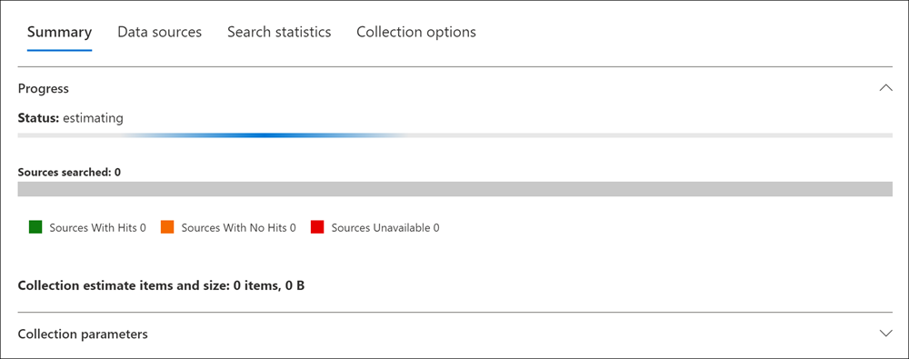
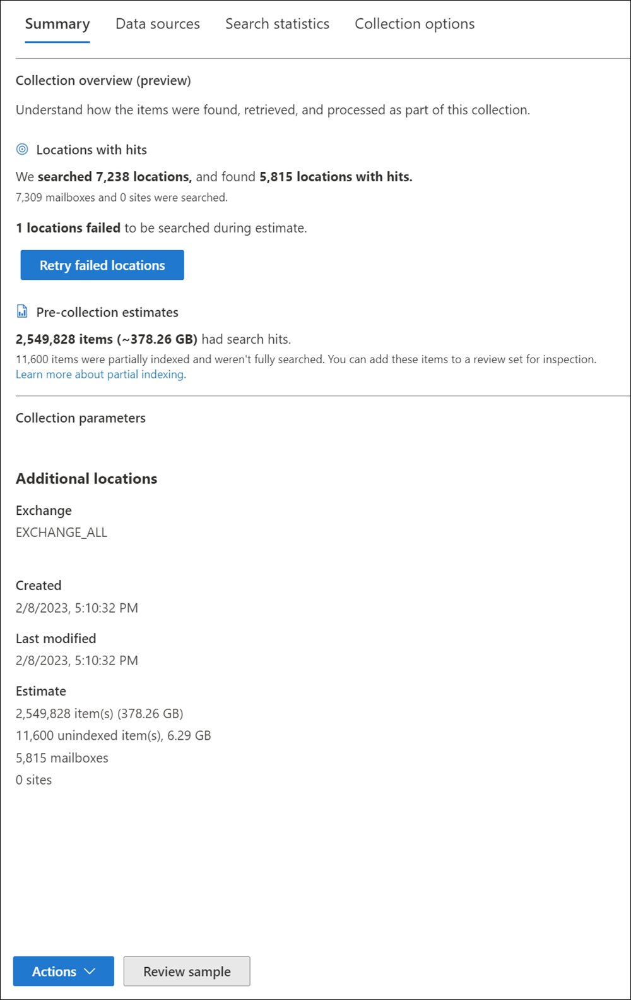
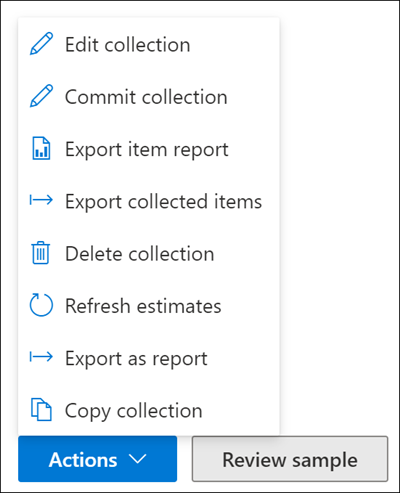

# Create a collection estimate in eDiscovery (Premium)

After you've identified custodians and any non-custodian data sources for the case, you're ready to identify and locate a set of documents that are relevant by using the **Collections** tool to search data sources for relevant content. You can create a collection that searches specified data sources for content that matches your search criteria. You must create a *collection estimate*, which is an estimate of the items found.

When you create a collection estimate, you can view information about the estimated results that matched the search query, such as the total number and size of items found, the different data sources for the found items, and statistics about the search query. You can also review a sample of items that were returned by the collection. Using these statistics, you can change the search query and rerun the collection estimate to narrow your results. Once you're satisfied with the collection results, you can commit the collection to a review set. When you commit a collection estimate, the items returned by the collection are added to a review set for review, analysis, and export.

[!INCLUDE [purview-preview](../includes/purview-preview.md)]

## Recommendations when creating collection estimates

- Consider [adding custodians](ediscovery-add-custodians-to-case.md) and [non-custodial data sources](ediscovery-non-custodial-data-sources.md) to the case before you create a collection estimate. Adding these sources allows you to quickly select the data sources when you create a collection estimate in the wizard. If you choose to skip adding custodians or non-custodial data sources, you can search for these sources and any additional data sources (ones that haven't been added to the case as custodial or non-custodial locations) in a collection estimate for content that may be relevant to the case. These data sources might include mailboxes, SharePoint sites, and Teams. If this situation is applicable to your case, use additional locations to add these sources to your collection.
- Verify that you have [permissions](/microsoft-365/compliance/ediscovery-assign-permissions) to create a collection estimate for a case.
- When configuring a new collection, you can save your progress in the wizard as a draft collection and complete it later if needed. Just select **Save and close** on any page in the collection wizard to save your progress as a draft. The collection is added to the collection list with a status of *Draft*. To resume working on the collection, select the draft collection, select **Actions**, then select **Edit collection**.

## Create a collection estimate

1. In the [Microsoft Purview compliance portal](https://compliance.microsoft.com/), navigate to **eDiscovery** > **Premium**.
2. Select the **Cases** tab and open an eDiscovery (Premium) case, and then select the **Collections** tab.
3. On the **Collections** page, select **New collection**.
4. On the **Name and description** page, enter a name (required) and description (optional) for the collection. After the collection is created, you can't change the name, but you can modify the description.
5. On the **Custodial data sources** page, select one of the following options to identify the custodial data sources to collect content from:

   - Select **Select custodians** to search specific custodians that were added to the case. If you use this option, a list of the case custodians is displayed. Select one or more custodians. After you select and add the custodians, you can also select the specific data sources to search for each custodian. Data sources that are displayed are specified when the custodian is added to the case.

   - Select the **Select all** toggle to search all custodians that were added to the case. When you select this option, all data sources for all custodians are searched.

6. On the **Non-custodial data sources** page, select one of the following options to identify the non-custodial data sources to collect content from:

   - Select **Select non-custodial data sources** to select specific non-custodial data sources that were added to the case. If you use this option, a list of data sources displayed. Select one or more of these data sources.

   - Select the **Select all** toggle to select all non-custodial data sources that were added to the case.

7. On the **Additional locations** page, you can select other mailboxes and sites to search as part of the collection. You can also choose additional search options for additional search locations (defined in eDiscovery settings) to include in the collection.

    Use the **Additional locations** options to choose the types of data sources weren't added as custodial or non-custodial data locations in the case. You also have two options when searching additional data sources:

    - To search all content locations for a specific service (Exchange mailboxes, SharePoint and OneDrive sites, or Exchange public folders), select the corresponding **Select all** toggle in the **Status** column. This option will search all content locations in the selected service.

8. On the **Search query** page, you can create the search query that is used to collect items from the data sources that you've identified in the previous wizard pages. You can search for keywords, property:value pairs, or use a keyword list. You can also add various search conditions to narrow the scope of the collection or user the query builder to define query operators, filters, and conditions. For more information, see:

    - [Build search queries using keywords and conditions for collections](ediscovery-building-search-queries.md)
    - [Use the KQL editor to build search queries](/microsoft-365/compliance/ediscovery-kql-editor)
    - [Use the query builder to build search queries (preview)](/microsoft-365/compliance/ediscovery-query-builder)

    Use the **Additional search options** options to include other search locations. The options available here are set by your admin in eDiscovery global settings. Search options that aren't defined by your eDiscovery admin aren't selectable or available. Search options enabled by your eDiscovery admin can be selected and included in the collection as applicable. You have two choices for additional search options:

    - **Guest mailboxes**: Select to include guest mailboxes during tenant-wide searches.
    - **Shared Teams channels**: Select to include shared channels during tenant-wide searches.

8. On the **Conditions** page, you can create the search query that is used to collect items from the data sources that you've identified in the previous wizard pages. You can search for keywords, property-value pairs, or use a keyword list. You can also add various search conditions to narrow the scope of the collection. For more information, see [Build search queries for collections](ediscovery-building-search-queries.md).
9. On the **Review your collection and get estimates** page, you'll see a summary of the collection estimate process. The collection estimate is saved for further review and refinement, but the results won't be automatically committed to a review set. You'll need to decide to commit to a review set later.
10. On the **Review your collection** page, you can review and update the collection selection, data sources, and conditions that you configured on the previous pages. Select **Edit** for any of the selections and update if needed.
11. Select **Submit** to create the collection estimate. A page is displayed confirming that the collection was created.

## What happens after you create a collection estimate

After you create a collection estimate, it listed on the **Collections** page in the case and the status shows that it's in progress. A job named **Preparing search preview and estimates** is also created and displayed on the **Jobs** page in the case. During the collection estimate process, eDiscovery (Premium) performs a search estimate using the search criteria and data sources that you specified in the collection. eDiscovery (Premium) also prepares a sampling of items that you can preview.

Additionally, you can now monitor the progress of the estimate that shows how many sources and items have been completed when building the estimate. As part of the estimate progress, you can see statistics for the following areas:

- **Status**: The status of the estimate. Values are *In progress*, *Successful*, or *UNSUCCESSFUL VALUE?*
- **Sources searched**: The number of sources searched in the estimate.
    - **Sources with Hits**: Sources in the estimate that meet the conditions configured for the collection.
    - **Sources with No Hits**: Sources in the estimate that don't have any items that meet the conditions configured for the collection.
    - **Sources Unavailable**: Sources that were unavailable during the period that the estimate was in progress.
- **Collection estimate items and size**: The number of items and size of the collection estimate.

When the collection is complete, the following columns and corresponding values on the **Collection** page are updated:

- **Status**: Indicates the status and type of collection. A value of **Estimated** indicates that a collection estimate is complete. This same value also indicates that the collection is a collection estimate, and that it hasn't been added to a review set. A value of **Committed** in the **Status** column indicates that the collection has been added to a review set.
- **Estimate status**: Indicates the status of the estimated search results and whether or not the search estimates and statistics are ready for review. A value of **Successful** indicates the results of the collection estimate are ready for review. After you first submit a collection estimate, a value of **In progress** is displayed to indicate the collection is still running
- **Preview status**: Indicates the status of the sample items that you can preview. A value of **Successful** indicates the items are ready for preview. After you first submit a collection estimate, a value of **In progress** is displayed to indicate that the collection estimate is still running.

## Next steps after a collection estimate is complete

After the collection estimate is successfully completed, you can perform various tasks. To perform most of these tasks, go the **Collections** tab and select the name of the collection estimate to display the flyout page.

Here's a list of things you can do from the collection flyout page:

- Select the **Summary** tab to view summary information about the collection and the estimated search results returned by the collection. This includes:

    - **Collection overview (preview)** section: This section includes the **Locations with hits** subsection that provides data on the total number of locations searched and the number of locations that contained items resulting in hits. For example, a collection scoped to Exchange Online mailboxes and SharePoint sites may summarize results by the number of mailboxes and sites searched, and the combined number of mailboxes and sites that had hits. This section also includes the **Pre-collection estimate** subsection that displays the total number of items and size of the estimated search results. You have the option to add these items to the review set for inspection.
    - **Collection parameters** section: This section includes information about additional locations, when the collection was created and modified, and a summary of the estimate items, size, and any unindexed items and size.

- Select the **Data sources** tab to view a list of custodians and non-custodial data sources) that were searched in the collection. Any additional content locations that were search are listed under **Locations** on the **Summary** tab.
- Select the **Search statistics** tab to view statistics about the collection. This includes the total number and size of items found in each service (for example, Exchange mailboxes or SharePoint sites) and a condition report that displays statistics about the number of items returned by different components of the search query used by the collection. For more information, see [Collection statistics and reports](ediscovery-collection-statistics-reports.md).
- Select the **Collection options** tab to view information about the included collection options. This includes a summary of the additional locations and retrieval options chosen in the collection wizard.  
- Select **Review sample** (located at the bottom of the flyout page) to preview a sample of the items returned by the collection.
- Take actions on the collection estimate by selecting choices in the **Actions** menu. For more information, see the following section about the available management options.

## Manage a collection estimate

You can use the options in the **Actions** menu on the flyout page of a collection estimate to perform various management tasks.

Here's the descriptions of the pre-collection estimate management options.

- **Edit collection**: Change the settings of the collection estimate. After you make changes, you can rerun the collection and update the search estimates and statistics. As previously explained, you use this option to commit a collection estimate to a review set.  
- **Commit collection**: Commit a collection to a review set. This means that you rerun the collection (using the current settings) and add the items returned by the collection to a review set. As previously explained, you can also configure additional settings (such as conversation threading and cloud-based attachments) when you add the collection to a review set. For more information and step-by-step instructions, see [Commit a collection estimate to a review set](ediscovery-commit-draft-collection.md).
- **Export item report**: Similar to the [exporting items in Content search](/microsoft-365/compliance/ediscovery-export-a-content-search-report), you can choose this option to export the results of the report that is based on the actual items that can be retrieved from the source. After selecting, you have the following export options for collected items:

    - **Types of collected items to include in the export**: Choose to export collected items with search hits, items with search hits and partially indexed items without hits, or only partially indexed items without search hits. You can also choose to one or more of the following options for collected items:

        - Include Microsoft Teams and Yammer conversations
        - Include cloud attachments
        - Include all existing versions of Microsoft 365 documents on SharePoint
        - Include subfolder contents (insider subfolders of a matched folder)
        - Include files in SharePoint lists (and their child items)

- **Export collected items (preview)**: Export the collected items without adding the items to the review set. This option is useful in scenarios where data residency requirements associated with data storage may be prohibitive and you need collected data as a download. After selecting, you have the following export options for collected items:

    - **Types of collected items to include in the export**: Choose to export collected items with search hits, items with search hits and partially indexed items without hits, or only partially indexed items without search hits. You can also choose to one or more of the following options for collected items:

        - Include Microsoft Teams and Yammer conversations
        - Include cloud attachments
        - Include all existing versions of Microsoft 365 documents on SharePoint
        - Include subfolder contents (inside subfolders of a matched folder)
        - Include files in SharePoint lists (and their child items)

    - **How to format emails**: Choose an option of how collected emails should be formatted:

        - Individual .pst files for each mailbox
        - Individual .msg files for each message
        - Individual .eml files for each message

- **Delete collection**: Delete a collection estimate. After you commit a collection estimate to a review set, it can't be deleted.
- **Refresh estimates**: Rerun the query (against the data sources) specified in the collection estimate to update the search estimates and statistics.
- **Export as report (preview)**: Exports information about the collection estimate to a CSV file that you can download to your local computer. The export report contains the following information:

  - The identity of each content location that contains items that match the search query in the collection estimate. These locations are typically mailboxes or sites.
  - The total number of items in each content location.
  - The total size (in bytes) of the items in each content location.
  - The service (such as Exchange or SharePoint) in which the content location is located.

  The limits for the export report and report results are as follows:
  
    - Total items: 1 million
    - Total locations: 500,000
    - Exported results (items): 500,000
    - Exported results (locations): 100,000

- **Copy collection**: Create a new collection estimate by copying the settings from an existing collection. You have to use a different name for the new collection. You also have the option to modify the settings before you submit the new collection. After you submit it, the search query runs and new estimates and statistics are generated. This is a good way to quickly create additional collection estimate and then modify selected settings as necessary while still preserving information in the original collection. This also lets you easily compare the results of two similar collections.

> [!NOTE]
> After a collection estimate is committed to a review set, you can only select **Copy collection** and **Export as report**.
