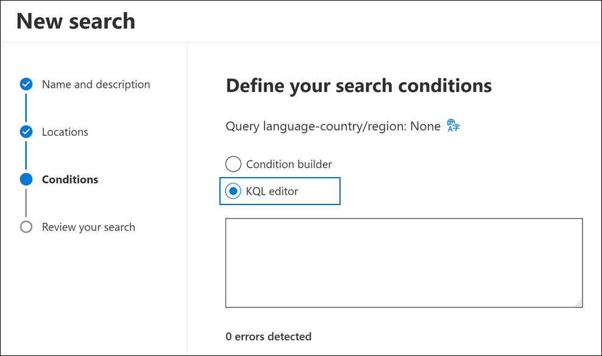

# Use the KQL editor to build search queries

The new KQL query experience in Microsoft 365 eDiscovery tools search provides feedback and guidance when you build search queries in Content search, Core eDiscovery, and Advanced eDiscovery. When you type queries in the editor, it provides autocompletion for supported searchable properties and conditions and provides lists of supported values for standard properties and conditions. For example, if you specify the `kind` email property in your query, the editor will present a list of supported values that you can select. The KQL editor also displays potential query errors in real time that you can fix before you run the search. Best of all, you can paste complex queries directly into the editor without having to manually build queries using the keywords and conditions cards in the standard condition builder. 
  
Here are the key benefits to using the KQL editor:

- Provides guidance and helps you build search queries from scratch.

- Lets you quickly paste long complex queries directly into the editor. For example, if you receive complex queries from opposing counsel, you can paste that into the KQL editor instead of having to use the condition builder.

- Quickly identifies potential errors and display a hint about how to resolve errors.

## Displaying the KQL editor

When you create or edit a search, the option to display and use the KQL editor is located on the **Conditions** page in the search or collections wizard.

### KQL editor in Content search and Core eDiscovery

### KQL editor in Advanced eDiscovery

## Using the KQL editor

## More information

- The KQL editor is also available when you create query-based holds in Core eDiscovery and Advanced eDiscovery.

- You can toggle between the condition builder and the KQL editor. For example, if you use the condition builder to configure a query using the Keywords box and multiple condition cards, you can display the resulting query in the KQL editor. However, if you create a complex query (with keywords and conditions) in the KQL editor, the resulting query is displayed only in the Keywords box when you view it in the condition builder.

- If you paste a complex query into the KQL editor, the editor detects potential errors and suggests possible solutions to resolve any errors.
