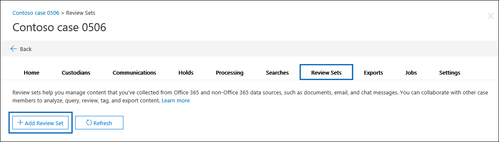
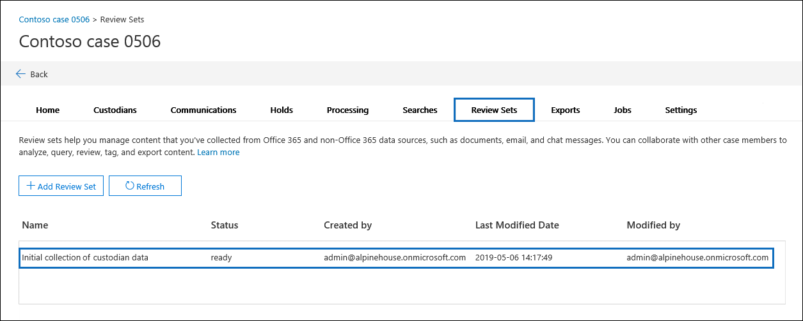
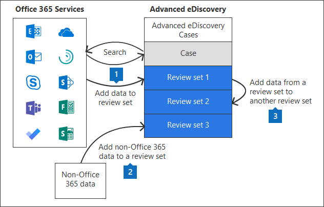

# Manage review sets in eDiscovery (Premium)

Review sets are a static set of documents where you can analyze, query, view, tag, and export data in a case. For more information about performing these tasks, see:

- [Analyze data in a review set](ediscovery-analyzing-data-in-review-set.md)
- [Query the data in a review set](ediscovery-review-set-search.md)
- [View documents in a review set](ediscovery-view-documents-in-review-set.md)
- [Tag documents in a review set](ediscovery-tagging-documents.md)
- [Export case data](ediscovery-exporting-data.md)

[!INCLUDE [purview-preview](../includes/purview-preview.md)]

## Create a review set

Review sets can be created on the **Review sets** tab by selecting **+ Add review set**.

On the **Add review set** flyout page, type a name for the review set and then select **Save**. The new review set is displayed in the list on the **Review sets** tab.

There are three different ways to add data to a review set in an eDiscovery (Premium) case.

1. [Add search results to a review set](ediscovery-add-data-to-review-set.md)

2. [Load non-Microsoft 365 data into a review set](ediscovery-load-non-office-365-data-into-a-review-set.md)

3. [Add data to a review set from another review set](ediscovery-add-data-to-review-set-from-another-review-set.md)

> [!NOTE]
> You can't delete items from a review set and you can't delete review sets from a case. To delete a review set (and delete the data in it), you have to delete the eDiscovery (Premium) case the review set is located in. For more information, see [Close or delete an eDiscovery (Premium) case](ediscovery-close-or-delete-case.md).
