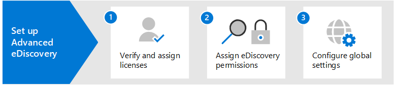

# Get started with eDiscovery (Premium)

Microsoft Purview eDiscovery (Premium) provides an end-to-end workflow to preserve, collect, review, analyze, and export data that's responsive to your organization's internal and external investigations. Nothing is needed to deploy eDiscovery (Premium), but there are some prerequisite tasks that an IT admin and eDiscovery manager have to complete before your organization can start to create and use eDiscovery (Premium) cases to manage your investigations.

This article discusses the following steps necessary to set up eDiscovery (Premium).

This includes ensuring the proper licensing required to access eDiscovery (Premium) and add custodians to cases, and assigning permissions to your legal and investigation team so they can access and manage cases.

[!INCLUDE [purview-preview](../includes/purview-preview.md)]

## Step 1: Verify and assign appropriate licenses

Microsoft Purview eDiscovery capabilities are included with Microsoft Purview. The licensing requirements may vary even within capabilities, depending on configuration options. For licensing requirements, guidance, and options, see the [Microsoft 365 guidance for security & compliance](/office365/servicedescriptions/microsoft-365-service-descriptions/microsoft-365-tenantlevel-services-licensing-guidance/microsoft-365-security-compliance-licensing-guidance#microsoft-purview-ediscovery).

## Step 2: Assign eDiscovery permissions

To access eDiscovery (Premium) or added as a member of an eDiscovery (Premium) case, a user must be assigned the appropriate permissions. Specifically, a user must be added as a member of the eDiscovery Manager role group in the Microsoft Purview compliance portal. Members of this role group can create and manage eDiscovery (Premium) cases. They can add and remove members, place custodians and content locations on hold, manage legal hold notifications, create and edit searches associated in a case, add search results to a review set, analyze data in a review set, and export and download from an eDiscovery (Premium) case.

For step-by-step guidance to configure permissions for eDiscovery, see [Assign eDiscovery permissions](ediscovery-assign-permissions.md).

## Step 3: Configure global settings for eDiscovery (Premium)

The last step to complete before people in your organization start to create and use cases is to configure global settings that apply to all cases in your organization. At this time, the only global setting is *attorney-client privilege detection* (more global settings will be available in the future). This setting enables the attorney-client privilege model to run when you analyze data in a review set. The model uses machine learning to determine the likelihood that a document contains content that is legal in nature. It also compares the participants of documents with an attorney list (that you submit when setting up the model) to determine if a document has at least one participant who is an attorney.

For more information about setting up and using the attorney-client privilege detection model, see [Set up attorney-client privilege detection in eDiscovery (Premium)](ediscovery-attorney-privilege-detection.md).

> [!NOTE]
> This is an optional step that you can perform anytime. Not implementing the attorney-client privilege detection model doesn't prevent you from creating and using eDiscovery (Premium) cases.

## Step 4: Verify that required eDiscovery apps are enabled

eDiscovery (Premium) requires the following Enterprise apps to be enabled in your Microsoft 365 or Office 365 organization. If these apps aren't enabled, you won't be able to access eDiscovery (Premium) view, filter, and search features.

|**App**|**App ID**|
|:------|:---------|
| ComplianceWorkbenchApp | 92876b03-76a3-4da8-ad6a-0511ffdf8647 |
| MicrosoftPurviewEDiscovery | b26e684c-5068-4120-a679-64a5d2c909d9 |
| Microsoft Exchange Online Protection | 00000007-0000-0ff1-ce00-000000000000 |
| Office365Zoom | 0d38933a-0bbd-41ca-9ebd-28c4b5ba7cb7 |

For more information about how to view and enable apps, see:

- [Quickstart: View enterprise applications](/azure/active-directory/manage-apps/view-applications-portal)
- [Quickstart: Add an enterprise application](/azure/active-directory/manage-apps/add-application-portal)

## Next steps

After you set up eDiscovery (Premium), you're ready to [create a case](ediscovery-create-and-manage-cases.md).
