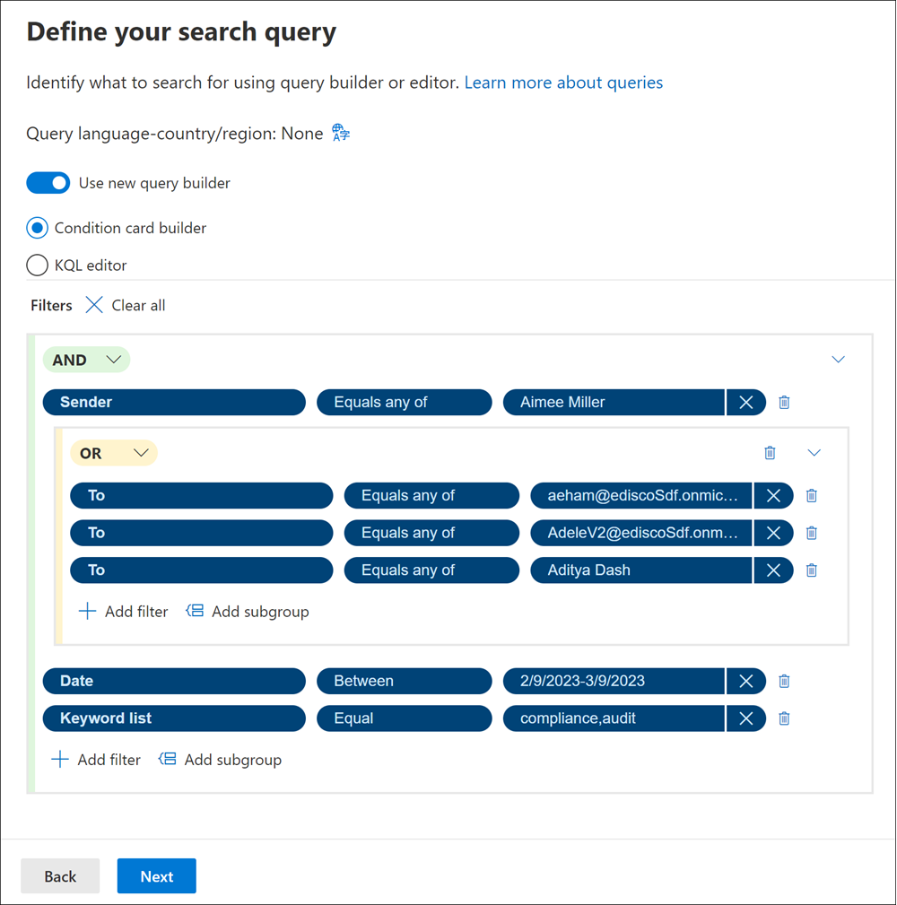

# Use the query builder to create search queries (preview)

The query builder option in collection search tool provides a visual filtering experience when you build search queries in Microsoft Purview eDiscovery (Premium). Use the new query builder to construct complex queries with additional functionality, including AND, OR, and grouping of conditions. These features in the query builder help you build queries more effectively, provide a visual interface for grouping sub-queries, and provide additional space for complex keyword queries to be constructed and reviewed.

[!INCLUDE [purview-preview](../includes/purview-preview.md)]

## Displaying the query builder

When you create or edit an eDiscovery search for a collection in eDiscovery (Premium), the option to display and use the query builder is located on the **Search query** page in the collections wizard. Select **Use new query builder** to display and use the query builder.

## Using the query builder

After you've selected **Use new query builder**, you're ready to get started. To create a query and custom filtering for your search, use the following controls:

- **AND/OR**: These conditional logical operators allow you to select the query condition that applies to specific filters and filter subgroups. These operators allow you to use multiple filters or subgroups connected to a single filter in your query.
- **Select a filter**: Allows you to select filters for the specific data sources and location content selected for the collection.
- **Add filter**: Allows you to add multiple filters to your query. Is available after you've defined at least one query filter.
- **Select an operator**: Depending on the selected filter, the operators compatible for the filter are available to select. For example, if the *Date* filter is selected, the available operators are *Before*, *After*, and *Between*. If the *Size (in bytes)* filter is selected, the available operators are *Greater than*, *Greater or equal*, *Less than*, *Less or equal*, *Between*, and *Equal*.
- **Value**: Depending on the selected filter, the values compatible for the filter are available. Additionally, some filters support multiple values and some filters support one specific value. For example, if the *Date* filter is selected, select date values. If the *Size (in bytes)* filter is selected, select a value for bytes.
- **Add subgroup**: After you've defined a filter, you can add a subgroup to refine the results returned by the filter. You can also add a subgroup to a subgroup for multi-layered query refinement.
- **Remove a filter condition**: To remove an individual filter or subgroup, select the remove icon to the right of each filter line or subgroup.
- **Clear all**: To clear the entire query of all filters and subgroups, select **Clear all**.

## Scenario example

The eDiscovery administrator needs to create a query to find emails sent from Aimee Miller to Adam Eham, Adele Vance, or Aditya Dash that were sent between February 9, 2023 and March 9, 2023 that contains the keywords *compliance* and *audit*. For this example, the administrator creates the following query using the new query builder:

1. For the first filter, the administrator selects *Sender*, then selects the *Equals any of* operator, then selects *Aimee Miller* from the list of users available in the **Value** control.
2. Next, the administrator selects **Add subgroup** and the **OR** operator to define the other users that Aimee may have sent an email to about the compliance audit.
3. In the subgroup, the administrator selects the *To* filter, the *Equals any of* operator, and the *Value (user)* for each of the other users that Aimee may have sent email to about the compliance audit. In this example, the administrator creates a filter in the subgroup for Adam Eham, Adele Vance, and Aditya Dash.
4. To define the date range, the administrator selects **Add filter** and selects the *Date* filter, the *Between* operator, and start and ending dates for the *Value*.
5. Finally, the administrator selects the *Keyword list* filter, the *Equal* operator, and *compliance, audit* as the keyword *Value*.

