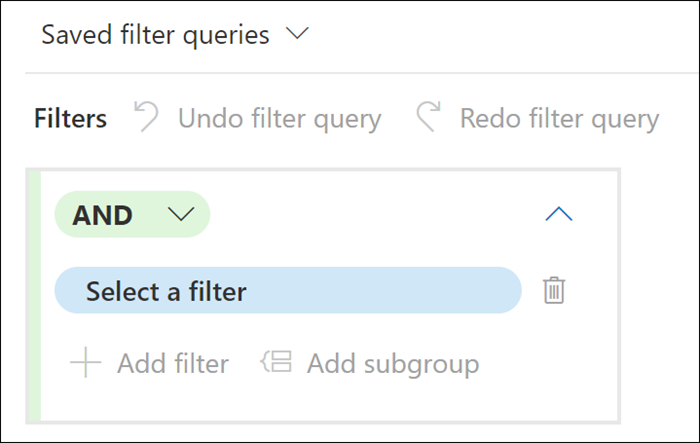
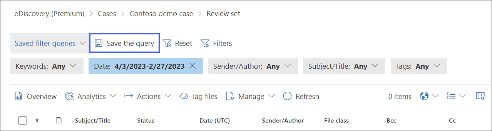
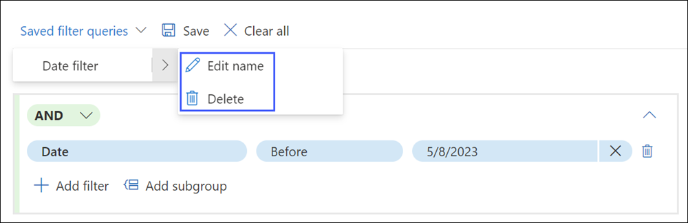
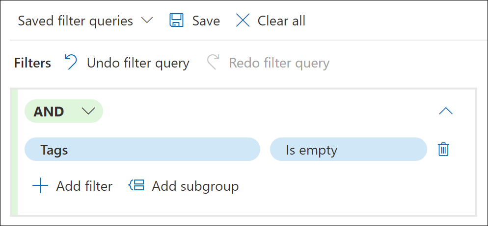
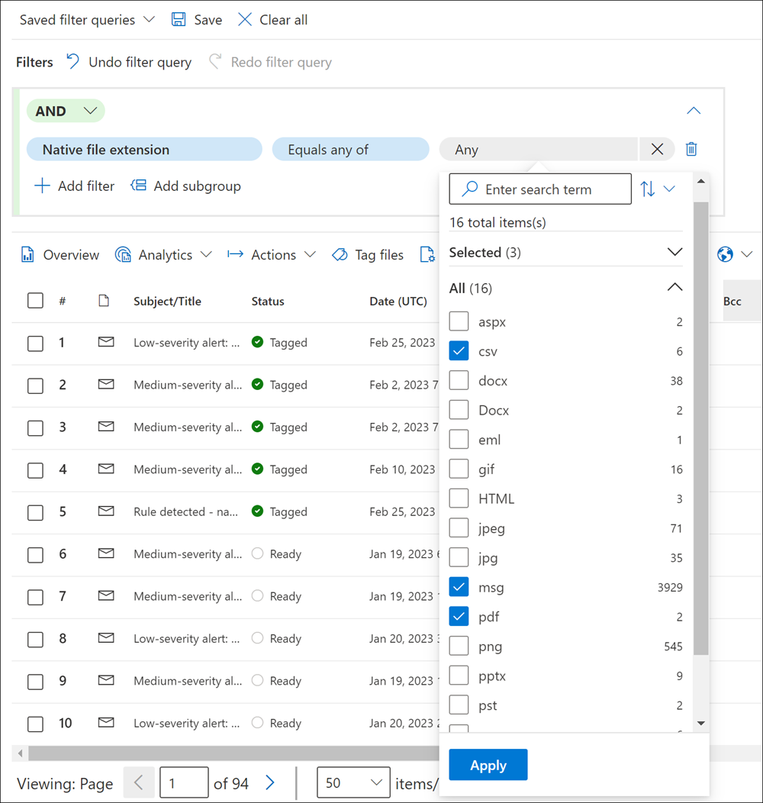

# Query and filter content in a review set

In most cases, it is useful to dig deeper into the content in a review set and organize it to facilitate a more efficient review. Using filters and queries in a review set helps you focus on a subset of documents that meet the criteria of your review.

[!INCLUDE [purview-preview](../includes/purview-preview.md)]

## Advanced filters

Improving on the default filters in previous versions, eDiscovery (Premium) now provides advanced filters that let you build more flexible and advanced filters for review sets. Similar to the [collection query builder experience](/microsoft-365/compliance/ediscovery-query-builder), the advanced filtering capability enables you to:

- Quickly search for filter conditions.
- Create complex filters using subgroups, *AND*, or *OR* conditions.
- Easily change your queries with **Undo filter query** and **Redo filter query** controls.
- Manage saved filters without having to navigate to another area.
- Use *Is empty* and *Is not empty* conditions for each filter.

> [!NOTE]
> A review set displays a maximum of 1,000 items per page and up to 10 pages (for a total of 10,000 items displayed per review set). Use default or custom filters to adjust the displayed items as needed.

## Advanced filter controls

To create and custom filtering for your review set, use the following controls:

- **AND/OR**: These conditional logical operators allow you to select the query condition that applies to specific filters and filter subgroups. These operators allow you to use multiple filters or subgroups connected to a single filter in your query.
- **Select a filter**: Allows you to select filters for the specific data sources and location content selected for the collection.
- **Add filter**: Allows you to add multiple filters to your query. Is available after you've defined at least one query filter.
- **Select an operator**: Depending on the selected filter, the operators compatible for the filter are available to select. For example, if the *Date* filter is selected, the available operators are *Before*, *After*, and *Between*. If the *Size (in bytes)* filter is selected, the available operators are *Greater than*, *Greater or equal*, *Less than*, *Less or equal*, *Between*, and *Equal*.
- **Value**: Depending on the selected filter, the values compatible for the filter are available. Additionally, some filters support multiple values and some filters support one specific value. For example, if the *Date* filter is selected, select date values. If the *Size (in bytes)* filter is selected, select a value for bytes.
- **Add subgroup**: After you've defined a filter, you can add a subgroup to refine the results returned by the filter. You can also add a subgroup to a subgroup for multi-layered query refinement.
- **Remove a filter condition**: To remove an individual filter or subgroup, select the remove icon to the right of each filter line or subgroup.
- **Clear all**: To clear the entire query of all filters and subgroups, select **Clear all**.

## Filter types

Every searchable field in a review set has a corresponding filter that you can use for filter items based on a specific field.

There are multiple types of filters:

- **Freetext**: A freetext filter is applied to text fields such as *Subject*. You can list multiple search terms by separating them with a comma.
- **Date**: A date filter is used for date fields such as *Last modified date*.
- **Search options**: A search options filter provides a list of possible values (each value is displayed with a checkbox that you can select) for particular fields in the review. This filter is used for fields, such as *Sender*, where there's a finite number of possible values in the review set.
- **Keyword**: A keyword condition is a specific instance of freetext condition that you can use to search for terms. You can also use KQL-like query language in this type of filter. For more information, see the Query language and Advanced query builder sections in this article.

## Save and manage filter queries

After you're satisfied with your filters, you can save the filter combination as a filter query. This saved filter query lets you apply the filter in the future review sessions.

To save a filter, select **Save** on the **Save filter queries** command bar and name it. You or other reviewers can run previously saved filter queries by selecting the **Saved filter queries** dropdown and selecting a filter query to apply to review set documents.

To edit or delete a saved filter query, select **Saved filter queries** and expand the filter properties to display the **Edit** and **Delete** options for the saved filter query.

## Use query language support for KQL and Keyword filters

When using the *KQL* or *Keyword* filters, you can use a KQL-like query language to build your review set search query. The query language for these two filters supports standard Boolean operators, such as **AND**, **OR**, **NOT**, and **NEAR**. It also supports a single-character wildcard (?) and a multi-character wildcard (*).

> [!NOTE]
> Review filters only support wildcards (? or *) on a single term. Using wildcards in searches on phrases that consist of multiple terms aren't supported.

## Scenario example: Filter for untagged items in a review set

An eDiscovery administrator needs to create a query to find all items in the review set that haven't had any tagging applied. For this example, the administrator creates the following review set filter query:

1. For the first filter, the administrator selects the filter and types *tag* in filter search. The filter *Tags* is displayed as a matching option, and the administrator selects it.
2. The administrator then selects **Select an operator** and selects the *Is empty* operator. This operator returns all items that don't have any tags applied.

The review set is immediately updated and the only the items that aren't tagged are displayed.

## Scenario example: Filter for native file type items in a review set

An eDiscovery administrator needs to create a query to find all items in the review set that are a certain type, such as .csv, .msg, or .pdf. For this example, the administrator creates the following review set filter query:

1. For the first filter, the administrator selects the filter and types *file* in filter search. The filter *Native file extension* is one of the filter options displayed in the search results, and the administrator selects it.
2. The administrator then selects **Select an operator** and selects the *Equals any of* operator. The administrator selects the *Any* field and selects the checkboxes for the file types to include in the filter query.

The review set is immediately updated and the only the items that match the selected file types are displayed.

## Scenario example: Filter partially indexed items

If you selected the option to add partially indexed items from additional data sources when you committed the collection estimate to a review set. You'll probably want to identify and view those items to determine if an item might be relevant to your investigation and whether you need to remediate the error that resulted in the item being partially indexed.

At this time, there isn't a filter option in a review set to display partially indexed items. But we're working on it. Until then, here's a way you can filter and display the partially indexed items that you added to a review set.

1. Create a collection and commit it to a new review set *without* adding partially indexed items from the additional data sources.
2. Create a new collection by copying the collection from step 1.
3. Commit the new collection to the same review set. But this time, add the partially indexed items from the additional data sources. Because items from the collection you created in step 1 have already been added to the review set, only the partially indexed items from the second collection are added to the review set.
4. After both collections are added to the review set, select the review set, and select **Load sets**.
5. Copy or make note of the **Load Id** for the second collection (the one you created in step 2). The collection name is identified in the **Source info** column.
6. Back in the review set, select **Filter**, expand the **IDs** section, and then select the **Load Id** checkbox.
7. Expand the **Load Id** filter, and then select the checkbox for the load ID that corresponds to the second collection to display the partially indexed items.
