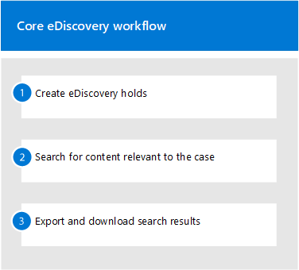

# Get started with eDiscovery (Standard)

Microsoft Purview eDiscovery (Standard) in Microsoft Purview provides a basic eDiscovery tool that organizations can use to search and export content in Microsoft 365 and Office 365. You can also use eDiscovery (Standard) to place an eDiscovery hold on content locations, such as Exchange mailboxes, SharePoint sites, OneDrive accounts, and Microsoft Teams. Nothing is needed to deploy eDiscovery (Standard), but there are some prerequisite tasks that an IT admin and eDiscovery manager have to complete before your organization can start using eDiscovery (Standard) to search, export, and preserve content.

This article discusses the steps necessary to set up eDiscovery (Standard). This includes ensuring the proper licensing required to access eDiscovery (Standard) and place an eDiscovery hold on content locations, as well as assigning permissions to your IT, legal, and investigation team so they can access and manage cases. This article also provides a high-level overview of using cases to search for and export content.

[!INCLUDE [purview-preview](../includes/purview-preview.md)]

## Step 1: Verify and assign appropriate licenses

Microsoft Purview eDiscovery capabilities are included with Microsoft Purview. The licensing requirements may vary even within capabilities, depending on configuration options. For licensing requirements, guidance, and options, see the [Microsoft 365 guidance for security & compliance](/office365/servicedescriptions/microsoft-365-service-descriptions/microsoft-365-tenantlevel-services-licensing-guidance/microsoft-365-security-compliance-licensing-guidance#microsoft-purview-ediscovery).
  
For information about how to assign licenses, see [Assign licenses to users](../admin/manage/assign-licenses-to-users.md).

## Step 2: Verify that required eDiscovery apps are enabled

eDiscovery (Standard) requires the following Enterprise apps to be enabled in your Microsoft 365 or Office 365 organization. If these apps aren't enabled, you won't be able to access eDiscovery (Standard) view, filter, and search features.

|**App**|**App ID**|
|:------|:---------|
| ComplianceWorkbenchApp | 92876b03-76a3-4da8-ad6a-0511ffdf8647 |
| Microsoft Exchange Online Protection | 00000007-0000-0ff1-ce00-000000000000 |
| Office365Zoom | 0d38933a-0bbd-41ca-9ebd-28c4b5ba7cb7 |

For more information about how to view and enable apps, see:

- [Quickstart: View enterprise applications](/azure/active-directory/manage-apps/view-applications-portal)
- [Quickstart: Add an enterprise application](/azure/active-directory/manage-apps/add-application-portal)

## Step 3: Assign eDiscovery permissions

To access eDiscovery (Standard) or be added as a member of a eDiscovery (Standard) case, a user must be assigned the appropriate permissions. Specifically, a user must be added as a member of the eDiscovery Manager role group in the compliance portal. Members of this role group can create and manage eDiscovery (Standard) cases. They can add and remove members, place an eDiscovery hold on users, create and edit searches, and export content from a eDiscovery (Standard) case.

For step-by-step guidance to configure permissions for eDiscovery, see [Assign eDiscovery permissions](ediscovery-assign-permissions.md).

## Step 4: Create a eDiscovery (Standard) case

The next step is to create a case and start using eDiscovery (Standard). Complete the following steps to create a case and add members. The user who creates the case is automatically added as a member.

1. Go to <a href="https://go.microsoft.com/fwlink/p/?linkid=2077149" target="_blank">compliance portal</a> and sign in using the credentials for a user account that has been assigned the appropriate eDiscovery permissions. Members of the Organization Management role group can also create eDiscovery (Standard) cases.
2. In the left navigation pane of the compliance portal, select **Show all**, and then select **eDiscovery** > <a href="https://go.microsoft.com/fwlink/p/?linkid=2174007" target="_blank">**Core**</a>.
3. On the **eDiscovery (Standard)** page, select **Create a case**.
4. On the **New case** flyout page, give the case a name (required) and then type an optional description. The case name must be unique in your organization.
5. Select **Save** to create the case.

The new case is created and displayed on the eDiscovery (Standard) page. You may have to select **Refresh** to display the new case.

## Step 5 (optional): Add members to a eDiscovery (Standard) case

If you create a case in Step 3 and you're the only person who will use the case, then you don't have to perform this step. You can start using the case to create eDiscovery holds, search for content, and export search results. Perform this step if you want to give other users (or roles group) access to the case.

1. On the **eDiscovery (Standard)** page in the compliance portal, select the name of the case that you want to add members to.

2. On the case home page, select the **Settings** tab, and then select **Access & permissions**.

3. On the **Access & permissions** flyout page, under **Members**, select **Add** to add members to the case.

    You can also choose to add role groups as members of a case. Under **Role groups**, select **Add**. You can only assign the role groups that you're a member of to a case. That's because role groups control who can assign members to an eDiscovery case.

4. In the list of people or role groups that can be added as members of the case, select to the left of the name of the people (or role groups) that you want to add. If you have a large list of people or role groups who can be added as members, use the **Search** box to search for a specific person or role group in the list.
  
5. After you select the people or role groups to add as members of the case, select **Save** to save the new members or role groups.

> [!IMPORTANT]
>
>- If a role is added or removed from a role group that you've added as a member of a case, then the role group will be automatically removed as a member of the case (or any case the role group is a member of). The reason for this is to protect your organization from inadvertently providing additional permissions to members of a case. Similarly, if a role group is deleted, it will be removed from all cases it was a member of. For more information, see [Assign eDiscovery permissions](ediscovery-assign-permissions.md#adding-role-groups-as-members-of-ediscovery-cases). 
>
>- Only an eDiscovery Administrator can remove members from a case. Users who are members of the eDiscovery Manager subgroup can't remove members from a case, even if the user created the case.
>

## Explore the eDiscovery (Standard) workflow

To get you started using eDiscovery (Standard), here's a simple workflow of creating eDiscovery holds for people of interest, searching for content that relevant to your investigation, and then exporting that data for further review. In each of these steps, we'll also highlight some extended eDiscovery (Standard) functionality that you can explore.

1. **[Create an eDiscovery hold](ediscovery-create-holds.md)**. The first step after creating a case is placing a hold (also called an *eDiscovery hold*) on the content locations of the people of interest in your investigation. Content locations include Exchange mailboxes, SharePoint sites, OneDrive accounts, and the mailboxes and sites associated with Microsoft Teams and Microsoft 365 Groups. While this step is optional, creating an eDiscovery hold preserves content that may be relevant to the case during the investigation. When you create an eDiscovery hold you can preserve all content in specific content locations or you can create a query-based hold to preserve only the content that matches a hold query. In addition to preserving content, another good reason to create eDiscovery holds is to quickly search the content locations on hold (instead of having to select each location to search) when you create and run searches in the next step. After you complete your investigation, you can release any hold that you created.

2. **[Search for content](ediscovery-search-for-content.md)**. After you create eDiscovery holds, use the built-in search tool to search the content locations on hold. You can also search other content locations for data that may be relevant to the case. You can create and run different searches that are associated with the case. You use keywords, properties, and conditions to [build search queries](ediscovery-keyword-queries-and-search-conditions.md) that return search results with the data that's most likely relevant to the case. You can also:

   - View search statistics that may help you refine a search query to narrow the results.
   - Preview the search results to quickly verify whether the relevant data is being found.
   - Revise a query and rerun the search.

3. **[Export and download search results](ediscovery-export-content.md)**. After you search for and find data that's relevant to your investigation, you can export it out of Office 365 for review by people outside of the investigation team. Exporting data is a two-step process. The first step is to export the results of a search in the case out of Office 365. This is accomplished by copying the results of a search to a Microsoft-provided Azure Storage location. The next step is to use the eDiscovery Export tool to download the content to a local computer. In addition to the exported data files, the export package contains an export report, a summary report, and an error report.
