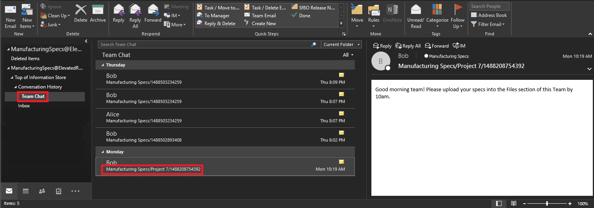

# Conduct an eDiscovery investigation of content in Microsoft Teams

Large enterprises are often exposed to high penalty legal proceedings that demand submission of all Electronically Stored Information (ESI). Microsoft Teams content can be searched and used during eDiscovery investigations.

## Overview

All Microsoft Teams 1:1 or group chats are journaled through to the respective users' mailboxes. All standard channel messages are journaled through to the group mailbox representing the team. Files uploaded in standard channels are covered under the eDiscovery functionality for SharePoint Online and OneDrive for Business.

eDiscovery of messages and files in [private channels](/microsoftteams/private-channels) works differently than in standard channels. To learn more, see [eDiscovery of private channels](#ediscovery-of-private-and-shared-channels).

Recorded Teams meetings are stored in the OneDrive for Business account of the user recording the meeting. To learn more, see [eDiscovery (Premium) workflow for content in Microsoft Teams](/microsoft-365/compliance/ediscovery-teams-workflow).

Not all Teams content is eDiscoverable. The following table shows the Teams content types that you can search for using Microsoft eDiscovery tools:

|**Content type**|**Notes**|
|:---------------|:--------|
|Audio recordings|Audio calls between Teams user and external contacts|
|Card content|See [Search for card content](#search-for-card-content) for more information.|
|Chat links||
|Chat messages|This includes content in standard Teams channels, 1:1 chats, 1:N group chats, chats with yourself, and chats with guests.|
|Code snippets||
|Edited messages|If the user is on hold, previous versions of edited messages are also preserved.|
|Emojis, GIFs, and stickers||
|Inline images||
|Loop components|Content in a loop component is saved in a .fluid file that's stored in the OneDrive for Business account of the user who sends the loop component. That means you have to include OneDrive as a data source when searching for content in loop components.|
|Meeting IM conversations||
|Meeting metadata<sup>1</sup>||
|Meeting recordings and transcripts (preview)|Transcripts of the meeting audio are extracted and provided as a separate file. Maximum supported recorded meeting .mp4 file size is 350 MB. If the recorded meeting file size is above 350 MB, a processing error occurs and the file is available for download.|
|Name of channel||
|Quotes|Quoted content is searchable. However, search results don't indicate that the content was quoted.|
|Reactions (such as likes, hearts, and other reactions)|Reactions are supported for all commercial customers after June 1, 2022. Reactions before this date aren't available for eDiscovery. Expanded reactions are now supported. To understand reaction history, the content must be on legal hold.|
|Subject||
|Tables||
|Teams Video Clip (TVC)|Search TVC with "Video-Clip" keyword and "save as" a .mp4 file for each TVC attachment by right-clicking the preview. <p> TVCs are collected as Teams conversation attachments and separate .mp4 files. TVC file data is discoverable in eDiscovery [review sets](/microsoft-365/compliance/add-data-to-review-set) and can be exported.

<a name="teams-metadata"></a><sup>1</sup> Meeting (and call) metadata includes the following:

- Meeting start and end time, and duration
- Meeting join and leave events for each participant
- VOIP joins/calls
- Anonymous joins
- Federated user joins
- Guest joins

Here's an example of a chat conversation between participants during a meeting.


Here's an example of the compliance copy of the same chat conversation viewed in an eDiscovery tool.


Here's an example of the meeting metadata.


For more information about conducting an eDiscovery investigation, see [Get started with eDiscovery (Standard)](/microsoft-365/compliance/get-started-core-ediscovery).

Microsoft Teams data appears as IM or Conversations in the Excel eDiscovery export output. You can open the `.pst` file in Outlook to view those messages after you export them.

When viewing the .pst file for the team, all conversations are located in the Team Chat folder under Conversation History. The title of the message contains the team name and channel name. For example, the image below shows a message from Bob who messaged the Project 7 standard channel of the Manufacturing Specs team.



Private chats in a user's mailbox are stored in the Team Chat folder under Conversation History.

## eDiscovery of private and shared channels

Compliance copies of messages in private and shared channels are sent to different mailboxes depending on the channel type. That means you have to search different mailbox locations based on the type of channel a user is a member of.

- **Private channels**. Compliance copies are sent to the mailbox of all members of the private channel members. That means you have to search the user mailbox when searching for content in private channel messages.
- **Shared channels**. Compliance copies are sent to a system mailbox that's associated with the parent team. Because Teams doesn't support an eDiscovery search of a single system mailbox for a shared channel, you have to search the mailbox for the parent team (by selecting the name of the Team mailbox) when searching for message content in shared channels.

Each private and shared channel has its own SharePoint site that's separate from the parent team site. That means files in private and shared channels are stored in its own site and managed independently of the parent team. This means you must identify and search the specific site associated with a channel when searching for content in files and channel message attachments.

Use the following sections to help identify the private or shared channel to include in your eDiscovery search.

### Identifying the members of a private channel

Use the procedure in this section to identify members of a private channel so that you can use eDiscovery tools to search the member's mailbox for content in private channel messages.

Before you perform these steps, make sure you have the [latest version of the Teams PowerShell module](/microsoftteams/teams-powershell-overview) installed.

1. Run the following command to get the group ID of the team that contains the shared channels you want to search.

   ```powershell
   Get-Team -DisplayName <display name of the the parent team>
   ```

   > [!TIP]
   > Run the **Get-Team** cmdlet without any parameters to display a list of all Teams in your organization. The list contains the group Id and DisplayName for every team.

2. Run the following command to get a list of private channels in the parent team. Use the group ID for the team that you obtained in step 1.

   ```PowerShell
    Get-TeamChannel -GroupId <parent team GroupId> -MembershipType Private
   ```

3. Run the following command to get a list of private channel owners and members for a specific private channel.

   ```PowerShell
    Get-TeamChannelUser -GroupId <parent team GroupId> -DisplayName "Partner Shared Channel"
   ```

4. Include the mailboxes of owners and members of a private channel as part of your [eDiscovery search query in eDiscovery (Standard)](/microsoft-365/compliance/search-for-content-in-core-ediscovery) or when [identifying and collecting custodian content in eDiscovery (Premium)](/microsoft-365/compliance/add-custodians-to-case).

### Identifying the SharePoint site for private and shared channels

As previously explained, files shared in private and shared channels (and files attached to channel messages) are stored in the site collection associated with the channel. Use the procedure in this section to identify the URL for the site associated with a specific private or shared channel. Then you can use eDiscovery tools to search for content in the site.

Before you perform these steps, [install the SharePoint Online Management Shell and connect to  SharePoint Online](/powershell/sharepoint/sharepoint-online/connect-sharepoint-online).

1. Optionally, run the following to get a list of all SharePoint site collections associated with shared channels in the parent team.

   ```PowerShell
    Get-SPOSite
   ```

   > [!TIP]
   > The naming convention of the URL for a site that's associated with private and shared channels is `[SharePoint domain]/sites/[Name of parent team]-[Name of private or shared channel]`. For example, the URL for the shared channel named "Partner Collaboration", which is located in the "Engineer Team" parent team in the Contoso organization is `https://contoso.sharepoint.com/sites/EngineeringTeam-PartnerCollaboration`.

2. Run the following PowerShell commands to display the URL for all SharePoint sites associated with the private and shared channels in your organization. The output of the script also includes the group ID of the parent team, which you need to run the commands in step 3.

    ```PowerShell
    $sites = Get-SPOSite -Template "TEAMCHANNEL#1"
    foreach ($site in $sites) {$x= Get-SPOSite -Identity $site.url -Detail; $x.relatedgroupID; $x.url}
    ```

   > [!NOTE]
   > SharePoint sites for private channels created before June 28, 2021 use the value `"TEAMCHANNEL#0"` for the custom template ID. To displays private channels created after this date, use the value `"TEAMCHANNEL#1"` when running the previous two scripts. Shared channels only use the value of `"TEAMCHANNEL#1"`.

3. For each parent team, run the following PowerShell commands to identify the private and shared channel sites, where `$groupID` is the group ID of the parent team.

    ```PowerShell
    $sites = Get-SPOSite -Template "TEAMCHANNEL#1"
    $groupID = "<group ID of parent team)"
    foreach ($site in $sites) {$x= Get-SpoSite -Identity $site.url -Detail; if ($x.RelatedGroupId -eq $groupID) {$x.RelatedGroupId;$x.url}}
    ```

4. Include the site associated with a private or shared channel as part of your [eDiscovery search query in eDiscovery (Standard)](/microsoft-365/compliance/search-for-content-in-core-ediscovery) or when [identifying and collecting custodian content in eDiscovery (Premium)](/microsoft-365/compliance/add-custodians-to-case).

## Search for content for guests

You can use eDiscovery tools to search for Teams content related to guests in your organization. Teams chat content that's associated with a guest is preserved in a cloud-based storage location and can be searched for using eDiscovery. This includes searching for content in 1:1 and 1:N chat conversations in which a guest is a participant with other users in your organization. You can also search for private channel messages in which a guest is a participant and search for content in *guest:guest* chat conversations where the only participants are guests.

To search for content for guests:

1. Connect to Microsoft Graph PowerShell. For more information, see the [Microsoft Graph PowerShell overview](/powershell/microsoftgraph/overview). Be sure to complete Step 1 and Step 2 in the previous article.

2. After you successfully connect to Microsoft Graph PowerShell, run the following command to display the user principal name (UPN) for all guests in your organization. You have to use the UPN of the guest when you create the search in step 4.

   ```powershell
   Get-MgUser -Filter "userType eq 'Guest'" -All $true | FL UserPrincipalName
   ```

   > [!TIP]
   > Instead of displaying a list of user principal names on the computer screen, you can redirect the output of the command to a text file. You can do this by appending `> filename.txt` to the previous command. The text file with the user principal names will be saved to the current folder.

3. In a different Windows PowerShell window, connect to Security & Compliance PowerShell. For instructions, see [Connect to Security & Compliance PowerShell](/powershell/exchange/connect-to-scc-powershell). You can connect with or without using multi-factor authentication.

4. Create a content search that searches for all content (such as chat messages and email messages) in which the specified guest was a participant by running the following command.

   ```powershell
   New-ComplianceSearch <search name> -ExchangeLocation <guest UPN>  -AllowNotFoundExchangeLocationsEnabled $true -IncludeUserAppContent $true
   ```

   For example, to search for content associated with the guest Sara Davis, you would run the following command.

   ```powershell
   New-ComplianceSearch "Sara Davis Guest" -ExchangeLocation "sara.davis_hotmail.com#EXT#@contoso.onmicrosoft.com" -AllowNotFoundExchangeLocationsEnabled $true -IncludeUserAppContent $true
   ```

    For more information about using PowerShell to create content searches, see [New-ComplianceSearch](/powershell/module/exchange/new-compliancesearch).

5. Run the following command to start the content search that you created in step 4:

   ```powershell
   Start-ComplianceSearch <search name>
   ```

6. Go to [https://compliance.microsoft.com](https://compliance.microsoft.com) and then select **Show all** > **Content search**.

7. In the list of searches, select the search that you created in step 4 to display the flyout page.

8. On the flyout page, you can do the following things:

   - Select **View results** to view the search results and preview the content.
   - Next to the **Query** field, select **Edit** to edit and then rerun the search. For example, you can add a search query to narrow the results.
   - Select **Export results** to export and download the search results.

## Search for card content

Card content generated by apps in Teams channels, 1:1 chats, and 1xN chats are stored in mailboxes and can be searched. A *card* is a UI container for short pieces of content. Cards can have multiple properties and attachments, and can include buttons that can trigger card actions. For more information, see [Cards](/microsoftteams/platform/task-modules-and-cards/what-are-cards)

Like other Teams content, where card content is stored is based on where the card was used. Content for cards used in a Teams channel is stored in the Teams group mailbox. Card content for 1:1 and 1xN chats are stored in the mailboxes of the chat participants.

To search for card content, you can use the `kind:microsoftteams` or `itemclass:IPM.SkypeTeams.Message` search conditions. When reviewing search results, card content generated by bots in a Teams channel has the **Sender/Author** email property as `<appname>@teams.microsoft.com`, where `appname` is the name of the app that generated the card content. If card content was generated by a user, the value of **Sender/Author** identifies the user.

When viewing card content in Content search results, the content appears as an attachment to the message. The attachment is named `appname.html`, where `appname` is the name of the app that generated the card content. The following screenshots show how card content (for an app named Asana) appears in Teams and in the results of a search.

### Card content in Teams


### Card content in search results


> [!NOTE]
> To display images from card content in search results at this time (such as the checkmarks in the previous screenshot), you have to be signed into Teams (at <https://teams.microsoft.com>) in a different tab in the same browser session that you use to view the search results. Otherwise, image placeholders are displayed.

## eDiscovery in external access and guest environments

Admins can use eDiscovery to search for content in chats messages in a Teams meeting in external access and guest access environments based on the following restrictions:

- **External access**: In a Teams meeting with users from your organization and users from an external organization where external attendees are using external access, admins in both organizations can search for content in chat messages from the meeting.
- **Guest**: In a Teams meeting with users from your organization and guests, only admins in the organization who hosts the Teams meeting can search for content in chat messages from the meeting.

## Related articles

- [Microsoft 365 eDiscovery solutions](/microsoft-365/compliance/ediscovery)
- [Get started with eDiscovery (Standard)](/microsoft-365/compliance/get-started-core-ediscovery)
- [Teams workflow in eDiscovery (Premium)](/microsoft-365/compliance/teams-workflow-in-advanced-ediscovery)
- [Teams PowerShell Overview](/microsoftteams/teams-powershell-overview)
