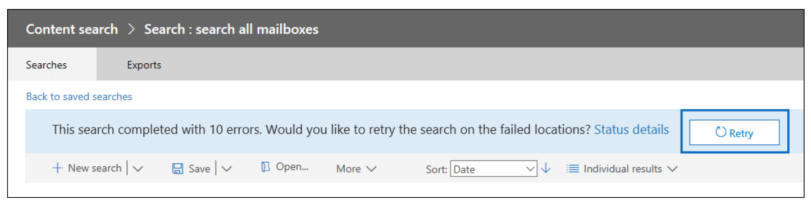

# Investigate, troubleshoot and resolve common eDiscovery issues

This topic covers basic troubleshooting steps that you can take to identify and resolve several issues you may encounter during an eDiscovery search or elsewhere in the eDiscovery process. Resolving some of these scenarios requires help from Customer Support Services (CSS). Information on when to contact CSS is included in the resolution steps.

## Error/issue ambiguous location

You'll receive this error "The compliance search contains the following invalid location `(s):useralias@contoso.com. The location "useralias@contoso.com" is ambiguous"`

### Details

You may receive this error if you tried to add user’s mailbox location to search and there are duplicate or conflicting objects with the same user ids in the Exchange Online Protection (EOP) directory.

### Resolution

Check for duplicate users or distribution list with the same user ID.

1. Connect to [Exchange Online PowerShell](https://docs.microsoft.com/en-us/powershell/exchange/exchange-online/connect-to-exchange-online-powershell/connect-to-exchange-online-powershell?view=exchange-ps).
2. Retrieve all instances of the username, type:

```powershell
Get-Recipient <username>
```

The output for 'useralias@contoso.com' might be

> 
> |Name  |RecipientType  |
> |---------|---------|
> |Alias, User     |MailUser         |
> |Alias, User     |User         |

3. If multiple users are returned, locate and fix the conflicting object.

## Error/issue specific location search fails

Specific locations in a large search fails

### Details

This search completed with (#) errors.  Would you like to retry the search on the failed locations?



### Resolution

If you receive this error, we recommend that you locate the failed location in the search and re-run the search only on the failed locations.

1. Connect to [Exchange Online Protection Powershell](https://docs.microsoft.com/en-us/powershell/exchange/exchange-eop/connect-to-exchange-online-protection-powershell?view=exchange-ps).
1. Type:

```powershell
Get-Compliancesearch searchname|fl 
```

3. From the PowerShell output, view the failed locations in the Errors field or from the Status details in the error form the Search output.
1. Retry the eDiscovery search on the failed locations only.
1. If you continue to receive these error, see [Retry  Failed Locations](https://docs.microsoft.com/en-us/Office365/SecurityCompliance/retry-failed-content-search) for additional troubleshooting steps.

## Error/issue file not found
“File not found” in the export warnings and errors.csv or skipped items.csv.

### Details

When running an eDiscovery search that includes SharePoint Online and One Drive For Business locations, you may receive the error `File Not Found` although the file is located on the site.  This may occur if the file cannot be located on the site or the index is out of date. Heres is the text of an actual error, with emphasis added.
  
> 28.06.2019 10:02:19_FailedToExportItem_Failed to download content. Additional diagnostic info : Microsoft.Office.Compliance.EDiscovery.ExportWorker.Exceptions.ContentDownloadTemporaryFailure: Failed to download from content 6ea52149-91cd-4965-b5bb-82ca6a3ec9be of type Document. Correlation Id: 3bd84722-937b-4c23-b61b-08d6fba9ec32. ServerErrorCode: -2147024894 ---> Microsoft.SharePoint.Client.ServerException: ***File Not Found***. at Microsoft.SharePoint.Client.ClientRequest.ProcessResponseStream(Stream responseStream) at Microsoft.SharePoint.Client.ClientRequest.ProcessResponse()
--- End of inner exception stack trace ---

### Resolution

1. Check location identified in the search to ensure the that the location of the file is correct and added in the search locations.
2. Use the procedures at [Manually request crawling and re-indexing of a site, a library or a list](https://docs.microsoft.com/en-us/sharepoint/crawl-site-content) to re-index the site.

## Error/issue search fails recipient not found
 eDiscovery search fails with error `Recipient Not Found`

### Details

This error may occur if the user object cannot be found in Exchange Online Protection (EOP) because the object has not synced.

### Resolution

1. Connect to [Exchange Online Protection PowerShell](https://docs.microsoft.com/en-us/powershell/exchange/exchange-eop/connect-to-exchange-online-protection-powershell?view=exchange-ps).
1. Check to see if the user object is synced to Exchange Online Protection type:

```powershell
Get-Recipient userId|fl
```

3. There should be a mailuser object for the user question. If nothing is returned, investigate the user object. Contact CSS if the object can't be synced.

## Error/issue exporting search results is slow

eDiscovery export is slow when exporting search results from eDiscovery or Content Search in the Security and Compliance center.

### Details

When running eDiscovery export, the download is taking longer than expected.  You can check to see the amount of data to be download and possibly increase your export speed.

### Resolution

1.	Try using the steps identified in the article [Increase Download Speeds](https://docs.microsoft.com/en-us/office365/securitycompliance/increase-download-speeds-when-exporting-ediscovery-results).
2.	If you still have issues, connect to [Exchange Online Protection PowerShell](https://docs.microsoft.com/en-us/powershell/exchange/exchange-eop/connect-to-exchange-online-protection-powershell?view=exchange-ps) and type:

```powershell
Get-ComplianceSearch searchname\fl
```

4. Find the amount of data to be downloaded in the SearchResults and SearchStatistics parameters.
5. Type:

```powershell
Get-ComplianceSearchAction |fl
```

6. In the results field find the data that has been exported and view and errors encountered.
7. Check the trace.log file located in the directory that you exported the content to for any errors.

## Error/issue "Internal server error (500) occurred"


### Details 
When running an eDiscovery search, if the search continually fails with error similar to "Internal server error (500) occurred, you may need re-run the search only on specific mailbox locations.

### Resolution

1. Rerun the search and break the search into smaller searches.  Try using smaller date range or limit the number of locations being searched.
2. Connect to [Exchange Online Protection PowerShell](https://docs.microsoft.com/en-us/powershell/exchange/exchange-eop/connect-to-exchange-online-protection-powershell?view=exchange-ps) and type:

```powershell
Get-ComplianceSearch searchname |fl
```

3. Examine the output for results and errors.
3. Examine the trace.log file. It will be in the same folder that you sent the export to.
4. Contact Support CSS.

## Error/issue holds don't sync

eDiscovery Case Hold Policy Sync Distribution error. 

### Details

"Resources: It's taking longer than expected to deploy the policy. It might take an additional 2 hours to update the final deployment status, so check back in a couple hours.”

### Resolution

1.	Connect to [Exchange Online Protection PowerShell](https://docs.microsoft.com/en-us/powershell/exchange/exchange-eop/connect-to-exchange-online-protection-powershell?view=exchange-ps) and type:

```powershell
Get-RetentionCompliancePolicy  policyname - Distributiondetail|fl
```

2. Examine the value in the Distributiondetail parameter for errors like the following:

> If error exists, create escalation to PG to force a manual re-sync on the Policy.

3. Contact CSS.
