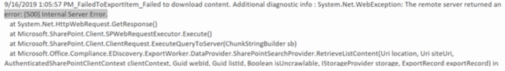

# Investigate, troubleshoot, and resolve common eDiscovery issues

This topic covers basic troubleshooting steps you can take to identify and resolve issues you may encounter during an eDiscovery search or elsewhere in the eDiscovery process. Resolving some of these scenarios requires help from Microsoft Support. Information on when to contact Microsoft Support is included in the resolution steps.

## Error/issue: Ambiguous location

If you try to add user's mailbox location to search and there are duplicate or conflicting objects with the same userID in the Exchange Online Protection (EOP) directory, you receive this error: `The compliance search contains the following invalid location(s):useralias@contoso.com. The location "useralias@contoso.com" is ambiguous`.

### Resolution

Check for duplicate users or distribution list with the same user ID.

1. Connect to [Security & Compliance Center PowerShell](/powershell/exchange/connect-to-scc-powershell).

2. Run the following command to retrieve all instances of the username:

    ```powershell
    Get-Recipient <username>
    ```

   The output for 'useralias@contoso.com' would be similar to the following:

   > 
   > |Name|RecipientType|
   > |---|---|
   > |Alias, User|MailUser|
   > |Alias, User|User|

3. If multiple users are returned, locate and fix the conflicting object.

## Error/issue: Search fails on specific locations

An eDiscovery or content search may yield the following error: `This search completed with (#) errors.  Would you like to retry the search on the failed locations?`


### Resolution

If you receive this error, we recommend that you verify the locations that failed in the search  then rerun the search only on the failed locations.

1. Connect to [Security & Compliance Center PowerShell](/powershell/exchange/connect-to-scc-powershell) and then run the following command:

   ```powershell
   Get-ComplianceSearch <searchname> | FL
   ```

2. From the PowerShell output, view the failed locations in the errors field or from the status details in the error from the search output.

3. Retry the eDiscovery search on the failed locations only.

4. If you continue to receive these errors, see [Retry failed locations](/Office365/SecurityCompliance/retry-failed-content-search) for more troubleshooting steps.

## Error/issue: File not found

When running an eDiscovery search that includes SharePoint Online and One Drive For Business locations, you may receive the error `File Not Found` although the file is located on the site. This error will be in the export warnings and errors.csv or skipped items.csv. This may occur if the file can't be found on the site or if the index is out of date. Here's the text of an actual error (with emphasis added).

> 28.06.2019 10:02:19_FailedToExportItem_Failed to download content. Additional diagnostic info : Microsoft.Office.Compliance.EDiscovery.ExportWorker.Exceptions.ContentDownloadTemporaryFailure: Failed to download from content 6ea52149-91cd-4965-b5bb-82ca6a3ec9be of type Document. Correlation Id: 3bd84722-937b-4c23-b61b-08d6fba9ec32. ServerErrorCode: -2147024894 ---> Microsoft.SharePoint.Client.ServerException: ***File Not Found***. at Microsoft.SharePoint.Client.ClientRequest.ProcessResponseStream(Stream responseStream) at Microsoft.SharePoint.Client.ClientRequest.ProcessResponse()
--- End of inner exception stack trace ---

### Resolution

1. Check location identified in the search to ensure that the location of the file is correct and added in the search locations.

2. Use the procedures at [Manually request crawling and re-indexing of a site, a library, or a list](/sharepoint/crawl-site-content) to reindex the site.

## Error/issue: Search fails because recipient is not found

An eDiscovery search fails with error the `recipient not found`. This error may occur if the user object cannot be found in Exchange Online Protection (EOP) because the object has not synced.

### Resolution

1. Connect to [Exchange Online PowerShell](/powershell/exchange/connect-to-exchange-online-powershell).

2. Run the following command to check if the user is synced to Exchange Online Protection:

   ```powershell
   Get-Recipient <userId> | FL
   ```

3. There should be a mail user object for the user question. If nothing is returned, investigate the user object. Contact Microsoft Support if the object can't be synced.

## Error/issue: Exporting search results is slow

When exporting search results from eDiscovery or Content Search in the Security and Compliance center, the download takes longer than expected.  You can check to see the amount of data to be download and possibly increase the export speed.

### Resolution

1. Connect to [Security & Compliance Center PowerShell](/powershell/exchange/connect-to-scc-powershell) and then run the following command:

   ```powershell
   Get-ComplianceSearch <searchname> | FL
   ```

2. Find the amount of data to be downloaded in the SearchResults and SearchStatistics parameters.

3. Run the following command:

   ```powershell
   Get-ComplianceSearchAction | FL
   ```

4. In the results field, find the data that has been exported and view any errors encountered.

5. Check the trace.log file located in the directory that you exported the content to for any errors.

6. If you still have issues, consider dividing searches that return a large set of results into smaller searches. For example, you can use date ranges in search queries to return a smaller set of results that can be downloaded faster.

## Error/issue: "Internal server error (500) occurred"

When running an eDiscovery search, if the search continually fails with error similar to "Internal server error (500) occurred", you may need rerun the search only on specific mailbox locations.



### Resolution

1. Break the search into smaller searches and run the search again.  Try using a smaller date range or limit the number of locations being searched.

2. Connect to [Security & Compliance Center PowerShell](/powershell/exchange/connect-to-scc-powershell) and then run the following command:

   ```powershell Set-CaseHoldPolicy <policyname> -RetryDistribution
   Get-ComplianceSearch <searchname> | FL
   ```

3. Examine the output for results and errors.

4. Examine the trace.log file. It's located  in the same folder that you exported the search results to.

5. Contact Microsoft Support.

## Error/issue: Holds don't sync

eDiscovery Case Hold Policy Sync Distribution error. The error reads:

> "Resources: It's taking longer than expected to deploy the policy. It might take an additional 2 hours to update the final deployment status, so check back in a couple hours."

### Resolution

1. Connect to [Security & Compliance Center PowerShell](/powershell/exchange/connect-to-scc-powershell) and then run the following command for an eDiscovery case hold:

   ```powershell
   Get-CaseHoldPolicy <policyname> - DistributionDetail | FL
   ```

    For a retention policy, run the following command:

   ```powershell
   Get-RetentionCompliancePolicy <policyname> - DistributionDetail | FL
   ```

2. Examine the value in the DistributionDetail parameter for errors like the following:

   > Error: Resources: It's taking longer than expected to deploy the policy. It might take an additional 2 hours to update the final deployment status, so check back in a couple hours."

3. Try running the RetryDistribution parameter on the policy in question:

   For eDiscovery case holds:

   ```powershell
   Set-CaseHoldPolicy <policyname> -RetryDistribution
   ```

   For retention policies:

   ```powershell
   Set-RetentionCompliancePolicy <policyname> -RetryDistribution
   ```

4. Contact Microsoft Support.

## Error: "The condition specified using HTTP conditional header(s) is not met"

When downloading search results using the eDiscovery Export Tool, it's possible you might receive the following error: `System.Net.WebException: The remote server returned an error: (412) The condition specified using HTTP conditional header(s) is not met.` This is transient error, which typically occurs in the Azure Storage location.

### Resolution

To resolve this issue, retry [downloading the search results](export-search-results.md#step-2-download-the-search-results), which will restart the eDiscovery Export Tool.

## Error/issue: Downloaded export shows no results

After a successful export, the completed download via the export tool shows zero files in the results.

### Resolution

This is a client-side issue and in order to remediate it, please attempt the following steps:

1. Try using another client/machine to download.

2. Remove old searches that are no longer needed using [Remove-ComplianceSearch][/powershell/module/exchange/remove-compliancesearch] cmdlet.

3. Make sure to download to a local drive.

4. Make sure the virus scanner is not running.

5. Make sure that no other export is downloading to the same folder or any parent folder.

6. If the previous steps did not work, disable zipping and de-duplication.

7. If this works then the issue is due to a local virus scanner or a disk issue.
