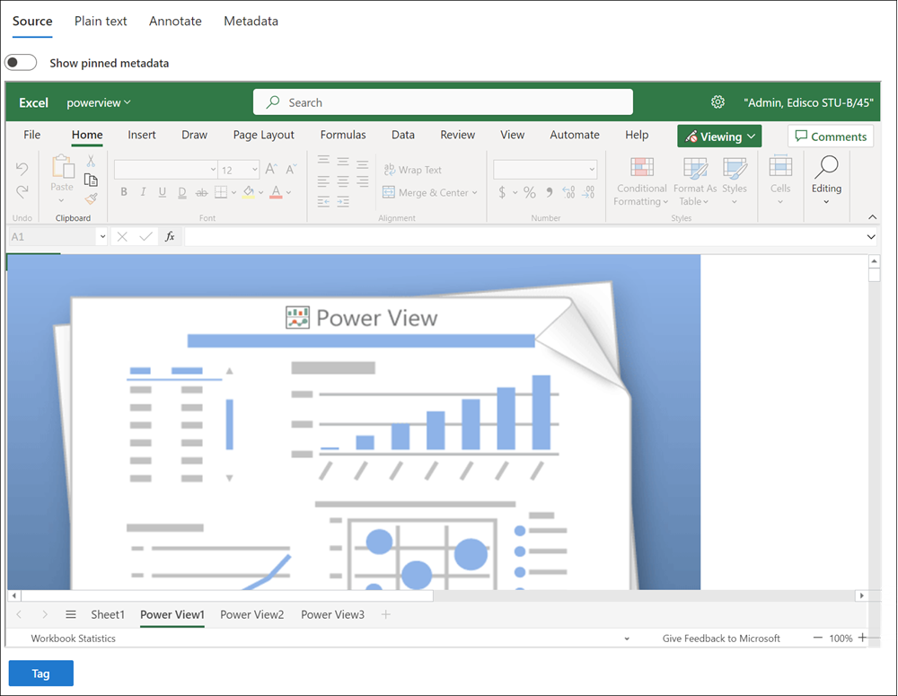
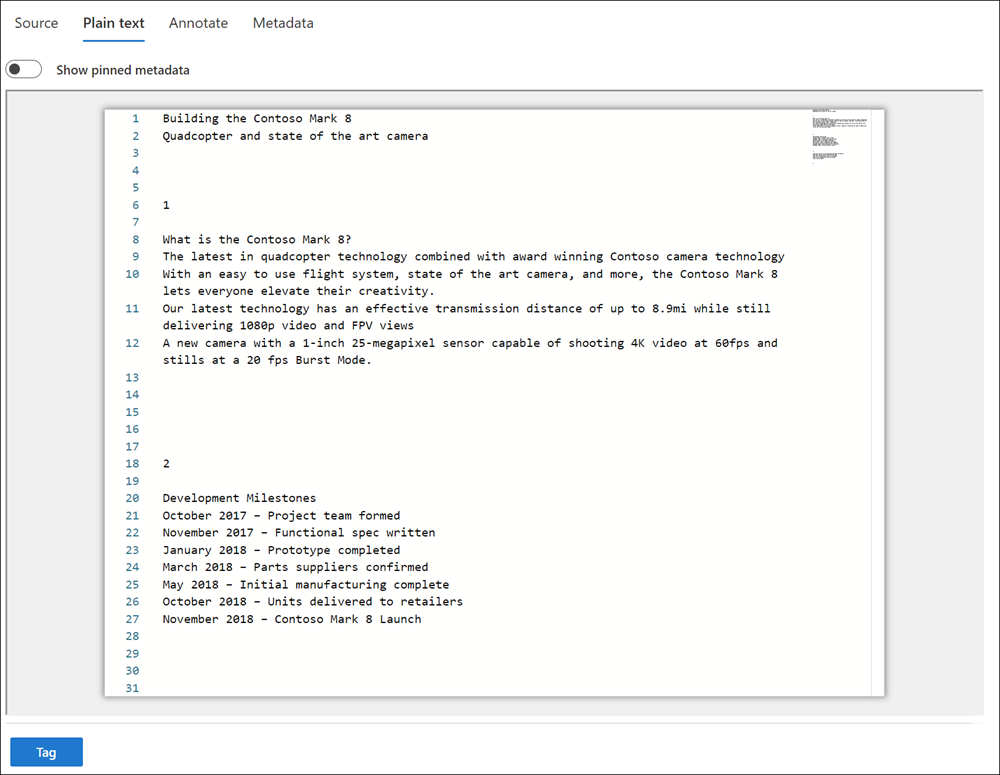
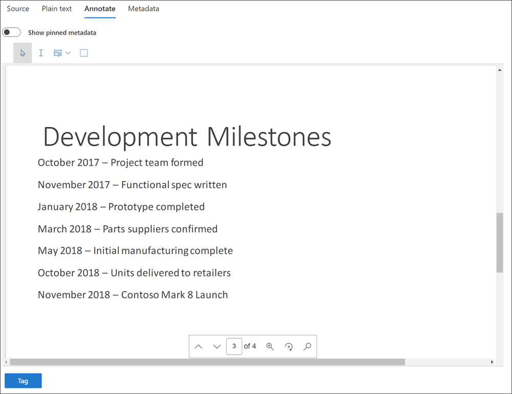
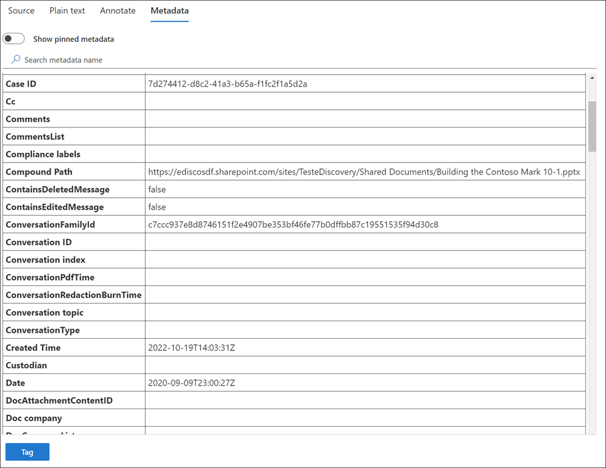

# Group and view documents in a review set in eDiscovery (Premium)

eDiscovery (Premium) review sets display content using different grouping options and include specialized viewers that you can use to examine details about individual items.

[!INCLUDE [purview-preview](../includes/purview-preview.md)]

## Grouping

Use the **Group** control in the command bar of a review set to view review content grouped by the following options:

### Option 1: Group items with Group ID and Thread ID

If you're new to eDiscovery or are an existing eDiscovery customer with a steady stream of new cases, grouping review set items using [Group IDs and Thread IDs](ediscovery-document-metadata-fields.md) is the recommended option. This grouping option makes it easier to find and review related items in a review set by grouping them together in the list view. With the **Enable group** option [enabled in the case settings](ediscovery-configure-review-set-settings.md), you'll see the following grouping options on the **Group** control in the command bar of a review set:

- **Group by families**: All items related to a specific file are grouped together using the same Group ID. For example, if you have a PowerPoint file in the review set that includes imbedded images or .zip files, these images and files are grouped with the PowerPoint file and shown as nested items with the file in the item list view.
- **Group by conversations**: All email messages, Teams conversations, and Yammer conversations are grouped using the same Thread ID and appear as nested items. Additionally, all associated content for these messages and conversations is also grouped together. For example, if you have an email conversation that includes several email messages, some of which include attachments and some that include embedded images, all of the email messages, attachments, and images are grouped together in the review set list view under an applicable item.

>[!NOTE]
> For cases created before March 15, 2023, the **Enable group** toggle is disabled and these grouping options aren't available. Item grouping in review sets for these cases is based on *Family ID* and *Conversation ID* described in Option 2.

### Option 2: Group items with Family ID and Conversation ID

If you're an existing eDiscovery with a large number of existing cases or use existing internal or third-party automation to help process review set items, you may want to continue to group review set items with [Family IDs and Conversation IDs](ediscovery-document-metadata-fields.md). With the **Enable group** option [disabled in the case settings](ediscovery-configure-review-set-settings.md), you'll see the following grouping options on the **Group** control in the command bar of a review set:

- **Group family attachments**: View review set content grouped by family. Each transcript file is displayed on a line in the list of review set items. Attachments are nested under the item.
- **Group Teams or Yammer conversations**: View Teams and Yammer content grouped by conversation. Each conversation is displayed on a line in the list of review set items. Transcript files and attachments are nested under the top-level conversation.

> [!NOTE]
> Cloud attachments are grouped with the conversations they appear in. This grouping is accomplished by assigning the same **FamilyId** as the transcript file of the message the file was attached to and the same **ConversationId** as the conversation the message appeared in. This means multiple copies of cloud attachments may be added to the review set if they were attached to different conversations.

## Source view

The **Source** viewer displays the richest view of a selected document. It supports hundreds of file types and is meant to display the truest to native experience possible. For Microsoft Office files, the viewer uses the web version of Office apps to display content such as document comments, Microsoft Teams chats, Excel formulas, hidden rows/columns, and PowerPoint notes.

## Text view

The **Plain text** viewer provides a view of the extracted text of a selected file. It ignores any embedded images and formatting but is useful if you're trying to understand the content quickly. Text view also includes these features:

- Line counter makes it easier to reference specific portions of a document
- Search hit highlighting that highlights terms within the document and in the scrollbar

## Annotate view

The **Annotate** view provides features that allow users to apply markup on a selected document including:

- **Select annotations**: Select annotations on a document to delete
- **Select text**: Select text on the document to delete
- **Area redactions**: Draw a box on the document to hide sensitive content
- **Pencil**: Free-hand draw in selectable colors on a document in order to bring attention to certain portions of a document
- **Toggle annotation transparency**: Make annotations semi-transparent in order to view the content behind the annotation
- **Previous page**: Navigates to previous page
- **Next page**: Navigates to the next page
- **Go to page**: Enter a specific page number to navigate to
- **Zoom**: Set the zoom level for annotate view
- **Rotate**: Rotate the document clockwise

## Metadata view

The panel in the **Metadata** view can be toggled on/off to display various metadata associated with the selected document. Although the search results grid can be customized to display specific metadata, there are instances where scrolling horizontally can be difficult while reviewing data. The File metadata panel allows a user to toggle on a view within the viewer.

## Viewer and management tools

For selected content, there are additional view and management tools to help you work with documents.

You can select the following actions for selected content:

- **View or update notes**: Opens the **Notes** pane where you can view or add notes to the selected document. You can display the notes for the document in a column in the dashboard list by customizing your displayed columns.
- **Show in a new window**: Displays the selected document in a new browser window/tab.
- **Download PDF**: Downloads the selected document as a .pdf file.
- **Move up**: Selects the previous review set item and displays the item in the viewer.
- **Move down**: Selects the next review set item and displays the item in the viewer.
- **Maximize/Minimize**: Maximizes the viewer pane to full screen and minimizes the viewer pane.
- **Close**: Closes the selected item from the viewers
