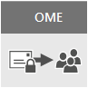
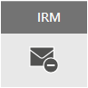
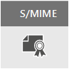

# Email encryption

This article compares encryption options in Microsoft 365 including Office 365 Message Encryption (OME), S/MIME, Information Rights Management (IRM), and introduces Transport Layer Security (TLS).
  
Microsoft 365 delivers multiple encryption options to help you meet your business needs for email security. This article presents three ways to encrypt email in Office 365. If you want to learn more about all security features in Office 365, visit the [Office 365 Trust Center](https://go.microsoft.com/fwlink/p/?LinkID=282470). This article introduces the three types of encryption available for Microsoft 365 administrators to help secure email in Office 365:
  
- Office Message Encryption (OME).

- Secure/Multipurpose Internet Mail Extensions (S/MIME).

- Information Rights Management (IRM).

## How Microsoft 365 uses email encryption

Encryption is the process by which information is encoded so that only an authorized recipient can decode and consume the information. Microsoft 365 uses encryption in two ways: in the service, and as a customer control. In the service, encryption is used in Microsoft 365 by default; you don't have to configure anything. For example, Microsoft 365 uses Transport Layer Security (TLS) to encrypt the connection, or session, between two servers. 
  
Here's how email encryption typically works:
  
- A message is encrypted, or transformed from plain text into unreadable ciphertext, either on the sender's machine, or by a central server while the message is in transit.

- The message remains in ciphertext while it's in transit in order to protect it from being read in case the message is intercepted.

- Once the message is received by the recipient, the message is transformed back into readable plain text in one of two ways:

  - The recipient's machine uses a key to decrypt the message, or

  - A central server decrypts the message on behalf of the recipient, after validating the recipient's identity.

For more information on how Microsoft 365 secures communication between servers, such as between organizations within Microsoft 365 or between Microsoft 365 and a trusted business partner outside of Microsoft 365, see [How Exchange Online uses TLS to secure email connections in Office 365](exchange-online-uses-tls-to-secure-email-connections.md).
    
## Comparing email encryption options available in Office 365

|Email encryption technology||||
|:-----|:-----|:-----|:-----|
|What is it?|Office 365 Message Encryption (OME) is a service built on Azure Rights Management (Azure RMS) that lets you send encrypted email to people inside or outside your organization, regardless of the destination email address (Gmail, Yahoo! Mail, Outlook.com, etc.).   As an admin, you can set up transport rules that define the conditions for encryption. When a user sends a message that matches a rule, encryption is applied automatically.   To view encrypted messages, recipients can either get a one-time passcode, sign in with a Microsoft account, or sign in with a work or school account associated with Office 365. Recipients can also send encrypted replies. They don't need a Microsoft 365 subscription to view encrypted messages or send encrypted replies.|IRM is an encryption solution that also applies usage restrictions to email messages. It helps prevent sensitive information from being printed, forwarded, or copied by unauthorized people.   IRM capabilities in Microsoft 365 use Azure Rights Management (Azure RMS).|S/MIME is a certificate-based encryption solution that allows you to both encrypt and digitally sign a message. The message encryption helps ensure that only the intended recipient can open and read the message. A digital signature helps the recipient validate the identity of the sender.   Both digital signatures and message encryption are made possible through the use of unique digital certificates that contain the keys for verifying digital signatures and encrypting or decrypting messages.   To use S/MIME, you must have public keys on file for each recipient. Recipients have to maintain their own private keys, which must remain secure. If a recipient's private keys are compromised, the recipient needs to get a new private key and redistribute public keys to all potential senders.|
|What does it do?|OME:   Encrypts messages sent to internal or external recipients.    Allows users to send encrypted messages to any email address, including Outlook.com, Yahoo! Mail, and Gmail.    Allows you, as an admin, to customize the email viewing portal to reflect your organization's brand.   Microsoft securely manages and stores the keys, so you don't have to.   No special client side software is needed as long as the encrypted message (sent as an HTML attachment) can be opened in a browser.|IRM:   Uses encryption and usage restrictions to provide online and offline protection for email messages and attachments.   Gives you, as an admin, the ability to set up transport rules or Outlook protection rules to automatically apply IRM to select messages.   Lets users manually apply templates in Outlook or Outlook on the web (formerly known as Outlook Web App).|S/MIME addresses sender authentication with digital signatures, and message confidentiality with encryption.|
|What does it not do?|OME doesn't let you apply usage restrictions to messages. For example, you can't use it to stop a recipient from forwarding or printing an encrypted message.|Some applications may not support IRM emails on all devices. For more information about these and other products that support IRM email, see [Client device capabilities](/azure/information-protection/requirements#BKMK_ClientCapabilities).|S/MIME doesn't allow encrypted messages to be scanned for malware, spam, or policies.|
|Recommendations and example scenarios|We recommend using OME when you want to send sensitive business information to people outside your organization, whether they're consumers or other businesses. For example:     A bank employee sending credit card statements to customers     A doctor's office sending medical records to a patient     An attorney sending confidential legal information to another attorney|We recommend using IRM when you want to apply usage restrictions as well as encryption. For example:     A manager sending confidential details to her team about a new product applies the "Do Not Forward" option.     An executive needs to share a bid proposal with another company, which includes an attachment from a partner who is using Office 365, and require both the email and the attachment to be protected.|We recommend using S/MIME when either your organization or the recipient's organization requires true peer-to-peer encryption.     S/MIME is most commonly used in the following scenarios:     Government agencies communicating with other government agencies     A business communicating with a government agency|
||

## What encryption options are available for my Microsoft 365 subscription?

For information about email encryption options for your Microsoft 365 subscription see the [Exchange Online service description](/office365/servicedescriptions/exchange-online-service-description/exchange-online-service-description). Here, you can find information about the following encryption features:
  
- Azure RMS, including both IRM capabilities and OME

- S/MIME

- TLS

- Encryption of data at rest (through BitLocker)

You can also use third-party encryption tools with Microsoft 365, for example, PGP (Pretty Good Privacy). Microsoft 365 does not support PGP/MIME and you can only use PGP/Inline to send and receive PGP-encrypted emails.

## What about encryption for data at rest?

"Data at rest" refers to data that isn't actively in transit. In Microsoft 365, email data at rest is encrypted using BitLocker Drive Encryption. BitLocker encrypts the hard drives in Microsoft datacenters to provide enhanced protection against unauthorized access. To learn more, see [BitLocker Overview](/previous-versions/windows/it-pro/windows-server-2012-R2-and-2012/hh831713(v=ws.11)).
  
## More information about email encryption options

For more information about the email encryption options in this article as well as TLS, see these articles:
  
**OME**
  
[Office 365 Message Encryption (OME)](ome.md)
  
**IRM**
  
[Information Rights Management in Exchange Online](./information-rights-management-in-exchange-online.md)
  
[What is Azure Rights Management?](/azure/information-protection/what-is-azure-rms)
  
**S/MIME**
  
[S/MIME for message signing and encryption](/Exchange/policy-and-compliance/smime/smime)
  
[Understanding S/MIME](/previous-versions/tn-archive/aa995740(v=exchg.65))
  
[Understanding Public Key Cryptography](/previous-versions/tn-archive/aa998077(v=exchg.65))
  
**TLS**
  
[Configure custom mail flow by using connectors](/exchange/mail-flow-best-practices/use-connectors-to-configure-mail-flow/use-connectors-to-configure-mail-flow)
