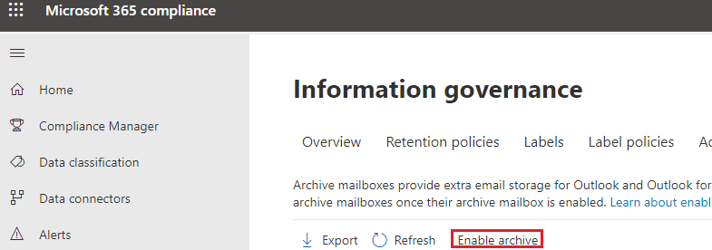

# Enable archive mailboxes in the compliance center

Archiving in Microsoft 365 (also called *In-Place Archiving*) provides users with additional mailbox storage space. After you turn on archive mailboxes, users can access and store messages in their archive mailboxes by using Microsoft Outlook and Outlook on the web (formerly known as Outlook Web App). Users can also move or copy messages between their primary mailbox and their archive mailbox. They can also recover deleted items from the Recoverable Items folder in their archive mailbox by using the Recover Deleted Items tool.

> [!NOTE]
> The auto-expanding archiving feature in Microsoft 365 provides additional storage in archive mailboxes. When auto-expanding  archiving is turned on, and then the initial storage quota in a user's archive mailbox is reached, Microsoft 365 automatically adds additional storage space. This means that users won't run out of mailbox storage space and you won't have to manage anything after you initially enable the archive mailbox and turn on auto-expanding archiving for your organization. For more information, see [Overview of unlimited archiving](unlimited-archiving.md).

## Get the necessary permissions

You have to be assigned the Mail Recipients role in Exchange Online to enable or disable archive mailboxes. By default, this role is assigned to the Recipient Management and Organization Management role groups on the **Permissions** page in the Exchange admin center. If you don't see the **Archive** page in the Security & Compliance Center, ask your administrator to assign you the necessary permissions.

## Enable an archive mailbox

1. Go to <https://protection.office.com>.

2. Sign in using your work or school account.

3. In the left pane of the Security & Compliance Center, click **Information governance** \> **Archive**.

   The **Archive** page is displayed. The **Archive mailbox** column indicates whether an archive mailbox is enabled or disabled for each user.

   > [!NOTE]
   > The **Archive** page shows a maximum of 500 users.

4. In the list of mailboxes, select the user that you want to enable the archive mailbox for.

   

5. In the details pane for the selected user, click **Enable**.

   A warning is displayed saying that if you enable the archive mailbox, items in the user's mailbox that are older than the archiving policy assigned to the mailbox will be moved to the new archive mailbox. The default archive policy that is part of the retention policy assigned to Exchange Online mailboxes moves items to the archive mailbox two years after the date the item was delivered to the mailbox or created by the user. For more information, see the **More info** section in this article.

6. Click **Yes** to enable the archive mailbox.

   It might take a few moments to create the archive mailbox. When it's created, **Archive mailbox: enabled** is displayed in the details pane for the selected user. You might have to click **Refresh**  to update the information in the details pane.

> [!TIP]
> You can also bulk-enable archive mailboxes by selecting multiple users with disabled archive mailboxes (use the Shift or Ctrl keys). After selecting multiple mailboxes, click **Enable** in the details pane.

## Disable an archive mailbox

You can also use the **Archive** page in the Security & Compliance Center to disable a user's archive mailbox. After you disable an archive mailbox, you can reconnect it to the user's primary mailbox within 30 days of disabling it. In this case, the original contents of the archive mailbox are restored. After 30 days, the contents of the original archive mailbox are permanently deleted and can't be recovered. So if you re-enable the archive more than 30 days after disabling it, a new archive mailbox is created.

The default archive policy assigned to users' mailboxes moves items to the archive mailbox two years after the date the item is delivered. If you disable a user's archive mailbox, no action will be taken on mailbox items and they will remain in the user's primary mailbox.

To disable an archive mailbox:

1. Go to <https://protection.office.com>.

2. Sign in using your work or school account.

3. In the left pane of the Security & Compliance Center, click **Information governance** \> **Archive**.

   The **Archive** page is displayed. The **Archive mailbox** column indicates whether an archive mailbox is enabled or disabled for each user.

   > [!NOTE]
   > The **Archive** page shows a maximum of 500 users.

4. In the list of mailboxes, select the user that you want to disable the archive mailbox for.

5. In the details pane, click **Disable**.

   A warning message is displayed saying that you'll have 30 days to re-enable the archive mailbox, and that after 30 days, all information in the archive will be permanently deleted.

6. Click **Yes** to disable the archive mailbox.

   It might take a few moments to disable the archive mailbox. When it's disabled, **Archive mailbox: disabled** is displayed in the details pane for the selected user. You might have to click **Refresh**  to update the information in the details pane.

> [!TIP]
> You can also bulk-disable archive mailboxes by selecting multiple users with enabled archive mailboxes (use the Shift or Ctrl keys). After selecting multiple mailboxes, click **Disable** in the details pane.

## Use Exchange Online PowerShell to enable or disable archive mailboxes

You can also use Exchange Online PowerShell to enable archive mailboxes. The primary reason to use PowerShell is that you can quickly enable the archive mailbox for all users in your organization.

The first step is to connect to Exchange Online PowerShell. For instructions, see [Connect to Exchange Online PowerShell](/powershell/exchange/connect-to-exchange-online-powershell).

After you're connected to Exchange Online, you can run the commands in the following sections to enable or disable archive mailboxes.

### Enable archive mailboxes

Run the following command to enable the archive mailbox for a single user.

```powershell
Enable-Mailbox -Identity <username> -Archive
```

Run the following command to enable the archive mailbox for all users in your organization (whose archive mailbox is currently not enabled).

```powershell
Get-Mailbox -Filter {ArchiveGuid -Eq "00000000-0000-0000-0000-000000000000" -AND RecipientTypeDetails -Eq "UserMailbox"} | Enable-Mailbox -Archive
```

### Disable archive mailboxes

Run the following command to disable the archive mailbox for a single user.

```powershell
Disable-Mailbox -Identity <username> -Archive
```

Run the following command to disable the archive mailbox for all users in your organization (whose archive mailbox is currently enabled).

```powershell
Get-Mailbox -Filter {ArchiveGuid -Ne "00000000-0000-0000-0000-000000000000" -AND RecipientTypeDetails -Eq "UserMailbox"} | Disable-Mailbox -Archive
```

## More information

- When an archive mailbox is enabled, users can store messages in their archive mailbox. Users can access their archive mailboxes by using Microsoft Outlook and Outlook on the web. Using either of these client applications, users can view messages in their archive mailbox and move or copy messages between their primary mailbox and their archive mailbox. Users can also recover deleted items from the Recoverable Items folder in their archive mailbox by using the Recover Deleted Items tool.

  For a list of Outlook licenses that support In-Place Archiving, see [Outlook license requirements for Exchange features](https://support.microsoft.com/office/46b6b7c5-c3ca-43e5-8424-1e2807917c99).

- Archive mailboxes help you and your users to meet your organization's retention, eDiscovery, and hold requirements. For example, you can use your organization's Exchange retention policy to move mailbox content to users' archive mailbox. When you use the Content Search tool in the Security & Compliance Center to search a user's mailbox for specific content, the user's archive mailbox will also be searched. And, when you place a Litigation Hold or apply a retention policy to a user's mailbox, items in the archive mailbox are also retained.

- After archive mailboxes are enabled, your organization can take advantage of the default Exchange retention policy (also called Messaging Records Management or MRM policy) that is automatically assigned to every mailbox. When an archive mailbox is enabled, the default Exchange retention policy automatically does the following:

  - Moves items that are two years or older from a user's primary mailbox to their archive mailbox.

  - Moves items that are 14 days or older from the Recoverable Items folder in the user's primary mailbox to the Recoverable Items folder in their archive mailbox.

- For more information about archive mailboxes and Exchange retention policies, see:

  - [Retention tags and retention policies in Exchange Online](/exchange/security-and-compliance/messaging-records-management/retention-tags-and-policies)

  - [Default Retention Policy in Exchange Online](/exchange/security-and-compliance/messaging-records-management/default-retention-policy)

  - [Set up an archive and deletion policy for mailboxes in your organization](set-up-an-archive-and-deletion-policy-for-mailboxes.md)