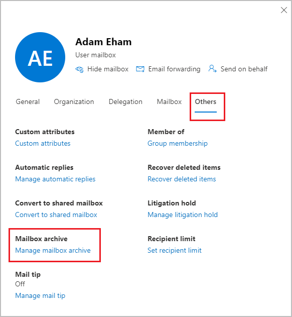
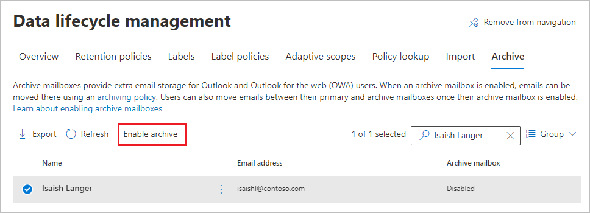
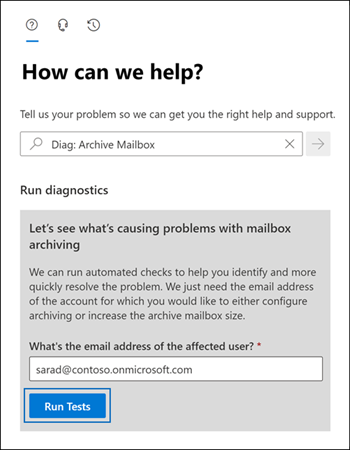

# Enable archive mailboxes for Microsoft 365

>*[Microsoft 365 licensing guidance for security & compliance](/office365/servicedescriptions/microsoft-365-service-descriptions/microsoft-365-tenantlevel-services-licensing-guidance/microsoft-365-security-compliance-licensing-guidance).*

Archiving in Microsoft 365 (also called *In-Place Archiving*) provides users with more mailbox storage space. For more information, see [Learn about archive mailboxes](archive-mailboxes.md).

Use the information in this article to enable or disable an archive mailbox by using an admin portal or by using PowerShell. Also learn how to run an automated diagnostic check on a user's archive mailbox to identify any problems and suggested resolutions.

Currently, you can use either the [Microsoft Purview compliance portal](microsoft-365-compliance-center.md) or the [new Exchange admin center (EAC)](/exchange/exchange-admin-center) to enable or disable archive mailboxes.

## Get the necessary permissions

You must be assigned the Mail Recipients role in Exchange Online to enable or disable archive mailboxes. By default, this role is assigned to the Recipient Management and Organization Management role groups on the **Permissions** page in the <a href="https://go.microsoft.com/fwlink/p/?linkid=2059104" target="_blank">Exchange admin center</a>. 


## How to enable an archive mailbox

Configuration to manage archive mailboxes is moving from the Microsoft 365 Purview compliance portal to the new Exchange admin center.

### Use the new Exchange admin center to enable an archive mailbox

> [!NOTE]
> When you enable the archive mailbox, items in the user's mailbox that are older than the archiving policy assigned to the mailbox will be moved to the new archive mailbox. The default archive policy that is part of the retention policy assigned to Exchange Online mailboxes moves items to the archive mailbox two years after the date the item was delivered to the mailbox or created by the user. For more information, see [Learn about archive mailboxes](archive-mailboxes.md).

1. In the new EAC, navigate to **Recipients** \> **Mailboxes**.

2. In the list of mailboxes, select the user to enable their mailbox for archive.

3. In the flyout pane, select **Others**, and under **Mailbox archive**, select **Manage mailbox archive**: 
    
   

4. On the **Manage mailbox archive** pane, turn on **Mailbox archive**, and then **Save**.

It might take a few moments to create the archive mailbox. When it's created, **Active** is displayed in the **Archive status** column for the selected user, although you might need to refresh the page to see the change of status.

### Use the Purview compliance portal to enable an archive mailbox

1. Go to <a href="https://go.microsoft.com/fwlink/p/?linkid=2077149" target="_blank">Microsoft Purview compliance portal</a> and sign in.

2. In the left pane of the compliance portal, select **Data lifecycle management** > **Microsoft 365** > **Archive**.

   On the **Archive** page, the  **Archive mailbox** column identifies whether an archive mailbox is enabled or disabled for each user.

   > [!NOTE]
   > The **Archive** page shows a maximum of 500 users. Use the search box if you can't immediately see the name of the user you want.

3. In the list of mailboxes, select the user to enable their mailbox for archive, and then select the **Enable archive** option:
    
   
    
   A warning is displayed saying that if you enable the archive mailbox, items in the user's mailbox that are older than the archiving policy assigned to the mailbox will be moved to the new archive mailbox. The default archive policy that is part of the retention policy assigned to Exchange Online mailboxes moves items to the archive mailbox two years after the date the item was delivered to the mailbox or created by the user. For more information, see [Learn about archive mailboxes](archive-mailboxes.md).

5. Select **Enable** to confirm.

   It might take a few moments to create the archive mailbox. When it's created, **Enabled** is displayed in the **Archive mailbox** column for the selected user, although you might need to refresh the page to see the change of status.

## How to disable an archive mailbox

Similarly to how you enable an archive mailbox, you can use the same configuration in the EAC or compliance portal to disable a user's archive mailbox. This time, turn **Mailbox archive** off in the EAC, or select the **Disable archive** option after you select the user in the compliance portal.

After you disable an archive mailbox, you can reconnect it to the user's primary mailbox within 30 days of disabling it. In this case, the original contents of the archive mailbox are restored. After 30 days, the contents of the original archive mailbox are permanently deleted and can't be recovered. So if you re-enable the archive more than 30 days after disabling it, a new archive mailbox is created.

The default archive policy assigned to users' mailboxes moves items to the archive mailbox two years after the date the item is delivered. If you disable a user's archive mailbox, no action will be taken on mailbox items and they'll remain in the user's primary mailbox.

## Use Exchange Online PowerShell to enable or disable archive mailboxes

You can also use Exchange Online PowerShell to enable archive mailboxes. The primary reason to use PowerShell is that you can quickly enable the archive mailbox for all users in your organization.

The first step is to connect to Exchange Online PowerShell. For instructions, see [Connect to Exchange Online PowerShell](/powershell/exchange/connect-to-exchange-online-powershell).

After you're connected to Exchange Online, you can run the commands in the following sections to enable or disable archive mailboxes.

### Enable archive mailboxes

Run the following command to enable the archive mailbox for a single user.

```powershell
Enable-Mailbox -Identity <username> -Archive
```

Run the following command to enable the archive mailbox for all users in your organization (whose archive mailbox is currently not enabled).

```powershell
Get-Mailbox -Filter {ArchiveGuid -Eq "00000000-0000-0000-0000-000000000000" -AND RecipientTypeDetails -Eq "UserMailbox"} | Enable-Mailbox -Archive
```

### Disable archive mailboxes

Run the following command to disable the archive mailbox for a single user.

```powershell
Disable-Mailbox -Identity <username> -Archive
```

Run the following command to disable the archive mailbox for all users in your organization (whose archive mailbox is currently enabled).

```powershell
Get-Mailbox -Filter {ArchiveGuid -Ne "00000000-0000-0000-0000-000000000000" -AND RecipientTypeDetails -Eq "UserMailbox"} | Disable-Mailbox -Archive
```

## Run diagnostics on archive mailboxes

You can run an automated diagnostic check on a user's archive mailbox to identify any problems and suggested resolutions.

To run the diagnostic check, click the button below. 

> [!div class="nextstepaction"]
> [Run Tests: Archive Mailbox](https://aka.ms/PillarArchiveMailbox)



A flyout page opens in the Microsoft 365 admin center. Enter the email address of the mailbox you want to check and click **Run Tests**.

> [!NOTE]
> You must be a Microsoft 365 global admin to use the archive mailbox diagnostic check. Also, this feature isn't available in Microsoft 365 Government clouds, Microsoft 365 operated by 21Vianet, or Microsoft 365 Germany.

## Instructions for end users

Explain to users how their archive mailbox works, and how they can interact with it in Outlook on Windows, macOS, and the web. The most effective documentation will be customized for your organization. But for basic instructions, see [Manage email storage with online archive mailboxes](https://prod.support.services.microsoft.com/en-us/office/manage-email-storage-with-online-archive-mailboxes-1cae7d17-7813-4fe8-8ca2-9a5494e9a721).

## Next steps

Consider enabling [auto-expanding archiving](autoexpanding-archiving.md) for additional storage space. For instructions, see [Enable auto-expanding archiving](enable-autoexpanding-archiving.md).
