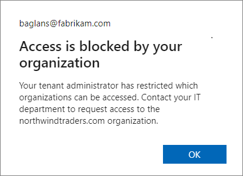
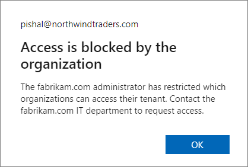

# Azure AD configuration for encrypted content

If you protect sensitive items such as emails and documents by using encryption from the Azure Rights Management Service from [Microsoft Purview Information Protection](information-protection.md), there are some Azure Active Directory (Azure AD) configurations that can prevent authorized access to this encrypted content.

Similarly, if your users receive encrypted email from another organization or collaborate with other organizations that encrypt documents by using the Azure Rights Management Service, your users might not be able to open that email or document because of how their Azure AD is configured.

For example:

- A user can't open encrypted email sent from another organization. Or, a user reports that the recipients in another organization can't open an encrypted email that they sent them.

- Your organization collaborates with another organization on a joint project, and project documents are protected by encrypting them, granting access by using groups in Azure AD. Users can't open the documents encrypted by users in the other organization.

- Users can successfully open an encrypted document when they are in the office, but can't when they try to access this document remotely and they're prompted for multi-factor authentication (MFA).

To ensure access to the encryption service isn't inadvertently blocked, use the following sections to help configure your organization's Azure AD, or relay the information to an Azure AD administrator in another organization. Without access to this service, users can't be authenticated and authorized to open encrypted content.

## Cross-tenant access settings and encrypted content

> [!IMPORTANT]
> Another organization's cross-tenant access settings can be responsible for either their users being unable to open content that your users have encrypted, or your users being unable to open content encrypted by the other organization.
> 
> The message that users see indicates which organization blocked access. You might need to direct the Azure AD admin from another organization to this section.

By default, there's nothing to configure for cross-tenant authentication to work when users protect content by using encryption from the Azure Rights Management Service. However, your organization can restrict access by using Azure AD [External Identities cross-tenant access settings](/azure/active-directory/external-identities/cross-tenant-access-overview). Conversely, another organization can also configure these settings to restrict access with users in your organization. These settings affect opening any encrypted items, which include encrypted emails and encrypted documents.

For example, another organization might have settings configured that prevent their users from opening content encrypted by your organization. In this scenario, until their Azure AD admin reconfigures their cross-tenant settings, an external user attempting to open that content will see a message that informs them **Access is blocked by your organization** with a reference to **Your tenant administrator**.

Example message for the signed in user from the Fabrikam, Inc organization, when their local Azure AD blocks access:



Your users will see a similar message when it's your Azure AD configuration that blocks access.

From the perspective of the signed in user, if it's another Azure AD organization that's responsible for blocking access, the message changes to **Access is blocked by the organization** and displays the domain name of that other organization in the body of the message. For example:



Whenever cross-tenant access settings restrict access by applications, they must be configured to allow access to **Microsoft Azure Information Protection**, which has the following an app ID:

````plaintext
00000012-0000-0000-c000-000000000000
````

If this access isn't allowed, users can't be authenticated and authorized to open encrypted content. This configuration can be set as a default setting and as an organizational setting:

- To permit sharing of encrypted content with another organization, create an inbound setting that allows access to Microsoft Azure Information Protection (ID: 00000012-0000-0000-c000-000000000000). 

- To permit access to encrypted content that users receive from other organizations, create an outbound setting that allows access to Microsoft Azure Information Protection (ID: 00000012-0000-0000-c000-000000000000)

When these settings are configured for Microsoft Azure Information Protection, the application displays **Microsoft Rights Management Services**.

For instructions to configure these cross-tenant access settings, see [Configure cross-tenant access settings for B2B collaboration](/azure/active-directory/external-identities/cross-tenant-access-settings-b2b-collaboration).

If you have also configured Azure AD Conditional Access policies that require multi-factor authentication (MFA) for users, see the following section how to configure Conditional Access for encrypted content.

## Conditional Access policies and encrypted documents

If your organization has implemented [Azure Active Directory Conditional Access policies](/azure/active-directory/conditional-access/overview) that include **Microsoft Azure Information Protection** and the policy extends to external users who need to open documents encrypted by your organization:

- For external users who have an Azure AD account in their own tenant, we recommend you use [External Identities cross-tenant access settings](/azure/active-directory/external-identities/cross-tenant-access-overview) to configure trust settings for MFA claims from one, many, or all external Azure AD organizations.

- For external users not covered by the previous entry, for example, users who don't have an Azure AD account or you haven't configured cross-tenant access settings for trust settings, these external users must have a guest account in your tenant.
    
Without one of these configurations, external users won't be able to open the encrypted content and will see an error message. The message text might inform them that their account needs to be added as an external user in the tenant, with the incorrect instruction for this scenario to **Sign out and sign in again with a different Azure Active Directory user account**.

If you can't meet these configuration requirements for external users who need to open content encrypted by your organization, you must either remove Microsoft Azure Information Protection from the Conditional Access policies, or exclude external users from the policies.

For more information, see the frequently asked question, [I see Azure Information Protection is listed as an available cloud app for conditional access—how does this work?](/azure/information-protection/faqs#i-see-azure-information-protection-is-listed-as-an-available-cloud-app-for-conditional-accesshow-does-this-work)

## Guest accounts for external users to open encrypted documents

You might need guest accounts in your Azure AD tenant for external users to open documents encrypted by your organization. Options to create the guest accounts:

- Create these guest accounts yourself. You can specify any email address that these users already use. For example, their Gmail address.
    
    The advantage of this option is that you can restrict access and rights to specific users by specifying their email address in the encryption settings. The downside is the administration overhead for the account creation and coordination with the label configuration.

- Use [SharePoint and OneDrive integration with Azure AD B2B](/sharepoint/sharepoint-azureb2b-integration) so that guest accounts are automatically created when your users share links.
    
    The advantage of this option is minimum administrative overhead because the accounts are created automatically, and simpler label configuration. For this scenario, you must select the encryption option [Add any authenticated user](encryption-sensitivity-labels.md#requirements-and-limitations-for-add-any-authenticated-users) because you won't know the email addresses in advance. The downside is that this setting doesn't let you restrict access and usage rights to specific users.

External users can also use a Microsoft account to open encrypted documents when they use Windows and Microsoft 365 Apps ([formerly Office 365 apps](/deployoffice/name-change)) or the standalone edition of Office 2019. More recently supported for other platforms, Microsoft accounts are also supported for opening encrypted documents on macOS (Microsoft 365 Apps, version 16.42+), Android (version 16.0.13029+), and iOS (version 2.42+). 

For example, a user in your organization shares an encrypted document with a user outside your organization, and the encryption settings specify a Gmail email address for the external user. This external user can create their own Microsoft account that uses their Gmail email address. Then, after signing in with this account, they can open the document and edit it, according to the usage restrictions specified for them. For a walkthrough example of this scenario, see [Opening and editing the protected document](/azure/information-protection/secure-collaboration-documents#opening-and-editing-the-protected-document).

> [!NOTE]
> The email address for the Microsoft account must match the email address that's specified to restrict access for the encryption settings.

When a user with a Microsoft account opens an encrypted document in this way, it automatically creates a guest account for the tenant if a guest account with the same name doesn't already exist. When the guest account exists, it can then be used to open documents in SharePoint and OneDrive by using Office on the web, in addition to opening encrypted documents from the supported desktop and mobile Office apps.

However, the automatic guest account is not created immediately in this scenario, because of replication latency. If you specify personal email addresses as part of your encryption settings, we recommend that you create corresponding guest accounts in Azure Active Directory. Then let these users know that they must use this account to open an encrypted document from your organization.

> [!TIP]
> Because you can't be sure that external users will be using a supported Office client app, sharing links from SharePoint and OneDrive after creating guest accounts (for specific users) or when you use [SharePoint and OneDrive integration with Azure AD B2B](/sharepoint/sharepoint-azureb2b-integration-preview) (for any authenticated user) is a more reliable method to support secure collaboration with external users.

## Next steps

For addition configurations you might need to make, see [Restrict access to a tenant](/azure/active-directory/manage-apps/tenant-restrictions). Specific to network infrastructure configuration for the Azure Information Protection service, see [Firewalls and network infrastructure](/azure/information-protection/requirements#firewalls-and-network-infrastructure).

If you use [sensitivity labels](sensitivity-labels.md) to encrypt documents and emails, you might be interested in [Support for external users and labeled content](sensitivity-labels-office-apps.md#support-for-external-users-and-labeled-content) to understand which label settings apply across tenants. For configuration guidance for the label encryption settings, see [Restrict access to content by using sensitivity labels to apply encryption](encryption-sensitivity-labels.md).

Interested to learn how and when the encryption service is accessed? See [Walkthrough of how Azure RMS works: First use, content protection, content consumption](/azure/information-protection/how-does-it-work#walkthrough-of-how-azure-rms-works-first-use-content-protection-content-consumption).


