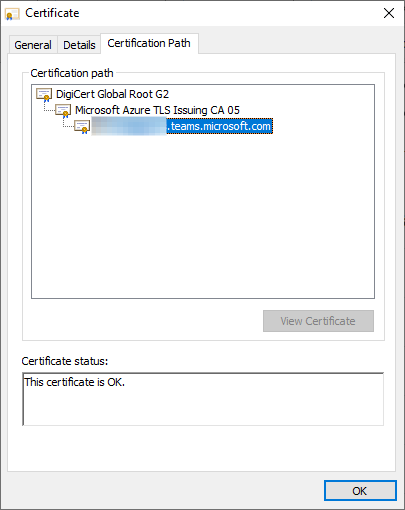

# Office TLS Certificate Changes

Microsoft 365 is updating services powering messaging, meetings, telephony, voice, and video to use TLS certificates from a different set of Root Certificate Authorities (CAs). This change is being made because the current Root CA will expire in May 2025.

Affected products include:
- Microsoft Teams
- Skype
- Skype for Business Online
- Microsoft Dynamics 365
- GroupMe
- Kaizala
- Azure Communication Services

Affected endpoints include (but are not limited to):
- *.teams.microsoft.com
- *.skype.com
- *.skypeforbusiness.com
- *.groupme.com
- *.communication.azure.com
- *.operatorconnect.microsoft.com

Additionally, Teams and Skype for Business Online endpoints in US Government national cloud instances of Microsoft 365 will make the same change, affecting endpoints such as:
- *.gcc.teams.microsoft.com
- *.dod.teams.microsoft.us
- *.gov.teams.microsoft.us
- *.online.dod.skypeforbusiness.us
- *.online.gov.skypeforbusiness.us
- *.um-dod.office365.us
- *.um.office365.us

This change will not affect certificates, domains, or services used in the China or Germany national cloud instances of Microsoft 365.

All certificate information in this article was previously provided in [Microsoft 365 encryption chains](./encryption-office-365-certificate-chains.md) no later than October 2020.

## When will this change happen?

Services began transitioning to the new Root CAs in January 2022 and will continue through October 2022.

## What is changing?

Today, most of the TLS certificates used by Microsoft 365 services chain up to the following Root CA:

| Common Name of the CA | Thumbprint (SHA1) |
|--|--|
| [Baltimore CyberTrust Root](https://cacerts.digicert.com/BaltimoreCyberTrustRoot.crt) | d4de20d05e66fc53fe1a50882c78db2852cae474 |

with one of the following Intermediate CAs:

| Common Name of the CA | Thumbprint (SHA1) |
|--|--|
| [Microsoft RSA TLS CA 01](https://www.microsoft.com/pki/mscorp/Microsoft%20RSA%20TLS%20CA%2001.crt) | 703d7a8f0ebf55aaa59f98eaf4a206004eb2516a |
| [Microsoft RSA TLS CA 02](https://www.microsoft.com/pki/mscorp/Microsoft%20RSA%20TLS%20CA%2002.crt) | b0c2d2d13cdd56cdaa6ab6e2c04440be4a429c75 |

New TLS certificates used by Microsoft 365 services will now chain up to one of the following Root CAs:

| Common Name of the CA | Thumbprint (SHA1) |
|--|--|
| [DigiCert Global Root G2](https://cacerts.digicert.com/DigiCertGlobalRootG2.crt) | df3c24f9bfd666761b268073fe06d1cc8d4f82a4 |
| [Microsoft RSA Root Certificate Authority 2017](https://www.microsoft.com/pkiops/certs/Microsoft%20RSA%20Root%20Certificate%20Authority%202017.crt) | 73a5e64a3bff8316ff0edccc618a906e4eae4d74 | 
| [Microsoft ECC Root Certificate Authority 2017](https://www.microsoft.com/pkiops/certs/Microsoft%20ECC%20Root%20Certificate%20Authority%202017.crt) | 999a64c37ff47d9fab95f14769891460eec4c3c5 |

with one of the following Intermediate CAs:

| Common Name of the CA | Thumbprint (SHA1) |
|--|--|
| [Microsoft Azure TLS Issuing CA 01](https://www.microsoft.com/pkiops/certs/Microsoft%20Azure%20TLS%20Issuing%20CA%2001%20-%20xsign.crt) | 2f2877c5d778c31e0f29c7e371df5471bd673173 |
| [Microsoft Azure TLS Issuing CA 02](https://www.microsoft.com/pkiops/certs/Microsoft%20Azure%20TLS%20Issuing%20CA%2002%20-%20xsign.crt) | e7eea674ca718e3befd90858e09f8372ad0ae2aa |
| [Microsoft Azure TLS Issuing CA 05](https://www.microsoft.com/pkiops/certs/Microsoft%20Azure%20TLS%20Issuing%20CA%2005%20-%20xsign.crt) | 6c3af02e7f269aa73afd0eff2a88a4a1f04ed1e5 |
| [Microsoft Azure TLS Issuing CA 06](https://www.microsoft.com/pkiops/certs/Microsoft%20Azure%20TLS%20Issuing%20CA%2006%20-%20xsign.crt) | 30e01761ab97e59a06b41ef20af6f2de7ef4f7b0 |

As an example, this is a valid certificate with one of the new certificate chains:



## Will this change affect me?

The Root CA "DigiCert Global Root G2" is widely trusted by operating systems including Windows, macOS, Android, and iOS and by browsers such as Microsoft Edge, Chrome, Safari, and Firefox. We expect that **most Microsoft 365 customers will not be impacted**. 

However, **your application may be impacted if it explicitly specifies a list of acceptable CAs**. This practice is known as "certificate pinning". Customers who do not have the new Root CAs in their list of acceptable CAs will receive certificate validation errors, which may impact the availability or function of your application.

Here are some ways to detect if your application may be impacted:

- Search your source code for the thumbprint, Common Name, or other properties of any of the Intermediate CAs found [here](https://www.microsoft.com/pki/mscorp/cps/default.htm). If there is a match, then your application will be impacted. To resolve this problem, update the source code to add the properties of the new CAs. As a best practice, ensure that CAs can be added or edited on short notice. Industry regulations require CA certificates to be replaced within seven days in some circumstances, so applications that implement certificate pinning must react to these changes swiftly.

- .NET exposes the `System.Net.ServicePointManager.ServerCertificateValidationCallback` and the `System.Net.HttpWebRequest.ServerCertificateValidationCallback` callback functions, which allow developers to use custom logic to determine if certificates are valid rather than relying on the standard Windows certificate store. A developer can add logic that checks for a specific Common Name or thumbprint or only allows a specific Root CA such as "Baltimore CyberTrust Root". If your application uses these callback functions, you should make sure that it accepts both the old and new Root and Intermediate CAs.

- Native applications may be using `WINHTTP_CALLBACK_STATUS_SENDING_REQUEST`, which allows native applications to implement custom certificate validation logic. Usage of this notification is rare and requires a significant amount of custom code to implement. Similar to the above, ensure that your application accepts both the old and new Root and Intermediate CAs. 

- If you use an application that integrates with Microsoft Teams, Skype, Skype for Business Online, or Microsoft Dynamics APIs and you are unsure if it uses certificate pinning, check with the application vendor.

- Different operating systems and language runtimes that communicate with Azure services may require other steps to correctly build and validate the new certificate chains:
   - **Linux**: Many distributions require you to add CAs to `/etc/ssl/certs`. For specific instructions, refer to the distribution's documentation.
   - **Java**: Ensure that the Java key store contains the CAs listed above.
   - **Windows running in disconnected environments**: Systems running in disconnected environments will need to have the new Root CAs added to their `Trusted Root Certification Authorities` store and the new Intermediate CAs added to their `Intermediate Certification Authorities` store.
   - **Android**: Check the documentation for your device and version of Android.
   - **IoT or embedded devices**: Embedded devices such as TV set top boxes often ship with a limited set of root authority certificates and have no easy way to update the certificate store. If you write code for, or manage deployments of, custom embedded or IoT devices, make sure the devices trust the new Root CAs. You may need to contact the device manufacturer.

- If you have an environment where firewall rules allow outbound calls only to specific endpoints, allow the following Certificate Revocation List (CRL) or Online Certificate Status Protocol (OCSP) URLs:
   - `http://crl3.digicert.com`
   - `http://crl4.digicert.com`
   - `http://ocsp.digicert.com`
   - `http://crl.microsoft.com`
   - `http://oneocsp.microsoft.com`
   - `http://ocsp.msocsp.com`
   - `http://www.microsoft.com/pkiops`

- If you are impacted by this change, you may see error messages dependent on the type of environment you are running in and scenario you are impacted by. Check Windows Application event logs, CAPI2 event logs, and custom application logs for messages that look like:
   ```output
   An operation failed because the following certificate has validation errors:
   
   Subject Name: CN=teams.microsoft.com
   Issuer Name: CN=Microsoft Azure TLS Issuing CA 01, O=Microsoft Corporation, C=US
   
   Errors:
   
   The root of the certificate chain is not a trusted root authority.
   ```

- If you use a Session Border Controller, Microsoft has prepared a testing endpoint that can be used to verify that SBC appliances trust certificates issued from the new Root CA. This endpoint should be used only for SIP OPTIONS ping messages and not for voice traffic.
   ```
   Global FQDN: sip.mspki.pstnhub.microsoft.com 
   Port: 5061
   ```
   If this does not operate normally, please contact your device manufacturer to determine if updates are available to support the new Root CA. 

## When can I retire the old CA information?

The current Root CA, Intermediate CA, and leaf certificates will not be revoked. The existing CA Common Names and/or thumbprints will be required through at least October 2023 based on the lifetime of existing certificates.

## Known Issues

Under very rare circumstances, enterprise users may see certificate validation errors where the Root CA "DigiCert Global Root G2" appears as revoked. This is due to a known Windows bug under both of the following conditions:

- The Root CA is in the [CurrentUser\Root certificate store](/windows/win32/seccrypto/system-store-locations#cert_system_store_current_user) and is missing the `NotBeforeFileTime` and `NotBeforeEKU` properties
- The Root CA is in the [LocalMachine\AuthRoot certificate store](/windows/win32/seccrypto/system-store-locations#cert_system_store_local_machine) but has both the `NotBeforeFileTime` and `NotBeforeEKU` properties
- The Root CA is NOT in the [LocalMachine\Root certificate store](/windows/win32/seccrypto/system-store-locations#cert_system_store_local_machine)

All leaf certificates issued from this Root CA after the `NotBeforeFileTime` will appear revoked. 

Administrators can identify and troubleshoot the issue by inspecting the CAPI2 Log for this error:

```text
Log Name:      Microsoft-Windows-CAPI2/Operational
Source:        Microsoft-Windows-CAPI2
Date:          6/23/2022 8:36:39 AM
Event ID:      11
Task Category: Build Chain
Level:         Error
[...]
        <ChainElement>
          <Certificate fileRef="DF3C24F9BFD666761B268073FE06D1CC8D4F82A4.cer" subjectName="DigiCert Global Root G2" />
          [...]
          <TrustStatus>
            <ErrorStatus value="4000024" CERT_TRUST_IS_REVOKED="true" CERT_TRUST_IS_UNTRUSTED_ROOT="true" CERT_TRUST_IS_EXPLICIT_DISTRUST="true" />
            <InfoStatus value="10C" CERT_TRUST_HAS_NAME_MATCH_ISSUER="true" CERT_TRUST_IS_SELF_SIGNED="true" CERT_TRUST_HAS_PREFERRED_ISSUER="true" />
          </TrustStatus>
          [...]
          <RevocationInfo freshnessTime="PT0S">
            <RevocationResult value="80092010">The certificate is revoked.</RevocationResult>
          </RevocationInfo>
        </ChainElement>
      </CertificateChain>
      <EventAuxInfo ProcessName="Teams.exe" />
      <Result value="80092010">The certificate is revoked.</Result>
```
Note the presence of the `CERT_TRUST_IS_EXPLICIT_DISTRUST="true"` element. 

You can confirm that two copies of the Root CA with different `NotBeforeFileTime` properties are present by running the following `certutil` commands and comparing the output:

```
certutil -store -v authroot DF3C24F9BFD666761B268073FE06D1CC8D4F82A4
certutil -user -store -v root DF3C24F9BFD666761B268073FE06D1CC8D4F82A4
```

A user can resolve the issue by deleting the copy of the Root CA in the `CurrentUser\Root` certificate store by doing:
```
certutil -user -delstore root DF3C24F9BFD666761B268073FE06D1CC8D4F82A4
```
or 
```
reg delete HKCU\SOFTWARE\Microsoft\SystemCertificates\Root\Certificates\DF3C24F9BFD666761B268073FE06D1CC8D4F82A4 /f
```
The first approach creates a Windows dialog that a user must click through while the second approach does not. 
