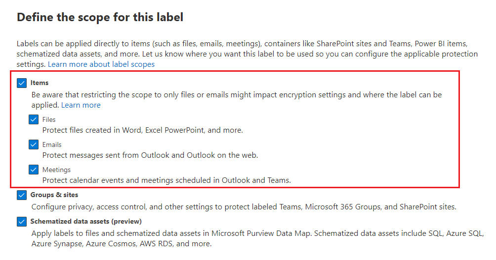
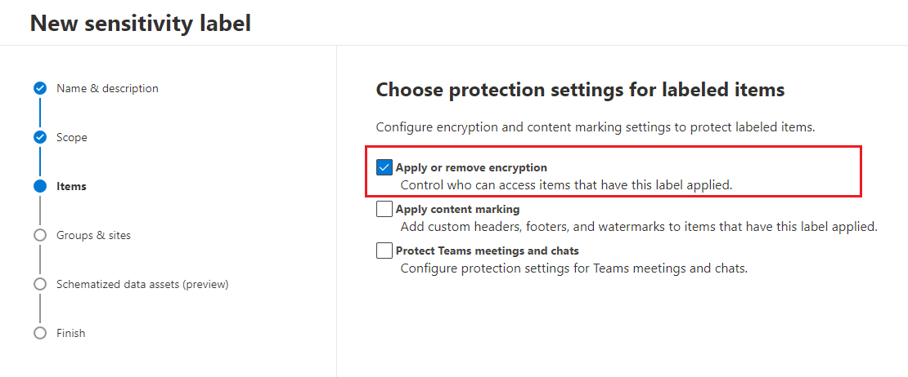
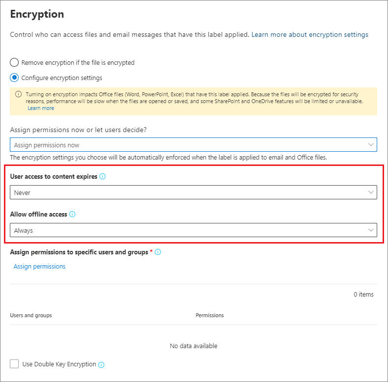
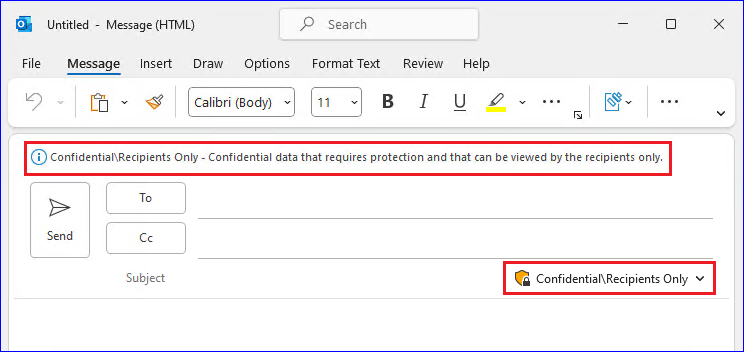

# Restrict access to content by using sensitivity labels to apply encryption

>*[Microsoft 365 licensing guidance for security & compliance](/office365/servicedescriptions/microsoft-365-service-descriptions/microsoft-365-tenantlevel-services-licensing-guidance/microsoft-365-security-compliance-licensing-guidance).*

When you create a sensitivity label, you can restrict access to content that the label will be applied to. For example, with the encryption settings for a sensitivity label, you can protect content so that:

- Only users within your organization can open a confidential document or email.
- Only users in the marketing department can edit and print the promotion announcement document or email, while all other users in your organization can only read it.
- Users cannot forward an email or copy information from it that contains news about an internal reorganization.
- The current price list that is sent to business partners cannot be opened after a specified date.

When a document or email is encrypted, access to the content is restricted, so that it:

- Can be decrypted only by users authorized by the label's encryption settings.
- Remains encrypted no matter where it resides, inside or outside your organization, even if the file's renamed.
- Is encrypted both at rest (for example, in a OneDrive account) and in transit (for example, email as it traverses the internet).

Finally, as an admin, when you configure a sensitivity label to apply encryption, you can choose either to:

- **Assign permissions now**, so that you determine exactly which users get which permissions to content with that label.
- **Let users assign permissions** when they apply the label to content. This way, you can allow people in your organization some flexibility that they might need to collaborate and get their work done.

The encryption settings are available when you [create a sensitivity label](create-sensitivity-labels.md) in the Microsoft 365 compliance center. You can also use the older portal, the Security & Compliance Center.

## Understand how the encryption works

Encryption uses the Azure Rights Management service (Azure RMS) from Azure Information Protection. This protection solution uses encryption, identity, and authorization policies. To learn more, see [What is Azure Rights Management?](/azure/information-protection/what-is-azure-rms) from the Azure Information Protection documentation. 

When you use this encryption solution, the **super user** feature ensures that authorized people and services can always read and inspect the data that has been encrypted for your organization. If necessary, the encryption can then be removed or changed. For more information, see [Configuring super users for Azure Information Protection and discovery services or data recovery](/azure/information-protection/configure-super-users).

## How to configure a label for encryption

1. Follow the general instructions to [create or edit a sensitivity label](create-sensitivity-labels.md#create-and-configure-sensitivity-labels) and make sure **Files & emails** is selected for the label's scope: 
    
    

2. Then, on the **Choose protection settings for files and emails** page, make sure you select **Encrypt files and emails**
    
    

4.  On the **Encryption** page of the wizard, select one of the following options:
    
    - **Remove encryption if the file is encrypted**: This option is supported by the Azure Information Protection unified labeling client only. When you select this option and use built-in labeling, the label might not display in apps, or display and not make any encryption changes.
        
        For more information about this scenario, see the [What happens to existing encryption when a label's applied](#what-happens-to-existing-encryption-when-a-labels-applied) section. It's important to understand that this setting can result in a sensitivity label that users might not be able to apply when they don't have sufficient permissions.
    
    - **Configure encryption settings**: Turns on encryption and makes the encryption settings visible:
        
        
        
        Instructions for these settings are in the following [Configure encryption settings](#configure-encryption-settings) section.

### What happens to existing encryption when a label's applied

If a sensitivity label is applied to unencrypted content, the outcome of the encryption options you can select is self-explanatory. For example, if you didn't select **Encrypt files and emails**, the content remains unencrypted.

However, the content might be already encrypted. For example, another user might have applied:

- Their own permissions, which include user-defined permissions when prompted by a label, custom permissions by the Azure Information Protection client, and the **Restricted Access** document protection from within an Office app.
- An Azure Rights Management protection template that encrypts the content independently from a label. This category includes mail flow rules that apply encryption by using rights protection.
- A label that applies encryption with permissions assigned by the administrator.

The following table identifies what happens to existing encryption when a sensitivity label is applied to that content:

| | Encryption: Not selected | Encryption: Configured | Encryption: Remove \* |
|:-----|:-----|:-----|:-----|
|**Permissions specified by a user**|Original encryption is preserved|New label encryption is applied|Original encryption is removed|
|**Protection template**|Original encryption is preserved|New label encryption is applied|Original encryption is removed|
|**Label with administator-defined permissions**|Original encryption is removed|New label encryption is applied|Original encryption is removed|

**Footnote:**

\*
Supported by the Azure Information Protection unified labeling client only

In the cases where the new label encryption is applied or the original encryption is removed, this happens only if the user applying the label has a usage right or role that supports this action:

- The [usage right](/azure/information-protection/configure-usage-rights#usage-rights-and-descriptions) Export or Full Control.
- The role of [Rights Management issuer or Rights Management owner](/azure/information-protection/configure-usage-rights#rights-management-issuer-and-rights-management-owner), or [super user](/azure/information-protection/configure-super-users).

If the user doesn't have one of these rights or roles, the label can't be applied and so the original encryption is preserved. The user sees the following message: **You don't have permission to make this change to the sensitivity label. Please contact the content owner.**

For example, the person who applies Do Not Forward to an email message can relabel the thread to replace the encryption or remove it, because they are the Rights Management owner for the email. But with the exception of super users, recipients of this email can't relabel it because they don't have the required usage rights.

#### Email attachments for encrypted email messages

When an email message is encrypted by any method, any unencrypted Office documents that are attached to the email automatically inherit the same encryption settings.

Documents that are already encrypted and then added as attachments always preserve their original encryption.

## Configure encryption settings

When you select **Configure encryption settings** on the **Encryption** page of the wizard to create or edit a sensitivity label, choose one of the following options:

- **Assign permissions now**, so that you can determine exactly which users get which permissions to content that has the label applied. For more information, see the next section [Assign permissions now](#assign-permissions-now).
- **Let users assign permissions** when your users apply the label to content. With this option, you can allow people in your organization some flexibility that they might need to collaborate and get their work done. For more information, see the [Let users assign permissions](#let-users-assign-permissions) section on this page.

For example, if you have a sensitivity label named **Highly Confidential** that will be applied to your most sensitive content, you might want to decide now who gets what type of permissions to that content.

Alternatively, if you have a sensitivity label named **Business Contracts**, and your organization's workflow requires that your people collaborate on this content with different people on an ad hoc basis, you might want to allow your users to decide who gets permissions when they assign the label. This flexibility both helps your users' productivity and reduces the requests for your admins to update or create new sensitivity labels to address specific scenarios.

Choosing whether to assign permissions now or let users assign permissions:

## Assign permissions now

Use the following options to control who can access email or documents to which this label is applied. You can:

- **Allow access to labeled content to expire**, either on a specific date or after a specific number of days after the label is applied. After this time, users won't be able to open the labeled item. If you specify a date, it is effective midnight on that date in your current time zone. (Note that some email clients might not enforce expiration and show emails past their expiration date, due to their caching mechanisms.)

- **Allow offline access** never, always, or for a specific number of days after the label is applied. If you restrict offline access to never or a number of days, when that threshold is reached, users must be reauthenticated and their access is logged. For more information, see the next section on the Rights Management use license.

Settings for access control for encrypted content:

### Rights Management use license for offline access

When a user opens a document or email that's been protected by encryption from the Azure Rights Management service, an Azure Rights Management use license for that content is granted to the user. This use license is a certificate that contains the user's usage rights for the document or email, and the encryption key that was used to encrypt the content. The use license also contains an expiration date if this has been set, and how long the use license is valid.

If no expiration date has been set, the default use license validity period for a tenant is 30 days. For the duration of the use license, the user is not reauthenticated or reauthorized for the content. This process lets the user continue to open the protected document or email without an internet connection. When the use license validity period expires, the next time the user accesses the protected document or email, the user must be reauthenticated and reauthorized.

In addition to reauthentication, the encryption settings and user group membership is reevaluated. This means that users could experience different access results for the same document or email if there are changes in the encryption settings or group membership from when they last accessed the content.

To learn how to change the default 30-day setting, see [Rights Management use license](/azure/information-protection/configure-usage-rights#rights-management-use-license).

### Assign permissions to specific users or groups

You can grant permissions to specific people so that only they can interact with the labeled content:

1. First, add users or groups that will be assigned permissions to the labeled content.

2. Then, choose which permissions those users should have for the labeled content.

Assigning permissions:

#### Add users or groups

When you assign permissions, you can choose:

- Everyone in your organization (all tenant members). This setting excludes guest accounts.

- Any authenticated users. Make sure you understand the [requirements and limitations](#requirements-and-limitations-for-add-any-authenticated-users) of this setting before selecting it.

- Any specific user or email-enabled security group, distribution group, or Microsoft 365 group ([formerly Office 365 group](https://techcommunity.microsoft.com/t5/microsoft-365-blog/office-365-groups-will-become-microsoft-365-groups/ba-p/1303601)) in Azure AD. The Microsoft 365 group can have static or [dynamic membership](/azure/active-directory/users-groups-roles/groups-create-rule). Note that you can't use a [dynamic distribution group from Exchange](/Exchange/recipients/dynamic-distribution-groups/dynamic-distribution-groups) because this group type isn't synchronized to Azure AD, and you can't use a security group that isn't email-enabled.

- Any email address or domain. Use this option to specify all users in another organization who uses Azure AD, by entering any domain name from that organization. You can also use this option for social providers, by entering their domain name such as **gmail.com**, **hotmail.com**, or **outlook.com**.

    > [!NOTE]
    > If you specify a domain from an organization that uses Azure AD, you can't restrict access to that specific domain. Instead, all verified domains in Azure AD are automatically included for the tenant that owns the domain name you specify.

When you choose all users and groups in your organization or browse the directory, the users or groups must have an email address.

As a best practice, use groups rather than users. This strategy keeps your configuration simpler.

##### Requirements and limitations for "Add any authenticated users"

This setting doesn't restrict who can access the content that the label encrypts, while still encrypting the content and providing you with options to restrict how the content can be used (permissions), and accessed (expiry and offline access). However, the application opening the encrypted content must be able to support the authentication being used. For this reason, federated social providers such as Google, and onetime passcode authentication work for email only, and only when you use Exchange Online. Microsoft accounts can be used with Office 365 apps and the [Azure Information Protection viewer](https://portal.azurerms.com/#/download).

> [!NOTE]
> Consider using this setting with [SharePoint and OneDrive integration with Azure AD B2B](/sharepoint/sharepoint-azureb2b-integration-preview) when sensitivity labels are [enabled for Office files in SharePoint and OneDrive](sensitivity-labels-sharepoint-onedrive-files.md).

Some typical scenarios for any authenticated users setting:

- You don't mind who views the content, but you want to restrict how it is used. For example, you don't want the content to be edited, copied, or printed.
- You don't need to restrict who accesses the content, but you want to be able to confirm who opens it.
- You have a requirement that the content must be encrypted at rest and in transit, but it doesn't require access controls.

#### Choose permissions

When you choose which permissions to allow for those users or groups, you can select either:

- A [predefined permissions level](/azure/information-protection/configure-usage-rights#rights-included-in-permissions-levels) with a preset group of rights, such as Co-Author or Reviewer.
- Custom permissions, where you choose one or more usage rights.

For more information to help you select the appropriate permissions, see [Usage rights and descriptions](/azure/information-protection/configure-usage-rights#usage-rights-and-descriptions).  

Note that the same label can grant different permissions to different users. For example, a single label can assign some users as Reviewer and a different user as Co-author, as shown in the following screenshot.

To do this, add users or groups, assign them permissions, and save those settings. Then repeat these steps, adding users and assigning them permissions, saving the settings each time. You can repeat this configuration as often as necessary, to define different permissions for different users.

#### Rights Management issuer (user applying the sensitivity label) always has Full Control

Encryption for a sensitivity label uses the Azure Rights Management service from Azure Information Protection. When a user applies a sensitivity label to protect a document or email by using encryption, that user becomes the Rights Management issuer for that content.

The Rights Management issuer is always granted Full Control permissions for the document or email, and in addition:

- If the encryption settings include an expiration date, the Rights Management issuer can still open and edit the document or email after that date.
- The Rights Management issuer can always access the document or email offline.
- The Rights Management issuer can still open a document after it is revoked.

For more information, see [Rights Management issuer and Rights Management owner](/azure/information-protection/configure-usage-rights#rights-management-issuer-and-rights-management-owner).

### Double Key Encryption

> [!NOTE]
> This feature is currently supported only by the Azure Information Protection unified labeling client.

Select this option only after you have configured the Double Key Encryption service and you need to use this double key encryption for files that will have this label applied.

For more information, prerequisites, and configuration instructions, see [Double Key Encryption (DKE)](double-key-encryption.md).

## Let users assign permissions

> [!IMPORTANT]
> Not all labeling clients support all the options that let users assign their own permissions. Use this section to learn more.

You can use the following options to let users assign permissions when they manually apply a sensitivity label to content:

- In Outlook, a user can select restrictions equivalent to the [Do Not Forward](/azure/information-protection/configure-usage-rights#do-not-forward-option-for-emails) option or [Encrypt-only](/azure/information-protection/configure-usage-rights#encrypt-only-option-for-emails) for their chosen recipients.
    
    The Do Not Forward option is supported by all email clients that support sensitivity labels. However, applying the **Encrypt-Only** option with a sensitivity label is a recent release that's supported only by built-in labeling and not the Azure Information Protection unified labeling client. For email clients that don't support this capability, the label won't be visible.
    
    To check the minimum versions of Outlook apps that use built-in labeling to support applying the Encrypt-Only option with a sensitivity label, use the [capabilities table for Outlook](sensitivity-labels-office-apps.md#sensitivity-label-capabilities-in-outlook) and the row **Let users assign permissions: - Encrypt-Only**.

- In Word, PowerPoint, and Excel, a user is prompted to select their own permissions for specific users, groups, or organizations.

    This option is supported by the Azure Information Protection unified labeling client and by some apps that use built-in labeling. For apps that don't support this capability, the label either won't be visible for users, or the label is visible for consistency but it can't be applied with an explanation message to users.
    
    To check which apps that use built-in labeling support this option, use the [capabilities table for Word, Excel, and PowerPoint](sensitivity-labels-office-apps.md#sensitivity-label-capabilities-in-word-excel-and-powerpoint) and the row **Let users assign permissions: - Prompt users**.

When the options are supported, use the following table to identify when users see the sensitivity label:

|Setting |Label visible in Outlook|Label visible in Word, Excel, PowerPoint|
|:-----|:-----|:-----|:-----|
|**In Outlook, enforce restrictions with the Do Not Forward or Encrypt-Only option**|Yes |No |
|**In Word, PowerPoint, and Excel, prompt users to specify permissions**|No |Yes|

When both settings are selected, the label is therefore visible in both Outlook and in Word, Excel, and PowerPoint.

A sensitivity label that lets users assign permissions must be applied to content manually by users; it can't be auto-applied or used as a recommended label.

Configuring the user-assigned permissions:

### Outlook restrictions

In Outlook, when a user applies a sensitivity label that lets them assign permissions to a message, you can choose the **Do Not Forward option** or **Encrypt-Only**. The user will see the label name and description at the top of the message, which indicates the content's being protected. Unlike Word, PowerPoint, and Excel (see the [next section](#word-powerpoint-and-excel-permissions)), users aren't prompted to select specific permissions.

When either of these options are applied to an email, the email is encrypted and recipients must be authenticated. Then, the recipients automatically have restricted usage rights:

- **Do Not Forward**: Recipients cannot forward the email, print it, or copy from it. For example, in the Outlook client, the Forward button is not available, the Save As and Print menu options are not available, and you cannot add or change recipients in the To, Cc, or Bcc boxes.
    
    For more information about how this option works, see [Do Not Forward option for emails](/azure/information-protection/configure-usage-rights#do-not-forward-option-for-emails).

- **Encrypt-Only**: Recipients have all usage rights except Save As, Export and Full Control. This combination of usage rights means that the recipients have no restrictions except that they cannot remove the protection. For example, a recipient can copy from the email, print it, and forward it.
    
    For more information about how this option works, see [Encrypt-only option for emails](/azure/information-protection/configure-usage-rights#encrypt-only-option-for-emails).

Unencrypted Office documents that are attached to the email automatically inherit the same restrictions. For Do Not Forward, the usage rights applied to these documents are Edit Content, Edit; Save; View, Open, Read; and Allow Macros. If the user wants different usage rights for an attachment, or the attachment is not an Office document that supports this inherited protection, the user needs to encrypt the file before attaching it to the email.

### Word, PowerPoint, and Excel permissions

In Word, PowerPoint, and Excel, when a user applies a sensitivity label that lets them assign permissions to a document, they are prompted to specify their choice of users and permissions when the encryption is applied.

For example, with the Azure Information Protection unified labeling client, users can:

- Select a permission level, such as Viewer (which assigns View Only permission) or Co-Author (which assigns View, Edit, Copy, and Print permissions).
- Select users, groups, or organizations. This can include people both inside or outside your organizations.
- Set an expiration date, after which the selected users cannot access the content. For more information, see the above section [Rights Management use license for offline access](#rights-management-use-license-for-offline-access).

For built-in labeling, users see the same dialog box if they select the following:

- Windows: **File** tab > **Info** > **Protect Document** > **Restrict Access** > **Restricted Access**

- macOS: **Review** tab > **Protection** > **Permissions** > **Restricted Access**

## Example configurations for the encryption settings

For each example that follows, do the configuration from the **Encryption** page of the wizard when **Configure encryption settings** is selected:

### Example 1: Label that applies Do Not Forward to send an encrypted email to a Gmail account

This label displays only in Outlook and Outlook on the web, and you must use Exchange Online. Instruct users to select this label when they need to send an encrypted email to people using a Gmail account (or any other email account outside your organization).

Your users type the Gmail email address in the **To** box.  Then, they select the label and the Do Not Forward option is automatically added to the email. The result is that recipients cannot forward the email, or print it, copy from it, or save the email outside their mailbox by using the **Save As** option.

1. On the **Encryption** page: For **Assign permissions now or let users decide?** select **Let users assign permissions when they apply the label**.

2. Select the checkbox: **In Outlook, enforce restrictions equivalent to the Do Not Forward option**.

3. If selected, clear the checkbox: **In Word, PowerPoint, and Excel, prompt users to specify permissions**.

4. Select **Next** and complete the wizard.

### Example 2: Label that restricts read-only permission to all users in another organization

This label is suitable for sharing very sensitive documents as read-only, and the documents always require an internet connection to view them.

This label is not suitable for emails.

1. On the **Encryption** page: For **Assign permissions now or let users decide?** select **Assign permissions now**.

2. For **Allow offline access**, select **Never**.

3. Select **Assign permissions**.

4. On the **Assign permissions** pane, select **Add specific email addresses or domains**.

5. In the text box, enter the name of a domain from the other organization, for example, **fabrikam.com**. Then select **Add**.

6. Select **Choose permissions**.

7. On the **Choose permissions** pane, select the dropdown box, select **Viewer**, and then select **Save**.

8. Back on the **Assign Permissions** pane, select **Save**.

9. On the **Encryption** page, select **Next** and complete the wizard.

### Example 3: Add external users to an existing label that encrypts content

The new users that you add will be able open documents and emails that have already been protected with this label. The permissions that you grant these users can be different from the permissions that the existing users have.

1. On the **Encryption** page: For **Assign permissions now or let users decide?** make sure **Assign permissions now** is selected.

2. Select **Assign permissions**.

3. On the **Assign permissions** pane, select **Add specific email addresses or domains**.

4. In the text box, enter the email address of the first user (or group) to add, and then select **Add**.

5. Select **Choose permissions**.

6. On the **Choose permissions** pane, select the permissions for this user (or group), and then select **Save**.

7. Back on the **Assign Permissions** pane, repeat steps 3 through 6 for each user (or group) that you want to add to this label. Then click **Save**.

8. On the **Encryption** page, select **Next** and complete the wizard.

### Example 4: Label that encrypts content but doesn't restrict who can access it

This configuration has the advantage that you don't need to specify users, groups, or domains to encrypt an email or document. The content will still be encrypted and you can still specify usage rights, an expiry date, and offline access.

Use this configuration only when you do not need to restrict who can open the protected document or email. [More information about this setting](#requirements-and-limitations-for-add-any-authenticated-users)

1. On the **Encryption** page: For **Assign permissions now or let users decide?** make sure **Assign permissions now** is selected.

2. Configure settings for **User access to content expires** and **Allow offline access** as required.

3. Select **Assign permissions**.

4. On the **Assign permissions** pane, select **Add any authenticated users**.

    For **Users and groups**, you see **Authenticated users** automatically added. You can't change this value, only delete it, which cancels the **Add any authenticated users** selection.

5. Select **Choose permissions**.

6. On the **Choose permissions** pane, select the dropdown box, select the permissions you want, and then select **Save**.

7. Back on the **Assign Permissions** pane, select **Save**.

8. On the **Encryption** page, select **Next** and complete the wizard.

## Considerations for encrypted content

Encrypting your most sensitive documents and emails helps to ensure that only authorized people can access this data. However, there are some considerations to take into account:

- If your organization hasn't [enabled sensitivity labels for Office files in SharePoint and OneDrive](sensitivity-labels-sharepoint-onedrive-files.md):

  - Search, eDiscovery, and Delve will not work for encrypted files.
  - DLP policies work for the metadata of these encrypted files (including retention label information) but not the content of these files (such as credit card numbers within files).
  - Users can't open encrypted files using Office on the web. When sensitivity labels for Office files in SharePoint and OneDrive are enabled, users can use Office on the web to open encrypted files, with some [limitations](sensitivity-labels-sharepoint-onedrive-files.md#limitations) that include encryption that has been applied with an on-premises key (known as "hold your own key", or HYOK), [double key encryption](#double-key-encryption), and encryption that has been applied independently from a sensitivity label.

- If you share encrypted documents with people outside your organization, you might need to create guest accounts and modify Conditional Access policies. For more information, see [Sharing encrypted documents with external users](sensitivity-labels-office-apps.md#support-for-external-users-and-labeled-content).

- For multiple users to edit an encrypted file at the same time, they must all be using Office for the web. If this isn't the case, and the file is already open:

  - In Office apps (Windows, Mac, Android, and iOS), users see a **File In Use** message with the name of the person who has checked out the file. They can then view a read-only copy or save and edit a copy of the file, and receive notification when the file is available.
  - In Office for the web, users see an error message that they can't edit the document with other people. They can then select **Open in Reading View**.

- The [AutoSave](https://support.office.com/article/what-is-autosave-6d6bd723-ebfd-4e40-b5f6-ae6e8088f7a5) functionality in Office apps (Windows, Mac, Android, and iOS) is disabled for encrypted files. Users see a message that the file has restricted permissions that must be removed before AutoSave can be turned on.

- Encrypted files might take longer to open in Office apps (Windows, Mac, Android, and iOS).

- If a label that applies encryption is added by using an Office app when the document is [checked out in SharePoint](https://support.microsoft.com/office/check-out-check-in-or-discard-changes-to-files-in-a-library-7e2c12a9-a874-4393-9511-1378a700f6de), and the user then discards the checkout, the document remains labeled and encrypted.

- The following actions for encrypted files aren't supported from Office apps (Windows, Mac, Android, and iOS), and users see an error message that something went wrong. However, SharePoint functionality can be used as an alternative:

  - View, restore, and save copies of previous versions. As an alternative, users can do these actions using Office on the web when you [enable and configure versioning for a list or library](https://support.office.com/article/enable-and-configure-versioning-for-a-list-or-library-1555d642-23ee-446a-990a-bcab618c7a37).
  - Change the name or location of files. As an alternative, users can [rename a file, folder, or link in a document library](https://support.microsoft.com/office/rename-a-file-folder-or-link-in-a-document-library-bc493c1a-921f-4bc1-a7f6-985ce11bb185) in SharePoint.

For the best collaboration experience for files that are encrypted by a sensitivity label, we recommend you use [sensitivity labels for Office files in SharePoint and OneDrive](sensitivity-labels-sharepoint-onedrive-files.md) and Office for the web.

## Important prerequisites

Before you can use encryption, you might need to do some configuration tasks.

- Activate protection from Azure Information Protection
    
    For sensitivity labels to apply encryption, the protection service (Azure Rights Management) from Azure Information Protection must be activated for your tenant. In newer tenants, this is the default setting, but you might need to manually activate the service. For more information, see [Activating the protection service from Azure Information Protection](/azure/information-protection/activate-service).

- Check for network requirements
    
    You might need to make some changes on your network devices such as firewalls. For details, see [Firewalls and network infrastructure](/azure/information-protection/requirements#firewalls-and-network-infrastructure) from the Azure Information Protection documentation.

- Configure Exchange for Azure Information Protection
    
    Exchange does not have to be configured for Azure Information Protection before users can apply labels in Outlook to encrypt their emails. However, until Exchange is configured for Azure Information Protection, you do not get the full functionality of using Azure Rights Management protection with Exchange.
    
    For example, users cannot view encrypted emails on mobile phones or with Outlook on the web, encrypted emails cannot be indexed for search, and you cannot configure Exchange Online DLP for Rights Management protection. 
    
    To ensure that Exchange can support these additional scenarios, see the following:
    
    - For Exchange Online, see the instructions for [Exchange Online: IRM Configuration](/azure/information-protection/configure-office365#exchangeonline-irm-configuration).
    - For Exchange on-premises, you must deploy the [RMS connector and configure your Exchange servers](/azure/information-protection/deploy-rms-connector). 

## Next steps

Need to share your labeled and encrypted documents with people outside your organization?  See [Sharing encrypted documents with external users](sensitivity-labels-office-apps.md#sharing-encrypted-documents-with-external-users).