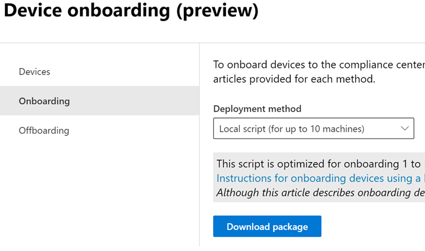

# Get started with Endpoint data loss prevention

Endpoint data loss prevention (Endpoint DLP) is part of the Microsoft Purview Data Loss Prevention (DLP) suite of features you can use to discover and protect sensitive items across Microsoft 365 services. For more information about all of Microsoft’s DLP offerings, see [Learn about data loss prevention](dlp-learn-about-dlp.md). To learn more about Endpoint DLP, see [Learn about Endpoint data loss prevention](endpoint-dlp-learn-about.md)

Microsoft Endpoint DLP allows you to monitor [onboarded Windows 10, and Windows 11](device-onboarding-overview.md) and [onboarded macOS devices](device-onboarding-macos-overview.md) running Catalina 10.15 and higher. Once a device is onboarded, DLP will detect when sensitive items are used and shared. This gives you the visibility and control you need to ensure that they are used and protected properly, and to help prevent risky behavior that might compromise them.

## Before you begin

### SKU/subscriptions licensing

Before you get started with Endpoint DLP, you should confirm your [Microsoft 365 subscription](https://www.microsoft.com/microsoft-365/compare-microsoft-365-enterprise-plans?rtc=1) and any add-ons. To access and use Endpoint DLP functionality, you must have one of these subscriptions or add-ons.

- Microsoft 365 E5
- Microsoft 365 A5 (EDU)
- Microsoft 365 E5 compliance
- Microsoft 365 A5 compliance
- Microsoft 365 E5 information protection and governance
- Microsoft 365 A5 information protection and governance

for full licensing details, see [Microsoft 365 licensing guidance for information protection](/office365/servicedescriptions/microsoft-365-service-descriptions/microsoft-365-tenantlevel-services-licensing-guidance/microsoft-365-security-compliance-licensing-guidance#information-protection-data-loss-prevention-for-exchange-online-sharepoint-online-and-onedrive-for-business)

### Configure proxy on the Windows 10 or Windows 11 device

If you are onboarding Windows 10 or Windows 11 devices, check to make sure that the device can communicate with the cloud DLP service. For more information see, [Configure device proxy and internet connection settings for Information Protection](device-onboarding-configure-proxy.md#configure-device-proxy-and-internet-connection-settings-for-information-protection).

## Windows 10 and Windows 11 Onboarding procedures

For a general introduction to onboarding Windows devices, see:

- [Onboard Windows 10 and Windows 11 devices into Microsoft Purview overview](device-onboarding-overview.md#onboard-windows-10-and-windows-11-devices-into-microsoft-365-overview)

For specific guidance to onboarding Windows devices, see:

Topic | Description
:---|:---
[Onboard Windows 10 or 11 devices using Group Policy](device-onboarding-gp.md) | Use Group Policy to deploy the configuration package on devices.
[Onboard Windows 10 or 11 devices using Microsoft Endpoint Configuration Manager](device-onboarding-sccm.md) | You can use either use Microsoft Endpoint Configuration Manager (current branch) version 1606 or Microsoft Endpoint Configuration Manager (current branch) version 1602 or earlier to deploy the configuration package on devices.
[Onboard Windows 10 or 11 devices using Microsoft Intune](device-onboarding-mdm.md) | Use Microsoft Intune to deploy the configuration package on device.
[Onboard Windows 10 or 11 devices using a local script](device-onboarding-script.md) | Learn how to use the local script to deploy the configuration package on endpoints.
[Onboard non-persistent virtual desktop infrastructure (VDI) devices](device-onboarding-vdi.md) | Learn how to use the configuration package to configure VDI devices.

## macOS onboarding procedures

For a general introduction to onboarding macOS devices, see:
 
- [Onboard macOS devices into Microsoft Purview](device-onboarding-macos-overview.md)

For specific guidance to onboarding macOS devices, see:

Topic | Description
:---|:---
|[Intune](device-onboarding-offboarding-macos-intune.md)|For macOS devices that are managed through Intune
|[Intune for Microsoft Defender for Endpoint customers](device-onboarding-offboarding-macos-intune-mde.md) |For macOS devices that are managed through Intune and that have Microsoft Defender for Endpoint (MDE) deployed to them
|[JAMF Pro)](device-onboarding-offboarding-macos-jamfpro.md) | For macOS devices that are managed through JAMF Pro
|[JAMF Pro for Microsoft Defender for Endpoint customers)](device-onboarding-offboarding-macos-jamfpro-mde.md)|For macOS devices that are managed through JAMF Pro and that have Microsoft Defender for Endpoint (MDE) deployed to them

Once a device is onboarded, it should be visible in the devices list and also start reporting audit activity to Activity explorer.

<!--### Permissions

To enable device management, the account you use must be a member of any one of these roles:

- Global admin
- Security admin
- Compliance admin

If you want to use a custom account to view the device management settings, it must be in one of these roles:

- Global admin
- Compliance admin
- Compliance data admin
- Global reader

If you want to use a custom account to access the onboarding/offboarding page, it must be in one of these roles:

- Global admin
- Compliance admin

If you want to use a custom account to turn on/off device monitoring, it must be in one of these roles:

- Global admin
- Compliance admin

Data from Endpoint DLP can be viewed in [Activity explorer](data-classification-activity-explorer.md). There are four roles that grant permission to activity explorer, the account you use for accessing the data must be a member of any one of them.

- Global admin
- Compliance admin
- Security admin
- Compliance data admin -->

<!-- ### Prepare your Windows 10/11 endpoints

Make sure that the Windows devices that you plan on deploying Endpoint DLP to meet these requirements.

1. Must be running Windows 10 x64 build 1809, Windows 11, or later.

1. Antimalware Client Version is 4.18.2009.7 or newer. Check your current version by opening Windows Security app, select the Settings icon, and then select About. The version number is listed under Antimalware Client Version. Update to the latest Antimalware Client Version by installing Windows Update KB4052623.

   > [!NOTE]
   > None of Windows Security components need to be active, you can run Endpoint DLP independent of Windows Security status, but the [Real-time protection and Behavior monitor](/windows/security/threat-protection/microsoft-defender-antivirus/configure-real-time-protection-microsoft-defender-antivirus)) must be enabled.

1. The following Updates are installed on Windows 10 devices

   > [!NOTE]
   > These updates are not a pre-requisite to onboard a device to Endpoint DLP, but contain fixes for important issues thus must be installed before using the product.

   - For Windows 10 1809 - KB4559003, KB4577069, KB4580390
   - For Windows 10 1903 or 1909 - KB4559004, KB4577062, KB4580386
   - For Windows 10 2004 - KB4568831, KB4577063
   - For devices running Office 2016 (and not any other Office version) - KB4577063

1. All devices must be one of these:

   - [Azure Active Directory (Azure AD) joined](/azure/active-directory/devices/concept-azure-ad-join)
   - [Hybrid Azure AD joined](/azure/active-directory/devices/concept-azure-ad-join-hybrid)
   - [AAD registered](/azure/active-directory/user-help/user-help-register-device-on-network)

1. Install Microsoft Chromium Edge browser on the endpoint device to enforce policy actions for the upload to cloud activity. See, [Download the new Microsoft Edge based on Chromium](https://support.microsoft.com/help/4501095/download-the-new-microsoft-edge-based-on-chromium). If your devices use the Chrome browser, you can install the [Microsoft Compliance Extension](dlp-chrome-learn-about.md#learn-about-the-microsoft-compliance-extension) to enforce policy actions for the upload to cloud activity.

1. If you are on Monthly Enterprise Channel of Microsoft 365 Apps versions 2004-2008, there is a known issue with Endpoint DLP classifying Office content and you need to update to version 2009 or later. See [Update history for Microsoft 365 Apps (listed by date)](/officeupdates/update-history-microsoft365-apps-by-date) for current versions. To learn more about this issue, see the Office Suite section of [Release notes for Current Channel releases in 2020](/officeupdates/current-channel#version-2010-october-27).

1. If you have endpoints that use a device proxy to connect to the internet, follow the procedures in [Configure device proxy and internet connection settings for Information Protection](device-onboarding-configure-proxy.md#configure-device-proxy-and-internet-connection-settings-for-information-protection).

## Prepare your macOS devices (preview)

See, [Onboard macOS devices into Microsoft 365 overview (preview)](device-onboarding-macos-overview.md#onboard-macos-devices-into-microsoft-365-overview-preview)-->

<!--## Onboarding Windows 10 and Windows 11 devices into device management

You must enable device monitoring and onboard your endpoints before you can monitor and protect sensitive items on a device. Both of these actions are done in the Microsoft Purview compliance portal.

When you want to onboard devices that haven't been onboarded yet, you'll download the appropriate script and deploy it to those devices. Follow the [Onboarding devices procedure](endpoint-dlp-getting-started.md#onboarding-devices).

If you already have devices onboarded into [Microsoft Defender for Endpoint](/windows/security/threat-protection/), they will already appear in the managed devices list. Follow the [With devices onboarded into Microsoft Defender for Endpoint procedure](?source=docs&view=o365-worldwide#with-devices-onboarded-into-microsoft-defender-for-endpoint).

### Onboarding devices

In this deployment scenario, you'll onboard devices that have not been onboarded yet, and you just want to monitor and protect sensitive items from unintentional sharing on Windows 10 or Windows 11 devices.

1. Open the <a href="https://go.microsoft.com/fwlink/p/?linkid=2077149" target="_blank">Microsoft Purview compliance portal</a>.

2. Choose **Settings** > **Device onboarding**.

   > [!NOTE]
   > While it usually takes about 60 seconds for device onboarding to be enabled, please allow up to 30 minutes before engaging with Microsoft support.

3. Choose **Devices** to open the **Devices** list. The list will be empty until you onboard devices.

4. Choose **Onboarding** to begin the onboarding process.

5. Choose the way you want to deploy to these additional devices from the **Deployment method** list and then **download package**.

   > [!div class="mx-imgBorder"]
   > 

6. Follow the appropriate procedures in [Onboarding tools and methods for Windows machines](/windows/security/threat-protection/microsoft-defender-atp/configure-endpoints). This link takes you to a landing page where you can access Microsoft Defender for Endpoint procedures that match the deployment package you selected in step 5:

    - Onboard Windows machines using Group Policy
    - Onboard Windows machines using Microsoft Endpoint Configuration Manager
    - Onboard Windows machines using Mobile Device Management tools
    - Onboard Windows machines using a local script
    - Onboard non-persistent virtual desktop infrastructure (VDI) machines in single-session scenarios

Once done and endpoint is onboarded, it should be visible in the devices list and also start reporting audit activity logs to Activity explorer.

> [!NOTE]
> This experience is under license enforcement. Without the required license, data will not be visible or accessible.

### With devices onboarded into Microsoft Defender for Endpoint

In this scenario, Microsoft Defender for Endpoint is already deployed and there are endpoints reporting in. All these endpoints will appear in the managed devices list. You can continue to onboard new devices into Endpoint DLP to expand coverage by using the [Onboarding devices procedure](endpoint-dlp-getting-started.md#onboarding-devices).

1. Open the <a href="https://go.microsoft.com/fwlink/p/?linkid=2077149" target="_blank">Microsoft Purview compliance portal</a>.

2. Open the Compliance Center settings page and choose **Enable device monitoring**.

3. Choose **Device management** to open the **Devices** list. You should see the list of devices that are already reporting in to Microsoft Defender for Endpoint.

   > [!div class="mx-imgBorder"]
   > 

4. Choose **Onboarding** if you need to onboard additional devices.

5. Choose the way you want to deploy to these additional devices from the **Deployment method** list and then **Download package**.

6. Follow the appropriate procedures in [Onboarding tools and methods for Windows machines](/windows/security/threat-protection/microsoft-defender-atp/configure-endpoints). This link takes you to a landing page where you can access Microsoft Defender for Endpoint procedures that match the deployment package you selected in step 5:
    - Onboard Windows machines using Group Policy
    - Onboard Windows machines using Microsoft Endpoint Configuration Manager
    - Onboard Windows machines using Mobile Device Management tools
    - Onboard Windows machines using a local script
    - Onboard non-persistent virtual desktop infrastructure (VDI) machines.

Once done and endpoint is onboarded, it should be visible under the **Devices** table and also start reporting audit logs to the **Activity Explorer**.

> [!NOTE]
>This experience is under license enforcement. Without the required license, data will not be visible or accessible.

### Viewing Endpoint DLP alerts in DLP Alerts Management dashboard

1. Open the Data loss prevention page in the <a href="https://go.microsoft.com/fwlink/p/?linkid=2077149" target="_blank">Microsoft Purview compliance portal</a> and choose Alerts.

2. Refer to the procedures in [How to configure and view alerts for your DLP policies](dlp-configure-view-alerts-policies.md) to view alerts for your Endpoint DLP policies.

### Viewing Endpoint DLP data in activity explorer

1. Open the [Data classification page](https://compliance.microsoft.com/dataclassification?viewid=overview) for your domain in the Microsoft Purview compliance portal and choose Activity explorer.

2. Refer to the procedures in [Get started with Activity explorer](data-classification-activity-explorer.md) to access and filter all the data for your Endpoint devices.

   > [!div class="mx-imgBorder"]
   > 

## Next steps

Now that you have onboarded devices and can view the activity data in Activity explorer, you are ready to move on to your next step where you create DLP policies that protect your sensitive items.

- [Using Endpoint data loss prevention](endpoint-dlp-using.md)

## See also

- [Learn about Endpoint data loss prevention](endpoint-dlp-learn-about.md)
- [Using Endpoint data loss prevention](endpoint-dlp-using.md)
- [Learn about data loss prevention](dlp-learn-about-dlp.md)
- [Create, test, and tune a DLP policy](create-test-tune-dlp-policy.md)
- [Get started with Activity explorer](data-classification-activity-explorer.md)
- [Microsoft Defender for Endpoint](/windows/security/threat-protection/)
- [Onboarding tools and methods for Windows machines](/windows/security/threat-protection/microsoft-defender-atp/configure-endpoints)
- [Microsoft 365 subscription](https://www.microsoft.com/microsoft-365/compare-microsoft-365-enterprise-plans?rtc=1)
- [Azure AD joined devices](/azure/active-directory/devices/concept-azure-ad-join)
- [Download the new Microsoft Edge based on Chromium](https://support.microsoft.com/help/4501095/download-the-new-microsoft-edge-based-on-chromium)
-->
