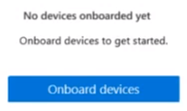
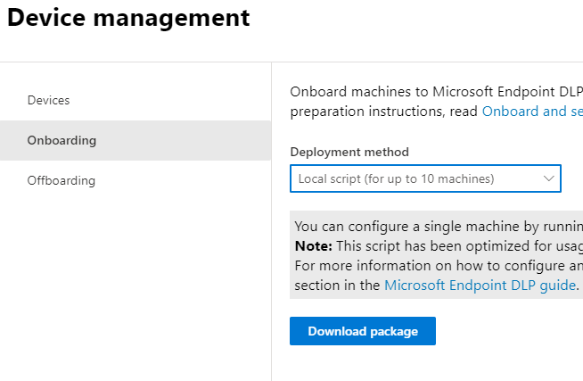
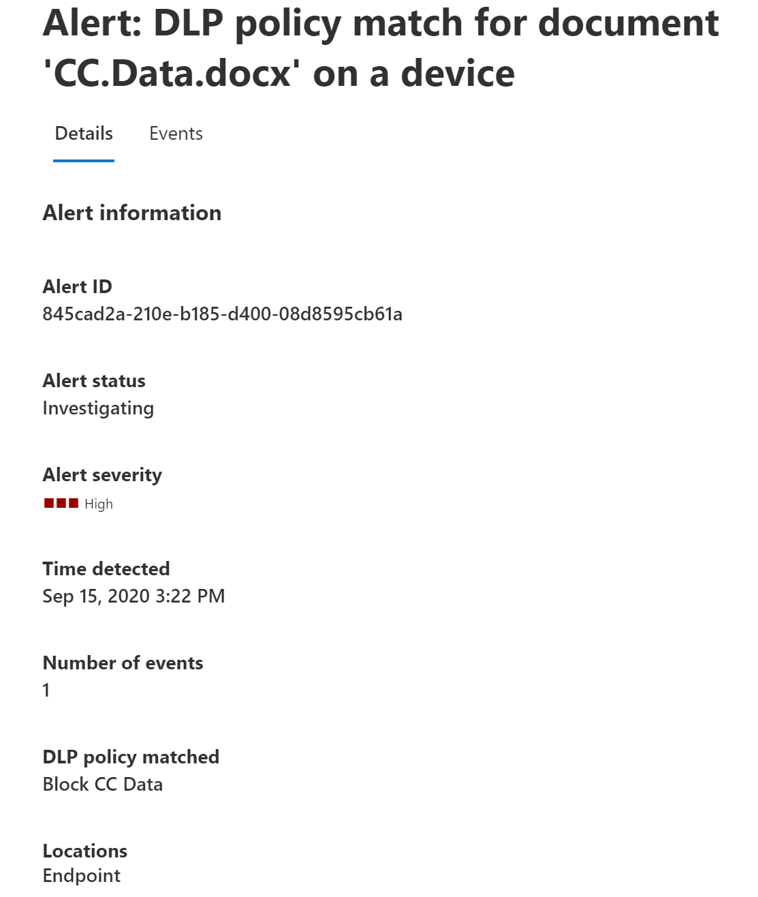
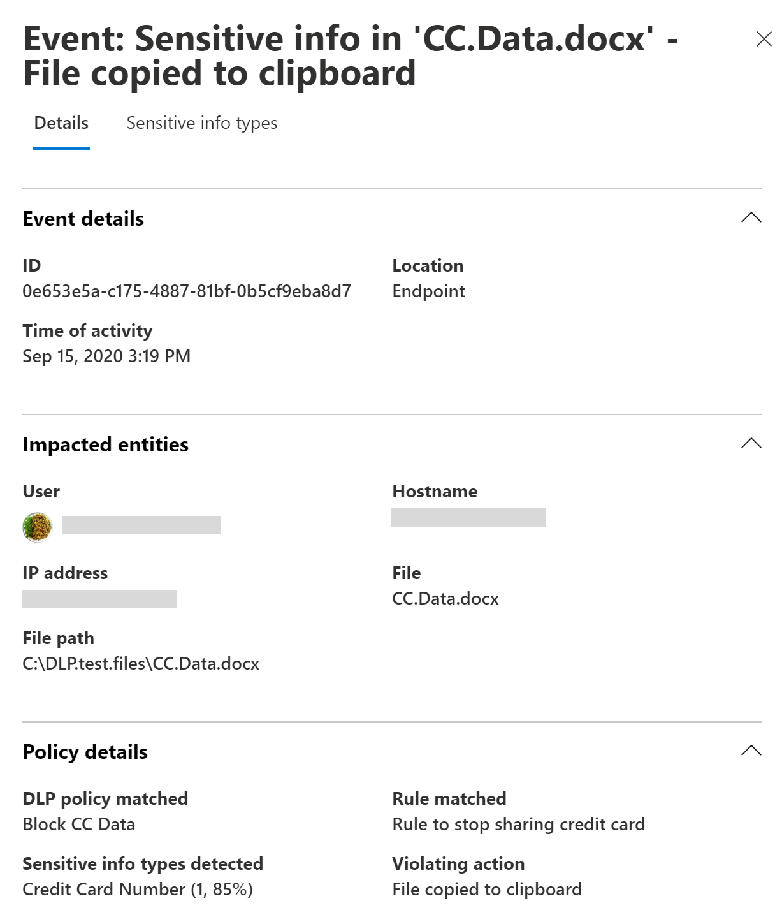
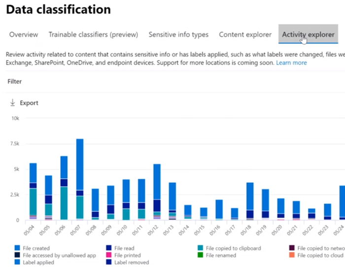
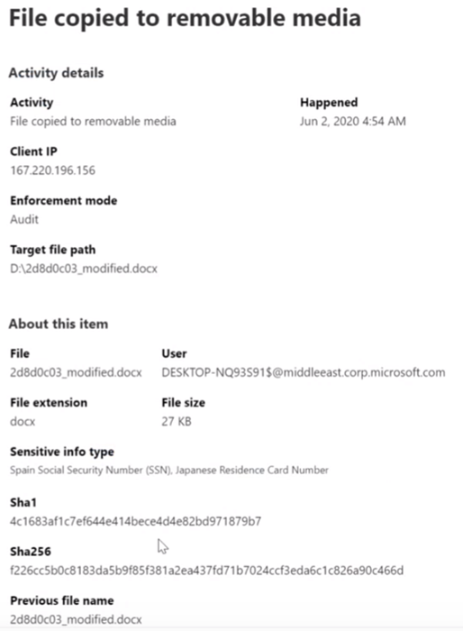

# Learn about Microsoft 365 Endpoint data loss prevention

You can use Microsoft 365 data loss prevention (DLP) to monitor the actions that are being taken on items you've determined to be sensitive and to help prevent the unintentional sharing of those items. For more information on DLP, see [Learn about data loss prevention](dlp-learn-about-dlp.md).

**Endpoint data loss prevention** (Endpoint DLP) extends the activity monitoring and protection capabilities of DLP to sensitive items that are on Windows 10 devices. Once devices are onboarded into the Microsoft 365 compliance solutions, the information about what users are doing with sensitive items is made visible in [activity explorer](data-classification-activity-explorer.md) and you can enforce protective actions on those items via [DLP policies](create-test-tune-dlp-policy.md).

## Endpoint activities you can monitor and take action on

Microsoft Endpoint DLP enables you to audit and manage the following types of activities users take on sensitive items on devices running Windows 10. 

|Activity |Description  | Auditable/restictable|
|---------|---------|---------|
|upload to cloud service, or access by unallowed browsers    | Detects when a user attempts to upload an item to a restricted service domain or access an item through a browser.  If they are using a browser that is listed in DLP as an being an unallowed browser, the upload activity will be blocked and the user is redirected to use Edge Chromium. Edge Chromium will then either allow or block the upload or access based on the DLP policy configuration         |auditable and restrictable|
|copy to other app    |Detects when a user attempts to copy information from a protected item and then paste it into another app, process or item. Copying and pasting information within the same app, process, or item is not detected by this activity.         | auditable and restrictable|
|copy to USB removable media |Detects when a user attempts to copy an item or information to removable media or USB device.         | auditable and restrictable|
|copy to a network share    |Detects when a user attempts to copy an item to a network share or mapped network drive         |auditable and restrictable|
|print a document    |Detects when a user attempts to print a protected item to a local or network printer.| auditable and restrictable         |
|copy to a remote session|Detects when a user attempts to copy an item to a remote desktop session |  auditable and restrictable|
|copy to a Bluetooth device|Detects when a user attempts to copy an item to an unallowed Bluetooth app (as defined in the list of unallowed Bluetooth aps in Endpoint DLP settings).| auditable and restrictable|
|create an item|Detects when a user creates an item| auditable|
|rename an item|Detects when a user renames an item| auditable|

 ## Monitored files

Endpoint DLP supports monitoring of these file types:

- Word files
- PowerPoint files
- Excel files
- PDF files
- .csv files
- .tsv files
- .txt files
- .rtf files
- .c files
- .class files
- .cpp files
- .cs files
- .h files
- .java files
 
By default, endpoint DLP audits the activities for these file types, even if there isn't a policy match. If you only want monitoring data from policy matches, you can turn off the **Always audit file activity for devices** in the endpoint DLP global settings. If this setting is on, activities on any Word, PowerPoint, Excel, PDF, and .csv file are always audited even if the device is not targeted by any policy.

Endpoint DLP monitors activity-based on MIME type, so activities will be captured even if the file extension is changed. 

## What's different in Endpoint DLP

There are a few extra concepts that you need to be aware of before you dig into Endpoint DLP.

### Enabling Device management

Device management is the functionality that enables the collection of telemetry from devices and brings it into Microsoft 365 compliance solutions like Endpoint DLP and [Insider Risk management](insider-risk-management.md). You'll need to onboard all devices you want to use as locations in DLP policies.

> [!div class="mx-imgBorder"]
> 

Onboarding and offboarding are handled via scripts you download from the Device management center. The center has custom scripts for each of these deployment methods:

- local script (up to 10 machines)
- Group policy
- System Center Configuration Manager (version 1610 or later)
- Mobile Device Management/Microsoft Intune
- VDI onboarding scripts for non-persistent machines

> [!div class="mx-imgBorder"]
> 

 Use the procedures in [Getting started with Microsoft 365 Endpoint DLP](endpoint-dlp-getting-started.md) to onboard devices.

If you have onboarded devices through [Microsoft Defender for Endpoint](/windows/security/threat-protection/), those devices will automatically show up in the list of devices.

> [!div class="mx-imgBorder"]
> 

### Viewing Endpoint DLP data

You can view alerts related to DLP policies enforced on endpoint devices by going to the [DLP Alerts Management Dashboard](dlp-configure-view-alerts-policies.md).

> [!div class="mx-imgBorder"]
> 

You can also view details of the associated event with rich metadata in the same dashboard

> [!div class="mx-imgBorder"]
> 

Once a device is onboarded, information about audited activities flows into Activity explorer even before you configure and deploy any DLP policies that have devices as a location.

> [!div class="mx-imgBorder"]
> 

Endpoint DLP collects extensive information on audited activity.

For example, if a file is copied to removable USB media, you'd see these attributes in the activity details:

- activity type
- client IP
- target file path
- happened timestamp
- file name
- user
- file extension
- file size
- sensitive information type (if applicable)
- sha1 value
- sha256 value
- previous file name
- location
- parent
- filepath
- source location type
- platform
- device name
- destination location type
- application that performed the copy
- Microsoft Defender for Endpoint device ID (if applicable)
- removable media device manufacturer
- removable media device model
- removable media device serial number

> [!div class="mx-imgBorder"]
> 

## Next steps

Now that you've learned about Endpoint DLP, your next steps are:

1) [Getting started with Microsoft Endpoint data loss prevention ](endpoint-dlp-getting-started.md)
2) [Using Microsoft Endpoint data loss prevention](endpoint-dlp-using.md)

## See also

- [Getting started with Microsoft Endpoint data loss prevention](endpoint-dlp-getting-started.md)
- [Using Microsoft Endpoint data loss prevention](endpoint-dlp-using.md)
- [Learn about data loss prevention](dlp-learn-about-dlp.md)
- [Create, test, and tune a DLP policy](create-test-tune-dlp-policy.md)
- [Get started with Activity explorer](data-classification-activity-explorer.md)
- [Microsoft Defender for Endpoint](/windows/security/threat-protection/)
- [Insider Risk management](insider-risk-management.md)