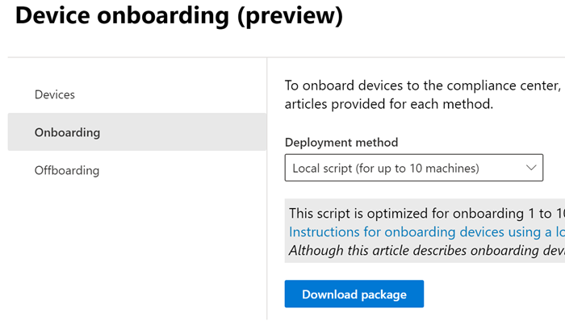

# Learn about Endpoint data loss prevention

You can use Microsoft Purview Data Loss Prevention (DLP) to monitor the actions that are being taken on items you've determined to be sensitive and to help prevent the unintentional sharing of those items. For more information on DLP, see [Learn about data loss prevention](dlp-learn-about-dlp.md).

**Endpoint data loss prevention** (Endpoint DLP) extends the activity monitoring and protection capabilities of DLP to sensitive items that are physically stored on Windows 10/11 and macOS (the three latest released major versions) devices. Once devices are onboarded into the Microsoft Purview solutions, the information about what users are doing with sensitive items is made visible in [activity explorer](data-classification-activity-explorer.md). You can then enforce protective actions on those items via [DLP policies](dlp-create-deploy-policy.md).

> [!TIP]
> If you are looking for device control for removable storage, see [Microsoft Defender for Endpoint Device Control Removable Storage Access Control](../security/defender-endpoint/device-control-removable-storage-access-control.md#microsoft-defender-for-endpoint-device-control-removable-storage-access-control).

[!INCLUDE [purview-preview](../includes/purview-preview.md)]

## Endpoint activities you can monitor and take action on

Endpoint DLP enables you to audit and manage the following types of activities users take on sensitive items that are physically stored Windows 10, Windows 11, or macOS devices.

|Activity |Description  |Windows 10 1809 and later/ Windows 11| macOS three latest released versions | Auditable/restrictable|
|---------|---------|---------|---------|---------|
|Upload to cloud service, or access by unallowed browsers    | Detects when a user attempts to upload an item to a restricted service domain or access an item through a browser.  If they're using a browser that is listed in DLP as unallowed, the upload activity is blocked and the user is redirected to use Microsoft Edge. Microsoft Edge then either allows or blocks the upload or access based on the DLP policy configuration. You can block, warn, or audit when protected files are allowed to be uploaded or prevented from being uploaded to cloud services based on the allow/unallowed domains list in Global settings. When the configured action is set to warn or block, other browsers (defined on the unallowed browsers list under Global settings) are blocked from accessing the file.         |Supported |Supported|Auditable and restrictable|
|Copy to another app    |Detects when a user attempts to copy information from a protected item and then paste it into another app, process, or item. It also detects when a user copies and pastes content among files within the same app, process, or item for Word, Excel, and PowerPoint.|Supported|Supported         | Auditable and restrictable|
|Copy to USB removable media |When this activity is detected, you can block, warn, or audit the copying or moving of protected files from an endpoint device to USB removable media.|Supported|Supported  |Auditable and restrictable|
|Copy to a network share    | When this activity is detected, you can block, warn, or audit the copying or moving of protected files from an endpoint device to any network share. |Supported|Supported         |Auditable and restrictable|
|Print a document    |When this activity is detected, you can block, warn, or audit the printing of protected files from an endpoint device. |Supported|Supported|Auditable and restrictable         |
|Copy to a remote session|Detects when a user attempts to copy an item to a remote desktop session. |Supported|Not supported|  Auditable and restrictable|
|Copy to a Bluetooth device|Detects when a user attempts to copy an item to an unallowed Bluetooth app (as defined in the list of unallowed Bluetooth aps in Endpoint DLP settings).|Supported|Supported (preview)| Auditable and restrictable|
|Create an item|Detects the creation of an item.|Supported |Supported |Auditable|
|Rename an item|Detects the renaming of an item.|Supported |Supported |Auditable|
|Copy to clipboard| When this activity is detected, you can block, warn, or audit the copying of protected files to a clipboard on an endpoint device. |Supported | Supported|Auditable and restrictable|
|Access by unallowed apps| Detects when an application that is on the unallowed apps list (as defined in [restricted apps and app groups](dlp-configure-endpoint-settings.md)) attempts to access protected files on an endpoint device. |Supported |Supported|

## Best practice for endpoint DLP policies

Say you want to block all items that contain credit card numbers from leaving endpoints of Finance department users. We recommend the following:

- Create a policy and scope it to endpoints and to that group of users.
- Create a rule in the policy that detects the type of information that you want to protect. In this case, set **content contains** to *Sensitive information type**, and select **Credit Card**.
- Set the actions for each activity to **Block**.

See [Design a data loss prevention policy](dlp-policy-design.md) for more guidance on designing your DLP policies.

> [!NOTE]
> In Microsoft Purview, DLP policy evaluation of sensitive items occurs centrally, so there is no time lag for policies and policy updates to be distributed to individual devices. When a policy is updated in compliance center, it generally takes about an hour for those updates to be synchronized across the service. Once policy updates are synchronized, items on targeted devices are automatically re-evaluated the next time they are accessed or modified. (Preview) For Authorized Groups changes, the policy will need 24 hours to sync.

## Monitored files

Endpoint DLP supports monitoring of these file types through policy:

- Word files
- PowerPoint files
- Excel files
- PDF files
- .csv files
- .tsv files
- .txt files
- .rtf files
- .c files
- .class files (Windows only)
- .cpp files
- .cs files
- .h files
- .java files
 
DLP audits the activities for these file types, even if there isn't a policy match: 

- Word files
- PowerPoint files
- Excel files
- PDF files

[!INCLUDE [dlp-pdf-adobe-requirements](../includes/dlp-pdf-adobe-requirements.md)]

If you only want monitoring data from policy matches, you can turn off the **Always audit file activity for devices** in the endpoint DLP global settings.

 If the **Always audit file activity for devices** setting is on, activities on any Word, PowerPoint, Excel, PDF, and .csv files are always audited, even if the device isn't targeted by any policy.

To ensure activities are audited for all supported file types, create a [custom DLP policy](dlp-create-deploy-policy.md).

Endpoint DLP monitors activity-based on MIME type, so activities are captured, even if the file extension is changed, for these files types:

After the extension is changed to any other file extension:
- doc
- docx
- xls
- xlsx
- ppt
- pptx
- pdf

If the extension is changed only to supported file extensions:
- txt
- pst
- msg
- rtf
- c
- cpp
- h
- cs
- java
- tsv

### File types

File types are a grouping of file formats. They are utilized to protect specific workflows or areas of business. You can use one or more file types as conditions in your DLP policies. File types are supported for Windows 10/11 devices. 

|File Type |App  |Monitored file extensions  |
|---------|---------|---------|
|word processing |Word, PDF | .doc, .docx,  .docm, .dot, .dotx, .dotm, .docb, .pdf |
|spreadsheet    |Excel, CSV, TSV |.xls, .xlsx, .xlt, .xlm, .xlsm, .xltx, .xltm, .xlsb, .xlw, .csv, .tsv         |
|presentation |PowerPoint|.ppt, .pptx, .pos, .pps, .pptm, .potx, .potm, .ppam, .ppsx|
|archive  |file archive and compression tools | .zip, .zipx, .rar, .7z, .tar, .gz |
|email    |Outlook |.pst, .ost, .msg         |

### File extensions

If the file types don't cover the file extensions you need to list as a condition in a policy, you can use file extensions separated by comma instead.

> [!IMPORTANT]
> The **file extensions** and **file types** options cannot be used as conditions in the same rule. If you want to use them as conditions in the same policy, they must be in separate rules. 

> [!IMPORTANT]
> These Windows versions support **file extensions** and **file types** features:
>- Windows 10 versions 20H1/20H2/21H1 (KB 5006738)
>- Windows 10 versions 19H1/19H2 (KB 5007189)
>- Windows 10 RS5 (KB 5006744)

## What's different in Endpoint DLP

There are a few extra concepts that you need to be aware of before you dig into Endpoint DLP.

### Enabling Device management

Device management is the functionality that enables the collection of telemetry from devices and brings it into Microsoft Purview solutions like Endpoint DLP and [insider risk management](insider-risk-management.md). You need to onboard all the devices you want to use as locations in your DLP policies.

> [!div class="mx-imgBorder"]
> 

Onboarding and offboarding are handled via scripts that you download from the device management center. The device management center has custom scripts for each of the following deployment methods:

- Local script (up to 10 machines)
- Group policy
- System Center Configuration Manager (version 1610 or later)
- Mobile Device Management/Microsoft Intune
- VDI onboarding scripts for non-persistent machines

> [!div class="mx-imgBorder"]
> 

 Use the procedures in [Getting started with Microsoft 365 Endpoint DLP](endpoint-dlp-getting-started.md) to onboard devices.

If you have onboarded devices through [Microsoft Defender for Endpoint](../security/defender-endpoint/configure-machines-onboarding.md), those devices will  show up automatically in the list of devices. This is because onboarding to Defender also onboards devices to DLP. You only need to **Turn on device monitoring** to use endpoint DLP.

> [!div class="mx-imgBorder"]
> 

### Viewing Endpoint DLP data

You can view alerts related to DLP policies enforced on endpoint devices by going to the [DLP Alerts Management Dashboard](dlp-configure-view-alerts-policies.md).

> [!div class="mx-imgBorder"]
> 

You can also view details of the associated event, with rich metadata, in the same dashboard

> [!div class="mx-imgBorder"]
> 

Once a device is onboarded, information about audited activities flows into Activity explorer even before you configure and deploy any DLP policies that have devices as a location.

> [!div class="mx-imgBorder"]
> 

Endpoint DLP collects extensive information on audited activity.

For example, if a file is copied to removable USB media, you'd see these attributes in the activity details:

- activity type
- client IP
- target file path
- happened timestamp
- file name
- user
- file extension
- file size
- sensitive information type (if applicable)
- sha1 value
- sha256 value
- previous file name
- location
- parent
- filepath
- source location type
- platform
- device name
- destination location type
- application that performed the copy
- Microsoft Defender for Endpoint device ID (if applicable)
- removable media device manufacturer
- removable media device model
- removable media device serial number

> [!div class="mx-imgBorder"]
> 

## Just-in-time protection (preview)

> [!IMPORTANT]
> If you want to try out just-in-time protection, you must register your tenant at [Endpoint JIT Preview](https://aka.ms/EndpointJITPreview).

Endpoint DLP can use **Just in time protection** once it's enabled in **Microsoft Purview compliance console** > **Settings**. 

Just-in-time protection applies a candidate policy to onboarded Windows 10/11 devices. The candidate policy blocks all egress activities on monitored files until policy evaluation completes successfully. The candidate policy is applied to:

- Items that have never been evaluated.
- Items on which the evaluation has gone stale. These are previously evaluated items that haven't been reevaluated by the current, updated cloud versions of the policies.
 
> [!NOTE]
> - Simulate Mode: Just-in-time protection is triggered in the background. Admins can see just-in-time events in Activity explorer, without users being blocked.
> - Enforce Mode: End users are blocked until the evaluation is complete.

You can prevent a file from being permanently blocked if policy evaluation starts on a file, but doesn't complete. Use the **Just in time protection configuration** fallback setting to either **Allow** or **Block** egress activities if the policy evaluation doesn't complete. To configure fallback settings, navigate to **Microsoft Purview compliance console** > **Settings** > **Just in time protection configuration** > **Decide what happens if JIT protection fails**.

> [!TIP]
> Because the candidate policy from just-in-time protection is applied to all files on onboarded devices, it may block user activity on files that won't have a policy applied once evaluation occurs. To prevent this productivity interruption, you should configure and deploy policies to devices before enabling just-in-time protection.

## Next steps

Now that you've learned about Endpoint DLP, your next steps are:

1. [Onboard Windows 10 or Windows 11 devices into Microsoft Purview overview](device-onboarding-overview.md)
1. [Onboard macOS devices into Microsoft Purview overview](device-onboarding-macos-overview.md)
1. [Configure endpoint data loss prevention settings](dlp-configure-endpoint-settings.md)
1. [Using Endpoint data loss prevention](endpoint-dlp-using.md)

## See also

- [Getting started with Microsoft Endpoint data loss prevention](endpoint-dlp-getting-started.md)
- [Using Microsoft Endpoint data loss prevention](endpoint-dlp-using.md)
- [Learn about data loss prevention](dlp-learn-about-dlp.md)
- [Create and Deploy data loss prevention policies](dlp-create-deploy-policy.md)
- [Get started with Activity explorer](data-classification-activity-explorer.md)
- [Microsoft Defender for Endpoint](../security/defender-endpoint/configure-machines-onboarding.md)
- [Insider risk management](insider-risk-management.md)
