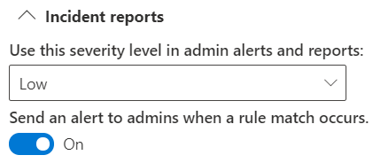
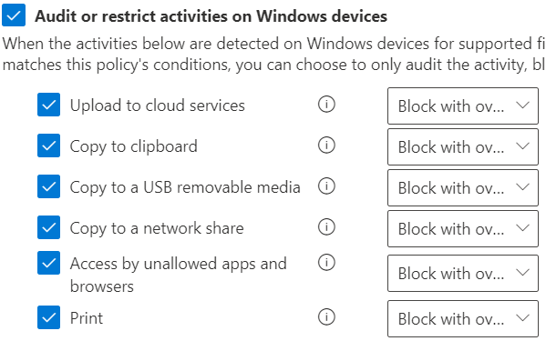
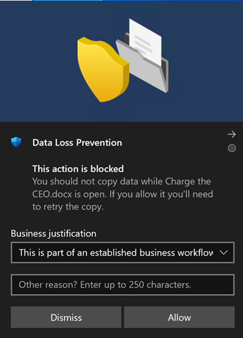
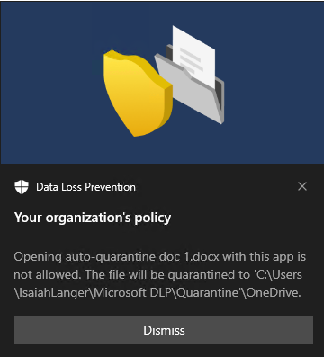

# Using Endpoint data loss prevention

To help familiarize you with Endpoint DLP features and how they surface in DLP policies, we've put together some scenarios for you to follow.

> [!IMPORTANT]
> These Endpoint DLP scenarios are not the official procedures for creating and tuning DLP policies. Refer to the below topics when you need to work with DLP policies in general situations:
>
>- [Learn about Microsoft Purview Data Loss Prevention](dlp-learn-about-dlp.md)
>- [Get started with the default DLP policy](get-started-with-the-default-dlp-policy.md)
>- [Create a DLP policy from a template](create-a-dlp-policy-from-a-template.md)
>- [Create, test, and tune a DLP policy](create-test-tune-dlp-policy.md)

[!INCLUDE [purview-preview](../includes/purview-preview.md)]

## Before you begin

### SKU/subscriptions licensing

For full licensing details, see [Microsoft 365 licensing guidance for information protection](/office365/servicedescriptions/microsoft-365-service-descriptions/microsoft-365-tenantlevel-services-licensing-guidance/microsoft-365-security-compliance-licensing-guidance#information-protection-data-loss-prevention-for-exchange-online-sharepoint-online-and-onedrive-for-business).

## Scenario 1: Create a policy from a template, audit only

These scenarios require that you already have devices onboarded and reporting into Activity explorer. If you haven't onboarded devices yet, see [Get started with Endpoint data loss prevention](endpoint-dlp-getting-started.md).

1. Open the [Data loss prevention page](https://compliance.microsoft.com/datalossprevention?viewid=policies).

2. Choose **Create policy**.

3. For this scenario, choose **Privacy**, then **U.S. Personally Identifiable Information (PII) Data** and choose **Next**.

4. Toggle the **Status** field to off for all locations except **Devices**. Choose **Next**.

5. Accept the default **Review and customize settings from the template** selection and choose **Next**.

6. Accept the default **Protection actions** values and choose **Next**.

7. Select **Audit or restrict activities on Windows devices** and leave the actions set to **Audit only**. Choose **Next**.

8. Accept the default **I'd like to test it out first** value and choose **Show policy tips while in test mode**. Choose **Next**.

9. Review your settings and choose **Submit**.

10. The new DLP policy will appear in the policy list.

11. Check Activity explorer for data from the monitored endpoints. Set the location filter for devices and add the policy, then filter by policy name to see the impact of this policy; see [Get started with activity explorer](data-classification-activity-explorer.md), if needed.

12. Attempt to share a test item that contains content that will trigger the U.S. Personally Identifiable Information (PII) Data condition with someone outside your organization. This should trigger the policy.

13. Check Activity explorer for the event.

## Scenario 2: Modify the existing policy, set an alert

1. Open the [Data loss prevention page](https://compliance.microsoft.com/datalossprevention?viewid=policies).

2. Choose the **U.S. Personally Identifiable Information (PII) Data** policy that you created in scenario 1.

3. Choose **edit policy**.

4. Go to the **Advanced DLP rules** page and edit the **Low volume of content detected U.S. Personally Identifiable Inf**.

5. Scroll down to the **Incident reports** section and set **Send an alert to admins when a rule match occurs** to **On**. Email alerts will be automatically sent to the administrator and anyone else you add to the list of recipients. 

   
6. For the purposes of this scenario, choose **Send alert every time an activity matches the rule**.

7. Choose **Save**.

8. Retain all your previous settings by choosing **Next** and then **Submit** the policy changes.

9. Attempt to share a test item that contains content that will trigger the U.S. Personally Identifiable Information (PII) Data condition with someone outside your organization. This should trigger the policy.

10. Check Activity explorer for the event.

## Scenario 3: Modify the existing policy, block the action with allow override

1. Open the [Data loss prevention page](https://compliance.microsoft.com/datalossprevention?viewid=policies).

2. Choose the **U.S. Personally Identifiable Information (PII) Data** policy that you created in scenario 1.

3. Choose **edit policy**.

4. Go to the **Advanced DLP rules** page and edit the **Low volume of content detected U.S. Personally Identifiable Inf**.

5. Scroll down to the **Audit or restrict activities on Windows device** section and for each activity set the corresponding action to  **Block with override**.

   > [!div class="mx-imgBorder"]
   > 
   
6. Choose **Save**.

7. Repeat steps 4-7 for the **High volume of content detected U.S. Personally Identifiable Inf**.

8. Retain all your previous settings by choosing **Next** and then **Submit** the policy changes.

9. Attempt to share a test item that contains content that will trigger the U.S. Personally Identifiable Information (PII) Data condition with someone outside your organization. This should trigger the policy.

   You'll see a popup like this on the client device:

   > [!div class="mx-imgBorder"]
   > 

10. Check Activity explorer for the event.

## Scenario 4: Avoid looping DLP notifications from cloud synchronization apps with auto-quarantine (preview)

#[!INCLUDE [purview-preview](../includes/purview-preview.md)]

## Before you begin

In this scenario, synchronizing files with the **Highly Confidential** sensitivity label to OneDrive is blocked. This is a complex scenario with multiple components and procedures. You will need:

- An AAD user account to target and an onboarded Windows 10 computer that is already synchronizing a local OneDrive folder with OneDrive cloud storage.
- Sensitivity labels configured and published—see [Get started with sensitivity labels](get-started-with-sensitivity-labels.md#get-started-with-sensitivity-labels) and [Create and configure sensitivity labels and their policies](create-sensitivity-labels.md#create-and-configure-sensitivity-labels-and-their-policies).

There are three procedures.

1. Configure the Endpoint DLP Auto-quarantine settings.
2. Create a policy that blocks sensitive items that have the **Highly Confidential** sensitivity label.
3. Create a Word document on the Windows 10 device that the policy is targeted to, apply the label, and copy it to the user accounts local OneDrive folder that is being synchronized.  

### Configure Endpoint DLP unallowed app and Auto-quarantine settings

1. Open [Endpoint DLP settings](https://compliance.microsoft.com/datalossprevention?viewid=globalsettings)

2. Expand **Unallowed apps**.

3. Choose **Add or edit unallowed apps** and add *OneDrive* as a display name and the executable name *onedrive.exe*  to disallow onedrive.exe from accessing items the **Highly Confidential** label.

4. Select **Auto-quarantine** and **Save**.

5. Under **Auto-quarantine settings** choose **Edit auto-quarantine settings**.

6. Enable **Auto-quarantine for unallowed apps**.

7. Enter the path to the folder on local machines where you want the original sensitive files to be moved to. For example:
   
    **'%homedrive%%homepath%\Microsoft DLP\Quarantine'** for the username *Isaiah langer* will place the moved items in a folder named:  

    *C:\Users\IsaiahLanger\Microsoft DLP\Quarantine\OneDrive*

    and append a date and time stamp to the original file name.
    
    > [!NOTE]
    > DLP Auto-quarantine will create sub-folders for the files for each unallowed app. So if you have both *Notepad* and *OneDrive* in your unallowed apps list, a sub-folder will be created for **\OneDrive** and another sub-folder for **\Notepad**.

8. Choose **Replace the files with a .txt file that contains the following text** and enter the text you want in the placeholder file. For example for a file named *auto quar 1.docx*:
    
    > %%FileName%% contains sensitive info that your organization is protecting with the data loss prevention (DLP) policy %%PolicyName%% and was moved to the quarantine folder: %%QuarantinePath%%
    
    will leave a text file that contains this message:
    
    > auto quar 1.docx contains sensitive info that your organization is protecting with the data loss prevention (DLP) policy and was moved to the quarantine folder: C:\Users\IsaiahLanger\Microsoft DLP\Quarantine\OneDrive\auto quar 1_20210728_151541.docx.

9. Choose **Save**

### Configure a policy to block OneDrive synchronization of files with the sensitivity label Highly Confidential

1. Open the [Data loss prevention page](https://compliance.microsoft.com/datalossprevention?viewid=policies).

2. Choose **Create policy**.

3. For this scenario, choose **Custom**, then **Custom policy** and choose **Next**.

4. Fill in the **Name** and **Description** fields, choose **Next**.

5. Toggle the **Status** field to off for all locations except **Devices**. If you have a specific end user account that you want to test this from, be sure to select it in the scope. Choose **Next**.

6. Accept the default **Create or customize advanced DLP rules** selection and choose **Next**.

7. Create a rule with these values:
    1. **Name** > *Scenario 4 Auto-quarantine*.
    1. **Conditions** > **Content contains** > **Sensitivity labels** > **Highly Confidential**.
    1.  **Actions** > **Audit or restrict activities on Windows devices** > **Access by unallowed apps** > **Block**. For the purposes of this scenario, clear all the other activities.
    1. **User notifications** > **On**.
    1. **Endpoint devices** > Choose **Show users a policy tip notification when an activity** if not already enabled.
    
8. Choose **Save** and **Next**.

9. Choose **Turn it on right away**. Choose **Next**.

10. Review your settings and choose **Submit**.

    > [!NOTE]
    > Allow at least an hour for the new policy to be replicated and applied to the target Windows 10 computer.

11. The new DLP policy will appear in the policy list.

### Test Auto-quarantine on the Windows 10 device

1. Log in to the Windows 10 computer with the user account you specified in [Configure a policy to block OneDrive synchronization of files with the sensitivity label Highly Confidential](#configure-a-policy-to-block-onedrive-synchronization-of-files-with-the-sensitivity-label-highly-confidential) step 5.

2. Create a folder whose contents will not be synchronized to OneDrive. For example:

    *C:\auto-quarantine source folder*

3. Open Microsoft Word and create a file in the auto-quarantine source folder. Apply the **Highly confidential** sensitivity label; see [Apply sensitivity labels to your files and email in Office](https://support.microsoft.com/topic/apply-sensitivity-labels-to-your-files-and-email-in-office-2f96e7cd-d5a4-403b-8bd7-4cc636bae0f9).

4. Copy the file you just created to your OneDrive synchronization folder. A user notification toast should appear telling you that the action is not allowed and that the file will be quarantined. For example, for user name *Isaiah Langer*, and a document titled *auto-quarantine doc 1.docx* you would see this message:

    
    
    The message reads:
    
    > Opening autoquarantine doc 1.docx with this app is not allowed. The file will be quarantined to 'C:\Users\IsaiahLanger\Microsoft DLP\OneDrive'

5. Choose **Dismiss**.

6. Open the place holder text file. It will be named **auto-quarantine doc 1.docx_*date_time*.txt**. 

7. Open the quarantine folder and confirm that the original file is there.
 
8. Check Activity explorer for data from the monitored endpoints. Set the location filter for devices and add the policy, then filter by policy name to see the impact of this policy; see [Get started with activity explorer](data-classification-activity-explorer.md), if needed.

9. Check Activity explorer for the event.

## Scenario 5: Restrict unintentional sharing to unallowed cloud apps and services

With Endpoint DLP and Microisoft Edge Web browser, you can restrict unintentional sharing of sensitive items to unallowed cloud apps and services. Edge understands when an item is restricted by an Endpoint DLP policy and enforces access restrictions.

When you select **Devices** as a location in a properly configured DLP policy and use the Microsoft Edge browser, the unallowed browsers that you've defined in these settings will be prevented from accessing the sensitive items that match your DLP policy controls. Instead, users will be redirected to use Microsoft Edge which, with its understanding of DLP imposed restrictions, can block or restrict activities when the conditions in the DLP policy are met.

To use this restriction, you’ll need to configure three important pieces:

1. Specify the places – services, domains, IP addresses – that you want to prevent sensitive items from being shared to.

2. Add the browsers that aren’t allowed to access certain sensitive items when a DLP policy match occurs.

3. Configure DLP policies to define the kinds of sensitive items for which upload should be restricted to these places by turning on **Upload to cloud services** and **Access from unallowed browser**.

You can continue to add new services, apps, and policies to extend and augment your restrictions to meet your business needs and protect sensitive data. 

This configuration will help ensure your data remains safe while also avoiding unnecessary restrictions that prevent or restrict users from accessing and sharing non-sensitive items.

## Scenario 6 Monitor or restrict user activities on sensitive service domains

Use this scenario when you want to audit, block with override, or block these user activities on a website.

- print from a website
- copy data from a website
- save a website as local files

The user must be accessing the website through Microsoft Edge.

### Supported syntax for designating websites in a website group

You can use a flexible syntax to include and exclude domains, subdomains, websites, and subsites in your website groups.

- use `*` as a wildcard to specify all domains or all subdomains
- use `/` as a terminator at the end of a URL to scope to that specific site only.

When you add a URL without a terminating `/`, that URL is scoped to that site and all subsites.

This syntax applies to all http/https websites.

Here are some examples:

|URL that you add to the website group  |URL will match  | URL will not match|
|---------|---------|---------|
|contoso.com  | //<!--nourl-->contoso.com   //<!--nourl-->contoso.com/   //<!--nourl-->contoso.com/allsubsites1   //<!--nourl-->contoso.com/allsubsites1/allsubsites2|        //<!--nourl-->allsubdomains.contoso.com   //<!--nourl-->allsubdomains.contoso.com.au    |
|contoso.com/     |//<!--nourl-->contoso.com   //<!--nourl-->contoso.com/         |//<!--nourl-->contoso.com/allsubsites1   //<!--nourl-->contoso.com/allsubsites1/allsubsites2   //<!--nourl-->allsubdomains.contoso.com   //<!--nourl-->allsubdomains.contoso.com/au   |
|*.contoso.com   | //<!--nourl-->contoso.com   //<!--nourl-->contoso.com/allsubsites   //<!--nourl-->contoso.com/allsubsites1/allsubsites2   //<!--nourl-->allsubdomains.contoso.com   //<!--nourl-->allsubdomains.contoso.com/allsubsites   //<!--nourl-->allsubdomains1/allsubdomains2/contoso.com/allsubsites1/allsubsites2         | //<!--nourl-->allsubdomains.contoso.com.au|
|*.contoso.com/xyz     |//<!--nourl-->contoso.com   //<!--nourl-->contoso.com/xyz   //<!--nourl-->contoso.con/xyz/allsubsites/   //<!--nourl-->allsubdomains.contoso.com/xyz   //<!--nourl-->allsubdomains.contoso.com/xyz/allsubsites   //<!--nourl-->allsubdomains1.allsubdomains2.contoso.com/xyz/allsubsites   //<!--nourl-->allsubdomains1.allsubdomains2.contoso.com/xyz/allsubsites1/allsubsites2         | //<!--nourl-->contoso.com/xyz   //<!--nourl-->allsubdomains.contoso.com/xyz/|
|*.contoso.com/xyz/     |//<!--nourl-->contoso.com/xyz   //<!--nourl-->allsubdomains.contoso.com/xyz         |//<!--nourl-->contoso.com   //<!--nourl-->contoso.com/xyz/allsubsites/   //<!--nourl-->allsubdomains.contoso.com/xyz/allsubsites/   //<!--nourl-->allsubdomains1.allsubdomains2.contoso.com/xyz/allsubsites/   //<!--nourl-->allsubdomains1.allsubdomains2.contoso.com/xyz/allsubsites1/allsubsites2|

### Configure Sensitive service domains

1. In the Microsoft Purview compliance portal open **Data loss prevention** > **Endpoint DLP settings** > **Browser and domain restrictions to sensitive data** > **Sensitive service domains**.
1. Select **Add a new group of sensitive service domains**.
1. Name the group.
1. Select the **Match type** you want. You can select from **URL**, **IP address**, **IP address range**.
1. Type in the appropriate value in the **Add new service domains to this group**. You can add multiple websites to a group and use wildcards to cover subdomains.  For example, `www.contoso.com` for just the top level website or \*.contoso.com for corp.contoso.com, hr.contoso.com, fin.contoso.com
1. Select **Save**.
1. Select **Policies**.
1. Create and scope a policy that is applied only to **Devices**. See, [Create, test, and tune a DLP policy](create-test-tune-dlp-policy.md) for more information on how to create a policy.
1. Create a rule that uses the **the user accessed a sensitive site from Edge**, and the action **Audit or restrict activities when users access sensitive sites in Microsoft Edge browser on Windows devices**.
1. In the action select **Add or remove Sensitive site groups**.
1. Select the **Sensitive site groups** you want.
1. Select **Add**.
1. Select the user activities you want to monitor or restrict and the actions you DLP to take in response to those activities.
1. Finish configuring the rule and policy and apply it.

## See also

- [Learn about Endpoint data loss prevention](endpoint-dlp-learn-about.md)
- [Get started with Endpoint data loss prevention](endpoint-dlp-getting-started.md)
- [Learn about data loss prevention](dlp-learn-about-dlp.md)
- [Create, test, and tune a DLP policy](create-test-tune-dlp-policy.md)
- [Get started with Activity explorer](data-classification-activity-explorer.md)
- [Microsoft Defender for Endpoint](/windows/security/threat-protection/)
- [Onboard Windows 10 and Windows 11 devices into Microsoft Purview overview](/microsoft-365/compliance/device-onboarding-overview)
- [Microsoft 365 subscription](https://www.microsoft.com/microsoft-365/compare-microsoft-365-enterprise-plans?rtc=1)
- [Azure Active Directory (AAD) joined](/azure/active-directory/devices/concept-azure-ad-join)
- [Download the new Microsoft Edge based on Chromium](https://support.microsoft.com/help/4501095/download-the-new-microsoft-edge-based-on-chromium)
- [Get started with the default DLP policy](get-started-with-the-default-dlp-policy.md)
- [Create a DLP policy from a template](create-a-dlp-policy-from-a-template.md)
