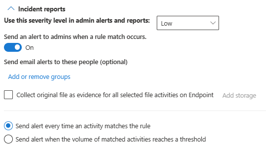

# Using Endpoint data loss prevention

To help familiarize you with Endpoint DLP features and how they surface in DLP policies, we've put together some scenarios for you to follow.

> [!IMPORTANT]
> These Endpoint DLP scenarios are not the official procedures for creating and tuning DLP policies. Refer to the below topics when you need to work with DLP policies in general situations:
>
>- [Learn about Microsoft Purview Data Loss Prevention](dlp-learn-about-dlp.md)
>- [Get started with the default DLP policy](get-started-with-the-default-dlp-policy.md)
>- [Create and Deploy data loss prevention policies](dlp-create-deploy-policy.md)


[!INCLUDE [purview-preview](../includes/purview-preview.md)]

## Before you begin

### SKU/subscriptions licensing

For full licensing details, see [Microsoft 365 licensing guidance for information protection](/office365/servicedescriptions/microsoft-365-service-descriptions/microsoft-365-tenantlevel-services-licensing-guidance/microsoft-365-security-compliance-licensing-guidance#information-protection-data-loss-prevention-for-exchange-online-sharepoint-online-and-onedrive-for-business).

These scenarios require that you already have devices onboarded and reporting into Activity explorer. If you haven't onboarded devices yet, see [Get started with Endpoint data loss prevention](endpoint-dlp-getting-started.md).

> [!IMPORTANT]
> Be sure you understand the difference between an unrestricted administrator and an administrative unit restricted administrator [Administrative units (preview)](microsoft-365-compliance-center-permissions.md#administrative-units-preview) before you start.

## Scenario 1: Create a policy from a template, audit only

This scenario is for an unrestricted admin creating and full directory policy.

1. Open the [Data loss prevention page](https://compliance.microsoft.com/datalossprevention?viewid=policies).

1. Choose **Create policy**.

1. For this scenario, choose **Privacy**, then **U.S. Personally Identifiable Information (PII) Data** and choose **Next**.

1. Select **Full directory** under **Admin units**.

1. Toggle the **Status** field to off for all locations except **Devices**. Choose **Next**.

1. Accept the default **Review and customize settings from the template** selection and choose **Next**.

1. Accept the default **Protection actions** values and choose **Next**.

1. Select **Audit or restrict activities on Windows devices** and leave the actions set to **Audit only**. Choose **Next**.

1. Accept the default **I'd like to test it out first** value and choose **Show policy tips while in test mode**. Choose **Next**.

1. Review your settings and choose **Submit**.

1. The new DLP policy will appear in the policy list.

1. Check Activity explorer for data from the monitored endpoints. Set the location filter for devices and add the policy, then filter by policy name to see the effect of this policy; see [Get started with activity explorer](data-classification-activity-explorer.md), if needed.

1. Attempt to share a test item that contains content that will trigger the U.S. Personally Identifiable Information (PII) Data condition with someone outside your organization. This should trigger the policy.

1. Check Activity explorer for the event.

## Scenario 2: Modify the existing policy, set an alert

This scenario is for an unrestricted admin modifying a full directory scoped policy.

1. Open the [Data loss prevention page](https://compliance.microsoft.com/datalossprevention?viewid=policies).

1. Choose the **U.S. Personally Identifiable Information (PII) Data** policy that you created in scenario 1.

1. Choose **edit policy**.

1. Go to the **Advanced DLP rules** page and edit the **Low volume of content detected U.S. Personally Identifiable Inf**.

1. Scroll down to the **Incident reports** section and set **Send an alert to admins when a rule match occurs** to **On**. Email alerts will be automatically sent to the administrator and anyone else you add to the list of recipients. 

    
   
1. For the purposes of this scenario, choose **Send alert every time an activity matches the rule**.

1. Choose **Save**.

1. Retain all your previous settings by choosing **Next** and then **Submit** the policy changes.

1. Attempt to share a test item that contains content that will trigger the U.S. Personally Identifiable Information (PII) Data condition with someone outside your organization. This should trigger the policy.

1. Check Activity explorer for the event.

## Scenario 3: Modify the existing policy, block the action with allow override

This scenario is for an unrestricted admin modifying a full directory policy.

1. Open the [Data loss prevention page](https://compliance.microsoft.com/datalossprevention?viewid=policies).

1. Choose the **U.S. Personally Identifiable Information (PII) Data** policy that you created in Scenario 1.

1. Choose **edit policy**.

1. Go to the **Advanced DLP rules** page and edit the **Low volume of content detected U.S. Personally Identifiable Inf**.

1. Scroll down to the **Audit or restrict activities on Windows device** section and for each activity set the corresponding action to  **Block with override**.

   > [!div class="mx-imgBorder"]
   > 
   
1. Choose **Save**.

1. Repeat steps 4-7 for the **High volume of content detected U.S. Personally Identifiable Inf**.

1. Retain all your previous settings by choosing **Next** and then **Submit** the policy changes.

1. Attempt to share a test item that contains content that will trigger the U.S. Personally Identifiable Information (PII) Data condition with someone outside your organization. This should trigger the policy.

   You'll see a popup like this on the client device:

   > [!div class="mx-imgBorder"]
   > 

1. Check Activity explorer for the event.

## Scenario 4: Avoid looping DLP notifications from cloud synchronization apps with autoquarantine

This scenario is for an unrestricted admin creating a full directory policy.

## Before you begin Scenario 4

In this scenario, synchronizing files with the **Highly Confidential** sensitivity label to OneDrive is blocked. This is a complex scenario with multiple components and procedures. You'll need:

- A Microsoft Azure Active Directory (Azure AD) user account to target and an onboarded Windows 10 computer that is already synchronizing a local OneDrive folder with OneDrive cloud storage.
- Sensitivity labels configured and published—see [Get started with sensitivity labels](get-started-with-sensitivity-labels.md#get-started-with-sensitivity-labels) and [Create and configure sensitivity labels and their policies](create-sensitivity-labels.md#create-and-configure-sensitivity-labels-and-their-policies).

There are three procedures.

1. Configure the Endpoint DLP Autoquarantine settings.
2. Create a policy that blocks sensitive items that have the **Highly Confidential** sensitivity label.
3. Create a Word document on the Windows 10 device that the policy is targeted to, apply the label, and copy it to the user accounts local OneDrive folder that is being synchronized.  

### Configure Endpoint DLP unallowed app and Autoquarantine settings

1. Open [Endpoint DLP settings](https://compliance.microsoft.com/datalossprevention?viewid=globalsettings)

1. Expand **Restricted apps and app groups**.

1. Choose **Add restricted app group** under **Restricted app groups**, put group name *Cloud Sync apps*,  and add *OneDrive* as a display name and the executable name *onedrive.exe*  to disallow onedrive.exe from accessing items the **Highly Confidential** label.

1. Select **Auto-quarantine** and **Save**.

1. Under **Auto-quarantine settings** choose **Edit auto-quarantine settings**.

1. Enable **Auto-quarantine for unallowed apps**.

1. Enter the path to the folder on local machines where you want the original sensitive files to be moved to. For example:
   
    **'%homedrive%%homepath%\Microsoft DLP\Quarantine'** for the username *Isaiah Langer* will place the moved items in a folder named:  

    *C:\Users\IsaiahLanger\Microsoft DLP\Quarantine\OneDrive*

    and append a date and time stamp to the original file name.
    
    > [!NOTE]
    > DLP Auto-quarantine will create sub-folders for the files for each unallowed app. So if you have both *Notepad* and *OneDrive* in your unallowed apps list, a sub-folder will be created for **\OneDrive** and another sub-folder for **\Notepad**.

1. Choose **Replace the files with a .txt file that contains the following text** and enter the text you want in the placeholder file. For example for a file named *auto quar 1.docx*:
    
    > %%FileName%% contains sensitive info that your organization is protecting with the data loss prevention (DLP) policy %%PolicyName%% and was moved to the quarantine folder: %%QuarantinePath%%
    
    will leave a text file that contains this message:
    
    > auto quar 1.docx contains sensitive info that your organization is protecting with the data loss prevention (DLP) policy and was moved to the quarantine folder: C:\Users\IsaiahLanger\Microsoft DLP\Quarantine\OneDrive\auto quar 1_20210728_151541.docx.

1. Choose **Save**

### Configure a policy to block OneDrive synchronization of files with the sensitivity label Highly Confidential

1. Open the [Data loss prevention page](https://compliance.microsoft.com/datalossprevention?viewid=policies).

1. Choose **Create policy**.

1. For this scenario, choose **Custom**, then **Custom policy** and choose **Next**.

1. Fill in the **Name** and **Description** fields, choose **Next**.

1. Select **Full directory** under **Admin units**.

1. Toggle the **Status** field to off for all locations except **Devices**. If you have a specific end user account that you want to test this from, be sure to select it in the scope. Choose **Next**.

1. Accept the default **Create or customize advanced DLP rules** selection and choose **Next**.

1. Create a rule with these values:
    1. **Name** > *Scenario 4 Auto-quarantine*.
    1. **Conditions** > **Content contains** > **Sensitivity labels** > **Highly Confidential**.
    1.  **Actions** > **Audit or restrict activities on Windows devices** > **File activities for apps in restricted app groups** > **Add restricted app group**, choose created *group Cloud Sync apps* > **Apply a restriction to all activity** > **Block**. For the purposes of this scenario, clear all the other activities.
    1. **User notifications** > **On**.
    1. **Endpoint devices** > Choose **Show users a policy tip notification when an activity** if not already enabled.
    
1. Choose **Save** and **Next**.

1. Choose **Turn it on right away**. Choose **Next**.

1. Review your settings and choose **Submit**.

    > [!NOTE]
    > Allow at least an hour for the new policy to be replicated and applied to the target Windows 10 computer.

1. The new DLP policy will appear in the policy list.

### Test Auto-quarantine on the Windows 10 device

1. Sign in to the Windows 10 computer with the user account you specified in [Configure a policy to block OneDrive synchronization of files with the sensitivity label Highly Confidential](#configure-a-policy-to-block-onedrive-synchronization-of-files-with-the-sensitivity-label-highly-confidential) step 5.

1. Create a folder whose contents won't be synchronized to OneDrive. For example:

    *C:\auto-quarantine source folder*

1. Open Microsoft Word and create a file in the autoquarantine source folder. Apply the **Highly confidential** sensitivity label; see [Apply sensitivity labels to your files and email in Office](https://support.microsoft.com/topic/apply-sensitivity-labels-to-your-files-and-email-in-office-2f96e7cd-d5a4-403b-8bd7-4cc636bae0f9).

1. Copy the file you just created to your OneDrive synchronization folder. A user notification toast should appear telling you that the action is not allowed and that the file will be quarantined. For example, for user name *Isaiah Langer*, and a document titled *auto-quarantine doc 1.docx* you would see this message:

    
    
    The message reads:
    
    > Opening auto-quarantine doc 1.docx with this app is not allowed. The file will be quarantined to 'C:\Users\IsaiahLanger\Microsoft DLP\OneDrive'

1. Choose **Dismiss**.

1. Open the place holder text file. It will be named **auto-quarantine doc 1.docx_*date_time*.txt**. 

1. Open the quarantine folder and confirm that the original file is there.
 
1. Check Activity explorer for data from the monitored endpoints. Set the location filter for devices and add the policy, then filter by policy name to see the effect of this policy; see [Get started with activity explorer](data-classification-activity-explorer.md), if needed.

1. Check Activity explorer for the event.

## Scenario 5: Restrict unintentional sharing to unallowed cloud apps and services

This scenario is for an unrestricted admin creating a full directory policy.

With Endpoint DLP and Microsoft Edge Web browser, you can restrict unintentional sharing of sensitive items to unallowed cloud apps and services. Microsoft Edge understands when an item is restricted by an Endpoint DLP policy and enforces access restrictions.

When you select **Devices** as a location in a properly configured DLP policy and use the Microsoft Edge browser, the unallowed browsers that you've defined in these settings will be prevented from accessing the sensitive items that match your DLP policy controls. Instead, users will be redirected to use Microsoft Edge, which, with its understanding of DLP imposed restrictions, can block or restrict activities when the conditions in the DLP policy are met.

To use this restriction, you’ll need to configure three important pieces:

1. Specify the places – services, domains, IP addresses – that you want to prevent sensitive items from being shared to.

1. Add the browsers that aren’t allowed to access certain sensitive items when a DLP policy match occurs.

1. Configure DLP policies to define the kinds of sensitive items for which upload should be restricted to these places by turning on **Upload to cloud services** and **Access from unallowed browser**.

You can continue to add new services, apps, and policies to extend and augment your restrictions to meet your business needs and protect sensitive data. 

This configuration will help ensure your data remains safe while also avoiding unnecessary restrictions that prevent or restrict users from accessing and sharing nonsensitive items.

You can also audit, block with override, or block these user upload sensitive items to cloud apps and services through **Sensitive service domains**.

1. In the Microsoft Purview compliance portal open **Data loss prevention** > **Endpoint DLP settings** > **Browser and domain restrictions to sensitive data** > **Sensitive service domains**.

1. Select **Add a new group of sensitive service domains**.

1. Name the group.

1. Select the **Match type** you want. You can select from **URL**, **IP address**, **IP address range**.

1. Type in the appropriate value in the **Add new service domains to this group**. You can add multiple websites to a group and use wildcards to cover subdomains.  For example, `www.contoso.com` for just the top level website or \*.contoso.com for corp.contoso.com, hr.contoso.com, fin.contoso.com

1. Select **Save**.

1. Select **Policies**.

1. Create and scope a policy that is applied only to the **Devices** location. For more information on how to create a policy, see [Create and Deploy data loss prevention policies](dlp-create-deploy-policy.md). Be sure to scope the **Admin units** to **Full directory**.

1. Create a rule that uses the **The user accessed a sensitive site from Edge**, and the action **Audit or restrict activities on devices**.

1. In **Service domain and browser activities** select **Upload to a restricted cloud service domain or access from an unallowed browser** and set the action to **Audit only**. This sets the overall action for all the site groups.

1. Select the **Sensitive site groups** you want.

1. Select **Add**.

1. OPTIONAL: If you want to create an exception (usually an allowlist) to the overall action for one or more site groups, select **Configure sensitive service domain exceptions**, add the site group you want the exception for, configure the desired action and **Save** the configuration.

1. Select the user activities you want to monitor or restrict and the actions you DLP to take in response to those activities.

1. Finish configuring the rule and policy and apply it.

## Scenario 6: Monitor or restrict user activities on sensitive service domains

This scenario is for an unrestricted admin creating and full directory policy.

Use this scenario when you want to audit or block these user activities on a website.

- print from a website
- copy data from a website
- save a website as local files

The user must be accessing the website through Microsoft Edge.

### Configure Sensitive service domains

1. In the Microsoft Purview compliance portal open **Data loss prevention** > **Endpoint DLP settings** > **Browser and domain restrictions to sensitive data** > **Sensitive service domains**.

1. Select **Add a new group of sensitive service domains**.

1. Name the group.

1. Select the **Match type** you want. You can select from **URL**, **IP address**, **IP address range**.

1. Type in the appropriate value in the **Add new service domains to this group**. You can add multiple websites to a group and use wildcards to cover subdomains.  For example, `www.contoso.com` for just the top level website or \*.contoso.com for corp.contoso.com, hr.contoso.com, fin.contoso.com

1. Select **Save**.

1. Select **Policies**.

1. Create and scope a policy that is applied only to the **Devices** location. See, [Create and Deploy data loss prevention policies](dlp-create-deploy-policy.md) for more information on how to create a policy. Be sure to scope the **Admin units** to **Full directory**.

1. Create a rule that uses the **the user accessed a sensitive site from Edge**, and the action **Audit or restrict activities when users access sensitive sites in Microsoft Edge browser on Windows devices**.

1. In the action, select **Add or remove Sensitive site groups**.

1. Select the **Sensitive site groups** you want. Any website under the group(s) you select here will be redirected to Microsoft Edge when opened in Chrome browser (with Purview extension installed).

1. Select **Add**.

1. Select the user activities you want to monitor or restrict and the actions you want DLP to take in response to those activities.

1. Finish configuring the rule and policy and apply it.

## Scenario 7: Restrict pasting sensitive content into a browser (preview)
This scenario is for restricting users from pasting sensitive content into a browser web form or field.

### Create your DLP policy
You can set up different levels of enforcement when it comes to blocking data from being pasted into a browser. To do this, create different URL groups. For instance, you can create a policy that warns users against posting U.S. Social Security Numbers (SSN) to any website, and that triggers an audit action for websites in Group A. You can create another policy that completely blocks the paste action--without giving a warning--for all of the websites in Group B.

**Create a URL group**

1. In Microsoft Purview, open the [compliance portal](https://sip.compliance.microsoft.com/homepage) and navigate to **Data loss prevention** > **Endpoint DLP settings**, and scroll down to **Browser and domain restrictions to sensitive data**. Expand the section.
2. Scroll down to **Sensitive service domain groups**.
3. Choose **Create sensitive service domain group**.
    - Enter a **Group name**.
    - In the **Sensitive service domain** field, enter the URL for the first website you want to monitor and then choose **Add site**.
    - Continue adding URLs for the rest of the websites you want to monitor in this group.
    - When you are finished adding all URLs to your group, choose **Save**.
4. Create as many separate groups of URLs as you need.

**Restrict pasting content into a browser**
1. Create a DLP policy as described in [Create and Deploy data loss prevention policies](dlp-create-deploy-policy.md#create-and-deploy-data-loss-prevention-policies).
2. On the [Define policy settings page](https://sip.compliance.microsoft.com/datalossprevention/policies) in the DLP policy creation flow, select **Create or customize advanced DLP rules** and then choose **Next**.
3. On the **Customize advanced DLP rules** page, choose **Create rule**.
4. Enter a name and description for the rule, and then add your conditions.
5. Scroll down to the **Actions** section, and choose **Add an action**.
6. Choose **Audit or restrict activities when users access sensitive sites**
7. Choose **Add or remove Sensitive site groups**.
8. Select the group you created in Step 3 that you want this policy to apply to, and then choose **Add**.
9. Expand **Conditions**, choose **Add condition**, and then select the **Sensitive info types**.
10. Under **Content Contains**, scroll down and select the new sensitive information type that you previously chose or created.
11. Under **Actions**, choose **Add or remove Sensitive site groups**, and select the group of sensitive sites you created that you want to monitor with this policy.
12. Choose **Save**.
13. Choose **Next**
14. Choose whether you want to test your policy, turn it on right away, or keep it off, and then choose **Next**.
15. Choose **Submit**.

## Scenario 8: Authorization groups

This scenario is for an unrestricted admin creating a full directory policy.

These scenarios require that you already have devices onboarded and reporting into Activity explorer. If you haven't onboarded devices yet, see [Get started with Endpoint data loss prevention](endpoint-dlp-getting-started.md).

Authorization groups are mostly used as allowlists. You assigned policy actions to the group that are different than the global policy actions. In this scenario, we'll go through defining a printer group and then configuring a policy with block actions for all print activities except for the printers in the group. These procedures are essentially the same for **Removeable storage device groups**, and **Network share groups**.

In this scenario, we'll define a group of printers that the legal department uses for printing contracts. Printing contracts to any other printers is blocked.

### Create and use printer groups

1. In the Microsoft Purview compliance portal open **Data loss prevention** > **Endpoint DLP settings** > **Printer groups**.

1. Select **Create printer group** and give the group a name. In this scenario, we'll use `Legal printers`.

1. Select **Add printer** and provide a name. You can define printers by:
    1. Friendly printer name 
    1. USB product ID
    1. USB vendor ID
    1. IP range
    1. Print to file
    1. Universal print deployed on a printer
    1. Corporate printer
    1. Print to local

1. Select **Close**.

### Configure policy printing actions

1. Open the **Policies** tab.

1. Select **Create policy** and select the custom policy template.

1. Select **Full directory** under **Admin units**.

1. Scope the location to only the **Devices** location.

1. Create a rule where:
    1. **Content contains** = **Trainable classifiers**, **Legal Affairs**
    1. **Actions** = **Audit or restrict activities on devices**
    1. Then pick **File activities on all apps**
    1. The select **Apply restrictions to specific activity**
    1. Select **Print** = **Block**

1. Select **Choose different print restrictions**

1. Under **Printer group restrictions**, select **Add group** and select **Legal printers**.

1. Set **Action** = **Allow**.
    > [!TIP]
    > The **Allow** action wil record  and audit event to the audit log, but not generate an alert or notification. 

1. Select **Save**.

1. Accept the default **I'd like to test it out first** value and choose **Show policy tips while in test mode**. Choose **Next**.

1. Review your settings and choose **Submit**.

1. The new DLP policy will appear in the policy list.

## Scenario 9: Network exceptions

This scenario is for an unrestricted admin creating a full directory policy.

These scenarios require that you already have devices onboarded and reporting into Activity explorer. If you haven't onboarded devices yet, see [Get started with Endpoint data loss prevention](endpoint-dlp-getting-started.md).

In this scenario, we'll define a list of VPNs that hybrid workers use for accessing organization resources.

### Create and use a Network exception

Network exceptions enable you to configure Allow, Audit only, Block with override, and Block actions to the file activities based on the network that users are accessing the file from. You can select from the [VPN settings](dlp-configure-endpoint-settings.md#vpn-settings) list you defined and **Corporate network** option. The actions can be applied individually or collectively to these user activities:

- Copy to clipboard
- Copy to a USB removable device
- Copy to a network share
- Print
- Copy or move using unallowed Bluetooth app
- Copy or move using RDP

#### Get the Server address or Network address

1. On a DLP monitored Windows device, open a **Windows PowerShell** window as an administrator.

1. Run this cmdlet

```powershell-interactive
Get-VpnConnection
```
3. Running this cmdlet returns multiple fields and values.

4. Find the **ServerAddress** field and record that value. You'll use this when you create a VPN entry in the VPN list.

5. Find the **Name** field and record that value. The **Name** field maps to the **Network address** field when you create a VPN entry in the VPN list.

#### Add a VPN

1. Open [Microsoft Purview compliance portal](https://compliance.microsoft.com) > **Data loss prevention** > **Endpoint DLP settings** > **VPN settings**.

1. Select **Add or edit VPN addresses**.

1. Provide either the **Server address** or **Network address** from running Get-VpnConnection.

1. Select **Save**.

1. Close the item.

#### Configure policy actions

1. Open the **Policies** tab.

1. Select **Create policy** and select the custom policy template.

1. Select **Full directory** under **Admin units**.
 
1. Scope the location to **Devices** only.

1. Create a rule where:
    1. **Content contains** = **Trainable classifiers**, **Legal Affairs**
    1. **Actions** = **Audit or restrict activities on devices**
    1. Then pick **File activities on all apps**
    1. The select **Apply restrictions to specific activity**
    1. Select the actions that you want to configure **Network exceptions** for.

1. Select **Copy to clipboard** and the **Audit only** action

1. Select **Choose different copy to clipboard restrictions**.

1. Select **VPN** and set the action to **Block with override**.

> [!IMPORTANT]
> When you want to control the activities of a user when they're connected through a VPN *you must* select the VPN and make the VPN the top priority in the **Network exceptions** configuration. Otherwise, if the **Corporate network** option is selected, then that action defined for the **Corporate network** entry will be enforced.

> [!CAUTION]
> The **Apply to all activities** option will copy the network exceptions that are defined here and apply them to all the other configured specific activities, like **Print**, and **Copy to a network share**. ***This will overwrite the network exceptions on the other activities The last saved configuration wins.***  

1. **Save**.

1. Accept the default **I'd like to test it out first** value and choose **Show policy tips while in test mode**. Choose **Next**.

1. Review your settings and choose **Submit**.

1. The new DLP policy will appear in the policy list.
 
 
## See also

- [Learn about Endpoint data loss prevention](endpoint-dlp-learn-about.md)
- [Get started with Endpoint data loss prevention](endpoint-dlp-getting-started.md)
- [Learn about data loss prevention](dlp-learn-about-dlp.md)
- [Get started with Activity explorer](data-classification-activity-explorer.md)
- [Microsoft Defender for Endpoint](/windows/security/threat-protection/)
- [Onboard Windows 10 and Windows 11 devices into Microsoft Purview overview](/microsoft-365/compliance/device-onboarding-overview)
- [Microsoft 365 subscription](https://www.microsoft.com/microsoft-365/compare-microsoft-365-enterprise-plans?rtc=1)
- [Azure Active Directory (Azure AD) joined](/azure/active-directory/devices/concept-azure-ad-join)
- [Download the new Microsoft Edge based on Chromium](https://support.microsoft.com/help/4501095/download-the-new-microsoft-edge-based-on-chromium)
- [Get started with the default DLP policy](get-started-with-the-default-dlp-policy.md)
- [Create and Deploy data loss prevention policies](dlp-create-deploy-policy.md)
