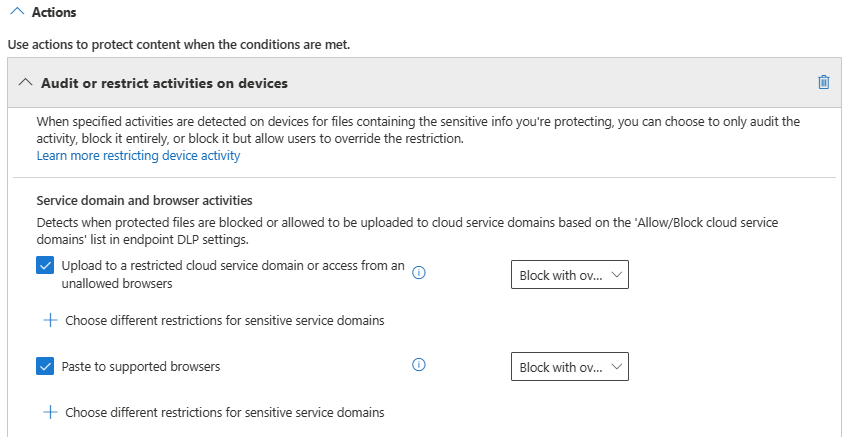

# Using Endpoint data loss prevention (preview)

This article walks you through three scenarios of creating and modifying a DLP policy that uses devices as a location.

## DLP settings

Before you get started you should set up your DLP settings which are applied to all DLP policies for devices.

### File path exclusions

You may want to exclude certain paths from monitoring, alerting, and protection on your devices because they are too noisy and don’t contain files you are interested in. Files in those locations will not be audited and any files that are created or modified in those locations will not be protected. You can configure path exclusions in DLP settings.

You can use this logic to construct your exclusion paths:

1. Begins with – matches every file path that starts with the defined prefix. For example, C:\Windows will match any file under C:\Windows folder and its subfolders.
2. Environment variables – defined paths can contain environment variables, for example, %AppData%\app123
3. Wildcards – defined paths can contain wildcards, for example, C:\Users\*\Desktop will match C:\Users\user1\Desktop, C:\Users\user1\Desktop and also C:\Users\user1\user1\Desktop

### Service domains

You can add domains to this list that Edge Chromium will refer to when enforcing the cloud upload action. If list mode is set to Block, then the domains in the list are essentially blacklisted and DLP will either generate a warning on upload attempt or block an upload attempt of files to those domain if the file matches the conditions of the enforced policy. If the list mode is set to Allow, then those domains are essentially whitelisted for upload while upload attempts to all domains not on the whitelist will either generate a warning on upload attempt or block an upload attempt if the file matches the conditions of the enforced policy.

### Unallowed apps

When a policy's 'Access by unallowed apps and browsers' setting is turned on and users attempt to use these apps to access a protected file, the activity will be allowed, blocked, or blocked but users can override the restriction. All activity is audited and available to review in activity explorer.

### Unallowed browsers

You add browsers, identified by their process names, that will be blocked from accessing files that match the conditions of an enforced  a DLP policy where Cloud upload is set to either warn or block. When these browsers are blocked from accessing a file, the end users will see a toast notification asking them to open the file through Edge.

## Endpoint DLP policy scenarios

To help familiarize you with Endpoint DLP features and how they surface in DLP policies, we've put together some scenarios for you to follow. All the Endpoint DLP content will be folded in to the main DLP content set when Endpoint DLP releases to general availability. 

> [!IMPORTANT]
> These Endpoint DLP scenarios are not the official procedures for creating and tuning DLP policies. Refer to the below topics when you need to work with DLP policies in general situations:
>- [Overview of data loss prevention](data-loss-prevention-policies.md)
>- [Get started with the default DLP policy](get-started-with-the-default-dlp-policy.md)
>- [Create a DLP policy from a template](create-a-dlp-policy-from-a-template.md)
>- [Create, test, and tune a DLP policy](create-test-tune-dlp-policy.md)

### Scenario 1: Create a policy from a template, audit only

These scenarios require that you already have devices onboarded and reporting into Activity explorer. If you haven't onboarded devices yet, see [Get started with Endpoint data loss prevention (preview)](endpoint-dlp-getting-started.md).

1. Open the [Data loss prevention page](https://compliance.microsoft.com/datalossprevention?viewid=policies).
2. Choose **Create policy (preview)**.
3. For this scenario, choose **Privacy**, then **U.S. Personally Identifiable Information (PII) Data** and choose **Next**.
4. Toggle the **Status** field to off for all locations except **Devices**. Choose **Next**.
5. Accept the default **Review and customize settings from the template** selection and choose **Next**.
6. Accept the default **Detect when this content is shared** and **With people outside my organization** selections and choose **Next**.
7. Accept the default **Protection actions** values and choose **Next**.
8. Select **Audit or restrict activities on Windows devices** and leave the actions set to **Audit only**. Choose **Next**.
9. Accept the default **I'd like to test it out first** value and choose **Show policy tips while in test mode**. Choose **Next**.
10. Review your settings and choose **Submit**.
11. The new DLP policy will appear in the policy list.
12. Check Activity explorer for data from the monitored endpoints. Set the location filter for devices. See, [Get started with activity explorer](data-classification-activity-explorer.md) if needed.
13. Attempt to share a test that contains content that will trigger the U.S. Personally Identifiable Information (PII) Data condition with someone outside your organization. This should trigger the policy.
14. Check Activity explorer for the event.

> [!NOTE]
> In the rule, **User notification** is turned on by default. This means that the when the user attempts to share the item, they will see a popup alerting them that the action matches the conditions in a policy. These notifications are useful for educating your users.

### Scenario 2: Modify the existing policy, set an alert

1. Open the [Data loss prevention page](https://compliance.microsoft.com/datalossprevention?viewid=policies).
2. Choose the **U.S. Personally Identifiable Information (PII) Data** policy that you created in scenario 1.
3. Choose **edit policy (preview)**.
4. Go to the **Advanced DLP rules** page and edit the **Low volume of content detected U.S. Personally Identifiable Inf**
5. Scroll down to the **Incident reports** section and set **Send an alert to admins when a rule match occurs** to **On**. Email alerts will be automatically sent to the administrator and anyone else you add to the list of recipients. 

6. For the purposes of this scenario, choose **Send alert every time an activity matches the rule**.
7. Choose **Save**.
8. Retain all your previous settings by choosing **Next** and then **Submit** the policy changes.
9. Attempt to share a test that contains content that will trigger the U.S. Personally Identifiable Information (PII) Data condition with someone outside your organization. This should trigger the policy.
10. Check Activity explorer for the event.

> [!NOTE]
> In the rule, **User notification** is turned on by default. This means that the when the user attempts to share the item, they will see a popup alerting them that the action matches the conditions in a policy. These notifications are useful for educating your users.

### Scenario 3: Modify the existing policy, block the action with allow override

1. Open the [Data loss prevention page](https://compliance.microsoft.com/datalossprevention?viewid=policies).
2. Choose the **U.S. Personally Identifiable Information (PII) Data** policy that you created in scenario 1.
3. Choose **edit policy (preview)**.
4. Go to the **Advanced DLP rules** page and edit the **Low volume of content detected U.S. Personally Identifiable Inf**
5. Scroll down to the **Audit or restrict activities on Windows device** section and for each activity set the corresponding action to  **Block with override**.

6. Scroll down to **User overrides** and set them to **On**.
7. Choose **Require a business justification to override**. 
 
8. Choose **Save**.
9. Repeat steps 4-7 for the **High volume of content detected U.S. Personally Identifiable Inf**.
10. Retain all your previous settings by choosing **Next** and then **Submit** the policy changes.
11. Attempt to share a test that contains content that will trigger the U.S. Personally Identifiable Information (PII) Data condition with someone outside your organization. This should trigger the policy.
12. Check Activity explorer for the event.

