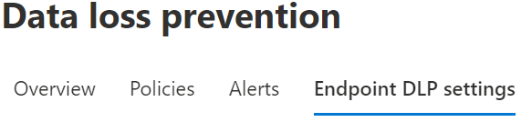

# Using Endpoint data loss prevention

This article walks you through four scenarios where you create and modify a DLP policy that uses devices as a location.

## DLP settings

Before you get started you should set up your DLP settings which are applied to all DLP policies for devices. You must configure these if you intend to create policies that enforce:

- cloud egress restrictions
- unallowed apps restrictions

Or

- If you want to exclude noisy file paths from monitoring

  > [!div class="mx-imgBorder"]
  > 

### File path exclusions

You may want to exclude certain paths from DLP monitoring, DLP alerting, and DLP policy enforcement on your devices because they are too noisy or don’t contain files you are interested in. Files in those locations will not be audited and any files that are created or modified in those locations will not be subject to DLP policy enforcement. You can configure path exclusions in DLP settings.

You can use this logic to construct your exclusion paths:

- Valid file path that ends with ‘\’, which means only files directly under folder.  For example: C:\Temp\

- Valid file path that ends with ‘\*’, which means only files under sub-folders, besides the files directly under the folder.  For example: C:\Temp\*

- Valid file path that ends without ‘\’ or ‘\*’, which means all files directly under folder and all sub-folders.  For example: C:\Temp

- A path with wildcard between ‘\’ from each side.  For example: C:\Users\*\Desktop\

- A path with wildcard between ‘\’ from each side and with ‘(number)’ to give exact number of subfolders.  For example: C:\Users\*(1)\Downloads\

- A path with SYSTEM environment variables.  For example: %SystemDrive%\Test\*

- A mix of all the above.  For example: %SystemDrive%\Users\*\Documents\*(2)\Sub\

### Unallowed apps

Unallowed apps is a list of applications that you create which will not be allowed to access a DLP protected file.
When a policy's **Access by unallowed apps** setting is turned on, and an app that is on the unallowed list attempts to access a protected file, the activity will be allowed, blocked, or blocked but users can override the restriction. All activity is audited and available to review in activity explorer.

> [!IMPORTANT]
> Do not include the path to the executable, but only the executable name (such as browser.exe).

#### Protect sensitive data from cloud synchronization apps

To prevent sensitive items from being synced to the cloud by cloud sync apps, like *onedrive.exe*, add the cloud sync app to the **Unallowed apps** list. When an unallowed cloud-sync app tries to accesses an item that is protected by a blocking DLP policy, DLP may generate repeated notifications. You can avoid these repeated notifications by enabling the **Auto-quarantine** option under **Unallowed apps**.  

##### Auto-quarantine (preview)

When enabled, Auto-quarantine kicks in when an unallowed app attempts to access a DLP protected sensitive item. Auto-quarantine moves the sensitive item to an admin configured folder and can leave a placeholder **.txt** file in the place of the original. You can configure the text in the placeholder file to tell users where the item was moved to and other pertinent information.  

You can use auto-quarantine to prevent an endless chain of DLP notifications for the user and admins. See, [Scenario 4: Avoid looping DLP notifications from cloud synchronization apps with auto-quarantine (preview)](#scenario-4-avoid-looping-dlp-notifications-from-cloud-synchronization-apps-with-auto-quarantine-preview).

### Unallowed Bluetooth apps

Prevent people from transferring files protected by your policies via specific Bluetooth apps.

### Browser and domain restrictions to sensitive data

Restrict sensitive files that match your policies from being shared with unrestricted cloud service domains.

#### Unallowed browsers

You add browsers, identified by their executable names, that will be blocked from accessing files that match the conditions of an enforced a DLP policy where the upload to cloud services restriction is set to block or block override. When these browsers are blocked from accessing a file, the end users will see a toast notification asking them to open the file through Edge Chromium.

#### Service domains

You can control whether sensitive files protected by your policies can be uploaded to specific service domains from Microsoft Edge.

If the list mode is set to **Block**, then user will not be able to upload sensitive items to those domains. When an upload action is blocked because an item matches a DLP policy, DLP will either generate a warning or block the upload of the sensitive item.

If the list mode is set to **Allow**, then users will be able to upload sensitive items ***only*** to those domains, and upload access to all other domains is not allowed.

> [!IMPORTANT]
> When the service restriction mode is set to "Allow", you must have at least one service domain configured before restrictions are enforced.

### Additional settings for endpoint DLP

#### Business justification in policy tips

You can control how users interact with the business justification option in DLP policy tip notifications. This option appears when users perform an activity that's protected by the **Block with override** setting in a DLP policy. This is a global setting. You can choose from one the following options:

- **Show default options and custom text box**: By default, users can select either a built-in justification, or enter their own text.
- **Only show default options**: Users can only select a built-in justification.
- **Only show custom text box**: Users can only enter their own justification. Only the text box will appear in the end user policy tip notification. 

##### Customizing the options in the drop-down menu

You can create up to five customized options that will appear when users interact with the policy notification tip by selecting the **Customize the options drop-down menu**. 

|Option |default text  |
|---------|---------|
|option 1    | **This is part of an established business workflow**  or you can enter customized text        |
|option 2  |**My manager has approved this action** or you can enter customized text         |
|option 3   |**Urgent access required; I'll notify my manager separately** or you can enter customized text          |
|Show false positive option     |**The information in these files is not sensitive** or you can enter customized text          |
|option 5    |**Other** or you can enter customized text         |

<!--See, [Scenario 5: Configure a policy to use the customized business justification](#scenario-5-configure-a-policy-to-use-the-customized-business-justification)-->

### Always audit file activity for devices

By default, when devices are onboarded, activity for Office, PDF, and CSV files is automatically audited and available for review in activity explorer. Turn this feature off if you want this activity to be audited only when onboarded devices are included in an active policy.

File activity will always be audited for onboarded devices, regardless of whether they are included in an active policy.

## Tying DLP settings together

With Endpoint DLP and Edge Chromium Web browser, you can restrict unintentional sharing of sensitive items to unallowed cloud apps and services. Edge Chromium understands when an item is restricted by an Endpoint DLP policy and enforces access restrictions.

When you use Endpoint DLP as a location in a properly configured DLP policy and the Edge Chromium browser, the unallowed browsers that you've defined in these settings will be prevented from accessing the sensitive items that match your DLP policy controls. Instead, users will be redirected to use Edge
Chromium and Edge Chromium, with its understanding of DLP imposed restrictions, can block or restrict activities when the conditions in the DLP policy are met.

To use this restriction you’ll need to configure three important pieces:

1. Specify the places – services, domains, IP addresses – that you want to prevent sensitive items from being shared to.

2. Add the browsers that aren’t allowed to access certain sensitive items when a DLP policy match occurs.

3. Configure DLP policies to define the kinds of sensitive items for which upload should be restricted to these places by turning on **Upload to cloud services** and **Access from unallowed browser**.

You can continue to add new services, apps, and policies to extend and augment your restrictions to meet your business needs and protect sensitive data. 

This configuration will help ensure your data remains safe while also avoiding unnecessary restrictions that prevent or restrict users from accessing and sharing non-sensitive items.

## Endpoint DLP policy scenarios

To help familiarize you with Endpoint DLP features and how they surface in DLP policies, we've put together some scenarios for you to follow.

> [!IMPORTANT]
> These Endpoint DLP scenarios are not the official procedures for creating and tuning DLP policies. Refer to the below topics when you need to work with DLP policies in general situations:

>- [Learn about data loss prevention](dlp-learn-about-dlp.md)
>- [Get started with the default DLP policy](get-started-with-the-default-dlp-policy.md)
>- [Create a DLP policy from a template](create-a-dlp-policy-from-a-template.md)
>- [Create, test, and tune a DLP policy](create-test-tune-dlp-policy.md)

### Scenario 1: Create a policy from a template, audit only

These scenarios require that you already have devices onboarded and reporting into Activity explorer. If you haven't onboarded devices yet, see [Get started with Endpoint data loss prevention](endpoint-dlp-getting-started.md).

1. Open the [Data loss prevention page](https://compliance.microsoft.com/datalossprevention?viewid=policies).

2. Choose **Create policy**.

3. For this scenario, choose **Privacy**, then **U.S. Personally Identifiable Information (PII) Data** and choose **Next**.

4. Toggle the **Status** field to off for all locations except **Devices**. Choose **Next**.

5. Accept the default **Review and customize settings from the template** selection and choose **Next**.

6. Accept the default **Protection actions** values and choose **Next**.

7. Select **Audit or restrict activities on Windows devices** and leave the actions set to **Audit only**. Choose **Next**.

8. Accept the default **I'd like to test it out first** value and choose **Show policy tips while in test mode**. Choose **Next**.

9. Review your settings and choose **Submit**.

10. The new DLP policy will appear in the policy list.

11. Check Activity explorer for data from the monitored endpoints. Set the location filter for devices and add the policy, then filter by policy name to see the impact of this policy. See, [Get started with activity explorer](data-classification-activity-explorer.md) if needed.

12. Attempt to share a test that contains content that will trigger the U.S. Personally Identifiable Information (PII) Data condition with someone outside your organization. This should trigger the policy.

13. Check Activity explorer for the event.

### Scenario 2: Modify the existing policy, set an alert

1. Open the [Data loss prevention page](https://compliance.microsoft.com/datalossprevention?viewid=policies).

2. Choose the **U.S. Personally Identifiable Information (PII) Data** policy that you created in scenario 1.

3. Choose **edit policy**.

4. Go to the **Advanced DLP rules** page and edit the **Low volume of content detected U.S. Personally Identifiable Inf**.

5. Scroll down to the **Incident reports** section and set **Send an alert to admins when a rule match occurs** to **On**. Email alerts will be automatically sent to the administrator and anyone else you add to the list of recipients. 

   > [!div class="mx-imgBorder"]
   > 
   
6. For the purposes of this scenario, choose **Send alert every time an activity matches the rule**.

7. Choose **Save**.

8. Retain all your previous settings by choosing **Next** and then **Submit** the policy changes.

9. Attempt to share a test that contains content that will trigger the U.S. Personally Identifiable Information (PII) Data condition with someone outside your organization. This should trigger the policy.

10. Check Activity explorer for the event.

### Scenario 3: Modify the existing policy, block the action with allow override

1. Open the [Data loss prevention page](https://compliance.microsoft.com/datalossprevention?viewid=policies).

2. Choose the **U.S. Personally Identifiable Information (PII) Data** policy that you created in scenario 1.

3. Choose **edit policy**.

4. Go to the **Advanced DLP rules** page and edit the **Low volume of content detected U.S. Personally Identifiable Inf**.

5. Scroll down to the **Audit or restrict activities on Windows device** section and for each activity set the corresponding action to  **Block with override**.

   > [!div class="mx-imgBorder"]
   > 
   
6. Choose **Save**.

7. Repeat steps 4-7 for the **High volume of content detected U.S. Personally Identifiable Inf**.

8. Retain all your previous settings by choosing **Next** and then **Submit** the policy changes.

9. Attempt to share a test that contains content that will trigger the U.S. Personally Identifiable Information (PII) Data condition with someone outside your organization. This should trigger the policy.

   You'll see a popup like this on the client device:

   > [!div class="mx-imgBorder"]
   > 

10. Check Activity explorer for the event.

### Scenario 4: Avoid looping DLP notifications from cloud synchronization apps with auto-quarantine (preview)

#### Before you begin

In this scenario, synchronizing files with the **Highly Confidential** sensitivity label to OneDrive is blocked. This is a complex scenario with multiple components and procedures. You will need:

- An AAD user account to target and an onboarded Windows 10 computer that is already synchronizing a local OneDrive folder with OneDrive cloud storage.
- Microsoft Word installed on the target Windows 10 computer
- Sensitivity labels configured and published. See, [Get started with sensitivity labels](get-started-with-sensitivity-labels.md#get-started-with-sensitivity-labels) and [Create and configure sensitivity labels and their policies](create-sensitivity-labels.md#create-and-configure-sensitivity-labels-and-their-policies)

There are three procedures.

1. Configure the Endpoint DLP Auto-quarantine settings.
2. Create a policy that blocks sensitive items that have the **Highly Confidential** sensitivity label.
3. Create a Word document on the Windows 10 device that the policy is targeted to, apply the label, and copy it to the user accounts local OneDrive folder that is being synchronized.  

#### Configure Endpoint DLP unallowed app and Auto-quarantine settings

1. Open [Endpoint DLP settings](https://compliance.microsoft.com/datalossprevention?viewid=globalsettings)

2. Expand **Unallowed apps**.

3. Choose **Add or edit unallowed apps** and add *OneDrive* as a display name and the executable name *onedrive.exe*  to disallow onedrive.exe from accessing items the the **Highly Confidential** label.

4. Select **Auto-quarantine** and **Save**.

5. Under **Auto-quarantine settings** choose **Edit auto-quarantine settings**.

6. Enable **Auto-quarantine for unallowed apps**.

7. Enter the path to the folder on local machines where you want the original sensitive files to be moved to. For example:
   
**'%homedrive%%homepath%\Microsoft DLP\Quarantine'** for the username *Isaiah langer* will place the moved items in a 

*C:\Users\IsaiahLanger\Microsoft DLP\Quarantine\OneDrive* folder and append a date and time stamp to the original file name.

> [!NOTE]
> DLP Auto-quarantine will create sub-folders for the files for each unallowed app. So if you have both *Notepad* and *OneDrive* in your unallowed apps list, a sub-folder will be created for **\OneDrive** and another sub-folder for **\Notepad**.

8. Choose **Replace the files with a .txt file that contains the following text** and enter the text you want in the placeholder file. For example for a file named *auto quar 1.docx*:
    
**%%FileName%% contains sensitive info that your organization is protecting with the data loss prevention (DLP) policy %%PolicyName%% and was moved to the quarantine folder: %%QuarantinePath%%.** 

will leave a .txt file that contains this message

*auto quar 1.docx contains sensitive info that your organization is protecting with the data loss prevention (DLP) policy and was moved to the quarantine folder: C:\Users\IsaiahLanger\Microsoft DLP\Quarantine\OneDrive\auto quar 1_20210728_151541.docx.*

9. Choose **Save**

#### Configure a policy to block OneDrive synchronization of files with the sensitivity label Highly Confidential

1. Open the [Data loss prevention page](https://compliance.microsoft.com/datalossprevention?viewid=policies).

2. Choose **Create policy**.

3. For this scenario, choose **Custom**, then **Custom policy** and choose **Next**.

4. Fill in the **Name** and **Description** fields, choose **Next**.

5. Toggle the **Status** field to off for all locations except **Devices**. If you have a specific end user account that you want to test this from, be sure to select it in the scope. Choose **Next**.

6. Accept the default **Create or customize advanced DLP rules** selection and choose **Next**.

7. Create a rule with these values:
    1. **Name** > *Scenario 4 Auto-quarantine*
    1. **Conditions** > **Content contains** > **Sensitivity labels** > **Highly Confidential**
    1.  **Actions** > **Audit or restrict activities on Windows devices** > **Access by unallowed apps** > **Block**. For the purposes of this scenario, clear all the other activities.
    1. **User notifications** > **On**
    1. **Endpoint devices** > Choose **Show users a policy tip notification when an activity** if not already enabled.
    
8. Choose **Save** and **Next**.

9. Choose **Turn it on right away**. Choose **Next**.

10. Review your settings and choose **Submit**.

> [!NOTE]
> Allow at least an hour for the new policy to be replicated and applied to the target Windows 10 computer.

11. The new DLP policy will appear in the policy list.

#### Test Auto-quarantine on the Windows 10 device

1. Login to the Windows 10 computer with the user account you specified in [Configure a policy to block OneDrive synchronization of files with the sensitivity label Highly Confidential](#configure-a-policy-to-block-onedrive-synchronization-of-files-with-the-sensitivity-label-highly-confidential) step 5.

2. Create a folder whose contents will not be synchronized to OneDrive. For example:

    *C:\auto-quarantine source folder*

3. Open Microsoft Word and create a file in the auto-quarantine source folder. Apply the **Highly confidential** sensitivity label. See, [Apply sensitivity labels to your files and email in Office](https://support.microsoft.com/topic/apply-sensitivity-labels-to-your-files-and-email-in-office-2f96e7cd-d5a4-403b-8bd7-4cc636bae0f9).

4. Copy the file you just created to your OneDrive synchronization folder. A user notification toast should appear telling you that the action is not allowed and that the file will be quarantined. For example, for user name *Isaiah Langer*, and a document titled *auto-quarantine doc 1.docx* you would see this message:

The message reads:

"Opening autoquarantine doc 1.docx with this app is not allowed. The file will be quarantined to 'C:\Users\IsaiahLanger\Microsoft DLP\OneDrive'"

5. Choose **Dismiss**

6. Open the place holder .txt file. It will be named **auto-quarantine doc 1.docx_*date_time*.txt**. 

7. Open the quarantine folder and confirm that the original file is there.
 
8. Check Activity explorer for data from the monitored endpoints. Set the location filter for devices and add the policy, then filter by policy name to see the impact of this policy. See, [Get started with activity explorer](data-classification-activity-explorer.md) if needed.

9. Check Activity explorer for the event.

### Scenario 5: Configure a policy to use the customized business justification

## See also

- [Learn about Endpoint data loss prevention](endpoint-dlp-learn-about.md)
- [Get started with Endpoint data loss prevention](endpoint-dlp-getting-started.md)
- [Learn about data loss prevention](dlp-learn-about-dlp.md)
- [Create, test, and tune a DLP policy](create-test-tune-dlp-policy.md)
- [Get started with Activity explorer](data-classification-activity-explorer.md)
- [Microsoft Defender for Endpoint](/windows/security/threat-protection/)
- [Onboarding tools and methods for Windows 10 machines](/microsoft-365/compliance/dlp-configure-endpoints)
- [Microsoft 365 subscription](https://www.microsoft.com/microsoft-365/compare-microsoft-365-enterprise-plans?rtc=1)
- [Azure Active Directory (AAD) joined](/azure/active-directory/devices/concept-azure-ad-join)
- [Download the new Microsoft Edge based on Chromium](https://support.microsoft.com/help/4501095/download-the-new-microsoft-edge-based-on-chromium)
- [Get started with the default DLP policy](get-started-with-the-default-dlp-policy.md)
- [Create a DLP policy from a template](create-a-dlp-policy-from-a-template.md)
