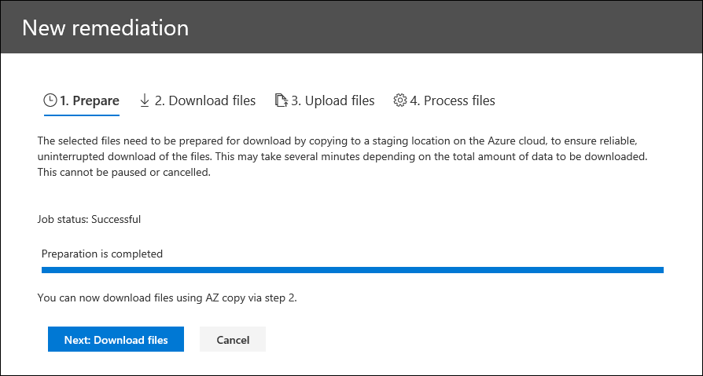
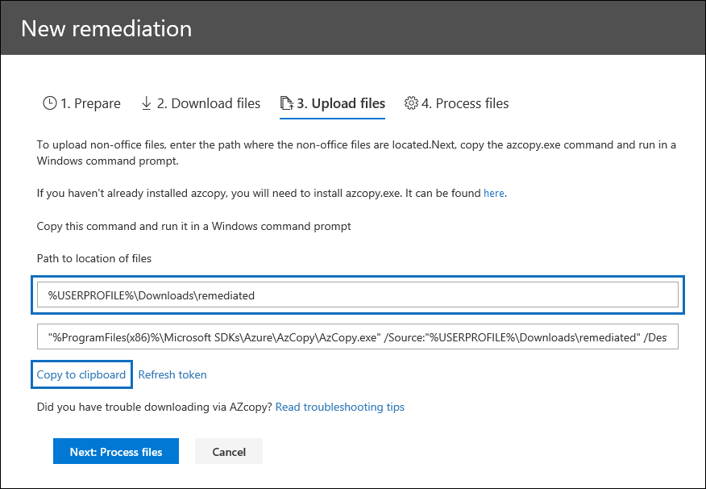

# Error remediation when processing data

Error remediation allows eDiscovery administrators the ability to rectify data issues that prevent Advanced eDiscovery from properly processing the content. For example, files that are password protected can't be processed since the files are locked or encrypted. Using error remediation, eDiscovery administrators can download files with such errors, remove the password protection, and then upload the remediated files.

Use the following workflow to remediate files with errors in Advanced eDiscovery cases.

## Create an error remediation session to remediate files with processing errors

>[!NOTE]
>If the the error remediation wizard is closed at any time during the following procedure, you can return to the error remediation session from the **Processing** tab by selecting **Remediations** in the **View** drop-down menu.

1. On the **Processing** tab in the Advanced eDiscovery case, select **Errors** in the **View** drop-down menu and then select a review set or the entire case in the **Scope** drop-down menu. This section displays all errors from the case or error from a specific review set.

   

2. Select the errors you want to remediate by clicking the radio button next to either the error type or file type.  In the following example, we're remediating a password protected file.

3. Click **New error remediation**.

    The error remediation workflow starts with a preparation stage where the files with errors are copied to a Microsoft-provided Azure Storage location so that you can download them to your local computer to remediate.

    

4. After the preparation is complete, click **Next: Download files** to proceed with download.

    

5. To download files, specify the **Destination path for download**. This is a path to the parent folder on your local computer where the file will be downloaded.  The default path, %USERPROFILE%\Downloads\errors, points to the logged-in user's downloads folder. You can change this path if desired. If you do change it, we recommend that you use a local file path for the best performance. Don't use a remote network path. For example, you could use the path **C:\Remediation**. 

   The path to the parent folder is automatically added to AzCopy command (as the value of the **/Dest** parameter).

6. Copy the predefined command by clicking **Copy to clipboard**. Open a Windows Command Prompt, paste the AzCopy command, and then press **Enter**.  

        

    > [!NOTE]
    > You must use AzCopy v8.1 to successfully use the command that's provided on the **Download files** page. You also must use AzCopy v8.1 to upload the files in step 10. To install this version of AzCopy, see [Transfer data with the AzCopy v8.1 on Windows](/previous-versions/azure/storage/storage-use-azcopy). If the supplied AzCopy command fails, please see [Troubleshoot AzCopy in Advanced eDiscovery](troubleshooting-azcopy.md).

    The files that you selected are downloaded to the location that you specified in step 5. In the parent folder (for example, **C:\Remediation**), the following subfolder structure is automatically created:

    `<Parent folder>\Subfolder 1\Subfolder 2\<file>`

    - *Subfolder 1* is named with the ID for the case or the review set, depending on the scope that you selected in step 1.

    - *Subfolder 2* is named with the file ID of the downloaded file

    - The downloaded file is located in *Subfolder 2* and is also named with the file ID.

    Here's an example of the folder path and error file name that's created when items are downloaded to the **C:\Remediation** parent folder:

    `C:\Remediation\232f8b7e-089c-4781-88c6-210da0615d32\d1459499146268a096ea20202cd029857d64087706e6d6ca2a224970ae3b8938\d1459499146268a096ea20202cd029857d64087706e6d6ca2a224970ae3b8938.docx`

    If multiple files are downloaded, each one is downloaded to a subfolder that's named with the file ID.

    > [!IMPORTANT]
    > When you upload files in step 9 and step 10, the remediated files must have that same filename and be located in the same subfolder structure. The subfolder and file names are used to associated the remediated file with the original error file. If the folder structure or file names are changed, you'll receive the following error: `Cannot apply Error Remediation to the current Workingset`. To prevent any issues, we recommend that keep the remediated files in the same parent folder and subfolder structure.

7. After downloading the files, you can remediate them with an appropriate tool. For password-protected files, there are several password cracking tools you can use. If you know the passwords for the files, you can open them and remove the password protection.

8. Return to Advanced eDiscovery and the error remediation wizard and then click **Next: Upload files**.  This moves to the next page where you can now upload the files.

    

9. Specify the parent folder where the remediated files are located in the **Path to location of files** text box. Again, the parent folder must have the same subfolder structure that was created when you downloaded the files.

    The path to the parent folder is automatically added to AzCopy command (as the value of the **/Source** parameter).

10. Copy the predefined command by clicking **Copy to clipboard**. Open a Windows Command Prompt, paste the AzCopy command, and then press **Enter**. upload the files.

    

11. After you run the AzCopy command, click **Next: Process files**.

    When processing is complete, you can go to review set and view the remediated files. 

## Remediating errors in container files

In situations when the contents of a container file (such as a .zip file) can't be extracted by Advanced eDiscovery, the containers can be downloaded and the contents expanded into the same folder in which the original container resides. The expanded files will be attributed to the parent container as if it was originally expanded by Advanced eDiscovery. The process works as described as above except for uploading a single file as the replacement file.  When you upload remediated files, don't include the original container file.

## Remediating errors by uploading the extracted text

Sometimes it's not possible to remediate a file to native format that Advanced eDiscovery can interpret. But you can replace the original file with a text file that contains the original text of the native file (in a process called *text overlay*). To do this, follow the steps described in this article but instead of remediating the original file in the native format, you would create a text file that contains the extracted text from the original file, and then upload the text file using the original filename appended with a .txt suffix. For example, you download a file during error remediation with the filename 335850cc-6602-4af0-acfa-1d14d9128ca2.abc. You open the file in the native application, copy the text, and then paste it into a new file named 335850cc-6602-4af0-acfa-1d14d9128ca2.abc.txt. When you do this, be sure to remove the original file in the native format from the remediated file location on your local computer before uploading the remediated text file to Advanced eDiscovery.

## What happens when files are remediated

When remediated files are uploaded, the original metadata is preserved except for the following fields: 

- ExtractedTextSize
- HasText
- IsErrorRemediate
- LoadId
- ProcessingErrorMessage
- ProcessingStatus
- Text
- WordCount
- WorkingsetId

For a definition of all metadata fields in Advanced eDiscovery, see [Document metadata fields](document-metadata-fields-in-advanced-ediscovery.md).