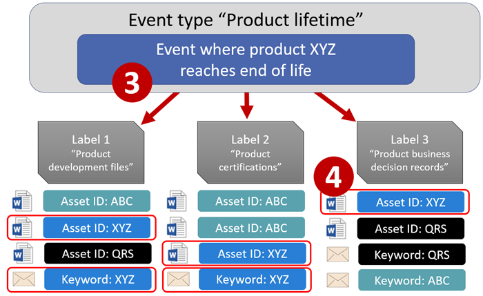
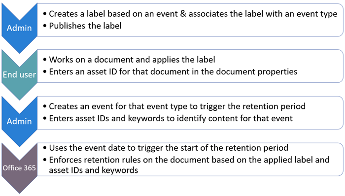
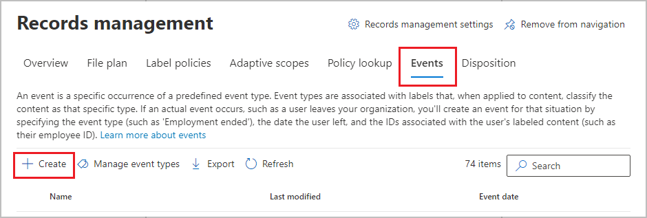
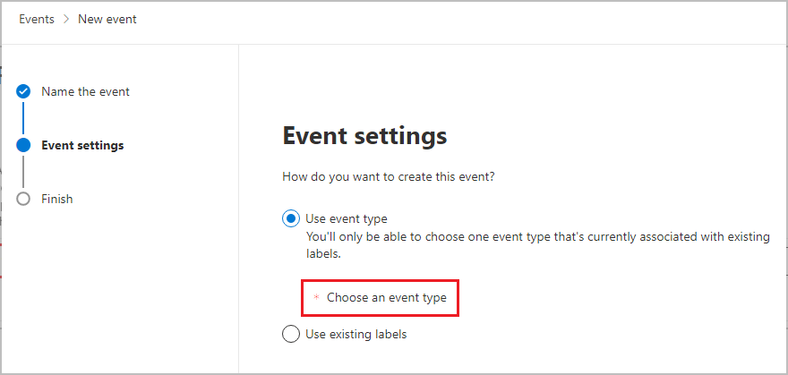
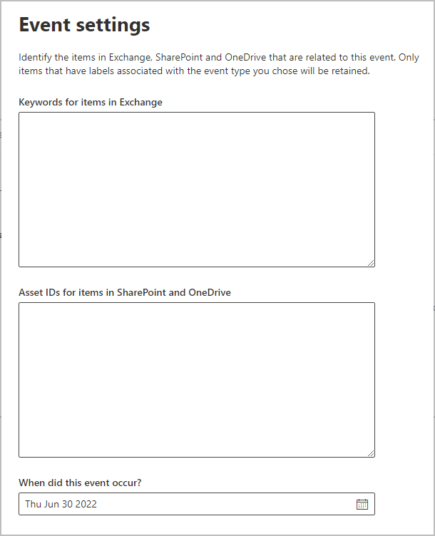
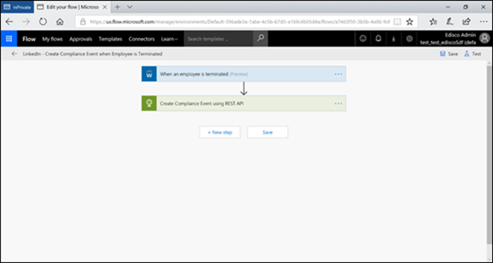
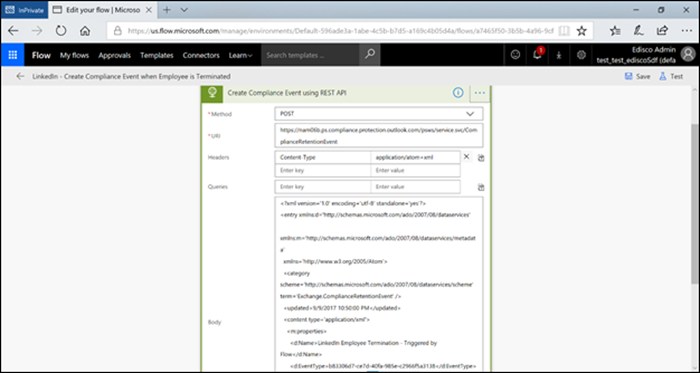

# Start retention when an event occurs

>*[Microsoft 365 licensing guidance for security & compliance](/office365/servicedescriptions/microsoft-365-service-descriptions/microsoft-365-tenantlevel-services-licensing-guidance/microsoft-365-security-compliance-licensing-guidance).*

When you retain content, the retention period is often based on the age of the content. For example, you might retain documents for seven years after they're created and then delete them. But when you configure [retention labels](retention.md#retention-labels), you can also base a retention period on when a specific type of event occurs. The event triggers the start of the retention period, and all content with a retention label applied for that type of event get the label's retention actions enforced on them.
  
Examples for using event-based retention:
  
- **Employees leaving the organization** Suppose that employee records must be retained for 10 years from the time an employee leaves the organization. After 10 years elapse, all documents related to the hiring, performance, and termination of that employee must be disposed. The event that triggers the 10-year retention period is the employee leaving the organization. 
    
- **Contract expiration** Suppose that all records related to contracts must be retained for five years from the time the contract expires. The event that triggers the five-year retention period is the expiration of the contract. 
    
- **Product lifetime** Your organization might have retention requirements related to the last manufacturing date of products for content such as technical specifications. In this case, the last manufacturing date is the event that triggers the retention period. 
    
Event-based retention is typically used as part of a records-management process. This means that:
  
- Retention labels based on events also usually mark items as a record, as a part of a records management solution. For more information, see [Learn about records management](records-management.md).

- A document that's been declared a record but whose event trigger has not yet happened is retained indefinitely (records can't be permanently deleted), until an event triggers that document's retention period.
    
- Retention labels based on events usually trigger a disposition review at the end of the retention period, so that a records manager can manually review and dispose of the content. For more information, see [Disposition of content](disposition.md).
    

A retention label based on an event has the same capabilities as any retention label in Microsoft 365. For more information, see [Learn about retention policies and retention labels](retention.md).

## Understanding the relationship between event types, labels, events, and asset IDs

To successfully use event-based retention, it's important to understand the relationship between event types, retention labels, events, and asset IDs as illustrated in the diagrams and the explanation that follows: 
  

  

  
1. You create retention labels for different types of content and then associate them with a type of event. For example, retention labels for different types of product files and records are associated with an event type named Product Lifetime because those records must be retained for 10 years from the time the product reaches its end of life.
    
2. Users (typically records managers) apply those retention labels to content and (for documents in SharePoint and OneDrive) enter an asset ID for each item. In this example, the asset ID is a product name or code used by the organization. Then, each product's records are assigned a retention label, and each record has a property that contains an asset ID. The diagram represents **all the content** for all product records in an organization, and each item bears the asset ID of the product whose record it is. 
    
3. Product Lifetime is the event type; a specific product reaching end of life is an event. When an event of that event type occurs—in this case, when a product reaches its end of life—you create an event that specifies:
    
   - An asset ID (for SharePoint and OneDrive documents)
    
   - Keywords (for Exchange items). In this example, the organization uses a product code in messages containing product records, so the keyword for Exchange items is functionally the same as the asset ID for SharePoint and OneDrive documents.
    
   - The date when the event occurred. This date is used as the start of the retention period. This date can be the current, a past, or a future date.

4. After you create an event, that event date is synchronized to all the content that has a retention label of that event type and that contains the specified asset ID or keyword. Like any retention label, this synchronization can take up to seven days. In the previous diagram, all the items circled in red have their retention period triggered by this event. In other words, when this product reaches its end of life, that event triggers the retention period for that product's records.

It's important to understand that if you don't specify an asset ID or keywords for an event, **all content** with a retention label of that event type will have its retention period triggered by the event. This means that in the previous diagram, all content would start being retained. This might not be what you intend.

Finally, remember that each retention label has its own retention settings. In this example, they all specify 10 years, but it's possible for an event to trigger retention labels where each label has a different retention period.
  
## How to set up event-driven retention

High-level workflow for event-driven retention:
  

  
> [!TIP]
> See [Use retention labels to manage the lifecycle of documents stored in SharePoint](auto-apply-retention-labels-scenario.md) for a detailed scenario about using managed properties in SharePoint to auto-apply retention labels and implement event-driven retention.

### Step 1: Create a label whose retention period is based on an event

To create and configure your retention label, see the instructions for [Create retention labels](./create-apply-retention-labels.md#step-1-create-retention-labels). But specific to event-based retention, on the **Define retention settings** page of the Create retention label wizard, after **Start the retention period based on**, select one of the default event types from the dropdown list, or create your own by selecting **Create new event type**:


An event type is simply a general description of an event that you want to associate with a retention label.

The default event types have **(event type)** after their name in the dropdown list for easier identification, and you can also see and create event type from the **Records management** > **Events** tab > **Manage event types**.

Event-based retention requires retention settings that:
  
- Retain the content.
    
- Delete the content automatically or trigger a disposition review at the end of the retention period.
  
Event-based retention is typically used for content that's declared a record, so this is a good time to check whether you also need to select the option that marks content as a [record](records-management.md#records).

If you're using an existing event type rather than creating a new event type, skip to step 3.

> [!NOTE]
> After you choose an event type and save the retention label, the event type cannot be changed.

### Step 2: Create a new event type for your label

For the retention settings, if you selected **Create new event type**, enter a name and description for your event type. Then select **Next**, **Submit**, and **Done**.

Back on the **Define retention settings** page, for **Start the retention period based on**, use the dropdown list to select the event type that you created.

  
### Step 3: Publish or auto-apply the event-based retention labels

Just like any retention label, you need to publish or auto-apply an event-based label, for it to be manually or automatically applied to content:
- [Create retention labels and apply them in apps](create-apply-retention-labels.md)
- [Apply a retention label to content automatically](apply-retention-labels-automatically.md)

### Step 4: Enter an asset ID

After an event-based label is applied to content, you can enter an asset ID for each item. For example, your organization might use:
  
- Product codes that you can use to retain content for only a specific product.
    
- Project codes that you can use to retain content for only a specific project.
    
- Employee IDs that you can use to retain content for only a specific person.
    
Asset ID is simply another document property that's available in SharePoint and OneDrive. Your organization might already use other document properties and IDs to classify content. If so, you can also use those properties and values when you create an event—see step 6 that follows. The important point is that you must use some *property:value* combination in the document properties to associate that item with an event type.
  

  
### Step 5: Create an event

When a particular instance of that event type occurs, such as a product reaches its end of life, go to the **Records management** > **Events** page in the Microsoft 365 compliance center, and select **+ Create** to create an event. You trigger the event by creating it, here.



Up to one million events are supported per tenant.

### Step 6: Choose the same event type used by the label in step 2

When you create the event, choose the same event type specified in the retention label settings in step 2. For example, if you selected **Product Lifetime** as your event type for the label settings, select **Product Lifetime** when you create the event. Only content with retention labels applied to it of that event type will have its retention period triggered.



Alternatively, if you need to create an event for multiple retention labels that have different event types, select the **Choose Existing Labels** option. Then, select the labels that are configured for the event types you want to associate with this event.

### Step 7: Enter keywords or an asset ID

Now you narrow the scope of the content by specifying asset IDs for SharePoint and OneDrive content, or keywords for Exchange content. For asset IDs, retention will be enforced only on content with the specified *property:value* pair. If an asset ID is not entered, all content with labels of that event type get the same retention date applied to them.

For example: If you're using the Asset ID property, enter `ComplianceAssetID:<value>` in the box for asset IDs shown below.
  
Your organization might have applied other properties and IDs to the documents related to this event type. For example, if you need to detect a specific product's records, the ID might be a combination of your custom property ProductID and the value "XYZ". In this case, you'd enter `ProductID:XYZ` in the box for asset IDs shown in the following picture.
  
For Exchange items, use keywords. You can use a query by using search operators such as AND, OR, and NOT. For more information, see [Keyword queries and search conditions for Content Search](keyword-queries-and-search-conditions.md).
  
Finally, choose the date when the event occurred; this date is used as the start of the retention period. After you create an event, that event date is synchronized to all the content with a retention label of that event type, asset ID, and keywords. As with any retention label, this synchronization can take up to seven days.
  


After creating an event, the retention settings take effect for the content that's already labeled and indexed. If the retention label is added to new content after the event is created, you must create a new event with the same details.

Deleting an event doesn't cancel the retention settings that are now in effect for the content that's already labeled. To do that, create a new event with the same details, but leave the date blank. 

## Use Content Search to find all content with a specific label or asset ID

After retention labels are assigned to content, you can use content search to find all content that's classified with a specific retention label or that contains a specific asset ID:
  
- To find all content with a specific retention label, choose the **Retention label** condition, and then enter the complete label name or part of the label name and use a wildcard. 
    
- To find all content with a specific asset ID, enter the **ComplianceAssetID** property and a value, using the format `ComplianceAssetID:<value>`. 
    
For more information, see [Keyword queries and search conditions for Content Search](keyword-queries-and-search-conditions.md).

## Automate events by using PowerShell

You can use a PowerShell script to automate event-based retention from your business applications. The PowerShell cmdlets available for event-based retention:
  
- [Get-ComplianceRetentionEventType](/powershell/module/exchange/get-complianceretentioneventtype)
    
- [New-ComplianceRetentionEventType](/powershell/module/exchange/new-complianceretentioneventtype)
    
- [Remove-ComplianceRetentionEventType](/powershell/module/exchange/remove-complianceretentioneventtype)
    
- [Set-ComplianceRetentionEventType](/powershell/module/exchange/set-complianceretentioneventtype)
    
- [Get-ComplianceRetentionEvent](/powershell/module/exchange/get-complianceretentionevent)
    
- [New-ComplianceRetentionEvent](/powershell/module/exchange/new-complianceretentionevent)
    

## Automate events by using a REST API

You can use a REST API to automatically create the events that trigger the start of the retention time.

A REST API is a service endpoint that supports sets of HTTP operations (methods), which provide create/retrieve/update/delete access to the service's resources. For more information, see [Components of a REST API request/response](/rest/api/gettingstarted/#components-of-a-rest-api-requestresponse). By using the Microsoft 365 REST API, events can be created and retrieved using the POST and GET methods.

There are two options for using the REST API:

- **Microsoft Power Automate or a similar application** to trigger the occurrence of an event automatically. Microsoft Power Automate is an orchestrator for connecting to other systems, so you don't need to write a custom solution. For more information, see the [Power Automate website](https://flow.microsoft.com/en-us/).

- **PowerShell or an HTTP client to call the REST API** to create events by using PowerShell (version 6 or later), which is part of a custom solution.

Before you use the REST API, as a global administrator, confirm the URL to use for the retention event call. To do this, run a GET retention event call by using the REST API URL:

```http
https://ps.compliance.protection.outlook.com/psws/service.svc/ComplianceRetentionEvent
```

Check the response code. If it's 302, get the redirected URL from the Location property of the response header and use that URL instead of `https://ps.compliance.protection.outlook.com/psws/service.svc/ComplianceRetentionEvent` in the instructions that follow.

The events that get automatically created can be confirmed by viewing them in the Microsoft 365 compliance center > **Records management** >  **Events**.

### Use Microsoft Power Automate to create the event

Create a flow that creates an event using the Microsoft 365 REST API:





#### Create an event

Sample code to call the REST API:

- **Method**: POST
- **URL**: `https://ps.compliance.protection.outlook.com/psws/service.svc/ComplianceRetentionEvent`
- **Headers**: Key = Content-Type, Value = application/atom+xml
- **Body**:
    
    ```xml
    <?xml version='1.0' encoding='utf-8' standalone='yes'?>
    
    <entry xmlns:d='http://schemas.microsoft.com/ado/2007/08/dataservices'
    
    xmlns:m='http://schemas.microsoft.com/ado/2007/08/dataservices/metadata'
    
    xmlns='http://www.w3.org/2005/Atom'>
    
    <category scheme='http://schemas.microsoft.com/ado/2007/08/dataservices/scheme' term='Exchange.ComplianceRetentionEvent' />
    
    <updated>9/9/2017 10:50:00 PM</updated>
    
    <content type='application/xml'>
    
    <m:properties>
    
    <d:Name>Employee Termination </d:Name>
    
    <d:EventType>99e0ae64-a4b8-40bb-82ed-645895610f56</d:EventType>
    
    <d:SharePointAssetIdQuery>1234</d:SharePointAssetIdQuery>
    
    <d:EventDateTime>2018-12-01T00:00:00Z </d:EventDateTime>
    
    </m:properties>
    
    </content>
    
    </entry>
    ```
    
- **Authentication**: Basic
- **Username**: "Complianceuser"
- **Password**:	"Compliancepassword"


##### Available parameters


|Parameters|Description|Notes|
|--- |--- |--- |
|<d:Name></d:Name>|Provide a unique name for the event,|Cannot contain trailing spaces or the following characters: % * \ & < \> \| # ? , : ;|
|<d:EventType></d:EventType>|Enter event type name (or Guid),|Example: "Employee termination". Event type has to be associated with a retention label.|
|<d:SharePointAssetIdQuery></d:SharePointAssetIdQuery>|Enter "ComplianceAssetId:" + employee ID|Example: "ComplianceAssetId:12345"|
|<d:EventDateTime></d:EventDateTime>|Event Date and Time|Format: yyyy-MM-ddTHH:mm:ssZ, Example: 2018-12-01T00:00:00Z
|

###### Response codes

| Response Code | Description       |
| ----------------- | --------------------- |
| 302               | Redirect              |
| 201               | Created               |
| 403               | Authorization Failed  |
| 401               | Authentication Failed |

##### Get events based on a time range

- **Method**: GET

- **URL**: `https://ps.compliance.protection.outlook.com/psws/service.svc/ComplianceRetentionEvent?BeginDateTime=2019-01-11&EndDateTime=2019-01-16`

- **Headers**: Key = Content-Type, Value = application/atom+xml

- **Authentication**: Basic

- **Username**: "Complianceuser"

- **Password**: "Compliancepassword"


###### Response codes

| Response Code | Description                   |
| ----------------- | --------------------------------- |
| 200               | OK, A list of events in atom+ xml |
| 404               | Not found                         |
| 302               | Redirect                          |
| 401               | Authorization Failed              |
| 403               | Authentication Failed             |

##### Get an event by ID

- **Method**: GET

- **URL**: `https://ps.compliance.protection.outlook.com/psws/service.svc/ComplianceRetentionEvent('174e9a86-74ff-4450-8666-7c11f7730f66')`

- **Headers**: Key = Content-Type, Value = application/atom+xml

- **Authentication**: Basic

- **Username**: "Complianceuser"

- **Password**: "Compliancepassword"

###### Response codes

| Response Code | Description                                      |
| ----------------- | ---------------------------------------------------- |
| 200               | OK, The response body contains the event in atom+xml |
| 404               | Not found                                            |
| 302               | Redirect                                             |
| 401               | Authorization Failed                                 |
| 403               | Authentication Failed                                |

##### Get an event by name

- **Method**: GET

- **URL**: `https://ps.compliance.protection.outlook.com/psws/service.svc/ComplianceRetentionEvent`

- **Headers**: Key = Content-Type, Value = application/atom+xml

- **Authentication**: Basic

- **Username**: "Complianceuser"

- **Password**: "Compliancepassword"


###### Response codes

| Response Code | Description                                      |
| ----------------- | ---------------------------------------------------- |
| 200               | OK, The response body contains the event in atom+xml |
| 404               | Not found                                            |
| 302               | Redirect                                             |
| 401               | Authorization Failed                                 |
| 403               | Authentication Failed                                |

### Use PowerShell or any HTTP client to create the event

PowerShell must be version 6 or later.

In a PowerShell session, run the following script:

```powershell
param([string]$baseUri)

$userName = "UserName"

$password = "Password"

$securePassword = ConvertTo-SecureString $password -AsPlainText -Force

$credentials = New-Object System.Management.Automation.PSCredential($userName, $securePassword)

$EventName="EventByRESTPost-$(([Guid]::NewGuid()).ToString('N'))"

Write-Host "Start to create an event with name: $EventName"

$body = "<?xml version='1.0' encoding='utf-8' standalone='yes'?>

<entry xmlns:d='http://schemas.microsoft.com/ado/2007/08/dataservices'

xmlns:m='http://schemas.microsoft.com/ado/2007/08/dataservices/metadata'

xmlns='http://www.w3.org/2005/Atom'>

<category scheme='http://schemas.microsoft.com/ado/2007/08/dataservices/scheme' term='Exchange.ComplianceRetentionEvent' />

<updated>7/14/2017 2:03:36 PM</updated>

<content type='application/xml'>

<m:properties>

<d:Name>$EventName</d:Name>

<d:EventType>e823b782-9a07-4e30-8091-034fc01f9347</d:EventType>

<d:SharePointAssetIdQuery>'ComplianceAssetId:123'</d:SharePointAssetIdQuery>

</m:properties>

</content>

</entry>"

$event = $null

try

{

$event = Invoke-RestMethod -Body $body -Method 'POST' -Uri "$baseUri/ComplianceRetentionEvent" -ContentType "application/atom+xml" -Authentication Basic -Credential $credentials -MaximumRedirection 0

}

catch

{

$response = $_.Exception.Response

if($response.StatusCode -eq "Redirect")

{

$url = $response.Headers.Location

Write-Host "redirected to $url"

$event = Invoke-RestMethod -Body $body -Method 'POST' -Uri $url -ContentType "application/atom+xml" -Authentication Basic -Credential $credentials -MaximumRedirection 0

}

}

$event | fl *

```
