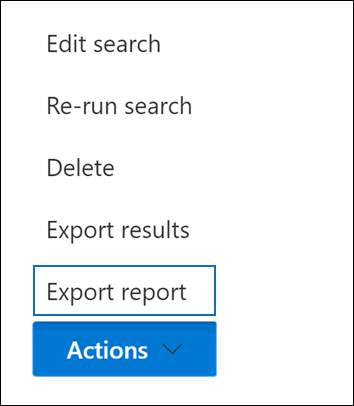
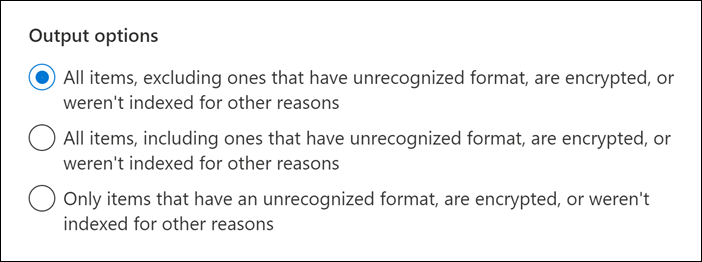

# Export a Content search report

Instead of exporting the full set of search results from a Content search in the Microsoft 365 compliance Center (or from a search that's associated with a Core eDiscovery case), you can export the same reports that are generated when you export the actual search results.
  
When you export a report, the report files are downloaded to a folder on your local computer that has the same name as the Content Search, but that's appended with *_ReportsOnly*. For example, if the Content Search is named  *ContosoCase0815*, then the report is downloaded to a folder named *ContosoCase0815_ReportsOnly*. For a list of documents that are included in the report, see [What's included in the report](#whats-included-in-the-report).

## Before you export a search report

- To export a search report, you have to be assigned the Compliance Search management role in Security & Compliance Center. This role is assigned by default to the built-in eDiscovery Manager and Organization Management role groups. For more information, see [Assign eDiscovery permissions](assign-ediscovery-permissions.md).

- When you export a report, the data is temporarily stored in an Azure Storage location in the Microsoft cloud before it's downloaded to your local computer. Be sure that your organization can connect to the endpoint in Azure, which is **\*.blob.core.windows.net** (the wildcard represents a unique identifier for your export). The search results data is deleted from the Azure Storage location two weeks after it's created.

- The computer you use to export the search results has to meet the following system requirements:

  - Latest version of Windows (32-bit or 64-bit)

  - Microsoft .NET Framework 4.7

- You have to use one of the following supported browsers to run the eDiscovery Export Tool1:

  - Microsoft Edge 2

    OR

  - Microsoft Internet Explorer 10 and later versions

  > [!NOTE]
  > 1 Microsoft doesn't manufacture third-party extensions or add-ons for ClickOnce applications. Exporting search results using an unsupported browser with third-party extensions or add-ons isn't supported. 
  > 2 As a result of recent changes to Microsoft Edge, ClickOnce support is no longer enabled by default. For instructions on enabling ClickOnce support in Edge, see [Use the eDiscovery Export Tool in Microsoft Edge](configure-edge-to-export-search-results.md).

- If the estimated total size of the results returned by search exceeds 2 TB, exporting the reports fails. To successfully export the reports, try to narrow the scope and rerun the search so the estimated size of the results is less than 2 TB.

- If the results of a search are older than 7 days and you submit an export report job, an error message is displayed prompting you to rerun the search to update the search results. If this happens, cancel the export, rerun the search, and then start the export again.

- Exporting search reports counts against the maximum number of exports running at the same time and the maximum number of exports that a single user can run. For more information about export limits, see [Export Content search results](export-search-results.md#export-limits).
  
## Step 1: Generate the report for export

The first step is to prepare the report for downloading to your computer exporting. When you export the report, the report documents are uploaded to an Azure Storage area in the Microsoft cloud.
  
1. In the Microsoft 365 compliance center, select the Content search that you want to export the report from.
  
2. On the **Actions** menu at the bottom of the search flyout page, click **Export report**.

   

   The **Export report** flyout page is displayed. The export report options available to export information about the search depend on whether search results are located in mailboxes or sites or a combination of both.
  
3. Under **Output options**, choose one of the following options:
  
   

    - **All items, excluding ones that have unrecognized format, are encrypted, or weren't indexed for other reasons**. This option only exports information about indexed items.
  
    - **All items, including ones that have unrecognized format, are encrypted, or weren't indexed for other reasons**. This option exports information about indexed and unindexed items.
  
    - **Only items that have an unrecognized format, are encrypted, or weren't indexed for other reasons**. This option only exports information about unindexed items.

4. Configure the **Enable de-duplication for Exchange content** option.
  
   - If you select this option, the count of duplicate messages (before de-duplication and after de-duplication) is included in the export summary report. Also, only one copy of a message will be included in the manifest.xml file. But the export results report will contain a row for every copy of a duplicate message so that you can identify the mailboxes that contain a copy of the duplicate message. For more information about the exported reports, see [What's included in the report](#whats-included-in-the-report).

   - If you don't select this option, the export reports will contain information about all messages returned by the search, including duplicates.

     For more information about de-duplication and how duplicate items are identified, see [De-duplication in eDiscovery search results](de-duplication-in-ediscovery-search-results.md).

5. Click **Generate report**.

   The search reports are prepared for downloading, which means the report documents are uploaded to an Azure Storage location in the Microsoft cloud. This may take several minutes.

See the next section for instructions to download the exported search reports.
  
## Step 2: Download the report

The next step is to download the report from the Azure Storage area to your local computer.

1. On the **Content search** page in the Microsoft 365 compliance center, select the **Exports** tab
  
   You may have to click **Refresh** to update the list of export jobs so that it shows the export job you created. Export report jobs have the same name as the corresponding search with **_ReportsOnly** appended to the search name.
  
2. Select the export job that you created in Step 1.

3. On the **Export report** flyout page under **Export key**, click **Copy to clipboard**. You use this key in step 6 to download the search results.
  
   > [!IMPORTANT]
   > Because anyone can install and start the eDiscovery Export tool, and then use this key to download the search report, be sure to take precautions to protect this key just like you would protect passwords or other security-related information.

4. At the top of the flyout page, click **Download results**.

5. If you're prompted to install the **eDiscovery Export Tool**, click **Install**.

6. In the **eDiscovery Export Tool**, do the following:

   

   1. Paste the export key that you copied in step 3 in the appropriate box.
  
   2. Click **Browse** to specify the location where you want to download the search report files.

7. Click **Start** to download the search results to your computer.
  
    The **eDiscovery Export Tool** displays status information about the export process, including an estimate of the number (and size) of the remaining items to be downloaded. When the export process is complete, you can access the files in the location where they were downloaded.
  
## What's included in the report

When you generate and export a report about the results of a Content search, the following documents are downloaded:
  
- **Export summary:** An Excel document that contains a summary of the export. This includes information such as the number of content sources that were searched, the number of search results from each content location, the estimated number of items, the actual number of items that would be exported, and the estimated and actual size of items that would be exported.

   If you include unindexed items when exporting the report, the number of unindexed items are included in the total number of estimated search results and in the total number of downloaded search results (if you were to export the search results) that are listed in the export summary report. In other words, the total number of items that would be downloaded is equal to the total number of estimated results and the total number of unindexed items.
  
- **Manifest:** A manifest file (in XML format) that contains information about each item included in the search results. If you enabled the de-duplication option, duplicate message are not included in the manifest file.

- **Results:** An Excel document that contains a row with information about each indexed item that would be exported with the search results. For email, the result log contains information about each message, including: 

  - The location of the message in the source mailbox (including whether the message is in the primary or archive mailbox).

  - The date the message was sent or received.

  - The Subject line from the message.

  - The sender and recipients of the message.

  For documents from SharePoint and OneDrive for Business sites, the results log contains information about each document, including:

  - The URL for the document.

  - The URL for the site collection where the document is located.

  - The date that the document was last modified.

  - The name of the document (which is located in the Subject column in the result log).

  > [!NOTE]
  > The number of rows in the **Results** report should be equal to the total number of search results minus the total number of items listed in the **Unindexed Items** report.
  
- **Trace.log**: A trace log that contains detailed logging information about the export process and can help uncover issues during export. If you open a ticket with Microsoft Support about an issue related to exporting search reports, you may be asked to provide this trace log.

- **Unindexed items:** An Excel document that contains information about any unindexed items included in the search results. If you don't include unindexed items when you generate the search results report, this report will still be downloaded, but will be empty.
