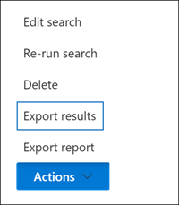
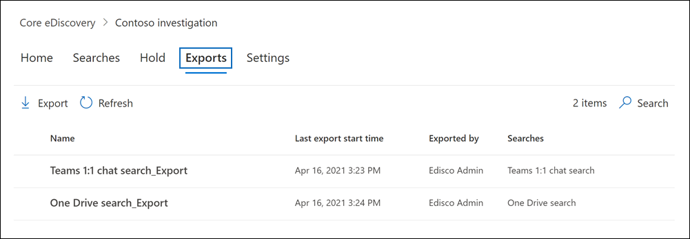

# Export content from a eDiscovery (Standard) case

After a search associated with a Microsoft Purview eDiscovery (Standard) case is successfully run, you can export the search results. When you export search results, mailbox items are downloaded in PST files or as individual messages. When you export content from SharePoint and OneDrive for Business sites, copies of native Office documents and other documents are exported. A Results.csv file that contains information about every item that's exported and a manifest file (in XML format) that contains information about every search result is also exported.
  
## Export search results

1. Go to the <a href="https://go.microsoft.com/fwlink/p/?linkid=2077149" target="_blank">Microsoft Purview compliance portal</a> and sign in using the credentials for user account that has been assigned the appropriate eDiscovery permissions.

2. In the left navigation pane of the compliance portal, select **Show all**, and then select **eDiscovery** > <a href="https://go.microsoft.com/fwlink/p/?linkid=2174007" target="_blank">**eDiscovery (Standard)**</a>.

3. On the **eDiscovery (Standard)** page, click the name of the case that you want to create the hold in.

4. On the **Home** page for the case, click the **Searches** tab.

5. On the **Actions** menu at the bottom of the flyout page, click **Export results**.

   

   The workflow to export the results of a search associated with a eDiscovery (Standard) case is that same as exporting the search results for a search on the **Content search** page. For step-by-step instructions, see [Export content search results](export-search-results.md).

   > [!NOTE]
   > When you export search results, you have the option to enable de-duplication so that only one copy of an email message is exported even though multiple instances of the same message might have been found in the mailboxes that were searched. For more information about de-duplication and how duplicate items are identified, see [De-duplication in eDiscovery search results](de-duplication-in-ediscovery-search-results.md).

   After you start the export, the search results are prepared for downloading, which means they are transferred to a Microsoft-provided Azure Storage location in the Microsoft cloud.
  
6. Click the **Exports** tab in the case to display the list of export jobs.
  
   

   You may have to click **Refresh** to update the list of export jobs so that it shows the export job you created. Export jobs have the same name as the corresponding search with **_Export** appended to the search name.

7. Click the export job you created to display status information on the flyout page. This information includes the percentage of items that have been transferred to the Azure Storage location.

8. After all items have been transferred, click **Download results** to download the search results to your local computer. For more information downloading search results, see Step 2 in [Export content search results](export-search-results.md#step-2-download-the-search-results)

> [!NOTE]
> The exported search results must be downloaded within 14 days after you created the export job.

### More information about exporting searches from a case

- For more information about the export files that are included when you export search results, see [Export a Content search report](export-a-content-search-report.md#whats-included-in-the-report).

- If you restart the export, any changes to the queries of the searches that make up the export job won't affect the search results that are retrieved. When you restart an export, the same combined search query job that was run when the export job was created will be run again.

- Also, if you restart an export, the search results that are copied to the Azure Storage location overwrites the previous results. The previous results that were copied won't be available to be downloaded.
