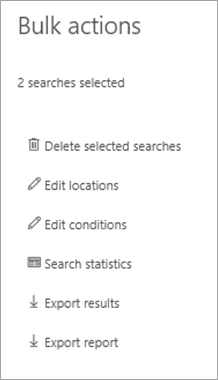

# Export content from a Core eDiscovery case

After a search is successfully run, you can export the search results. When you export search results, mailbox items are downloaded in PST files or as individual messages. When you export content from SharePoint and OneDrive for Business sites, copies of native Office documents and other documents are exported. A Results.csv file that contains information about every item that's exported and a manifest file (in XML format) that contains information about every search result is also exported.
  
You can export the results of a [single search associated with a case](#export-the-results-of-a-single-search) or you can export the results of [multiple searches associated with a case](#export-the-results-of-multiple-searches).
  
## Export the results of a single search

1. Go to [https://compliance.microsoft.com](https://compliance.microsoft.com) and sign in using the credentials for user account that has been assigned the appropriate eDiscovery permissions.

2. In the left navigation pane of the Microsoft 365 compliance center, click **Show all**, and then click **eDiscovery > Core**.

3. On the **Core eDiscovery** page, select the case that you want to export search results from, and then click **Open case**.

4. On the **Home** page for the case, click the **Searches** tab.

5. In the list of searches for the case, click the search that you want to export search results from, and then click **Export results** on the flyout.

    The **Export results** page is displayed. 

    
  
    The workflow to export the results of a search associated with a Core eDiscovery case is that same as exporting the search results for a search on the **Content search** page. For step-by-step instructions, see [Export content search results](export-search-results.md).

    > [!NOTE]
    > When you export search results, you have the option to enable de-duplication so that only one copy of an email message is exported even though multiple instances of the same message might have been found in the mailboxes that were searched. For more information about de-duplication and how duplicate items are identified, see [De-duplication in eDiscovery search results](de-duplication-in-ediscovery-search-results.md).

    After you start the export, the search results are prepared for downloading, which means they are uploaded to a Microsoft-provided Azure Storage location in the Microsoft cloud.
  
6. Click the **Export** tab to display the list of export jobs for the case.
  
    You may have to click **Refresh** to update the list of export jobs so that it shows the export job you created. Export jobs have the same name as the corresponding search with **_Export** appended to the search name.

7. Click the export job you created to display status information on the flyout page. This information includes the percentage of items that have been transferred to the Azure Storage location.

8. After all items have been transferred, click **Download results** to download the search results to your local computer. For more information downloading search results, see Step 2 in [Export content search results](export-search-results.md#step-2-download-the-search-results)

## Export the results of multiple searches

As an alternative to exporting the results of a single search associated with a case, you can export the results of multiple searches from the same case in a single export job. Exporting the results of multiple searches is faster and easier than exporting the results one search at a time.
  
> [!NOTE]
> You can't export the results of multiple searches if one of those searches was configured to search locations on hold.

1. Go to [https://compliance.microsoft.com](https://compliance.microsoft.com) and sign in using the credentials for user account that has been assigned the appropriate eDiscovery permissions.

2. In the left navigation pane of the Microsoft 365 compliance center, click **Show all**, and then click **eDiscovery > Core**.

3. On the **Core eDiscovery** page, select the case that you want to export search results from, and then click **Open case**.

4. On the **Home** page for the case, click the **Searches** tab.
    
5. In the list of searches for the case, select the checkbox next to two or more searches you want to export search results from. 

   The **Bulk actions** flyout page appears. 

    
  
6. Click **Export results**.

   The **Export results** page is displayed. 

    
  
    At this point, the workflow to export the results of multiple searches associated with a Core eDiscovery case is that same as exporting the search results for a single search. See step 5 in the previous section.

### More information about exporting the results of multiple searches

- When you export the results of multiple searches, the search queries from all the searches are combined by using **OR** operators, and then the combined search is started. The estimated results of the combined search are displayed in the flyout page of the selected export job. The search results are then copied to the Azure Storage location in the Microsoft cloud. The status of the copy job is also displayed on the flyout page. As previously stated, after all the search results have been copied, you can download them to a local computer.

- The maximum number of keywords from queries for all searches that you want to export is 500. This is the same limit for a single search. That's because the export job combines all the search queries by using the **OR** operator. If you exceed this limit, an error will be returned. In this case, you have to export the results from fewer searches or simplify the search queries of the original searches that you want to export.

- The search results that are exported are organized by the content location the item was found in. That means a content location in the export results may have items returned by different searches. For example, if you choose to export email messages in one PST file for each mailbox, the PST file might have results from multiple searches.

- If the same email item or document from the same content location is returned by more than one of the searches that you export, only one copy of the item will be exported.

- You can't edit an export for multiple searches after you create it. For example, you can't add or remove searches from the export job. You have to create an export job to change which search results are exported. After an export job is created, you only can download the results to a computer, restart the export, or delete the export job.

- If you restart the export, any changes to the queries of the searches that make up the export job won't affect the search results that are retrieved. When you restart an export, the same combined search query job that was run when the export job was created will be run again.

- Also, if you restart an export, the search results that are copied to the Azure Storage location overwrites the previous results. The previous results that were copied won't be available to be downloaded.
