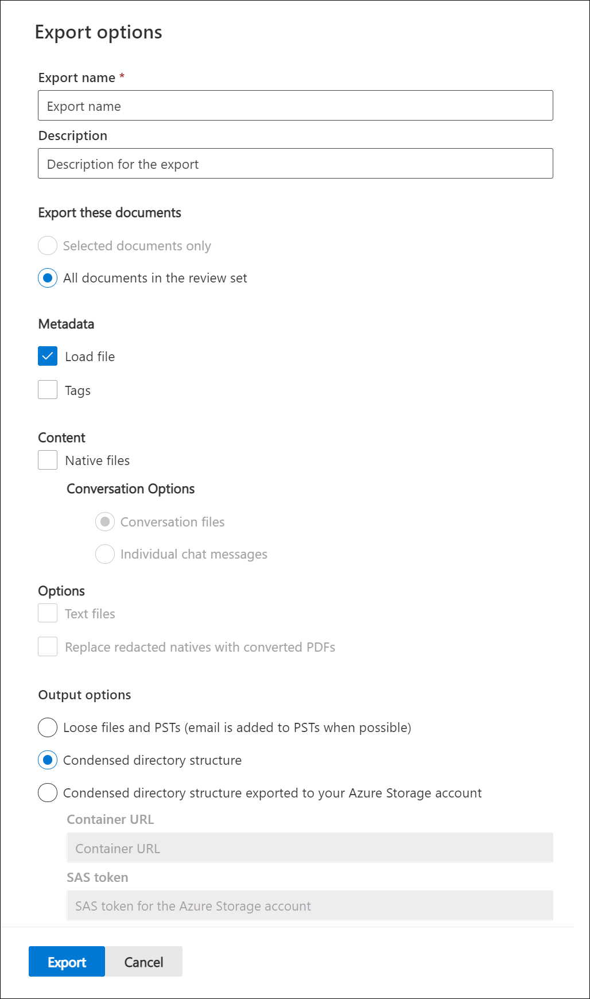

# Export documents from a review set in Advanced eDiscovery

Export allows users to customize the content that is included in the download package when you export document from a review set in Advanced eDiscovery.

To export documents from a review set:

1. In the Microsoft 365 compliance center, open the Advanced eDiscovery case, select the **Review sets** tab, and then select the review set that you want to export.

2. In the review set, click **Action** > **Export**.

   The Export tool displays the flyout page with the settings to configure the export. Some options are selected by default, but you can change these. See the following section for descriptions of the export options that you can configure.

   

3. After you configure the export, click **Export** to start the export process. Depending on the option that you selected in **Output options** section, you can access the export files by direct download or in your organization's Azure Storage account.

> [!NOTE]
> Export jobs are retained for the life of the case. However, you must download the content from an export job within 30 days after the export job is complete.

## Export options

Use the following options to configure the export. Not all options are allowed for some output options, most notably, export of text files and redacted PDFs are not allowed when exporting to the PST format.

- **Export name**: Name of the export job. This will be used to name the ZIP files that will be downloaded.

- **Description**: Free-text field for you to add a description.

- **Export these documents**

  - Selected documents only: This option exports only the documents that are currently selected. This option is only available when items are selected in a review set.
  - All filtered documents: This option exports the documents in an active filter. This option is only available when a filter is applied to the review set.
  - All documents in the review set: This option exports all documents in the review set.

- **Output options**: Exported content is either available for download directly through a web browser or can be sent to an Azure Storage account. The first two options enable direct download.
  
  - Reports only: Only the summary and load file are created.
  - Loose files and PSTs (email is added to PSTs when possible): Files are exported in a format that resembles the original directory structure seen by users in their native applications.  For more information, see the [Loose files and PST export structure](#loose-files-and-pst-export-structure) section.
  - Condensed directory structure: Files are exported and included in the download.
  - Condensed directory structure exported to your Azure Storage account: Files are exported to your organization's Azure Storage account. For this option, you have to provide the URL for the container in your Azure Storage account to export the files to. You also have to provide the shared access signature (SAS) token for your Azure Storage account. For more information, see [Export documents in a review set to an Azure Storage account](download-export-jobs.md).

- **Include**
  - Tags: When selected, tagging information is included in the load file.
  - Text files: This option includes the extracted text versions of native files in the export.
  - Replace redacted natives with converted PDFs: If redacted PDF files are generated during review, these files are available for export. You can choose to export only the native files that were redacted (by not selecting this option) or you can select this option to export the PDF files that contain the actual redactions.

## The following sections describe the folder structure for loose files and condensed directory structure options

Exports are partitioned into ZIP files with a maximum size of uncompressed content of 75 GB. If the export size is less than 75 GB, the export will consist of a summary file and a single ZIP file. For exports exceeding 75 GB of uncompressed data, multiple ZIP files will be created. Once downloaded, the ZIP files can be uncompressed into a single location to recreate the full export.

### Loose files and PST export structure

If you select this export option, the exported content is organized in the following structure:

- Summary.csv: Includes a summary of the content exported from the review set
- Root folder: This folder in named [Export Name] x of z.zip and will be repeated for each ZIP file partition.
  - Export_load_file_x of z.csv: The metadata file.
  - Warnings and errors x of z.csv: This file includes information about errors encountered when trying to export from the review set.
  - Exchange: This folder contains all content from Exchange stored in PST files. Redacted PDF files cannot be included with this option. If an attachment is selected in the review set, the parent email will be exported with the attachment attached.
  - SharePoint: This folder contains all native content from SharePoint in a native file format. Redacted PDF files cannot be included with this option.

### Condensed directory structure

- Summary.csv: Includes a summary of the content exported from the review set
- Root folder: This folder in named [Export Name] x of z.zip and will be repeated for each ZIP file partition.
  - Export_load_file_x of z.csv: The metadata file and also includes the location of each file that is stored in the ZIP file.
  - Warnings and errors x of z.csv: This file includes information about errors encountered when trying to export from the review set.
  - NativeFiles: This folder contains all the native files that were exported. Natives files are replaced with redacted PDFs if you selected the *Replace redacted natives with converted PDFs* option.
  - Error_files: This folder contains files that had either extraction or other processing error. The files will be placed into separate folders, either ExtractionError or ProcessingError. These files are listed in the load file.
  - Extracted_text_files: This folder contains all of the extracted text files that were generated at processing.

### Condensed directory structure exported to your Azure Storage Account

This option uses the same general structure as the *Condensed directory structure*, however the contents is not zipped and the data is saved to your Azure Storage account. This option is generally used when working with a third-party eDiscovery provider. For details about how to use this option, see [Export documents in a review set to an Azure Storage account](download-export-jobs.md).
