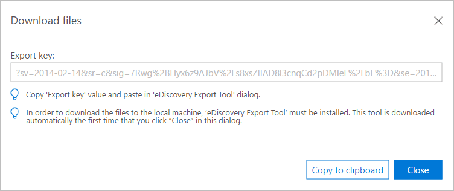
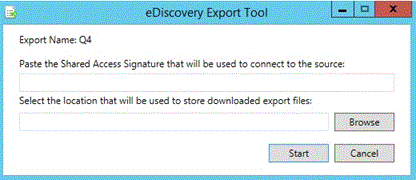

# Export results in Advanced eDiscovery (classic)

> [!NOTE]
> Advanced eDiscovery requires an Office 365 E3 with the Advanced Compliance add-on or an E5 subscription for your organization. If you don't have that plan and want to try Advanced eDiscovery, you can [sign up for a trial of Office 365 Enterprise E5](https://go.microsoft.com/fwlink/p/?LinkID=698279). 
  
This topic describes the Advanced eDiscovery Export Setup options.
  
 **In this topic:**
  
- [Defining export batches and sessions](export-results-in-advanced-ediscovery.md#BK_Define)
    
- [Incremental and additional exports](export-results-in-advanced-ediscovery.md#BK_IncrementalReports)
    
- [Set up batch export parameters](export-results-in-advanced-ediscovery.md#BK_SetUpExport)
    
- [Export report output files](export-results-in-advanced-ediscovery.md#BK_ExportOutputFIles)
    
## Defining export batches and sessions

An export batch allows export processing using a set of defined parameters. Advanced eDiscovery enables you to define batches to customize each export.
  
Parameters are defined per export batch. A batch named "Export batch 01" is created by default for the first batch of a case. You can also edit the batch name and description.
  
An export session is an execution of Advanced eDiscovery Export within an export batch.
  
## Incremental and additional exports

You can run multiple export sessions within an export batch, to ensure consistent results based on the same export template and parameters. For each session within a batch, you can export analytics for newly processed case data and process each "incrementally."
  
In order to export using a different set of parameters, you first need to create a new batch. The first session in the new batch will produce results for files processed in the case so far, whether or not these files were imported and processed over one or multiple Imports. Each batch recalculates pivots, similarity, inclusives, etc. Sessions use the parameters defined for the batch and do not recalculate pivots, similarity, inclusives, etc. for each session execution.
  
For example, assume a case was imported and its data analyzed. In order to retrieve Near-duplicates and Email Threading results for the incremental data, click **Create export session** in the same batch that was previously used to export data. 
  
## Set up batch export parameters

The eDiscovery Export Tool is used to export search results from Advanced eDiscovery to your local computer.
  
1. In Advanced eDiscovery, select a Case and click **Export** \> **Setup**.
    
    - From the **Export batch** list, select the batch name or export results to Export batch 01, (the default batch). 
    
    - To export results for new files that you added to an existing case, continue with your current batch. To create a session in the batch, select the same batch number and click **Create export session** You can use this option to export the same parameters as the previous batch, in an incremental manner. 
    
    - To export to a new batch, click **Add** and enter a new name in **Batch name** (or accept the default) and a description in **Batch description**. Click **OK**.
    
    - To edit a batch name or description, select the name in **Export batch**, click **Edit** , and then modify the fields.
    
      > [!NOTE]
      > After you've run sessions for an export batch, they cannot be deleted. In addition, only some parameters can be edited once the first session is run. 
  
    - To create a duplicate export batch, choose **Duplicate export batch**  and enter a name and a description for the duplicate batch in the panel. 
    
    - To delete an export batch, choose **Delete** .
    
    - To view the history of a batch, choose **Batch history** .
    
2. Under **Population**, select **Include only files above Relevance cut-off score** and/or **Refine export batch** if you want to fine-tune the settings for your export batch. 
    
3. If you select **Include only files above Relevance cut-off score**, then the **Issue** is enabled. If the file's relevance score is higher than the cut-off score for the selected issue, the file will be exported unless it's excluded by the 'For review' filter. 
  
    If you select **Refine export batch**, the **De-dupe** and Filter by 'For review' field radio buttons are enabled. If you choose **De-dupe**, then duplicate files will be filtered out according to the policy defined [Case level (default): from every set of duplicate files in the entire case, all but one file will be de-duped. Custodian level: from every set of duplicate files of the same custodian, all but one file will be de-duped.] The export output contains a record of all duplicate files. If you choose **Filter by 'For review'** field, select **Modify under Metadata** to enter your **'For review'** field settings. Select **Include input files** to include source files in the package content. You can clear this setting to speed up the export process. Note that the Native files will be exported in any case. 
    
4. Under **Metadata**, select from the following options in the **Export template** list (once per session). 
    
    - **Standard**: Basic set of data items, metadata, and properties. Use this option when import data was already processed in Advanced eDiscovery and export data is uploaded to a system that already contains the files. By default, export template columns are created and filled.
    
    - **All**: Full set of standard metadata including all processing data, as well as Analyze and Relevance scores. This template is required when Advanced eDiscovery performs the processing and file data is uploaded to an external system for the first time.
    
    - **Issues**: Select **All Issues** or select a particular issue you have created. 
    
5. Under **Destination**:
    
    - **Download to local machine**
    
    - **Export to user-defined Azure blob**: If this is checked, you can specify a container URL and SAS token.
    
      > [!NOTE]
      > Once an export package is stored to the user defined Azure blob, the data is no longer managed by Advanced eDiscovery; it's managed by the Azure blob. This means if you delete the case, the exported files will still remain on the Azure blob. 
  
    - **Save SAS token for future export session**: If checked, the SAS token will be encrypted in the Advanced eDiscovery's internal database for future use.
    
      > [!NOTE]
      > Currently the SAS token expires after a month. If you try to download after more than a month you have to undo last session, then export again. 
  
6. Click **Modify** to set the 'for review' field settings. 
    
    
  
   - Under **For review field settings**, in **Select scenario** pull-down list, select the scenario and scope of the review. The settings are displayed based on your selection.
    
      - **Review all** (default): All emails, attachments, and documents are selected by default. 
    
      - **Review all unique content in a set**: Inclusives and unique inclusive copies, unique attachments in email set level, representative from every set of exact duplicates.
    
      - **Review all unique content in a set - no inclusive copies**: Inclusives, unique attachments in email set level, representative from every set of exact duplicates.
    
      - **Review all unique content and related family files**: Inclusives, unique attachments in email set level, representative from every set of exact duplicates, expand to include family files.
    
      - **Custom** (allows you to define the options in the dialog): The default is to keep current selections and enable all dialog options, to allow their selection. If you select this option, you can then customize the settings for emails, documents, attachments and miscellaneous.
    
    - Under **Emails**, select the emails you want to export.
    
      - **All emails**: (default) All emails are selected.
    
      - **Inclusives**: An inclusive email is a last email of a thread, and it contains all the other emails from the thread.
    
      - **Inclusives and unique inclusive copies**: Inclusive copies and inclusives with the same subject, body and attachments; unique inclusive copies are unique copies of these emails .
    
    - Under **Documents**, select the documents you want to export. 
    
      - **All documents**: (default) All documents are selected.
    
      - **Pivots**: A file chosen as representative of near-duplicates set, which is typically used as the baseline when reviewing the set.
    
      - **Representative from every set of exact duplicates**: Unique near-duplicate files (including the pivot).
    
    - Under **Attachments**, select the attachments you want to export. 
    
      - **All attachments**: (default) All attachments are selected.
    
      - **Unique attachment in case level**: Unique attachment files within the specified case.
    
      - **Unique attachment in email set level**: Unique attachment files within the specified email case.
    
   - Under**Micellaneous**, you can choose to **Treat attachments as documents**, **Treat emails as documents**, or **Expand to include family files**. When you choose **Expand to include family files**, for each file that is flagged for review, all files of the same family will also be flagged.
    
7. Choose **Save** to save the settings. 
    
8. After you specify export parameters, to start export batch, click **Create export session**.
    
    During export, the status is displayed in **Task status**. The results are displayed in **Export summary**.
    
9. In the **Download files** window, click **Copy to clipboard** to copy the Export key. 
    
    
  
10. Click **Close**. 
    
    The eDiscovery Export Tool is started.
    
    
  
11. In the **eDiscovery Export Tool**:
    
    -  In **Paste the Shared Access Signature that will be used to connect to the source**, paste the Export key that youcopied to the clipboard in step 7.
    
    - Click **Browse** to select the target location for storing the downloaded export files on the local machine. 
    
    - Click **Start**.The export files are downloaded to the local machine. If you chose **Export to user-defined Azure blob** in step 4, the session is exported to a Blob storage URL destination of your choosing.
    
For a full description of the fields in the export report, see [Export report fields](export-report-fields-in-advanced-ediscovery.md).
  
## Export report output files

The following table lists the output files that are generated when you run an Export batch.
  
|**File name**|**File type**|**Description**|
|:-----|:-----|:-----|
|Export summary    |csv    |A log file generated by the eDiscovery Export Tool.    |
|Trace    |txt    |A log file generated by the eDiscovery Export Tool.    |
|Extracted text files    |File folder    |Folder that contains the extracted text files of the exported files.    |
|Input or native files    |File folder    |Folder that contains the native and input files of the exported files.    |
|Export list    |xlsx    |Exported files metadata in xlsx format. Fields in files are according to template user selects to export. If needed, several files are created, each contains 100-150K rows. If a certain value contains more characters than an Excel cell can contain (currently the limit is 32,767 characters), then the value will be trimmed to the maximum length allowed. If a value is trimmed, the cell's background color is red to indicate this to the user."Email participants" is an example of a field that can exceed the length limit, if the email was sent to a large distribution. See [Export report fields](export-report-fields-in-advanced-ediscovery.md) for details about the output fields.    |
|Load file    |csv    |Exported files metadata in csv format for loading into a different application. Fields in files are according to template user selects to export.    |
|Success indicator    |txt    |Only created when exporting to a 3rd party Azure blob. If export succeed completely, the file will be created. In case of failure, or partial success the file will not be created. File will be created in the root folder, allowing automated tracking on different Export batches/sessions statuses. This is an empty file. Its name is: TenantId_CaseId_ExternalCaseId_CaseName_ExportBatchId_SessionId_DateTime.txt.    |
   
## See also

[Advanced eDiscovery (classic)](office-365-advanced-ediscovery.md)
  
[Viewing batch history and exporting past results](view-batch-history-and-export-past-results.md)
  
[Quick setup for Advanced eDiscovery](quick-setup-for-advanced-ediscovery.md)

[Export report fields](export-report-fields-in-advanced-ediscovery.md)
