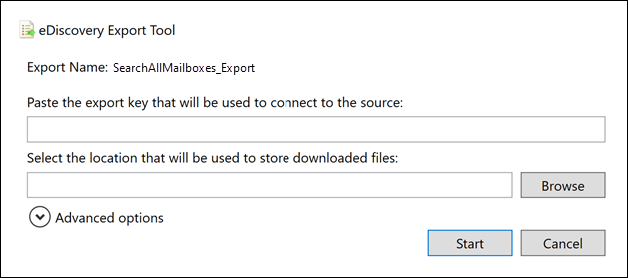
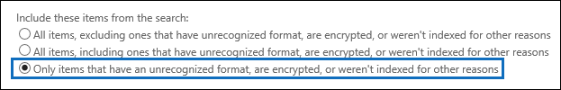
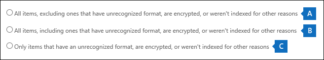

# Export Content Search results

After a Content Search is successfully run, you can export the search results to a local computer. When you export email results, they're downloaded to your computer as PST files. When you export content from SharePoint and OneDrive for Business sites, copies of native Office documents are exported. There are other documents and reports included with the exported search results.
  
Exporting the results of a Content Search involves preparing the results, and then downloading them to a local computer.
  
## Before you export content search results

- To export search results, you have to be assigned the Export management role in the Security & Compliance Center. This role is assigned to the built-in eDiscovery Manager role group. It isn't assigned by default to the Organization Management role group. For more information, see [Assign eDiscovery permissions](assign-ediscovery-permissions.md).

- The computer you use to export the search results has to meet the following system requirements:
  
  - Latest version of Windows (32-bit or 64-bit)
  
  - Microsoft .NET Framework 4.7
  
- You have to use one of the following supported browsers to run the eDiscovery Export Tool<sup>1</sup>:

  - Microsoft Edge <sup>2</sup>
  
    OR

  - Microsoft Internet Explorer 10 and later versions
  
  > [!NOTE]
  > <sup>1</sup> Microsoft doesn't manufacture third-party extensions or add-ons for ClickOnce applications. Exporting search results using an unsupported browser with third-party extensions or add-ons isn't supported.<br/>
  > <sup>2</sup> As a result of recent changes to Microsoft Edge, ClickOnce support is no longer enabled by default. For instructions on enabling ClickOnce support in Edge, see [Use the eDiscovery Export Tool in Microsoft Edge](configure-edge-to-export-search-results.md).
  
- We recommend downloading search results to a local computer. However, to eliminate your company's firewall or proxy infrastructure from causing issues when downloading search results, you might consider downloading search results to a virtual desktop outside of your network. This may decrease timeouts that occur in Azure data connections when exporting a large number of files. For more information about virtual desktops, see [Windows Virtual Desktop](https://azure.microsoft.com/services/virtual-desktop). 

- To improve performance when downloading search results, consider dividing searches that return a large set of results into smaller searches. For example, you can use date ranges in search queries to return a smaller set of results that can be downloaded faster.
  
- When you export search results, the data is temporarily stored in a Microsoft-provided Azure Storage location in the Microsoft cloud before it's downloaded to your local computer. Be sure that your organization can connect to the endpoint in Azure, which is **\*.blob.core.windows.net** (the wildcard represents a unique identifier for your export). The search results data is deleted from the Azure Storage location two weeks after it's created. 
  
- If your organization uses a proxy server to communicate with the Internet, you need to define the proxy server settings on the computer that you use to export the search results (so the export tool can be authenticated by your proxy server). To do this, open the  *machine.config*  file in the location that matches your version of Windows. 
  
  - **32-bit:** `%windir%\Microsoft.NET\Framework\[version]\Config\machine.config`
  
  - **64-bit:** `%windir%\Microsoft.NET\Framework64\[version]\Config\machine.config`
  
    Add the following lines to the  *machine.config*  file somewhere between the  `<configuration>` and  `</configuration>` tags. Be sure to replace  `ProxyServer` and  `Port` with the correct values for your organization; for example, `proxy01.contoso.com:80`. 
  
    ```xml
    <system.net>
       <defaultProxy enabled="true" useDefaultCredentials="true">
         <proxy proxyaddress="https://ProxyServer :Port " 
                usesystemdefault="False" 
                bypassonlocal="True" 
                autoDetect="False" />
       </defaultProxy>
    </system.net>
    ```

## Step 1: Prepare search results for export

The first step is to prepare the search results for exporting. When you prepare results, they are uploaded to a Microsoft-provided Azure Storage location in the Microsoft cloud. Content from mailboxes and sites is uploaded at a maximum rate of 2 GB per hour.
  
1. Go to [https://protection.office.com](https://protection.office.com).
  
2. Sign in using your work or school account.
  
3. In the left pane of the Security & Compliance Center, click **Search** \> **Content search**.
  
4. On the **Content search** page, select a search. 
  
5. In the details pane, under **Export results to a computer**, click **Start export**.
  
    > [!NOTE]
    > If the results for a search are older than 7 days, you are prompted to update the search results. If this happens, cancel the export, click **Update search results** in the details pane for the selected search, and then start the export again after the results are updated. 
  
6. On the **Export the search results** page, under **Output options**, choose one of the following options:
  
    - All items, excluding ones that have unrecognized format, are encrypted, or weren't indexed for other reasons
  
    - All items, including ones that have unrecognized format, are encrypted, or weren't indexed for other reasons
  
    - Only items that have an unrecognized format, are encrypted, or weren't indexed for other reasons
  
    See the [More information](#more-information) section for a description about how partially indexed items are exported. For more information about partially indexed items, see [Partially indexed items in Content Search](partially-indexed-items-in-content-search.md).
  
7. Under **Export Exchange content as**, choose one of the following options:
  
    - **One PST file for each mailbox:** Exports one PST file for each user mailbox that contains search results. Any results from the user's archive mailbox are included in the same PST file. This option reproduces the mailbox folder structure from the source mailbox.
  
    - **One PST file containing all messages:** Exports a single PST file (named *Exchange.pst*) that contains the search results from all source mailboxes included in the search. This option reproduces the mailbox folder structure for each message.
  
    - **One PST file containing all messages in a single folder:** Exports search results to a single PST file where all messages are located in a single, top-level folder. This option lets reviewers review items in chronological order (items are sorted by sent date) without having to navigate the original mailbox folder structure for each item.
  
    - **Individual messages:** Exports search results as individual email messages, using the .msg format. If you select this option, email search results are exported to a folder in the file system. The folder path for individual messages is the same as the one used if you exported the results to PST files.
  
      > [!IMPORTANT]
      > To decrypt RMS-protected messages when they're exported, you must export email search results as individual messages. Encrypted messages will remain encrypted if you export the search results as a PST file. For more information, see [Decrypting RMS-protected email messages and encrypted file attachments](#decrypting-rms-protected-email-messages-and-encrypted-file-attachments) in this article.
  
8. Click the **Enable de-duplication** checkbox to exclude duplicate messages. This option appears only if the content sources of the search include Exchange mailboxes or public folders. 
  
    If you select this option, only one copy of a message will be exported even if multiple copies of the same message are found in the mailboxes that were searched. The export results report (Results.csv) will contain a row for every copy of a duplicate message so that you can identify the mailboxes (or public folders) that contain a copy of the duplicate message. For more information about de-duplication and how duplicate items are identified, see [De-duplication in eDiscovery search results](de-duplication-in-ediscovery-search-results.md).
  
9. Click the **Include versions for SharePoint documents** checkbox to export all versions of SharePoint documents. This option appears only if the content sources of the search include SharePoint or OneDrive for Business sites. 
  
10. Click the **Export files in a compressed (zipped) folder** checkbox to export search results to compressed folders. This option is available only when you choose to export Exchange items as individual messages and when the search results include SharePoint or OneDrive documents. This option is primarily used to work around the 260 character limit in Windows file path names when items are exported. See the "Filenames of exported items" in the [More information](#more-information) section. 
  
11. Click **Start export**. The search results are prepared for downloading, which means they're being uploaded to an Azure Storage location in the Microsoft cloud. This may take several minutes.

See the next section for instructions to download the exported search results.
  
## Step 2: Download the search results

The next step is to download the search results from the Azure Storage location to your local computer.
  
1. On the **Content search** page, click the **Exports** tab. 
  
   You may have to click **Refresh** to update the list of export jobs so that it shows the export job you created. Export jobs have the same name as the corresponding search with **_Export** appended to the search name.
  
2. Select the export job that you created in Step 1.

3. On the flyout page under **Export key**, click **Copy to clipboard**. You use this key in step 6 to download the search results.
  
4. Click **Download results**.

5. If you're prompted to install the **eDiscovery Export Tool**, click **Install**.

6. In the **eDiscovery Export Tool**, do the following:

   

   1. Paste the export key that you copied in step 3 in the appropriate box.
  
   2. Click **Browse** to specify the location where you want to download the search result files.
  
      > [!IMPORTANT]
      >  Due to high network activity during download, you should download search results only to a location on an internal drive on your local computer. For the best download experience, follow these guidelines: <br/>
      >- Don't download search results to a UNC path, a mapped network drive, an external USB drive, or a synched OneDrive for Business account.<br/>
      >- Disable anti-virus scanning for the folder that you download the search result to.<br/>
      >- Download search results to different folders for concurrent download jobs.

6. Click **Start** to download the search results to your computer.
  
    The **eDiscovery Export Tool** displays status information about the export process, including an estimate of the number (and size) of the remaining items to be downloaded. When the export process is complete, you can access the files in the location where they were downloaded.

## More information

Here's more information about exporting search results.
  
[Export limits](#export-limits)
  
[Export reports](#export-reports)
  
[Exporting partially indexed items](#exporting-partially-indexed-items)

[Exporting individual messages or PST files](#exporting-individual-messages-or-pst-files)

[Decrypting RMS-protected email messages and encrypted file attachments](#decrypting-rms-protected-email-messages-and-encrypted-file-attachments)

[Filenames of exported items](#filenames-of-exported-items)  
  
[Miscellaneous](#miscellaneous)
  
### Export limits

For information about limits when exporting content search results, see the "Export limits" section in [Limits for content search](limits-for-content-search.md#export-limits).

### Export reports
  
- When you export search results, the following reports are included in addition to the search results.
  
  - **Export Summary** An Excel document that contains a summary of the export. This includes information such as the number of content sources that were searched, the estimated and downloaded sizes of the search results, and the estimated and downloaded number of items that were exported.
  
  - **Manifest** A manifest file (in XML format) that contains information about each item included in the search results.
  
  - **Results** An Excel document that contains information about each item that is download as a search result. For email, the result log contains information about each message, including:
  
    - The location of the message in the source mailbox (including whether the message is in the primary or archive mailbox).
  
    - The date the message was sent or received.

    - The Subject line from the message.

    - The sender and recipients of the message.

    - Whether the message is a duplicate message if you enabled the de-duplication option when exporting the search results. Duplicate messages have a value in the **Duplicate to Item** column that identifies the message as a duplicate. The value in the **Duplicate to Item** column contains the item identity of the message that was exported. For more information, see [De-duplication in eDiscovery search results](de-duplication-in-ediscovery-search-results.md).

      For documents from SharePoint and OneDrive for Business sites, the result log contains information about each document, including:

      - The URL for the document.

      - The URL for the site collection where the document is located.

      - The date that the document was last modified.

      - The name of the document (which is located in the Subject column in the result log).

  - **Unindexed Items** An Excel document that contains information about any partially indexed items that would be included in the search results. If you don't include partially indexed items when you generate the search results report, this report will still be downloaded, but will be empty.

  - **Errors and Warnings** Contains errors and warnings for files encountered during export. See the Error Details column for information specific to each individual error or warning.

  - **Skipped Items** When you export search results from SharePoint and OneDrive for Business sites, the export will usually include a skipped items report (SkippedItems.csv). The items cited in this report are typically items that won't be downloaded, such as a folder or a document set. Not exporting these types of items is by design. For other items that were skipped, the 'Error Type' and 'Error Details' field in the skipped items report show the reason the item was skipped and wasn't downloaded with the other search results.

  - **Trace Log** Contains detailed logging information about the export process and can help uncover issues during export.
  
    > [!NOTE]
    > You can just export these documents without having to export the actual search results. See [Export a Content Search report](export-a-content-search-report.md). 
  
### Exporting partially indexed items
  
- If you're exporting mailbox items from a content search that returns all mailbox items in the search results (because no keywords where included in the search query), partially indexed items won't be copied to the PST file that contains the unindexed items. This is because all items, including any partially indexed items, are automatically included in the regular search results. This means that partially indexed items will be included in a PST file (or as individual messages) that contains the other, indexed items.

    If you export both the indexed and partially indexed items or if you export only the indexed items from a content search that returns all items, the same number of items will be downloaded. This happens even though the estimated search results for the content search (displayed in the search statistics in the Security & Compliance Center) will still include a separate estimate for the number of partially indexed items. For example, let's say that the estimate for a search that includes all items (no keywords in the search query) shows that 1,000 items were found and that 200 partially indexed items were also found. In this case, the 1,000 items include the partially indexed items because the search returns all items. In other words, there are 1,000 total items returned by the search, and not 1,200 items (as you might expect). If you export the results of this search and choose to export indexed and partially indexed items (or export only partially indexed items), then 1,000 items will be downloaded. Again, that's because partially indexed items are included with the regular (indexed) results when you use a blank search query to return all items. In this same example, if you choose to export only partially indexed items, then only the 200 unindexed items would be downloaded.

    Also note that in the previous example (when you export indexed and partially indexed items or you export only indexed items), the **Export Summary** report included with the exported search results would list 1,000 items estimated items and 1,000 downloaded items for the same reasons as previously described. 

- If the search that you're exporting results from was a search of specific content locations or all content locations in your organization, only the partial items from content locations that contain items that match the search criteria will be exported. In other words, if no search results are found in a mailbox or site, then any partially indexed items in that mailbox or site won't be exported. The reason for this is that exporting partially indexed items from lots of locations in the organization might increase the likelihood of export errors and increase the time it takes to export and download the search results.

    To export partially indexed items from all content locations for a search, configure the search to return all items (by removing any keywords from the search query) and then export only partially indexed items when you export the search results.

    
  
- When exporting search results from SharePoint or OneDrive for Business sites, the ability to export unindexed items also depends on the export option that you select and whether a site that was searched contains an indexed item that matches the search criteria. For example, if you search specific SharePoint or OneDrive for Business sites and no search results are found, then no unindexed items from those sites will be exported if you choose the second export option to export both indexed and unindexed items. If an indexed item from a site does match the search criteria, then all unindexed items from that site will be exported when exporting both indexed and unindexed items. The following illustration describes the export options based on whether a site contains an indexed item that matches the search criteria.

    

    a. Only indexed items that match the search criteria are exported. No partially indexed items are exported.

    b. If no indexed items from a site match the search criteria, then partially indexed items from that same site aren't exported. If indexed items from a site are returned in the search results, then the partially indexed items from that site are exported. In other words, only the partially indexed items from sites that contain items that match the search criteria are exported.

    c. All partially indexed items from all sites in the search are exported, regardless of whether a site contains items that match the search criteria.

    If you choose to export partially indexed items, partially indexed mailbox items are exported in a separate PST file regardless of the option that you choose under **Export Exchange content as**.

- If partially indexed items are returned in the search results (because other properties of partially indexed items matched the search criteria), then those partially indexed are exported with the regular search results. So, if you choose to export both indexed items and partially indexed items (by selecting the **All items, including ones that have unrecognized format, are encrypted, or weren't indexed for other reasons** export option), the partially indexed items exported with the regular results will be listed in the Results.csv report. They will not be listed in the Unindexed items.csv report.
  
### Exporting individual messages or PST files
  
- If the file path name of a message exceeds the maximum character limit for Windows, the file path name is truncated. But the original file path name will be listed in the Manifest and ResultsLog.
  
- As previously explained, email search results are exported to a folder in the file system. The folder path for individual messages would replicate the folder path in the user's mailbox. For example, for a search named "ContosoCase101" messages in a user's inbox would be located in the folder path  `~ContosoCase101\\<date of export\Exchange\user@contoso.com (Primary)\Top of Information Store\Inbox`.

- If you choose to export email messages in one PST file containing all messages in a single folder, a **Deleted Items** folder and a **Search Folders** folder are included in the top level of the PST folder. These folders are empty.

- As previously stated, you must export email search results as individual messages to decrypt RMS-protected messages when they're exported. Encrypted messages will remain encrypted if you export email search results as a PST file.
  
### Decrypting RMS-protected email messages and encrypted file attachments

Any rights-protected (RMS-protected) email messages included in the results of a Content Search will be decrypted when you export them. Additionally, any file that's encrypted with a [Microsoft encryption technology](encryption.md) and is attached to an email message that's included in the search results will also be decrypted when it's exported. This decryption capability is enabled by default for members of the eDiscovery Manager role group. This is because the RMS Decrypt management role is assigned to this role group by default. Keep the following things in mind when exporting encrypted email messages and attachments:
  
- As previously explained, to decrypt RMS-protected messages when you export them, you have to export the search results as individual messages. If you export search results to a PST file, RMS-protected messages remain encrypted.

- Messages that are decrypted are identified in the **ResultsLog** report. This report contains a column named **Decode Status**, and a value of **Decoded** in this column identifies the messages that were decrypted.

- In addition to decrypting file attachments when exporting search results, you can also preview the decrypted file when previewing search results. You can only view the rights-protected email message after you export it.

- At this time, the decryption capability when exporting search results doesn't include encrypted content from SharePoint and OneDrive for Business sites. However, support is coming soon for documents encrypted with Microsoft encryption technologies and stored in SharePoint Online and OneDrive for Business.

- If you need to prevent someone from decrypting RMS-protect messages and encrypted file attachments, you have to create a custom role group (by copying the built-in eDiscovery Manager role group) and then remove the RMS Decrypt management role from the custom role group. Then add the person who you don't want to decrypt messages as a member of the custom role group.
  
### Filenames of exported items
  
- There is a 260-character limit (imposed by the operating system) for the full path name for email messages and site documents exported to your local computer. The full path name for exported items includes the item's original location and the folder location on the local computer where the search results are downloaded to. For example, if you specify to download the search results to  `C:\Users\Admin\Desktop\SearchResults` in the eDiscovery Export tool, then the full pathname for a downloaded email item would be  `C:\Users\Admin\Desktop\SearchResults\ContentSearch1\03.15.2017-1242PM\Exchange\sarad@contoso.com (Primary)\Top of Information Store\Inbox\Insider trading investigation.msg`.

- If the 260-character limit is exceeded, the full path name for an item will be truncated, based on the following:

  - If the full path name is longer than 260 characters, the file name will be shortened to get under the limit; note that the truncated filename (excluding the file extension) won't be fewer than eight characters.

  - If the full path name is still too long after shortening the file name, the item is moved from its current location to the parent folder. If the pathname is still too long, then the process is repeated: shorten the filename, and if necessary move again to the parent folder. This process is repeated until the full pathname is under the 260-character limit.

  - If a truncated full path name already exists, a version number is added to the end of the filename; for example, `statusmessage(2).msg`.

    To help mitigate this issue, consider downloading search results to a location with a short path name; for example, downloading search results to a folder named  `C:\Results` would add fewer characters to the path names of exported items than downloading them to a folder named  `C:\Users\Admin\Desktop\Results`.

- When you export site documents, it's also possible that the original file name of a document will be modified. This happens specifically for documents that have been deleted from a SharePoint or OneDrive for Business site that's been placed on hold. After a document that's on a site that's on hold is deleted, the deleted document is automatically moved to the Preservation Hold library for the site (which was created when the site was placed on hold). When the deleted document is moved to the Preservation Hold library, a randomly generated and unique ID is appended to the original filename of the document. For example, if the filename for a document is  `FY2017Budget.xlsx` and that document is later deleted and moved to the Preservation Hold library, the filename of the document that is moved to the Preservation Hold library is modified to something like  `FY2017Budget_DEAF727D-0478-4A7F-87DE-5487F033C81A2000-07-05T10-37-55.xlsx`. If a document in the Preservation Hold library matches the query of a Content Search and you export the results of that search, the exported file has the modified filename; in this example, the filename of the exported document would be  `FY2017Budget_DEAF727D-0478-4A7F-87DE-5487F033C81A2000-07-05T10-37-55.xlsx`.

    When a document on a site that's on hold is modified (and versioning for the document library in the site has been enabled), a copy of the file is automatically created in the Preservation Hold library. In this case, a randomly generated and unique ID is also appended to the filename of the document that's copied to the Preservation Hold library.

    The reason why filenames of documents that are moved or copied to the Preservation Hold library is to prevent conflicting filenames. For more information about placing a hold on sites and the Preservation Hold library, see [Overview of in-place hold in SharePoint Server 2016](https://support.office.com/article/5e400d68-cd51-444a-8fe6-e4df1d20aa95).

### Miscellaneous
  
- When downloading search results using the eDiscovery Export Tool, it's possible you might receive the following error: `System.Net.WebException: The remote server returned an error: (412) The condition specified using HTTP conditional header(s) is not met.` This is transient error, which typically occurs in the Azure Storage location. To resolve this issue, retry [downloading the search results](#step-2-download-the-search-results), which will restart the eDiscovery Export Tool.

- All search results and the export reports are included in a folder that has the same name as the Content Search. The email messages that were exported are located in a folder named **Exchange**. Documents are located in a folder named **SharePoint**.

- The file system metadata for documents on SharePoint and OneDrive for Business sites is maintained when documents are exported to your local computer. That means document properties, such as created and last modified dates, aren't changed when documents are exported.

- If your search results include a list item from SharePoint that matches the search query, all rows in the list will be exported in addition to the item that matches the search query and any attachments in the list. The reason for this behavior is to provide a context for list items that are returned in the search results. The additional list items and attachments may cause the count of exported items to be different than the original estimate of search results.
