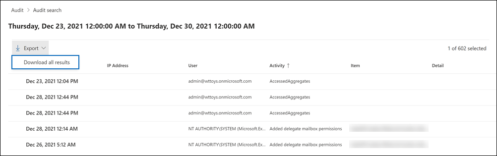

# Export, configure, and view audit log records

After you search the audit log and download the search results to a CSV file, the file contains a column named **AuditData**, which contains additional information about each event. The data in this column is formatted as a JSON object, which contains multiple properties that are configured as *property:value* pairs separated by commas. You can use the JSON transform feature in the Power Query Editor in Excel to split each property in the JSON object in the **AuditData** column into multiple columns so that each property has its own column. This lets you sort and filter on one or more of these properties, which can help you quickly locate the specific auditing data you're looking for.

## Step 1: Export audit log search results

The first step is to search the audit log and then export the results in a comma-separated value (CSV) file to your local computer.
  
1. Run an [audit log search](search-the-audit-log-in-security-and-compliance.md#search-the-audit-log) and revise the search criteria if necessary until you have the desired results.

2. Click **Export results** and select **Download all results**. 

   

   This option to exports all the audit records from the audit log search you ran in step 1, and downloads the raw data from the audit log to a CSV file. 

   A message is displayed at the bottom of the window that prompts you to open or save the CSV file. 

3. Click **Save > Save as** and save the CSV file to your local computer. It takes a while to download many search results. This is typically the case when searching for all activities or a broad date range. A message at the bottom of the windows is displayed when the CSV file is finished downloading.

   

> [!NOTE]
  > You can download a maximum of 50,000 entries to a CSV file from a single audit log search. If 50,000 entries are downloaded to the CSV file, you can probably assume there are more than 50,000 events that met the search criteria. To export more than this limit, try using a date range to reduce the number of audit log records. You might have to run multiple searches with smaller date ranges to export more than 50,000 entries.

## Step 2: Format the exported audit log using the Power Query Editor

The next step is to use the JSON transform feature in the Power Query Editor in Excel to split each property in the JSON object in the **AuditData** column into its own column. Then you filter columns to view records based on the values of specific properties. This can help you quickly locate the specific auditing data you're looking for.

1. Open a blank workbook in Excel for Office 365, Excel 2019, or Excel 2016.

2. On the **Data** tab, in the **Get & Transform Data** ribbon group, click **From Text/CSV**.

    

3. Open the CSV file that you downloaded in Step 1.

4. In the window that's displayed, click **Transform Data**.

   

   The CSV file is opened in the **Query Editor**. There are four columns: **CreationDate**, **UserIds**, **Operations**, and **AuditData**. The **AuditData** column is a JSON object that contains multiple properties. The next step is to create a column for each property in the JSON object.

5. Right-click the title in the **AuditData** column, click **Transform**, and then click **JSON**. 

   

6. In the upper-right corner of the **AuditData** column, click the expand icon.

   

   A partial list of the properties in the JSON objects in the **AuditData** column is displayed.

7. Click **Load more** to display all properties in the JSON objects in the **AuditData** column.

   

   You can unselect the checkbox next to any property that you don't want to include. Eliminating columns that aren't useful for your investigation is a good way to reduce the amount of data displayed in the audit log. 

   > [!NOTE]
   > The JSON properties displayed in the previous screenshot (after you click **Load more**) are based on the properties found in the **AuditData** column from the first 1,000 rows in the CSV file. If there are different JSON properties in records after the first 1,000 rows, these properties (and a corresponding column) won't be included when the **AuditData** column is split into multiple columns. To help prevent this, consider re-running the audit log search and narrow the search criteria so that fewer records are returned. Another workaround is to filter items in the **Operations** column to reduce the number of rows (before you perform step 5 above) before transforming the JSON object in the **AuditData** column.

   > [!TIP]
   > To view an attribute within a list such as AuditData.AffectedItems, click the **Expand** icon in the upper right corner of the column you want to pull an attribute from, and then select **Expand to New Row**.  From there it will be a record and you can click the **Expand** icon in the upper right corner of the column, view the attributes, and select the one you want to view or extract.

8. Do one of the following things to format the title of the columns that are added for each JSON property that's selected.

    - Unselect the **Use original column name as prefix** checkbox to use the name of the JSON property as the column names; for example, **RecordType** or **SourceFileName**.

    - Leave the **Use original column name as prefix** checkbox selected to add the AuditData prefix to the column names; for example, **AuditData.RecordType** or **AuditData.SourceFileName**.

9. Click **OK**.

    The **AuditData** column is split into multiple columns. Each new column corresponds to a property in the AuditData JSON object. Each row in the column contains the value for the property. If the property doesn't contain a value, the *null* value is displayed. In Excel, cells with null values are empty.
  
10. On the **Home** tab, click **Close & Load** to close the Power Query Editor and open the transformed CSV file in an Excel workbook.

## Use PowerShell to search and export audit log records

Instead of using the audit log search tool in the Security & Compliance Center, you can use the [Search-UnifiedAuditLog](/powershell/module/exchange/search-unifiedauditlog) cmdlet in Exchange Online PowerShell to export the results of an audit log search to a CSV file. Then you can follow the same procedure described in Step 2 to format the audit log using the Power Query editor. One advantage of using the PowerShell cmdlet is that you can search for events from a specific service by using the *RecordType* parameter. Here are few examples of using PowerShell to export audit records to a CSV file so you can use the Power Query editor to transform the JSON object in the **AuditData** column as described in Step 2.

In this example, run the following commands to return all records related to SharePoint sharing operations.

```powershell
$auditlog = Search-UnifiedAuditLog -StartDate 06/01/2019 -EndDate 06/30/2019 -RecordType SharePointSharingOperation
```

```powershell
$auditlog | Select-Object -Property CreationDate,UserIds,RecordType,AuditData | Export-Csv -Path c:\AuditLogs\PowerShellAuditlog.csv -NoTypeInformation
```

The search results are exported to a CSV file named *PowerShellAuditlog* that contains four columns: CreationDate, UserIds, RecordType, AuditData).

You can also use the name or enum value for the record type as the value for the *RecordType* parameter. For a list of record type names and their corresponding enum values, see the *AuditLogRecordType* table in [Office 365 Management Activity API schema](/office/office-365-management-api/office-365-management-activity-api-schema#enum-auditlogrecordtype---type-edmint32).

You can only include a single value for the *RecordType* parameter. To search for audit records for other record types, you have to run the two previous commands again to specify a different record type and append those results to the original CSV file. For example, you would run the following two commands to add SharePoint file activities from the same date range to the PowerShellAuditlog.csv file.

```powershell
$auditlog = Search-UnifiedAuditLog -StartDate 06/01/2019 -EndDate 06/30/2019 -RecordType SharePointFileOperation
```

```powershell
$auditlog | Select-Object -Property CreationDate,UserIds,RecordType,AuditData | Export-Csv -Append -Path c:\AuditLogs\PowerShellAuditlog.csv -NoTypeInformation
```

## Tips for exporting and viewing the audit log

Here are some tips and examples of exporting and viewing the audit log before and after you use the JSON transform feature to split the **AuditData** column into multiple columns.

- Filter the **RecordType** column to display only the records from a specific service or functional area. For example, to show events related to SharePoint sharing, you would select **14** (the enum value for records triggered by SharePoint sharing activities). For a list of the services that correspond to the enum values displayed in the **RecordType** column, see [Detailed properties in the audit log](detailed-properties-in-the-office-365-audit-log.md).

- Filter the **Operations** column to display the records for specific activities. For a list of most operations that correspond to a searchable activity in the audit log search tool in the Security & Compliance Center, see the "Audited activities" section in [Search the audit log in the Security & Compliance Center](search-the-audit-log-in-security-and-compliance.md#audited-activities).