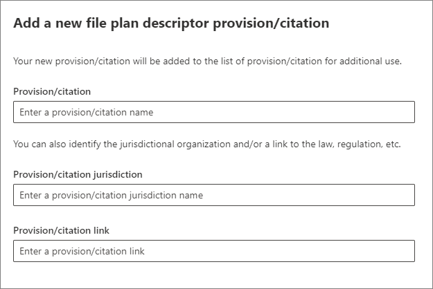

# Use file plan to manage retention labels

>*[Microsoft 365 licensing guidance for security & compliance](/office365/servicedescriptions/microsoft-365-service-descriptions/microsoft-365-tenantlevel-services-licensing-guidance/microsoft-365-security-compliance-licensing-guidance).*

Although you can create and manage retention labels from **Information governance** in the Microsoft 365 compliance center, file plan from **Records management** has additional management capabilities:

- You can bulk-create retention labels by importing the relevant information from a spreadsheet.

- You can export the information from existing retention labels for analysis and offline collaboration.

- More information about the retention labels is displayed to make it easier to see into and across the settings of all your retention labels from one view.

- File plan descriptors support additional and optional information for each label.

File plan can be used for all retention labels, even if they don't mark content as a record.

For information about what retention labels are and how to use them, see [Learn about retention policies and retention labels](retention.md).

## Accessing file plan

To access file plan, you must have one of the following admin roles:
    
- Retention Manager

- View-only Retention Manager

In the Microsoft 365 compliance center, go to **Solutions** > **Records management** > **File plan**. 

If **Records management** doesn't display in the navigation pane, first scroll down, and select **Show all**.

## Navigating your file plan

If you've already created retention labels from **Information governance** in the Microsoft 365 compliance center, these labels automatically display in your file plan. 

Similarly, if you now create retention labels in file plan, they are also available from **Information governance** if the labels aren't configured to mark content as a record.

On the **File plan** page, you see all your labels with their status and settings, optional file plan descriptors, an export option to analyze or enable offline reviews of your labels, and an import option to create retention labels. 

### Label settings columns

All columns except the label **Name** can be displayed or hidden by selecting the **Customize columns** option. But by default, the first few columns display information about the label status and its settings: 

- **Status** identifies whether the label is included in a label policy or auto-apply policy (**Active**) or not (**Inactive**).

- **Based on** identifies how or when the retention period begins. Valid values:
    - Event
    - When created
    - Last modified
    - When labeled

- **Is record** identifies if the item is marked as a record when the label is applied. Valid values:
    - No
    - Yes
    - Yes(Regulatory)

- **Retention duration** identifies the retention period. Valid values:
    - Days
    - Months
    - Years
    - Forever
    - None

- **Disposition type** identifies what happens to the content at the end of the retention period. Valid values:
    - No action
    - Auto-delete
    - Review required

### File plan descriptors columns

File plan lets you include more information as part of your retention labels. These file plan descriptors provide more options to improve the manageability and organization of the content you need to label.

By default, starting with **Reference ID**, the next few columns display these optional file plan descriptors that you can specify when you create a retention label, or edit an existing label. 

To get you started, there are some out-of-box values for the following file plan descriptors: 
- Business function/department
- Category
- Authority type
- Provision/citation 

Example of file plan descriptors when you create or edit a retention label:

When you select **Choose** for each of these optional descriptors, you can select one of the out-of-box values, or create your own and then select it. For example: 

## Export all retention labels to analyze or enable offline reviews

From your file plan, you can export the details of all retention labels into a .csv file to help you facilitate periodic compliance reviews with data governance stakeholders in your organization.

To export all retention labels: On the **File plan** page, click **Export**:

A *.csv file that contains all existing retention labels opens. For example:

## Import retention labels into your file plan

In file plan, you can bulk-import new retention labels by using a .csv file with a specific format: 

1. On the **File plan** page, click **Import**:
   

2. On the **Fill out and import your file plan** pane, select **Download a blank template**:

   

   

3. After the template downloads, add one entry for each label, and save the file. Use the following information that describes the properties and valid values for each property. For import, some values have a maximum length:
    
    - **LabelName**: Maximum length of 64 characters
    - **Comment** and **Notes**: Maximum length of 1024 characters
    - All other values: Unlimited length
     
    
   |Property|Type|Required|Valid values|
   |:-----|:-----|:-----|:-----|
   |LabelName|String|Yes|This property specifies the name of the retention label and must be unique in your tenant.|
   |Comment|String|No|Use this property to add a description about the retention label for admins. This description appears only to admins who manage the retention label in the compliance center.|
   |Notes|String|No|Use this property to add a description about the retention label for users. This description appears when users hover over the label in apps like Outlook, SharePoint, and OneDrive. If you leave this property blank, a default description is displayed, which explains the label's retention settings. |
   |IsRecordLabel|String|No, unless **Regulatory** is **TRUE**|This property specifies whether the label marks the content as a record. Valid values are:  **TRUE**: The label marks the item as a record and as a result, the item can't be deleted.  **FALSE**: The label doesn't mark the content as a record. This is the default value.     Group dependencies: When this property is specified, RetentionAction, RetentionDuration, and RetentionType must also be specified.|
   |RetentionAction|String|No, unless **RetentionDuration**, **RetentionType**, or **ReviewerEmail** are specified|This property specifies what action to take after the value specified by the RetentionDuration property (if specified) expires. Valid values are:  **Delete**: Items older than the value specified by the RetentionDuration property are deleted. **Keep**: Retain items for the duration specified by the RetentionDuration property and then do nothing when the duration period expires.  **KeepAndDelete**: Retain items for the duration specified by the RetentionDuration property and then delete them when the duration period expires.     Group dependencies: When this property is specified, RetentionDuration and RetentionType must also be specified. |
   |RetentionDuration|String|No, unless **RetentionAction** or **RetentionType** are specified|This property specifies the number of days to retain the content. Valid values are:  **Unlimited**: Items will be retained indefinitely.  ***n**: A positive integer in days; for example, **365**. The maximum number supported is 24,855, which is 68 years. If you need longer than this maximum, use Unlimited instead.    Group dependencies: When this property is specified, RetentionAction and RetentionType must also be specified.
   |RetentionType|String|No, unless **RetentionAction** or **RetentionDuration** are specified|This property specifies whether the retention duration (if specified) is calculated from the content creation date, event date, when labeled date, or last modified date. Valid values are:  **CreationAgeInDays** **EventAgeInDays** **TaggedAgeInDays** **ModificationAgeInDays**     Group dependencies: When this property is specified, RetentionAction and RetentionDuraction must also be specified.|
   |ReviewerEmail|SmtpAddress|No|When this property is specified, a disposition review will be triggered when the retention duration expires. This property specifies the email address of a reviewer for the **KeepAndDelete** retention action.     You can include the email address of individual users, distribution groups, or security groups in your tenant. Specify multiple email addresses by separating them with semicolons.     Group dependencies: When this property is specified, **RetentionAction** (must be **KeepAndDelete**), **RetentionDuration**, and **RetentionType** must also be specified.|
   |ReferenceId|String|No|This property specifies the value that's displayed in the **Reference Id** file plan descriptor, which you can use as a unique value to your organization.| 
   |DepartmentName|String|No|This property specifies the value that's displayed in the **Function/department** file plan descriptor.|
   |Category|String|No|This property specifies the value that's displayed in the **Category** file plan descriptor.|
   |SubCategory|String|No|This property specifies the value that's displayed in the **Sub category** file plan descriptor.|
   |AuthorityType|String|No|This property specifies the value that's displayed in the **Authority type** file plan descriptor.|
   |CitationName|String|No|This property specifies the name of the citation displayed in the **Provision/citation** file plan descriptor. For example, "Sarbanes-Oxley Act of 2002". |
   |CitationUrl|String|No|This property specifies the URL that's displayed in the **Provision/citation** file plan descriptor.|
   |CitationJurisdiction|String|No|This property specifies the jurisdiction or agency that's displayed in the **Provision/citation** file plan descriptor. For example, "U.S. Securities and Exchange Commission (SEC)".|
   |Regulatory|String|No|This property specifies whether the label marks the content as a regulatory record, which is [more restrictive](records-management.md#compare-restrictions-for-what-actions-are-allowed-or-blocked) than a record. To use this label configuration, your tenant must be configured to [display the option to mark content as a regulatory record](declare-records.md#how-to-display-the-option-to-mark-content-as-a-regulatory-record), or the import validation will fail. Valid values are:  **TRUE**: The label marks the item as a regulatory record. You must also set the **IsRecordLabel** property to TRUE. **FALSE**: The label doesn't mark the content as a regulatory record. This is the default value.|
   |EventType|String|No, unless **RetentionType** is **EventAgeInDays**|This property specifies an event type used for [event-based retention](event-driven-retention.md). Specify an existing event type that's displayed in **Records management** > **Events** > **Manage event types**. Alternatively, use the [Get-ComplianceRetentionEventType](/powershell/module/exchange/get-complianceretentioneventtype) cmdlet to view the available event types. Although there are some built-in event types, such as **Employee activity** and **Product lifetime**, you can also create your own event types.     If you specify your own event type, it must exist before the import because the name is validated as part of the import process.|
   |||

   Here's an example of the template containing the information about retention labels.

   

4. Select **Browse for files** to upload the filled-out template.

   File plan uploads the file and validates the entries, displaying the import statistics.

   

5. Depending on the validation results:
    
    - If validation fails: Note the row number and column name to correct in the import file. Correct the errors in the file and save it, and then repeat step 4.
    
    - If validation passes: The entries are successfully converted into retention labels. You can select the Close icon for the pane to return to the **File plan** page, where you must manually select **Refresh** to see your new labels. Or, select **Click here** to close and pane and automatically refresh the **File plan** page.

You can now publish your new retention labels, or auto-apply them. You can do both from the **Label policies** tab, and then select **Publish labels**, or **Auto-apply a label**.

## Next steps

For more information about creating and editing retention labels and their policies, see the following guidance:
- [Create retention labels and apply them in apps](create-apply-retention-labels.md)
- [Apply a retention label to content automatically](apply-retention-labels-automatically.md)