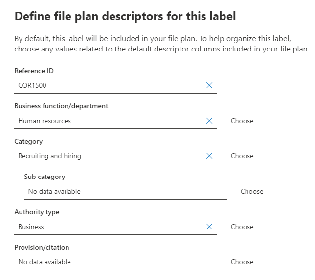

# Overview of file plan manager

File plan manager provides advanced management capabilities for retention labels, retention label policies, and provides an integrated way to traverse label and label-to-content activity for your entire content lifecycle – from creation, through collaboration, record declaration, retention, and finally disposition. 

To access file plan manager in the security and compliance center, go to **Records management** > **File plan**.

## Accessing file plan manager

There are two requirements to access file plan manager, they are:

- An Office 365 Enterprise E5 subscription.

- The user has been in assigned one of the following roles in the security and compliance center:
    
    - Retention Manager
    
    - View-only Retention Manager

## Default retention labels and label policy

If there are no retention labels in the Security & Compliance Center, the first time you choose **File plan** in the left nav, this creates a label policy called **Default Data Governance Publishing Policy**. 

This label policy contains three retention labels:

- **Operational procedure**
- **Business general**
- **Contract agreement**

These retention labels are configured only to retain content, not delete content. This label policy will be published to the entire organization and can be disabled or removed. 

You can determine who opened file plan manager and kicked off the first-run experience by reviewing the audit log for the activities **Created retention policy** and **Created retention configuration for a retention policy**.

> [!NOTE]
> Due to customer feedback, we have removed this feature that creates the default retention labels and retention label policy mentioned above. You will only see these retention labels and retention label policy if you opened file plan manager before April 11, 2019.

## Navigating your file plan

File plan manager makes it easier see into and across the settings of all your retention labels and policies from one view.

Note that retention labels created outside of the file plan will be available in the file plan and vice versa.

On the file plan **Labels** tab, the following additional information and capabilities are available:

### Label settings columns

- **Based on** identifies the type of trigger that will start the retention period. Valid values are:
    - Event
    - When created
    - When last modified
    - When labeled
- **Record** identifies if the item will become a declared record when the label is applied. Valid values are:
    - No
    - Yes
    - Yes(Regulatory)
- **Retention** identifies the retention type. Valid values are:
    - Keep
    - Keep and delete
    - Delete
- **Disposition** identifies what will happen to the content at the end of the retention period. Valid values are:
    - null
    - No action
    - Auto-delete
    - Review required (aka Disposition review)

### Retention label file plan descriptors columns

You can now include more information in the configuration of your retention labels. Inserting file plan descriptors into retention  labels will improve the manageability and organization of your file plan.

To get you started, file plan manager provides some out-of-box values for: Function/department, Category, Authority type and Provision/citation. You can add new file plan descriptor values when creating or editing a retention label. You can also specify file plan descriptors when importing retention labels into your file plan. 

Here's a view of the file plan descriptors step when creating or editing a retention label.

Here's a view of the file plan descriptors columns on the **Labels** tab of file plan manager.

## Export all existing retention labels to analyze and/or perform offline reviews

From file plan manager, you can export the details of all retention labels into a .csv file to assist you in facilitating periodic compliance reviews with data governance stakeholders in your organization.

To export all retention labels: On the **File plan** page, **File plan actions** \> **Export labels**.

A *.csv file containing all existing retention labels will open.

## Import retention labels into your file plan

In the File plan manager, you can bulk import new retention labels and modify existing retention labels.

To import new retention labels and modify existing retention labels: 

1. On the **File plan** page, go to **File plan actions** > **Import labels**.

   

   

2. Download a blank template to import new retention labels. Alternatively, you can start with the .csv file that is exported when you export the existing retention labels in your organization.

   

3. Fill-out the template. The following describes the properties and valid values for each property in the file plan template. 

   |**Property**|**Type**|**Valid values**|
   |:-----|:-----|:-----|
   |LabelName|String|This property specifies the name of the retention label.|
   |Comment|String|Use this property to add a description about the retention label for admins. This description appears only to admins who manage the label in the security and compliance center.|
   |Notes|String|Use this property to add a description about the retention label for users. This description appears when users hover over the label in apps like Outlook, SharePoint, and OneDrive. If you leave this property blank, a default description is displayed, which explains the label's retention settings. |
   |IsRecordLabel|String|This property specifies whether the label is a record label. Items tagged with a record label are declared as records. Valid values are: **TRUE**: The label is a record label. Note that items that are declared as a record can't be deleted.  **FALSE**: The label isn't a record label. This is the default value.|
   |RetentionAction|String|This property specifies what action to take after the value specified by the RetentionDuration property expires. Valid values are: **Delete**: Items older than the value specified by the RetentionDuration property are deleted. **Keep**: Retain items for the duration specified by the RetentionDuration property and then doing nothing when the duration period expires.  **KeepAndDelete**: Retain items for the duration specified by the RetentionDuration property and then delete them when the duration period expires.   |
   |RetentionDuration|String|This property specifies the number of days to retain the content. Valid values are: **Unlimited**: Items will be retained indefinitely.  ***n***: A positive integer; for example, **365**. 
   |RetentionType|String|This property specifies whether the retention duration is calculated from the content creation date, event date, labeled (tagged) date, or last modified date. Valid values are: **CreationAgeInDays** **EventAgeInDays** **TaggedAgeInDays** **ModificationAgeInDays** |
   |ReviewerEmail|SmtpAddress|When this property is populated, a disposition review will be triggered when the retention duration expires. This property specifies the email address of a reviewer for **Delete** and **KeepAndDelete** retention actions. You can include the email address of individual users, distribution, or security groups. You can specify multiple email addresses separated by semicolons.|
   |ReferenceId|String|This property specifies the value that's displayed in the **Reference Id** file plan descriptor.| 
   |DepartmentName|String|This property specifies the value that's displayed in the **Function/department** file plan descriptor.|
   |Category|String|This property specifies the value that's displayed in the **Category** file plan descriptor.|
   |SubCategory|String|This property specifies the value that's displayed in the **Sub category** file plan descriptor.|
   |AuthorityType|String|This property specifies the value that's displayed in the **Authority type** file plan descriptor.|
   |CitationName|String|This property specifies the name of the citation displayed in the **Provision/citation** file plan descriptor; for example "Sarbanes-Oxley Act or 2002". |
   |CitationUrl|String|This property specifies the URL that's displayed in the **Provision/citation** file plan descriptor.|
   |CitationJurisdiction|String|This property specifies the jurisdiction or agency that's displayed in the **Provision/citation** file plan descriptor; for example, "U.S. Securities and Exchange Commission (SEC)".|
   |Regulatory|String|Leave blank. This property isn't used at this time.|
   |EventType|String|This property specifies the retention rule that's associated with the label. You can use any value that uniquely identifies the rule. For example: **Name** **Distinguished name (DN)** **GUID**  You can use the [Get-RetentionComplianceRule](https://docs.microsoft.com/powershell/module/exchange/policy-and-compliance-retention/get-retentioncompliancerule?view=exchange-ps) cmdlet to view the available retention rules. Note that if you export labels from one organization, you can't use the values for the EventType  property from that organization when importing labels to a different organization. That because the EventType values are unique to an organization. |
   |||

   Here's an example the template containing the information about retention labels.

   

4. Under step 3 on the import file plan wizard page, click **Browse for files** to upload the filled-out template. 

   File plan manager will validate the entries and display the import statistics.

   

   In the event there is a validation error, file plan import will continue to validate every entry in the import file and display all errors referencing line/row numbers in the import file, copy the displayed error results so that you can easily return to the import file and correct the errors.

5. When the import is complete, return to file plan manager to associate the new retention labels to new or existing retention label policies.

   
