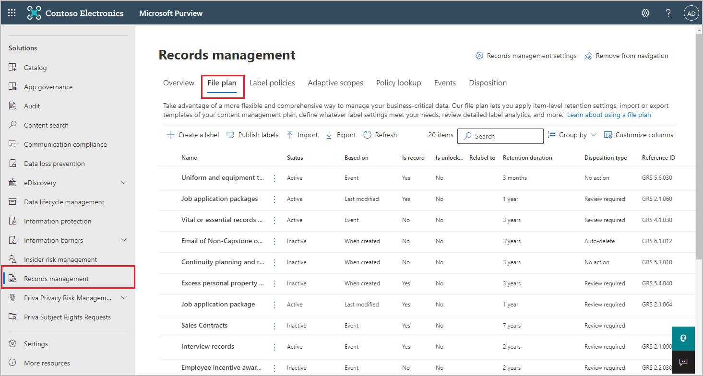
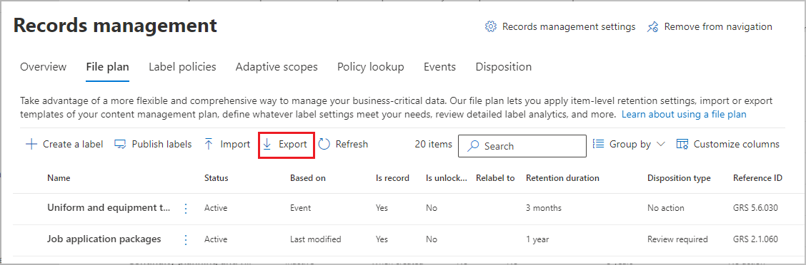
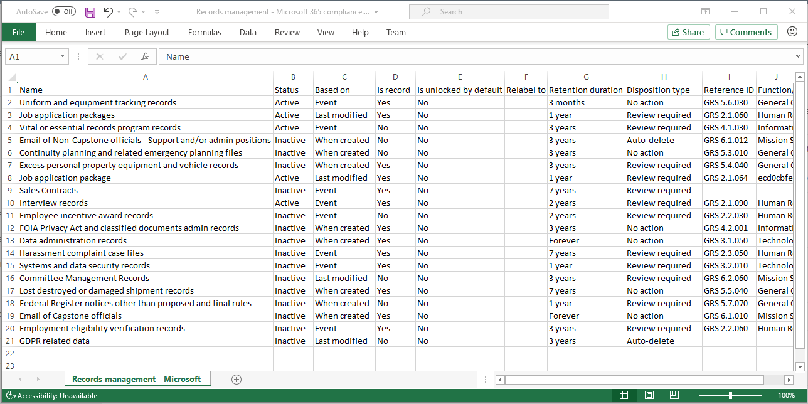
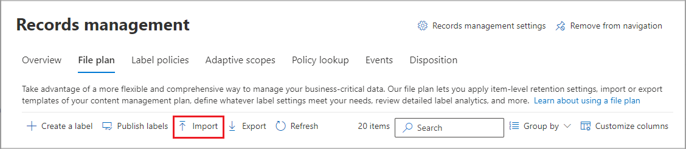
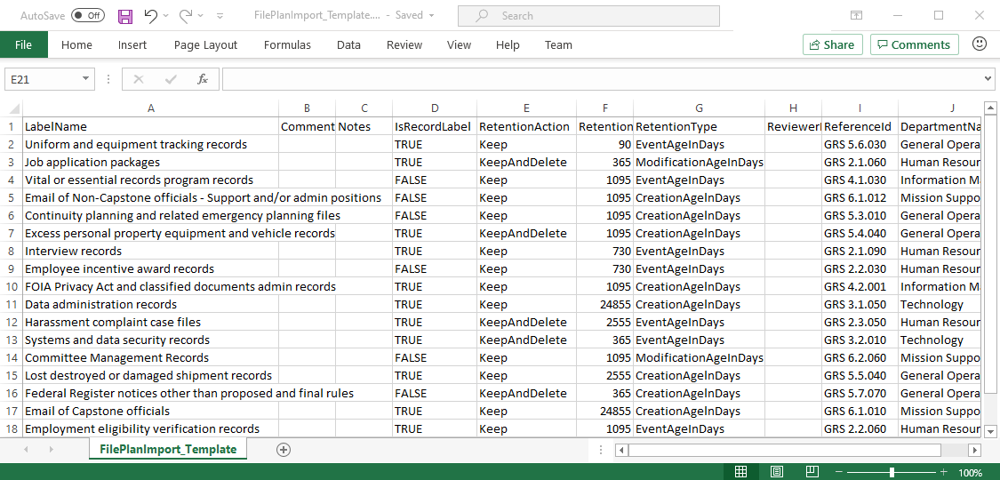

# Use file plan to manage retention labels

>*[Microsoft 365 licensing guidance for security & compliance](/office365/servicedescriptions/microsoft-365-service-descriptions/microsoft-365-tenantlevel-services-licensing-guidance/microsoft-365-security-compliance-licensing-guidance).*

Although you can create and manage retention labels from **Information governance** in the Microsoft 365 compliance center, file plan from **Records management** has additional management capabilities:

- You can bulk-create retention labels by importing the relevant information from a spreadsheet.

- You can export the information from existing retention labels for analysis and offline collaboration, or for bulk-editing.

- More information about the retention labels is displayed to make it easier to see into and across the settings of all your retention labels from one view.

- File plan descriptors support additional and optional information for each label.

File plan can be used for all retention labels, even if they don't mark content as a record.

For information about what retention labels are and how to use them, see [Learn about retention policies and retention labels](retention.md).

## Accessing file plan

To access file plan, you must have one of the following admin roles:
    
- Retention Manager

- View-only Retention Manager

In the Microsoft 365 compliance center, go to **Solutions** > **Records management** > **File plan**. 

If **Records management** doesn't display in the navigation pane, first scroll down, and select **Show all**.

## Navigating your file plan

If you've already created retention labels from **Information governance** in the Microsoft 365 compliance center, these labels automatically display in your file plan. 

Similarly, if you now create retention labels in file plan, they are also available from **Information governance** if the labels aren't configured to mark content as a record.

On the **File plan** page, you see all your labels with their status and settings, optional file plan descriptors, an export option to analyze or enable offline reviews of your labels, and an import option to create retention labels. 

### Label settings columns

All columns except the label **Name** can be displayed or hidden by selecting the **Customize columns** option. But by default, the first few columns display information about the label status and its settings: 

- **Status** identifies whether the label is included in a label policy or auto-apply policy (**Active**) or not (**Inactive**).

- **Based on** identifies how or when the retention period begins. Valid values:
    - Event
    - When created
    - Last modified
    - When labeled

- **Is record** identifies if the item is marked as a record when the label is applied. Valid values:
    - No
    - Yes
    - Yes(Regulatory)

- **Retention duration** identifies the retention period. Valid values:
    - Days
    - Months
    - Years
    - Forever
    - None

- **Disposition type** identifies what happens to the content at the end of the retention period. Valid values:
    - No action
    - Auto-delete
    - Review required

### File plan descriptors columns

File plan lets you include more information as part of your retention labels. These file plan descriptors provide more options to improve the manageability and organization of the content you need to label.

By default, starting with **Reference ID**, the next few columns display these file plan descriptors that you can specify when you create a retention label, or edit an existing label. 

To get you started, there are some out-of-box values for the following file plan descriptors: 
- Business function/department
- Category
- Authority type
- Provision/citation 

Example of file plan descriptors when you create or edit a retention label:

Example view of the file plan descriptors columns:

## Export all retention labels to analyze or enable offline reviews

From your file plan, you can export the details of all retention labels into a .csv file to help you facilitate periodic compliance reviews with data governance stakeholders in your organization.

To export all retention labels: On the **File plan** page, click **Export**:

A *.csv file that contains all existing retention labels opens. For example:

## Import retention labels into your file plan

In file plan, you can bulk-import new retention labels, and use the same method to bulk-modify existing retention labels.

To import new retention labels and modify existing retention labels: 

1. On the **File plan** page, click **Import** to use the **Fill out and import your file plan** page:

   

   

2. Download a blank template to import new retention labels. Alternatively, you can start with the .csv file that is exported when you export the existing retention labels in your organization.

   

3. Fill out the template, using the following information that describes the properties and valid values for each property. For import, some values have a maximum length:
    
    - **LabelName**: Maximum length of 64 characters
    - **Comment** and **Notes**: Maximum length of 1024 characters
    - All other values: Unlimited length
     
    
   |Property|Type|Valid values|
   |:-----|:-----|:-----|
   |LabelName|String|This property specifies the name of the retention label.|
   |Comment|String|Use this property to add a description about the retention label for admins. This description appears only to admins who manage the retention label in the compliance center.|
   |Notes|String|Use this property to add a description about the retention label for users. This description appears when users hover over the label in apps like Outlook, SharePoint, and OneDrive. If you leave this property blank, a default description is displayed, which explains the label's retention settings. |
   |IsRecordLabel|String|This property specifies whether the label marks the content as a record. Valid values are:  **TRUE**: The label marks the item as a record and as a result, the item can't be deleted.  **FALSE**: The label doesn't mark the content as a record. This is the default value.|
   |RetentionAction|String|This property specifies what action to take after the value specified by the RetentionDuration property expires. Valid values are:  **Delete**: Items older than the value specified by the RetentionDuration property are deleted. **Keep**: Retain items for the duration specified by the RetentionDuration property and then do nothing when the duration period expires.  **KeepAndDelete**: Retain items for the duration specified by the RetentionDuration property and then delete them when the duration period expires.   |
   |RetentionDuration|String|This property specifies the number of days to retain the content. Valid values are:  **Unlimited**: Items will be retained indefinitely.  ***n***: A positive integer; for example, **365**. 
   |RetentionType|String|This property specifies whether the retention duration is calculated from the content creation date, event date, when labeled date, or last modified date. Valid values are:  **CreationAgeInDays** **EventAgeInDays** **TaggedAgeInDays** **ModificationAgeInDays** |
   |ReviewerEmail|SmtpAddress|When this property is populated, a disposition review will be triggered when the retention duration expires. This property specifies the email address of a reviewer for the **KeepAndDelete** retention action. You can include the email address of individual users, distribution groups, or security groups. You can specify multiple email addresses separated by semicolons.|
   |ReferenceId|String|This property specifies the value that's displayed in the **Reference Id** file plan descriptor, which you can use as a unique value to your organization.| 
   |DepartmentName|String|This property specifies the value that's displayed in the **Function/department** file plan descriptor.|
   |Category|String|This property specifies the value that's displayed in the **Category** file plan descriptor.|
   |SubCategory|String|This property specifies the value that's displayed in the **Sub category** file plan descriptor.|
   |AuthorityType|String|This property specifies the value that's displayed in the **Authority type** file plan descriptor.|
   |CitationName|String|This property specifies the name of the citation displayed in the **Provision/citation** file plan descriptor. For example, "Sarbanes-Oxley Act of 2002". |
   |CitationUrl|String|This property specifies the URL that's displayed in the **Provision/citation** file plan descriptor.|
   |CitationJurisdiction|String|This property specifies the jurisdiction or agency that's displayed in the **Provision/citation** file plan descriptor. For example, "U.S. Securities and Exchange Commission (SEC)".|
   |Regulatory|String|Leave blank. This property isn't used at this time.|
   |EventType|String|This property specifies the retention rule that's associated with the label. You can use any value that uniquely identifies the rule. For example: **Name** **Distinguished name (DN)** **GUID**  You can use the [Get-RetentionComplianceRule](/powershell/module/exchange/get-retentioncompliancerule) cmdlet to view the available retention rules. Note that because the EventType values are unique to an organization, if you export labels from one organization, you can't use the values for the EventType property from that organization to import labels into a different organization.|
   |||

   Here's an example of the template containing the information about retention labels.

   

4. Under step 3 on the **Fill out and import your file plan** page, click **Browse for files** to upload the filled-out template. 

   File plan validates the entries and displays the import statistics.

   

   If there's a validation error, file plan import continues to validate every entry in the import file and displays all errors  referencing the line and row numbers in the import file. Copy the displayed error results so you can correct them when you return to the import file.

When the import is complete, you can now add the retention labels to a new retention label policy, or auto-apply them. You can do this right from the **File plan** page by selecting the dropdown from **+ Create a label** and then **Policy to publish labels**, or **Policy to auto-apply a label**.

## Next steps

For more information about creating and editing retention labels and their policies, see the following guidance:
- [Create retention labels and apply them in apps](create-apply-retention-labels.md)
- [Apply a retention label to content automatically](apply-retention-labels-automatically.md)