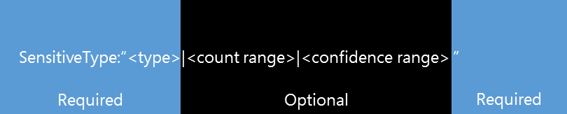

# Form a query to find sensitive data stored on sites

Users often store sensitive data, such as credit card numbers, social security numbers, or personal, on their sites, and over time this can expose an organization to significant risk of data loss. Documents stored on sites—including OneDrive for Business sites—could be shared with people outside the organization who shouldn't have access to the information. With data loss prevention (DLP) in SharePoint Online, you can discover documents that contain sensitive data throughout your tenant. After discovering the documents, you can work with the document owners to protect the data. This topic can help you form a query to search for sensitive data.
  
> [!NOTE]
> Electronic discovery, or eDiscovery, and DLP are premium features that require [SharePoint Online Plan 2](https://go.microsoft.com/fwlink/?LinkId=510080). 
  
## Forming a basic DLP query

There are three parts that make up a basic DLP query: SensitiveType, count range, and confidence range. As illustrated in the following graphic, **SensitiveType:"\<type\>"** is required, and both**|\<count range\>** and**|\<confidence range\>** are optional. 
  

  
### Sensitive type - required

So what is each part? SharePoint DLP queries typically begin with the property  `SensitiveType:"` and an information type name from the [sensitive information types inventory](/Exchange/what-the-sensitive-information-types-in-exchange-look-for-exchange-2013-help), and end with a  `"`. You can also use the name of a [custom sensitive information type](create-a-custom-sensitive-information-type.md) that you created for your organization. For example, you might be looking for documents that contain credit card numbers. In such an instance, you'd use the following format:  `SensitiveType:"Credit Card Number"`. Because you didn't include count range or confidence range, the query returns every document in which a credit card number is detected. This is the simplest query that you can run, and it returns the most results. Keep in mind that the spelling and spacing of the sensitive type matters. 
  
### Ranges - optional

Both of the next two parts are ranges, so let's quickly examine what a range looks like. In SharePoint DLP queries, a basic range is represented by two numbers separated by two periods, which looks like this:  `[number]..[number]`. For instance, if  `10..20` is used, that range would capture numbers from 10 through 20. There are many different range combinations and several are covered in this topic. 
  
Let's add a count range to the query. You can use count range to define the number of occurrences of sensitive information a document needs to contain before it's included in the query results. For example, if you want your query to return only documents that contain exactly five credit card numbers, use this:  `SensitiveType:"Credit Card Number|5"`. Count range can also help you identify documents that pose high degrees of risk. For example, your organization might consider documents with five or more credit card numbers a high risk. To find documents fitting this criterion, you would use this query:  `SensitiveType:"Credit Card Number|5.."`. Alternatively, you can find documents with five or fewer credit card numbers by using this query:  `SensitiveType:"Credit Card Number|..5"`. 
  
#### Confidence range

Finally, confidence range is the level of confidence that the detected sensitive type is actually a match. The values for confidence range work similarly to count range. You can form a query without including a count range. For example, to search for documents with any number of credit card numbers—as long as the confidence range is 85 percent or higher—you would use this query:  `SensitiveType:"Credit Card Number|*|85.."`. 
  
> [!IMPORTANT]
> The asterisk ( `*`) is a wildcard character that means any value works. You can use the wildcard character ( `*`) either in the count range or in the confidence range, but not in a sensitive type. 
  
### Additional query properties and search operators available in the eDiscovery Center

DLP in SharePoint also introduces the LastSensitiveContentScan property, which can help you search for files scanned within a specific timeframe. For query examples with the  `LastSensitiveContentScan` property, see the [Examples of complex queries](#examples-of-complex-queries) in the next section. 
  
You can use not only DLP-specific properties to create a query, but also standard SharePoint eDiscovery search properties such as  `Author` or  `FileExtension`. You can use operators to build complex queries. For the list of available properties and operators, see the [Using Search Properties and Operators with eDiscovery](/archive/blogs/quentin/using-search-properties-and-operators-with-ediscovery) blog post. 
  
## Examples of complex queries

The following examples use different sensitive types, properties, and operators to illustrate how you can refine your queries to find exactly what you're looking for.
  
|**Query**|**Explanation**|
|:-----|:-----|
| `SensitiveType:"International Banking Account Number (IBAN)"`   |The name might seem strange because it's so long, but it's the correct name for that sensitive type. Make sure to use exact names from the [sensitive information types inventory](/Exchange/what-the-sensitive-information-types-in-exchange-look-for-exchange-2013-help). You can also use the name of a [custom sensitive information type](create-a-custom-sensitive-information-type.md) that you created for your organization.    |
| `SensitiveType:"Credit Card Number|1..4294967295|1..100"`   |This returns documents with at least one match to the sensitive type "Credit Card Number." The values for each range are the respective minimum and maximum values. A simpler way to write this query is  `SensitiveType:"Credit Card Number"`, but where's the fun in that?    |
| `SensitiveType:"Credit Card Number| 5..25" AND LastSensitiveContentScan:"8/11/2018..8/13/2018"`   |This returns documents with 5-25 credit card numbers that were scanned from August 11, 2018 through August 13, 2018.    |
| `SensitiveType:"Credit Card Number| 5..25" AND LastSensitiveContentScan:"8/11/2018..8/13/2018" NOT FileExtension:XLSX`   |This returns documents with 5-25 credit card numbers that were scanned from August 11, 2018 through August 13, 2018. Files with an XLSX extension aren't included in the query results.  `FileExtension` is one of many properties that you can include in a query. For more information, see [Using Search Properties and Operators with eDiscovery](/archive/blogs/quentin/using-search-properties-and-operators-with-ediscovery).    |
| `SensitiveType:"Credit Card Number" OR SensitiveType:"U.S. Social Security Number (SSN)"`   |This returns documents that contain either a credit card number or a social security number.    |
   
## Examples of queries to avoid

Not all queries are created equal. The following table gives examples of queries that don't work with DLP in SharePoint and describes why.
  
|**Unsupported query**|**Reason**|
|:-----|:-----|
| `SensitiveType:"Credit Card Number|.."`   |You must add at least one number.    |
| `SensitiveType:"NotARule"`   |"NotARule" isn't a valid sensitive type name. Only names in the [sensitive information types inventory](/Exchange/what-the-sensitive-information-types-in-exchange-look-for-exchange-2013-help) work in DLP queries.    |
| `SensitiveType:"Credit Card Number|0"`   |Zero isn't valid as either the minimum value or the maximum value in a range.    |
| `SensitiveType:"Credit Card Number"`   |It's might be difficult to see, but there's extra white space between "Credit" and "Card" that makes the query invalid. Use exact sensitive type names from the [sensitive information types inventory](/Exchange/what-the-sensitive-information-types-in-exchange-look-for-exchange-2013-help).    |
| `SensitiveType:"Credit Card Number|1. .3"`   |The two-period portion shouldn't be separated by a space.    |
| `SensitiveType:"Credit Card Number| |1..|80.."`   |There are too many pipe delimiters (|). Follow this format instead: `SensitiveType: "Credit Card Number|1..|80.."`   |
| `SensitiveType:"Credit Card Number|1..|80..101"`   |Because confidence values represent a percentage, they can't exceed 100. Choose a number from 1 through 100 instead.    |
   
## For more information

- [Sensitive information type entity definitions](sensitive-information-type-entity-definitions.md)
- [Run a Content Search](content-search.md)
- [Keyword queries and search conditions for Content Search](keyword-queries-and-search-conditions.md)
